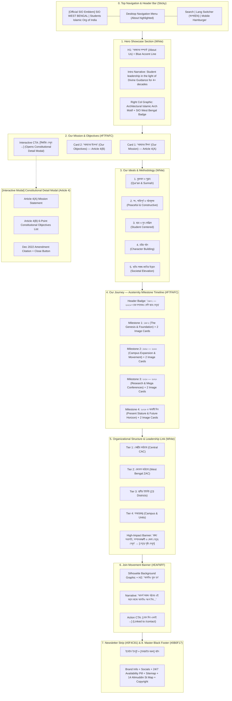

# SIO West Bengal — About Page Wireframe & Name-Wise Content Blueprint

This document specifies the complete architectural wireframe, layout blueprints, and section-by-section name-wise content matrix for the official **SIO West Bengal About Page** ([`src/app/about/page.tsx`](file:///home/masyud/Development/Masyud/SIO/src/app/about/page.tsx)).

---

## 1. High-Level Architectural Flow & Wireframe Diagram



---

## 2. Name-Wise Content Matrix & Layout Blueprint

### Section 0: Sticky Navigation Header (`Header`)
- **Container / Height**: `w-full h-[74px] md:h-[84px] bg-white/95 backdrop-blur-md border-b border-[#E5E7EB]`
- **Active Navigation Pill**: "আমাদের সম্পর্কে" (`/about`) highlighted in `#168BD4` with blue baseline accent indicator.
- **Brand Identity**: Authentic official SIO circular watercolor emblem (56px) + `SIO WEST BENGAL` + `Students Islamic Organisation of India`.

---

### Section 1: Hero Showcase (`/about#top`)
- **Visual Wireframe**:
  ```
  +-----------------------------------------------------------------------------------+
  | Left Column:                                | Right Column:                       |
  | H1: আমাদের সম্পর্কে (About Us)               | [ Architectural Arch Motif Card:    |
  | [ Blue Accent Line: w-14 h-1 ]              |   - Building2 Icon in Circle        |
  |                                             |   - 'স্টুডেন্টস ইসলামিক অর্গানাইজেশন  |
  | Body: ইসলামের আলোকে ছাত্র ও যুব সমাজকে গড়ে  |     অব ইন্ডিয়া'                     |
  | তোলা এবং ব্যক্তি, সমাজ ও জাতির পুনর্গঠনের   |   - 'পশ্চিমবঙ্গ জোন • প্রতিষ্ঠিত ১৯৮২'|
  | লক্ষ্য অর্জন করে যাওয়া SIO-র মূল লক্ষ্য...  | ]                                   |
  +-----------------------------------------------------------------------------------+
  ```
- **Name-Wise Content**:
  - **Section Name (BN)**: সূচনা ও সারসংক্ষেপ
  - **Section Name (EN)**: Hero Overview & Introduction
  - **Heading 1**: 
    - *Bengali*: `আমাদের সম্পর্কে`
    - *English*: `About Us`
  - **Accent Divider**: `w-14 h-1 bg-[#168BD4] rounded-full`
  - **Body Description**: 
    - *Bengali*: `ইসলামের আলোকে ছাত্র ও যুব সমাজকে গড়ে তোলা এবং ব্যক্তি, সমাজ ও জাতির পুনর্গঠনের লক্ষ্য অর্জন করে যাওয়া SIO-র মূল লক্ষ্য। কুরআন-সুন্নাহর নির্দেশনা ও আদর্শকে জীবনের সকল ক্ষেত্রে প্রতিষ্ঠা করতে আমরা প্রতিজ্ঞাবদ্ধ।`
    - *English*: `The core aim of SIO is to nurture students and youth in the light of Divine Guidance, actively participating in the moral and intellectual reconstruction of the individual, society, and the nation.`
  - **Visual Asset**: Architectural geometric arch SVG illustration with `Building2` icon and zonal badge.

---

### Section 2: Mission & Objectives (`#mission`)
- **Visual Wireframe**: 2-column card grid on `#F7FAFC` with central action button opening the constitutional modal.
- **Name-Wise Content**:
  - **Section Name (BN)**: আমাদের মিশন ও উদ্দেশ্য
  - **Section Name (EN)**: Our Mission & Objectives
  - **Section Subtitle**: `সংবিধানের ধারা ৪(ক) ও ৪(খ)-এর প্রাতিষ্ঠানিক রূপরেখা`

| # | Card Name (BN / EN) | Icon | Core Content & Constitutional Mandate |
|---|---|---|---|
| **1** | **আমাদের মিশন**<br/>*(Our Mission)* | `Target` | **ধারা ৪(ক)**: ইসলামের পূর্ণাঙ্গ নির্দেশনার আলোকে ছাত্র ও যুব সমাজকে প্রস্তুত করা, যাতে তারা ব্যক্তি, সমাজ এবং জাতির পুনর্গঠনে সক্রিয় ভূমিকা পালন করতে পারে। *(To prepare the students and youth for the reconstruction of the society in the light of Divine Guidance).* |
| **2** | **আমাদের উদ্দেশ্য**<br/>*(Our Objectives)* | `Flag` | **ধারা ৪(খ)**: ছাত্র ও যুবসমাজকে ইসলামের দিকে আহবান জানানো, ইসলামের সঠিক উপলব্ধি গড়ে তোলা, কুরআন-সুন্নাহ অনুযায়ী জীবন গড়ে তোলা, নৈতিক চরিত্র গঠন, সাম্য ও ন্যায়ের পক্ষে কাজ করা এবং সর্বাত্মক বিকাশ সাধন। |

- **Modal Trigger Button**: `[বিস্তারিত দেখুন →]` / `[View Full Constitution Details →]`

---

### Section 3: Ideals & Methodology (`#methodology`)
- **Visual Wireframe**: 5-column responsive grid on pure white background featuring circular icon badges and hover accents.
- **Section Heading**: 
  - *Title*: `আমাদের আদর্শ ও কাজের পদ্ধতি` / `Our Ideals & Methodology`
  - *Divider*: `w-12 h-1 bg-[#168BD4] rounded-full`
- **Name-Wise Methodology Cards**:

| # | Method Pillar (BN / EN) | Icon | Description |
|---|---|---|---|
| **1** | **কুরআন ও সুন্নাহ**<br/>*(Qur'an & Sunnah)* | `BookOpen` | আমাদের সকল কার্যক্রমের মূল নির্দেশনা ও ভিত্তি হচ্ছে কুরআন ও সুন্নাহ। |
| **2** | **সৎ, শান্তিপূর্ণ ও গঠনমূলক**<br/>*(Peaceful & Constructive)* | `Handshake` | আমরা শান্তিপূর্ণ, গঠনমূলক ও আইনসম্মত পন্থায় সামাজিক পরিবর্তনে বিশ্বাস করি। |
| **3** | **ছাত্র ও যুব কেন্দ্রিক**<br/>*(Student Centered)* | `Users` | ছাত্র ও যুব সমাজকে নেতৃত্বের জন্য প্রস্তুত করাই আমাদের প্রধান লক্ষ্য। |
| **4** | **চরিত্র গঠন**<br/>*(Character Building)* | `Heart` | ইসলামী চরিত্র, নৈতিকতা ও মূল্যবোধ গঠনে আমরা আপসহীন। |
| **5** | **ব্যক্তি-সমাজ-জাতির উন্নয়ন**<br/>*(Societal Elevation)* | `TrendingUp` | ব্যক্তির উন্নয়নের মাধ্যমে সমাজ ও জাতির সামগ্রিক পুনর্গঠন। |

---

### Section 4: Our Journey — Aceternity Milestone Timeline (`#history`)
- **Visual Wireframe**: Full-width interactive timeline featuring a dynamic vertical line with an animated glowing blue progress beam (`#168BD4` to `#63BDFF`), sticky milestone nodes, and two-column dummy photo cards.
- **Section Heading**:
  - *Pill Badge*: `১৯৮২ — ২০২৬ • চার দশকেরও বেশি ছাত্র নেতৃত্ব` (with pulsing indicator)
  - *Title*: `আমাদের পথচলা` / `Our Journey`
  - *Subtitle*: `১৯৮২ সালের ১৯শে অক্টোবর (১লা মহররম ১৪০৩ হিজরি) প্রতিষ্ঠিত হয়ে আজ চার দশকেরও বেশি সময় ধরে সত্য, শিক্ষা ও সমাজ সংস্কারের অবিচল ছাত্র আন্দোলন।`
- **Name-Wise Timeline Milestones**:

#### Milestone 1: ১৯৮২ (1982) — The Genesis & Foundation
- **Title**: `১৯৮২`
- **Subtitle**: `শুরু থেকে • The Genesis`
- **Narrative**: ১৯৮২ সালের ১৯শে অক্টোবর (১লা মহররম ১৪০৩ হিজরি) কয়েকজন দূরদর্শী ছাত্রের হাত ধরে প্রতিষ্ঠিত হয় স্টুডেন্টস ইসলামিক অর্গানাইজেশন অব ইন্ডিয়া (SIO)। জ্ঞান, চরিত্র ও কর্মের সমন্বয়ে একটি ন্যায়ভিত্তিক সমাজ বিনির্মাণের প্রত্যয়ে শুরু হয় এই ঐতিহাসিক অভিযাত্রা।
- **Badges**:
  - `১৯ অক্টোবর ১৯৮২ প্রতিষ্ঠা`
  - `১লা মহররম ১৪০৩ হিজরি`
  - `সত্য ও ন্যায়ের আদর্শ`
- **Dummy Images Grid (2 Columns)**:
  1. `https://images.unsplash.com/photo-1523240795612-9a054b0db644?q=80&w=800&auto=format&fit=crop`
     - *Caption*: প্রতিষ্ঠাতা ছাত্র প্রতিনিধিদের প্রাথমিক সমাবেশ (১৯৮২)
     - *Sub-caption*: পশ্চিমবঙ্গে ছাত্র আন্দোলনের সূত্রপাত
  2. `https://images.unsplash.com/photo-1517486808906-6ca8b3f04846?q=80&w=800&auto=format&fit=crop`
     - *Caption*: নৈতিক পাঠচক্র ও ছাত্র কল্যাণ কর্মসূচি
     - *Sub-caption*: ক্যাম্পাসভিত্তিক প্রাথমিক ইউনিট গঠন

#### Milestone 2: ১৯৯০ — ২০০০ (1990s — 2000s) — Organic Growth & Campus Outreach
- **Title**: `১৯৯০ — ২০০০`
- **Subtitle**: `ক্রমবিকাশ • Campus Expansion`
- **Narrative**: সময়ের সাথে সাথে স্কুল, মাদ্রাসা এবং বিশ্ববিদ্যালয় ক্যাম্পাসে সংগঠনের বিকাশ ঘটে। কলকাতা বিশ্ববিদ্যালয়, যাদবপুর, আলিয়া, উত্তরবঙ্গ এবং বর্ধমান বিশ্ববিদ্যালয়ে ছাত্র অধিকার রক্ষা, ক্যারিয়ার গাইডেন্স এবং রক্তদান কর্মসূচির মতো মানবিক সেবার সূচনা।
- **Badges**:
  - `ক্যাম্পাস অধিকার আন্দোলন`
  - `ক্যারিয়ার ও স্কলারশিপ গাইডেন্স`
  - `জরুরি মানবসেবা ও রক্তদান`
- **Dummy Images Grid (2 Columns)**:
  1. `https://images.unsplash.com/photo-1524178232363-1fb2b075b655?q=80&w=800&auto=format&fit=crop`
     - *Caption*: বিশ্ববিদ্যালয় ক্যাম্পাসে শিক্ষা অধিকার সেমিনার
     - *Sub-caption*: গণতান্ত্রিক ছাত্র সংসদ ও ক্যাম্পাস রাজনীতি সংস্কার
  2. `https://images.unsplash.com/photo-1427504494785-3a9ca7044f45?q=80&w=800&auto=format&fit=crop`
     - *Caption*: মেধাবী শিক্ষার্থীদের জন্য স্টাডি সার্কেল ও লাইব্রেরি
     - *Sub-caption*: উচ্চশিক্ষায় অনগ্রসরদের সহযোগিতা

#### Milestone 3: ২০১০ — ২০২০ (2010s — 2020s) — Research, Academic Forums & Mega Conferences
- **Title**: `২০১০ — ২০২০`
- **Subtitle**: `মেধা বিকাশ ও সম্মেলন • Research & Mega Conferences`
- **Narrative**: শিক্ষা সংস্কার ও বুদ্ধিবৃত্তিক গবেষণায় সূচনা হয় CERT (Centre for Educational Research & Training) এবং সাংস্কৃতিক জাগরণে BTF (বঙ্গীয় প্রতিভা ফোরাম)। রাজ্যজুড়ে ঐতিহাসিক ছাত্র সমাবেশ, শিক্ষানীতি সমীক্ষা ও গ্রন্থ প্রকাশনার নতুন দিগন্ত উন্মোচিত হয়।
- **Badges**:
  - `CERT শিক্ষা গবেষণা শাখা`
  - `BTF সাহিত্য ও প্রতিভা বিকাশ`
  - `ঐতিহাসিক রাজ্য ছাত্র সমাবেশ`
- **Dummy Images Grid (2 Columns)**:
  1. `https://images.unsplash.com/photo-1577495508048-b635879837f1?q=80&w=800&auto=format&fit=crop`
     - *Caption*: কলকাতা নজরুল মঞ্চে রাজ্য ছাত্র সম্মেলন
     - *Sub-caption*: হাজার হাজার প্রতিনিধির ঐতিহাসিক সমাগম
  2. `https://images.unsplash.com/photo-1541339907198-e08756dedf3f?q=80&w=800&auto=format&fit=crop`
     - *Caption*: শিক্ষা সমীক্ষা ও গবেষণা প্রকাশনা উদ্বোধন
     - *Sub-caption*: পশ্চিমবঙ্গের শিক্ষা সংকট নিয়ে বিশ্লেষণ

#### Milestone 4: ২০২৬ ও আগামী দিন (2026 & Beyond) — Transforming Bengal's Future
- **Title**: `২০২৬ ও আগামী দিন`
- **Subtitle**: `আজ ও আগামী দিন • Present & Future Horizon`
- **Narrative**: বর্তমানে পশ্চিমবঙ্গের ২৩টি জেলা এবং শত শত প্রতিষ্ঠানে সক্রিয় SIO। শিক্ষার্থীদের ডিজিটাল সহায়তা, লিগ্যাল এইড সেল, স্কলারশিপ ডেস্ক এবং নেতৃত্ব বিকাশ শিবিরের মাধ্যমে এক মানবিক, বৈষম্যহীন ও সমৃদ্ধ বাংলা গঠনে আমরা অঙ্গীকারবদ্ধ।
- **Badges**:
  - `২৩টি জেলায় তৃণমূল নেটওয়ার্ক`
  - `ডিজিটাল লার্নিং ও লিগ্যাল এইড`
  - `নৈতিক সমাজ ও আগামীর নেতৃত্ব`
- **Dummy Images Grid (2 Columns)**:
  1. `https://images.unsplash.com/photo-1531482615713-2afd69097998?q=80&w=800&auto=format&fit=crop`
     - *Caption*: রাজ্য যুব নেতৃত্ব ও স্কিল ডেভেলপমেন্ট সামিট
     - *Sub-caption*: একবিংশ শতাব্দীর চ্যালেঞ্জ মোকাবেলায় তরুণরা
  2. `https://images.unsplash.com/photo-1522202176988-66273c2fd55f?q=80&w=800&auto=format&fit=crop`
     - *Caption*: ক্যাম্পাস অধিকার ও সার্বজনীন ছাত্র সহায়তা নেটওয়ার্ক
     - *Sub-caption*: ২৪/৭ শিক্ষার্থী সহায়তায় নিবেদিত

---

### Section 5: Organizational Structure & Leadership Gateway (`#structure`)
- **Visual Wireframe**: 4-Tier horizontal structure cards followed by a high-impact horizontal banner directing users to the Leadership Directory (`/about/leadership`).
- **Section Heading**: 
  - *Title*: `আমাদের সাংগঠনিক কাঠামো` / `Our Organizational Structure`
- **Name-Wise Structural Tiers**:

| Tier # | Tier Name (BN / EN) | Icon | Scope & Responsibilities |
|---|---|---|---|
| **Tier 1** | **কেন্দ্রীয় কাঠামো**<br/>*(Central Structure)* | `Building2` | সারাদেশের জন্য দিকনির্দেশনা ও নীতি নির্ধারণ (National CAC & HQ)। |
| **Tier 2** | **জোনাল কাঠামো**<br/>*(Zonal Structure)* | `MapPin` | রাজ্য/অঞ্চল ভিত্তিক সংগঠন ও কার্যক্রম পরিচালনা (West Bengal ZAC & Secretariat)। |
| **Tier 3** | **স্থানীয় ইউনিট**<br/>*(Local Units)* | `Users2` | জেলা ও উপজেলা পর্যায়ে বাস্তব কার্যক্রম বাস্তবায়ন (23 Districts)। |
| **Tier 4** | **শাখা/প্রকল্প**<br/>*(Branches & Projects)* | `GitFork` | কলেজ, বিশ্ববিদ্যালয়, মাদ্রাসা ও পাড়া-মহল্লা পর্যায়ে শিক্ষার্থীদের সংগঠিত করা। |

- **Leadership Gateway Banner**:
  - *Headline*: `রাজ্য সভাপতি, সম্পাদকমণ্ডলী ও জেলা নেতৃত্ব দেখুন`
  - *Subtext*: `২০২৫–২৬ সেশনের নির্বাচিত রাজ্য পরামর্শদাতা পরিষদ এবং ঐতিহাসিক নেতৃত্ব আর্কাইভ।`
  - *CTA Button*: `[নেতৃত্ব পৃষ্ঠা দেখুন →]` (Linked to `/about/leadership`)

---

### Section 6: Join Movement Call to Action (`#join`)
- **Visual Wireframe**: Full-width light blue container (`#EAF6FF`) with subtle student silhouette graphic and prominent centered CTA.
- **Name-Wise Content**:
  - **Heading**: `আপনিও যুক্ত হন` / `Join the Movement`
  - **Description**: `আদর্শ সমাজ গঠনের এই মহান কাজে আপনিও অংশ নিন। আসুন, একসাথে গড়ে তুলি আলোকিত আগামী।`
  - **Action Button**: `[যোগ দিন এখনই →]` (Linked to `/contact`)

---

### Section 7: Newsletter Subscription Strip
- **Visual Wireframe**: Full-width `#0F4C81` Navy strip with Mail icon, description, input field, and black submit button.
- **Name-Wise Content**:
  - **Heading**: `আমাদের সাথে থাকুন` / `Stay Connected with Us`
  - **Description**: `নতুন খবর, অনুষ্ঠান ও প্রকাশনার আপডেট পেতে আমাদের নিউজলেটারে সাবস্ক্রাইব করুন।`
  - **Input**: `আপনার ইমেইল দিন`
  - **Submit Button**: `সাবস্ক্রাইব করুন` / `Subscribed!`

---

### Interactive Component: Constitutional Detail Modal (Article 4)
- **Modal Header**: SIO সংবিধান — ধারা ৪ (উদ্দেশ্য ও লক্ষ্য) / SIO Constitution — Article 4
- **Mission Box [Article 4(A)]**:
  `“The mission of the Organisation shall be to prepare the students and youth for the reconstruction of the society in the light of Divine Guidance.”`
- **Six Constitutional Objectives [Article 4(B)]**:
  1. ছাত্র ও যুব সমাজকে ইসলামের দিকে আহ্বান জানানো (To call students and youth towards Islam)।
  2. ছাত্র ও যুব সমাজের মধ্যে ইসলামের সঠিক জ্ঞান ও উপলব্ধি বিস্তার করা (To promote and cultivate the knowledge and understanding of Islam)।
  3. কুরআন ও সুন্নাহ অনুযায়ী ব্যক্তিগত ও সামগ্রিক জীবন গঠনের জন্য ছাত্রদের প্রস্তুত করা (To prepare students to shape their lives in accordance with the Qur’an and the Sunnah)।
  4. সৎকাজের প্রতিষ্ঠা (মারুফ) এবং অন্যায়ের প্রতিরোধে (মুনকার) সক্রিয় হওয়া (To uphold Virtue and prevent Evil)।
  5. শিক্ষাব্যবস্থায় নৈতিক মূল্যবোধের প্রতিষ্ঠা ও শিক্ষাঙ্গনে শান্তিপূর্ণ শিক্ষার পরিবেশ নিশ্চিত করা (To promote moral values in education and foster better academic atmosphere)।
  6. সংগঠনের সাথে যুক্ত ব্যক্তিবর্গের সামগ্রিক বিকাশ ও তাদের প্রতিভার সদ্ব্যবহার করা (To facilitate holistic development of individuals and nourish their talents)।
- **Citation**: *Students Islamic Organisation of India Constitution, Amended Dec 2022, Pages 10–11*.
- **Footer**: `[বন্ধ করুন / Close]`
