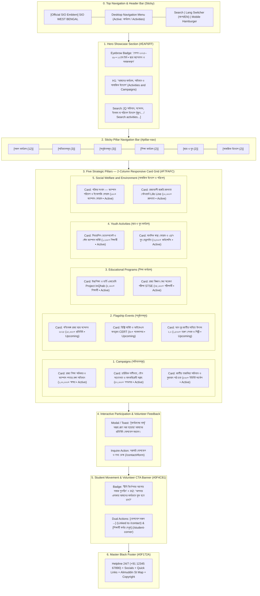

# SIO West Bengal — Activities Page Wireframe & Section-Wise Content Matrix
> **Document Status**: Production Ready & Fully Aligned with Official SIO Constitution (Amended Dec 2022) & Biennial Policy & Programme (2025–2026 / 22nd Term)  
> **Target Route**: `/activities`  
> **Source File**: [`src/app/activities/page.tsx`](file:///home/masyud/Development/Masyud/SIO/src/app/activities/page.tsx)  
> **Design Pattern**: Dynamic Student Movement & Social Welfare Hub with 5 Functional Pillars, Session 2025–2026 Policy Alignment, Sticky Pill Navigation, Real-Time Search, Impact Metrics, Biennial Calendar, and Interactive Participation Modal.

---

## 1. Executive Summary & Page Architecture

The **Activities Page** (`/activities`) serves as the central operational hub of SIO West Bengal's grassroots student activism, statewide advocacy campaigns, flagship conferences, higher education admissions desks, and emergency humanitarian relief services in execution of the **Biennial Policy & Programme (January 2025 – December 2026 / 22nd Term)**.

### Core Strategic Pillars:
$$\text{Campaigns (অভিযানসমূহ)} \longleftrightarrow \text{Flagship Events (অনুষ্ঠানসমূহ)} \longleftrightarrow \text{Education (শিক্ষা)} \longleftrightarrow \text{Youth (ছাত্র ও যুব)} \longleftrightarrow \text{Social Welfare (সামাজিক উদ্যোগ)}$$

### Key Technical & Visual Attributes:
- **Sticky Filter Navigation**: Sticky top filter bar featuring 6 dynamic pills with real-time counter badges (`All [12]`, `Campaigns [3]`, `Events [3]`, `Education [2]`, `Youth [2]`, `Social [2]`).
- **Instant Search Filtering**: Real-time multi-field search engine across titles, descriptions, and locations in both Bengali and English.
- **Unified Activity Card Anatomy**:
  - Top status pill (`Active` / `Upcoming` / `Completed`) with corresponding color palettes (Emerald, Blue, Slate).
  - Prominent verified impact metric tag (e.g., `১,০০,০০০+ শিক্ষার্থী স্বাক্ষর`, `৩৫,০০০+ পরীক্ষার্থী`, `১০,০০০+ রক্তদাতা নেটওয়ার্ক`).
  - Bilingual Title & Description.
  - Geo-location & operational timeframe metadata with Lucide icons (`MapPin`, `Clock`).
  - 3-point Key Highlights checklist with blue check indicators (`CheckCircle2`).
  - Interactive `Participate / Details` modal trigger button and quick `/contact#form` inquiry link.
- **Interactive Participation Modal**: Instant feedback modal acknowledging student engagement and dispatching interest to zonal coordination.
- **Volunteer Gateway CTA**: Dark navy banner (`#0F4C81`) routing to `/contact` and `/student-corner`.

---

## 2. Interactive Flowchart & Information Architecture



---

## 3. Visual Wireframes (ASCII Schematics)

### 3.1 Desktop Layout (1280px+)

```
+--------------------------------------------------------------------------------------------------+
| [LOGO] SIO West Bengal        [Home]  [About]  [Leadership]  [ACTIVITIES*]  [Contact]  [BN/EN]   |
+--------------------------------------------------------------------------------------------------+
| HERO SHOWCASE & SEARCH BAR (#EAF6FF)                                                             |
|                                                                                                  |
|   (•) SESSION 2025–26 • 22ND TERM / ছাত্র আন্দোলন ও সমাজকল্যাণ                                    |
|   STATEWIDE ACTIVITIES, CAMPAIGNS & SOCIAL WELFARE                                               |
|   আমাদের কার্যক্রম, অভিযান ও সামাজিক উদ্যোগ                                                          |
|   Advocating educational equity, campus democracy, moral character, and humanitarian relief.     |
|                                                                                                  |
|   +-------------------------------------------------------------------------+                    |
|   | [Q] Search campaigns, conferences, InQhab or eco-initiatives...        [X]|                    |
|   +-------------------------------------------------------------------------+                    |
+--------------------------------------------------------------------------------------------------+
| STICKY PILLAR NAVIGATION BAR (Sticky top-16 md:top-[72px])                                       |
| [All Activities (12)] [Campaigns (3)] [Events (3)] [Education (2)] [Youth (2)] [Social (2)]      |
+--------------------------------------------------------------------------------------------------+
| MAIN CONTENT AREA (2-Column Grid / #F7FAFC)                                                      |
|                                                                                                  |
|   +----------------------------------------+  +----------------------------------------+         |
|   | [Active]        [১,০০,০০০+ স্বাক্ষর]   |  | [Active]          [৫০,০০০+ শপথপত্র]    |         |
|   | Statewide Right to Education & Campus  |  | Moral Character, Sexual Morality &     |         |
|   | Democracy Campaign                     |  | Anti-Addiction Week                    |         |
|   | রাজ্য শিক্ষা অধিকার ও ক্যাম্পাস গণতন্ত্র |  | চারিত্রিক শালীনতা ও মাদকবিরোধী সপ্তাহ |         |
|   |                                        |  |                                        |         |
|   | Description: Statewide student drive   |  | Description: Awareness drive           |         |
|   | against fee hikes & restoring unions.. |  | cultivating modesty & ethical values...|         |
|   |                                        |  |                                        |         |
|   | [Pin] All Universities & Districts WB  |  | [Pin] 23 Districts & 500+ Campuses     |         |
|   | [Clock] Session 2025–2026              |  | [Clock] Annual State Campaign          |         |
|   |                                        |  |                                        |         |
|   | Key Highlights:                        |  | Key Highlights:                        |         |
|   |  [v] Memorandum to Education Minister  |  |  [v] Addiction-free pledges            |         |
|   |  [v] Student union revival conventions |  |  [v] Pre-marital counseling clinics    |         |
|   |  [v] Anti-dropout student assemblies   |  |  [v] 24/7 mental wellness desk         |         |
|   |                                        |  |                                        |         |
|   | [Participate / Details ->] [Inquire ->]|  | [Participate / Details ->] [Inquire ->]|         |
|   +----------------------------------------+  +----------------------------------------+         |
|                                                                                                  |
|   +----------------------------------------+  +----------------------------------------+         |
|   | [Upcoming]         [১৫,০০০+ প্রতিনিধি] |  | [Upcoming]         [৪০+ গবেষণাপত্র]   |         |
|   | West Bengal State Student Conf 2025    |  | History Summit & CERT Academic Conclave|         |
|   | পশ্চিমবঙ্গ রাজ্য ছাত্র সম্মেলন ২০২৫      |  | হিস্ট্রি সামিট ও আইকেএস কনক্লেভ        |         |
|   |                                        |  |                                        |         |
|   | Description: Flagship biennial summit  |  | Description: Research symposium on     |         |
|   | adopting educational charter & vision..|  | minority history & textbook reforms... |         |
|   |                                        |  |                                        |         |
|   | [Pin] Milan Mela / Convention Centre   |  | [Pin] Jadavpur & Aliah Universities    |         |
|   | [Clock] November 2025                  |  | [Clock] October 2025                   |         |
|   |                                        |  |                                        |         |
|   | Key Highlights:                        |  | Key Highlights:                        |         |
|   |  [v] 4-point student charter adopted   |  |  [v] Textbook distortions review       |         |
|   |  [v] National academic scholar talks   |  |  [v] CERT educational survey report    |         |
|   |  [v] Meritorious felicitations         |  |  [v] Best young researcher awards      |         |
|   |                                        |  |                                        |         |
|   | [Participate / Details ->] [Inquire ->]|  | [Participate / Details ->] [Inquire ->]|         |
|   +----------------------------------------+  +----------------------------------------+         |
|                                                                                                  |
|   +----------------------------------------+  +----------------------------------------+         |
|   | [Active]          [৫,০০০+ শিক্ষার্থী]  |  | [Active]           [৩৫,০০০+ পরীক্ষার্থী]|        |
|   | Project InQhab — Admissions Academy    |  | State Talent Search Exam (STSE)        |         |
|   | প্রজেক্ট ইনকাব — উচ্চশিক্ষা একাডেমি     |  | রাজ্য বিজ্ঞান মেধা অন্বেষণ পরীক্ষা (STSE)|        |
|   |                                        |  |                                        |         |
|   | [Pin] Online Portal & 12 Centers       |  | [Pin] 250+ Centers Across Bengal       |         |
|   | [Clock] Year-Round Academy             |  | [Clock] Annually Oct–Dec               |         |
|   | [Participate / Details ->] [Inquire ->]|  | [Participate / Details ->] [Inquire ->]|         |
|   +----------------------------------------+  +----------------------------------------+         |
|                                                                                                  |
|   +----------------------------------------+  +----------------------------------------+         |
|   | [Active]              [১,২০০+ ইঞ্জিনিয়ার]| | [Active]         [৩,৫০০+ কাউন্সেলিং]  |         |
|   | STEM Campuses & Leadership Summit      |  | Mental Wellness Forum & 24/7 Helpline  |         |
|   | স্টেম ক্যাম্পাস ও লিডারশিপ সামিট        |  | মানসিক স্বাস্থ্য ফোরাম ও যুব হেল্পলাইন |         |
|   |                                        |  |                                        |         |
|   | [Pin] IIT Kharagpur & Salt Lake Hub    |  | [Pin] 24/7 Online & Kolkata Wellness   |         |
|   | [Clock] September 2025                 |  | [Clock] Round-the-Clock Support        |         |
|   | [Participate / Details ->] [Inquire ->]|  | [Participate / Details ->] [Inquire ->]|         |
|   +----------------------------------------+  +----------------------------------------+         |
|                                                                                                  |
|   +----------------------------------------+  +----------------------------------------+         |
|   | [Active]           [১০০+ ক্যাম্পাস ফোরাম]| | [Active]            [১০,০০০+ রক্তদাতা] |         |
|   | Parisar Samvad Eco-Dialogue Movement   |  | Emergency Blood Donors & Relief Cell   |         |
|   | পরিসর সংবাদ — ক্যাম্পাস পরিবেশ আন্দোলন |  | জরুরি রক্তদাতা নেটওয়ার্ক ও দুর্যোগ সেল|         |
|   |                                        |  |                                        |         |
|   | [Pin] 500+ Campuses Across Bengal      |  | [Pin] All Medical Colleges & Hospitals |         |
|   | [Clock] Ongoing Year-Round             |  | [Clock] 24/7 Rapid Emergency Cell      |         |
|   | [Participate / Details ->] [Inquire ->]|  | [Participate / Details ->] [Inquire ->]|         |
|   +----------------------------------------+  +----------------------------------------+         |
+--------------------------------------------------------------------------------------------------+
| STUDENT MOVEMENT CTA BANNER (#0F4C81 Navy)                                                       |
|   (•) FOUR DECADES OF STUDENT LEADERSHIP / দ্বীনি নির্দেশনার আলোয় সমাজ পুনর্গঠন                   |
|   Want to Organize or Participate in SIO Initiatives?                                            |
|   আপনার এলাকায় বা ক্যাম্পাসে আমাদের কার্যক্রমে যুক্ত হতে চান?                                       |
|                                                                                                  |
|   [Get in Touch / যোগাযোগ করুন ->]              [Visit Student Corner / শিক্ষার্থী কর্নার]        |
+--------------------------------------------------------------------------------------------------+
| MASTER BLACK FOOTER (#0F172A)                                                                    |
|   24/7 Emergency Helpline | Quick Navigation | Social Channels | Google Maps HQ Location         |
+--------------------------------------------------------------------------------------------------+
```

### 3.2 Mobile Visual Layout (375px–430px Responsive View)

```
+-----------------------------------+
| [=] SIO WB Logo          [BN/EN]  |
+-----------------------------------+
| HERO SECTION                      |
| (•) 22ND TERM • 2025–26           |
| Activities, Campaigns & Welfare   |
| কার্যক্রম, অভিযান ও সামাজিক উদ্যোগ|
|                                   |
| [Q Search activities or dist...]  |
+-----------------------------------+
| HORIZONTAL SCROLL PILL NAV        |
| [All(12)] [Camp(3)] [Evt(3)] [Edu]|
+-----------------------------------+
| 1-COLUMN ACTIVITY CARDS           |
|                                   |
| +-------------------------------+ |
| | [Active]   [১,০০,০০০+ স্বাক্ষর] | |
| | Campus Democracy Campaign     | |
| | রাজ্য শিক্ষা অধিকার অভিযান   | |
| |                               | |
| | Campus democracy, fee hike    | |
| | reforms across Bengal...      | |
| |                               | |
| | [Pin] All WB Universities     | |
| | [Clock] Session 2025–26       | |
| |                               | |
| | Key Highlights:               | |
| |  [v] Mass signatures          | |
| |  [v] Student union revival    | |
| |  [v] Anti-dropout assemblies  | |
| |                               | |
| | [Participate / Details ->]    | |
| | Inquire →                     | |
| +-------------------------------+ |
|                                   |
| +-------------------------------+ |
| | [Upcoming]  [১৫,০০০+ প্রতিনিধি]| |
| | WB State Student Conf 2025    | |
| | পশ্চিমবঙ্গ রাজ্য ছাত্র সম্মেলন| |
| |                               | |
| | [Pin] Milan Mela, Kolkata     | |
| | [Clock] November 2025         | |
| |                               | |
| | [Participate / Details ->]    | |
| | Inquire →                     | |
| +-------------------------------+ |
|                                   |
| +-------------------------------+ |
| | [Active]    [১০,০০০+ রক্তদাতা]  | |
| | Blood Donors (Life Line)      | |
| | জরুরি রক্তদাতা নেটওয়ার্ক      | |
| |                               | |
| | [Pin] All Govt Hospitals      | |
| | [Clock] 24/7 Emergency        | |
| |                               | |
| | [Participate / Details ->]    | |
| | Inquire →                     | |
| +-------------------------------+ |
+-----------------------------------+
| CTA: CONNECT WITH SIO WB          |
| [Get in Touch] [Student Corner]   |
+-----------------------------------+
| MASTER FOOTER                     |
+-----------------------------------+
```

---

## 4. Section-by-Section Name-Wise Content Matrix

### Section 0: Sticky Navigation Header
- **Component File**: [`src/components/layout/header.tsx`](file:///home/masyud/Development/Masyud/SIO/src/components/layout/header.tsx)
- **Position**: Sticky (`top-0 z-50 bg-white/95 backdrop-blur-md border-b border-[#E5E7EB]`)
- **Active Navigation Link**: `কার্যক্রম (Activities)`
- **Actions**: Language switch (`বাংলা` / `English`), Search toggle, CTA button (`যুক্ত হোন / Join Us`).

---

### Section 1: Hero Showcase & Real-Time Search Bar (`#top`)
- **Component File**: Native Section in [`src/app/activities/page.tsx`](file:///home/masyud/Development/Masyud/SIO/src/app/activities/page.tsx)
- **Styling**: Light Sky Blue backdrop (`#EAF6FF`) with radial gradient glow orbs.

| Content Field | Bengali Translation (`bn`) | English Translation (`en`) |
| :--- | :--- | :--- |
| **Top Eyebrow Pill** | `সেশন ২০২৫–২৬ • ২২তম টার্ম • ছাত্র আন্দোলন ও সমাজকল্যাণ` | `Session 2025–26 • 22nd Term • Student Movement & Social Action` |
| **Main Title** | `আমাদের কার্যক্রম, অভিযান ও সামাজিক উদ্যোগ` | `Statewide Activities, Campaigns & Social Initiatives` |
| **Subtitle Description** | `এসআইও সংবিধানের লক্ষ্য এবং 'পলিসি অ্যান্ড প্রোগ্রাম ২০২৫–২৬'-এর নির্দেশনায় শিক্ষাঙ্গনের গণতান্ত্রিক অধিকার রক্ষা, আত্মশুদ্ধি, মেধা বিকাশ এবং মানবিক সেবায় আমাদের চার দশকেরও বেশি সময়ের ধারাবাহিক পথচলা।` | `Advocating educational equity, campus democracy, moral character development, and active emergency relief across West Bengal for over four decades.` |
| **Search Placeholder** | `অভিযান, সম্মেলন, ইনকাব বা পরিবেশ উদ্যোগ খুঁজুন...` | `Search campaigns, conferences, InQhab, or eco-initiatives...` |
| **Search Clear Glyph** | `✕ (অনুসন্ধান মুছুন)` | `✕ (Clear)` |

---

### Section 2: Sticky Pillar Navigation Bar (`#pillar-nav`)
- **Component**: Sticky Header Strip (`sticky top-16 md:top-[72px] z-40 bg-white border-b border-[#E5E7EB] shadow-2xs`)
- **Pills**: Responsive horizontal scroll pills with count badges and Lucide SVG icons.

| Tab ID | Bengali Label | English Label | Icon | Count | Filter Target |
| :--- | :--- | :--- | :--- | :--- | :--- |
| `all` | `সকল কার্যক্রম` | `All Activities` | `Sparkles` | **12** | Shows entire collection of 12 initiatives |
| `campaigns` | `অভিযানসমূহ` | `Campaigns` | `Megaphone` | **3** | Educational rights, character & tazkiyah drives |
| `events` | `অনুষ্ঠানসমূহ` | `Events` | `Calendar` | **3** | State conferences, history summits & lit fests |
| `education`| `শিক্ষা কার্যক্রম` | `Educational Programs` | `GraduationCap` | **2** | InQhab university academy & STSE exams |
| `youth` | `ছাত্র ও যুব` | `Youth Activities` | `Users` | **2** | STEM leadership summits & mental wellness forum |
| `social` | `সামাজিক উদ্যোগ` | `Social Welfare` | `HeartHandshake` | **2** | Parisar Samvad eco-chapters & Life Line blood cell |

---

### Section 3: Campaigns Pillar Grid (`category: "campaigns"`)
- **Focus**: Statewide student rights, campus democracy restoration, and Islamic moral rejuvenation.

#### Card 3.1: Statewide Right to Education, Campus Democracy & Student Union Restoration Campaign
- **ID**: `camp-1`
- **Status**: `active` (`চলমান`) | **Style**: `bg-emerald-50 text-emerald-700 border-emerald-200`
- **Verified Impact Metric**: `১,০০,০০০+ শিক্ষার্থী স্বাক্ষর` (100,000+ Student Signatures)
- **Title (BN)**: `রাজ্য শিক্ষা অধিকার, ক্যাম্পাস গণতন্ত্র ও ছাত্র সংসদ পুনর্বহাল অভিযান`
- **Title (EN)**: `Statewide Right to Education, Campus Democracy & Student Union Restoration Campaign`
- **Policy Alignment**: পলিসি পৃষ্ঠা ১৭-১৮ (ক্যাম্পাস সংস্কৃতি ও নিষিদ্ধ ছাত্র সংসদ সচল করার আন্দোলন)।
- **Description (BN)**: `পশ্চিমবঙ্গের বিশ্ববিদ্যালয় ও কলেজগুলোতে গণতান্ত্রিক পরিবেশ ফিরিয়ে আনা, নিষিদ্ধ ছাত্র সংসদ নির্বাচন পুনর্বহাল, অন্যায্য ফি বৃদ্ধি প্রতিরোধ এবং সংখ্যালঘু শিক্ষার্থীদের জন্য শিক্ষা বাজেটের দাবিতে রাজ্যব্যাপী ঐতিহাসিক আন্দোলন।`
- **Description (EN)**: `Statewide campaign demanding immediate revival of student union elections, curbing tuition fee hikes, and ensuring transparent admissions across colleges and universities.`
- **Location (BN/EN)**: `সকল বিশ্ববিদ্যালয়, কলেজ ও জেলা সদর` / `All Universities & Districts across WB`
- **Timeframe (BN/EN)**: `চলমান সেশন ২০২৫–২৬` / `Session 2025–2026 Active`
- **Key Highlights**:
  1. `শিক্ষামন্ত্রীর নিকট গণস্বাক্ষর সম্বলিত স্মারকলিপি পেশ` (Mass signature collection & memorandum submission to authorities)
  2. `ক্যাম্পাসে গণতান্ত্রিক ছাত্র সংসদ নির্বাচনের দাবিতে কনভেনশন` (Campus democracy conventions demanding student union elections)
  3. `মাতৃভাষায় শিক্ষা নিশ্চিতকরণ ও ড্রপ-আউট প্রতিরোধ সমাবেশ` (Public rallies ensuring mother-tongue schooling & dropout prevention)

#### Card 3.2: Moral Character, Sexual Morality & Anti-Substance Abuse Awareness Drive
- **ID**: `camp-2`
- **Status**: `active` (`চলমান`) | **Style**: `bg-emerald-50 text-emerald-700 border-emerald-200`
- **Verified Impact Metric**: `৫০,০০০+ শিক্ষার্থী শপথপত্র` (50,000+ Pledges Taken)
- **Title (BN)**: `চারিত্রিক শালীনতা, যৌন সচেতনতা ও মাদকবিরোধী সপ্তাহ`
- **Title (EN)**: `Moral Character, Sexual Morality & Anti-Substance Abuse Awareness Drive`
- **Policy Alignment**: পলিসি পৃষ্ঠা ১১ ও ২৪ (হায়া, যৌন সচেতনতা ও ডিজিটাল আসক্তি নিরসন)।
- **Description (BN)**: `তরুণ প্রজন্মের মাঝে ইসলামি শালীনতা (হায়া) ও চারিত্রিক পবিত্রতা বৃদ্ধি, ডিজিটাল পর্নোগ্রাফি ও মাদকাসক্তি প্রতিরোধ এবং প্রাক-বিবাহ নৈতিক কাউন্সেলিং পরিচালনা।`
- **Description (EN)**: `Statewide campaign educating youth on ethical values, combating drug addiction and digital pornography, and promoting pre-marital family ethics.`
- **Location (BN/EN)**: `২৩ জেলা ও ৫০০+ শিক্ষাপ্রতিষ্ঠান` / `23 Districts & 500+ Campuses`
- **Timeframe (BN/EN)**: `বার্ষিক রাজ্য ক্যাম্পেইন` / `Annual State Campaign`
- **Key Highlights**:
  1. `মাদক ও পর্নোগ্রাফিমুক্ত জীবনের জন্য শপথ গ্রহণ` (Student pledges for drug- and pornography-free life)
  2. `প্রাক-বিবাহ সচেতনতা ও পারিবারিক মূল্যবোধ কর্মশালা` (Pre-marital awareness and family values workshops)
  3. `২৪/৭ যুব মানসিক স্বাস্থ্য ও কাউন্সেলিং ডেস্ক` (24/7 youth mental health & recovery counseling desks)

#### Card 3.3: National Tazkiyah Campaign, Unit Quran Circles & Infaaq Drive
- **ID**: `camp-3`
- **Status**: `active` (`চলমান`) | **Style**: `bg-emerald-50 text-emerald-700 border-emerald-200`
- **Verified Metric**: `৫০০+ ইউনিট সার্কেল ও ইনফাক সপ্তাহ` (500+ Active Reading Circles)
- **Title (BN)**: `জাতীয় তাজকিয়া অভিযান ও ইউনিট কুরআন পাঠ চক্র`
- **Title (EN)**: `National Tazkiyah Campaign, Unit Quran Circles & Infaaq Drive`
- **Policy Alignment**: পলিসি পৃষ্ঠা ১০ ও ২৪ (আত্মশুদ্ধি, ফরজ সালাত, তাজকিয়া গাইড ও ইনফাক সপ্তাহ)।
- **Description (BN)**: `প্রতিটি ইউনিটে বাধ্যতামূলক কুরআন অধ্যয়ন সার্কেল পরিচালনা, আখেরাতের চিন্তা (Fikr-e-aakhirat) জাগ্রতকরণ, মুদাররিস-ই-কুরআন প্রশিক্ষণ এবং সদস্যদের জন্য ব্যক্তিগত আত্মমূল্যায়ন (মুহাসাবা)।`
- **Description (EN)**: `Mandatory grassroots Quranic study circles across all units, fostering contemplation of the Hereafter, training Quran mentors, and observing Infaaq Week.`
- **Location (BN/EN)**: `সমগ্র পশ্চিমবঙ্গ জোন (তৃণমূল ইউনিট স্তর)` / `All Units Across West Bengal Zone`
- **Timeframe (BN/EN)**: `সেশন ২০২৫–২৬ নিয়মিত কার্যক্রম` / `Regular Session 2025–26 Program`
- **Key Highlights**:
  1. `প্রতিটি স্থানীয় ইউনিটে সাপ্তাহিক কুরআন পাঠ চক্র বাধ্যতামূলক` (Mandatory weekly unit-level Quranic study circles)
  2. `বার্ষিক জাতীয় ইনফাক সপ্তাহ ও দানশীলতার বিকাশ` (Annual National Infaaq Week cultivating charity and sacrifice)
  3. `মুদাররিস-ই-কুরআন প্রশিক্ষণ ও তাজকিয়া গাইডবুক বিতরণ` (Quran mentor workshops & distribution of comprehensive Tazkiyah Guides)

---

### Section 4: Flagship Events & Summits Grid (`category: "events"`)
- **Focus**: Academic symposia, research conventions, and biennial student summits.

#### Card 4.1: West Bengal State Students Conference 2025
- **ID**: `evt-1`
- **Status**: `upcoming` (`আসন্ন`) | **Style**: `bg-[#EAF6FF] text-[#168BD4] border-[#63BDFF]/30`
- **Verified Impact Metric**: `১৫,০০০+ প্রতিনিধি ও ছাত্র নেতৃত্ব` (15,000+ Student Delegates)
- **Title (BN)**: `পশ্চিমবঙ্গ রাজ্য ছাত্র সম্মেলন ২০২৫`
- **Title (EN)**: `West Bengal State Student Conference 2025`
- **Description (BN)**: `রাজ্যের সকল কলেজ, বিশ্ববিদ্যালয় ও মাদরাসা শিক্ষার্থীদের অংশগ্রহণে দ্বিভাষিক শিক্ষা সনদ পেশ, ইনসাফ ও ভ্রাতৃত্বের সমাজ বিনির্মাণের ঐতিহাসিক মহাসম্মেলন।`
- **Description (EN)**: `Historic biennial convention uniting students across colleges, universities, and madrasas, declaring the Student Educational Charter for justice and fraternity.`
- **Location (BN/EN)**: `মিলন মেলা প্রাঙ্গণ / কনভেনশন সেন্টার, কলকাতা` / `Milan Mela / Convention Centre, Kolkata`
- **Timeframe (BN/EN)**: `নভেম্বর ২০২৫` / `November 2025`
- **Key Highlights**:
  1. `৪ দফা ঐতিহাসিক ছাত্র শিক্ষা সনদ ঘোষণা` (Proclamation of the 4-point historic Student Charter)
  2. `জাতীয় ও আন্তর্জাতিক বুদ্ধিজীবীদের উন্মুক্ত অ্যাকাডেমিক প্যানেল` (Academic symposiums with renowned scholars)
  3. `কৃতি শিক্ষার্থী ও সমাজসেবীদের বিশেষ সম্মাননা স্মারক` (Merit felicitations for exemplary students and social workers)

#### Card 4.2: History Summit, Indian Knowledge System (IKS) & CERT Academic Conclave
- **ID**: `evt-2`
- **Status**: `upcoming` (`আসন্ন`) | **Style**: `bg-[#EAF6FF] text-[#168BD4] border-[#63BDFF]/30`
- **Verified Metric**: `৪০+ গবেষণাপত্র ও মনোগ্রাফ প্রকাশ` (40+ Peer-Reviewed Papers)
- **Title (BN)**: `হিস্ট্রি সামিট ও ভারতীয় জ্ঞানব্যবস্থা (IKS) অ্যাকাডেমিক কনক্লেভ`
- **Title (EN)**: `History Summit, Indian Knowledge System (IKS) & CERT Academic Conclave`
- **Policy Alignment**: পলিসি পৃষ্ঠা ১৭ ও ২৬ (পাঠ্যপুস্তকে ইতিহাস বিকৃতি রোধ ও অ্যাকাডেমিক গবেষণা)।
- **Description (BN)**: `উপমহাদেশের ইতিহাস বিকৃতি প্রতিরোধ, মুসলিম ঐতিহ্যের বস্তুনিষ্ঠ মূল্যায়ন এবং শিক্ষানীতি পর্যালোচনায় শীর্ষ গবেষক ও অধ্যাপকদের অংশগ্রহণে অ্যাকাডেমিক সিম্পোজিয়াম।`
- **Description (EN)**: `Academic conclave countering historical distortions in textbooks, evaluating Muslim contributions objectively, and scrutinizing education policies.`
- **Location (BN/EN)**: `যাদবপুর বিশ্ববিদ্যালয় ও আলিয়া বিশ্ববিদ্যালয়` / `Jadavpur & Aliah Universities`
- **Timeframe (BN/EN)**: `অক্টোবর ২০২৫` / `October 2025`
- **Key Highlights**:
  1. `পাঠ্যপুস্তকে বিকৃতি ও ইতিহাস পুনর্লিখনের ওপর বৈজ্ঞানিক পর্যালোচনা` (Scientific review of curriculum and historiographical distortions)
  2. `সিইআরটি বার্ষিক শিক্ষা সমীক্ষা ও ড্রপ-আউট রিপোর্ট প্রকাশ` (Release of CERT annual educational survey & dropout research)
  3. `তরুণ ইতিহাস গবেষকদের জন্য সেরা পেপার অ্যাওয়ার্ড` (Best paper research awards and grants for young scholars)

#### Card 4.3: An Noor Literature & Cultural Festival 2.0
- **ID**: `evt-3`
- **Status**: `upcoming` (`আসন্ন`) | **Style**: `bg-[#EAF6FF] text-[#168BD4] border-[#63BDFF]/30`
- **Verified Metric**: `১,৫০০+ তরুণ লেখক, কবি ও শিল্পী` (1,500+ Young Creators)
- **Title (BN)**: `আন নূর জাতীয় সাহিত্য ও সংস্কৃতি উৎসব ২.০`
- **Title (EN)**: `An Noor Literature & Cultural Festival 2.0`
- **Policy Alignment**: পলিসি পৃষ্ঠা ২০-২১ ও ২৭ ('আল-জামিল' দর্শন, সুস্থ সংস্কৃতি ও বঙ্গীয় সাহিত্য চর্চা)।
- **Description (BN)**: `ইসলামি নন্দনতত্ত্বের আলোকে সাহিত্য, কবিতা, সাংবাদিকতা, ক্যালিগ্রাফি এবং চারুকলায় মুসলিম তরুণদের সৃজনশীল প্রতিভার বিকাশ সম্মেলন।`
- **Description (EN)**: `Creative youth confluence celebrating Islamic aesthetics, Bengali literature, poetry, calligraphy, and ethical journalism under 'Al-Jameel' philosophy.`
- **Location (BN/EN)**: `কলকাতা ও জেলা শিল্প একাডেমি` / `Kolkata & District Art Academies`
- **Timeframe (BN/EN)**: `জানুয়ারি ২০২৬` / `January 2026`
- **Key Highlights**:
  1. `বাংলা কবিতা আবৃত্তি, ছোটগল্প ও চিত্রাঙ্কন প্রতিযোগিতা` (Bengali poetry recitation, short story & painting competitions)
  2. `ইসলামিক ক্যালিগ্রাফি ও ভিজ্যুয়াল আর্ট এক্সিবিশন` (Islamic calligraphy galleries & visual art displays)
  3. `বঙ্গীয় মুসলিম সাহিত্যের ঐতিহাসিক অবদান বিষয়ক সিম্পোজিয়াম` (Symposium on the historical contributions to Bengali Muslim literature)

---

### Section 5: Educational Programs Grid (`category: "education"`)
- **Focus**: Academic empowerment, university entrance guidance, and science talent tests.

#### Card 5.1: Project InQhab — University Admissions & Higher Education Academy
- **ID**: `edu-1`
- **Status**: `active` (`চলমান`) | **Style**: `bg-emerald-50 text-emerald-700 border-emerald-200`
- **Verified Metric**: `৫,০০০+ শিক্ষার্থী ভর্তি প্রশিক্ষণ` (5,000+ Students Mentored)
- **Title (BN)**: `প্রজেক্ট ইনকাব (InQhab) — বিশ্ববিদ্যালয় ভর্তি ও উচ্চশিক্ষা একাডেমি`
- **Title (EN)**: `Project InQhab — University Admissions & Higher Education Academy`
- **Policy Alignment**: পলিসি পৃষ্ঠা ১৫ ও ২৫ (বিশ্ববিদ্যালয় ভর্তি সহায়তা ও ফ্রেমওয়ার্ক)।
- **Description (BN)**: `কেন্দ্রীয় ও রাজ্য বিশ্ববিদ্যালয়সমূহে (JNU, AMU, Jamia, DU, Presidency, Jadavpur, Aliah) অনগ্রসর শিক্ষার্থীদের ভর্তির প্রবেশিকা পরীক্ষার প্রস্তুতি, ফ্রি কোচিং এবং স্কলারশিপ সহায়তা।`
- **Description (EN)**: `Holistic admissions guidance academy offering test prep, free mock assessments, and mentor matching for prestigious central and state universities.`
- **Location (BN/EN)**: `অনলাইন পোর্টাল ও ১২টি অফলাইন লার্নিং সেন্টার` / `Online Portal & 12 Offline Learning Centers`
- **Timeframe (BN/EN)**: `সারা বছর চলমান` / `Round-the-Year Program`
- **Key Highlights**:
  1. `CUET ও বিশ্ববিদ্যালয় প্রবেশিকা পরীক্ষার ফ্রি মক টেস্ট` (Free mock tests for CUET and premier university entrance exams)
  2. `প্রখ্যাত বিশ্ববিদ্যালয়ের গবেষক ও অ্যালামনাইদের মেন্টরশিপ` (Direct mentoring by scholars and university alumni)
  3. `হস্টেল ও স্কলারশিপ আবেদন সহায়তা ডেস্ক` (Comprehensive hostel accommodation & national scholarship guidance)

#### Card 5.2: Statewide Science & Talent Search Examination (STSE)
- **ID**: `edu-2`
- **Status**: `active` (`চলমান`) | **Style**: `bg-emerald-50 text-emerald-700 border-emerald-200`
- **Verified Metric**: `৩৫,০০০+ পরীক্ষার্থী প্রতি বছর` (35,000+ Examinees Annually)
- **Title (BN)**: `রাজ্য বিজ্ঞান মেধা অন্বেষণ পরীক্ষা (STSE)`
- **Title (EN)**: `Statewide Science & Talent Search Examination (STSE)`
- **Description (BN)**: `পশ্চিমবঙ্গের ৭ম থেকে ১০ম শ্রেণির ছাত্রছাত্রীদের মাঝে বিজ্ঞান মনস্কতা, গণিত দক্ষতা ও নৈতিক শিক্ষার বিকাশে চার দশক ধরে পরিচালিত ঐতিহাসিক মেধা বৃত্তি পরীক্ষা।`
- **Description (EN)**: `Four-decade-old flagship talent assessment screening mathematics, natural science, and logical reasoning among school students across Bengal.`
- **Location (BN/EN)**: `২৫০+ পরীক্ষা কেন্দ্র (সমগ্র পশ্চিমবঙ্গ)` / `250+ Centers Across Bengal`
- **Timeframe (BN/EN)**: `প্রতি বছর অক্টোবর–ডিসেম্বর` / `Annually October–December`
- **Key Highlights**:
  1. `রাজ্য ও জেলা স্তরে মেধা বৃত্তি ও ল্যাপটপ পুরস্কার` (State & district ranker cash scholarships and laptop awards)
  2. `উচ্চশিক্ষার জন্য বিশেষ বিজ্ঞান কাউন্সেলিং শিবির` (Advanced science orientation & mentorship workshops)
  3. `প্রত্যন্ত গ্রামের অনগ্রসর স্কুলের শিক্ষার্থীদের বিশেষ প্রশিক্ষণ` (Targeted preparatory coaching in rural and underserved schools)

---

### Section 6: Youth Activities Grid (`category: "youth"`)
- **Focus**: STEM campus development, leadership bootcamps, and professional mental health support.

#### Card 6.1: Youth Leadership Development & STEM Campuses Summit
- **ID**: `yth-1`
- **Status**: `active` (`চলমান`) | **Style**: `bg-emerald-50 text-emerald-700 border-emerald-200`
- **Verified Metric**: `১,২০০+ ইঞ্জিনিয়ার ও চিকিৎসক প্রশিক্ষণার্থী` (1,200+ STEM Professionals)
- **Title (BN)**: `ইয়ুথ লিডারশিপ ডেভেলপমেন্ট ও স্টেম ক্যাম্পাস সামিট`
- **Title (EN)**: `Youth Leadership Development & STEM Campuses Summit`
- **Policy Alignment**: পলিসি পৃষ্ঠা ১৮ ও ২৮ (প্রফেশনাল ও স্টেম ক্যাম্পাস নেটওয়ার্ক)।
- **Description (BN)**: `মেডিক্যাল, ইঞ্জিনিয়ারিং ও পলিটেকনিক ক্যাম্পাসের শিক্ষার্থীদের প্রযুক্তিগত উৎকর্ষ, উদ্যোক্তা হওয়ার অনুপ্রেরণা এবং সামাজিক দায়িত্ববোধে উদ্বুদ্ধকরণ।`
- **Description (EN)**: `Premier summit gathering engineering, medical, and polytechnic students to instill tech ethics, entrepreneurship, and social leadership.`
- **Location (BN/EN)**: `আইআইটি খড়গপুর ও সল্টলেক আইটি হাব` / `IIT Kharagpur & Salt Lake IT Hub`
- **Timeframe (BN/EN)**: `সেপ্টেম্বর ২০২৫` / `September 2025`
- **Key Highlights**:
  1. `এআই, ডেটা সায়েন্স ও নৈতিক টেকনোলজি সেমিনার` (Seminars on AI, data science, and technology ethics)
  2. `স্টার্টআপ ইনকিউবেশন ও বিজনেস মডেল কর্মশালা` (Social venture incubation and business pitch clinics)
  3. `টেক প্রফেশনালদের সাথে ক্যারিয়ার নেটওয়ার্কিং সার্কেল` (Exclusive networking circles with industry leaders)

#### Card 6.2: Mental Wellness Forum & 24/7 Youth Helpline
- **ID**: `yth-2`
- **Status**: `active` (`চলমান`) | **Style**: `bg-emerald-50 text-emerald-700 border-emerald-200`
- **Verified Metric**: `৩,৫০০+ গোপনীয় কাউন্সেলিং সেশন` (3,500+ Confidential Sessions)
- **Title (BN)**: `যুব মানসিক স্বাস্থ্য ফোরাম ও ২৪/৭ হেল্পলাইন`
- **Title (EN)**: `Mental Wellness Forum & 24/7 Youth Helpline`
- **Policy Alignment**: পলিসি পৃষ্ঠা ১১ ও ২৫ (মানসিক সুস্থতা ও যুব মানসিক স্বাস্থ্য সাপোর্ট)।
- **Description (BN)**: `পড়াশোনার চাপ, ক্যারিয়ার হতাশা, সোশ্যাল মিডিয়া আসক্তি এবং পারিবারিক জটিলতায় ভোগা তরুণদের জন্য পেশাদার সাইকোলজিস্ট ও মেন্টরদের সার্বক্ষণিক বিনামূল্যে কাউন্সেলিং।`
- **Description (EN)**: `Round-the-clock anonymous mental health helpline offering empathetic counseling, stress management, and exam anxiety guidance.`
- **Location (BN/EN)**: `অনলাইন পোর্টাল ও কলকাতা ওয়েলনেস সেন্টার` / `Online Portal & Kolkata Wellness Center`
- **Timeframe (BN/EN)**: `২৪/৭ সার্বক্ষণিক সেবা` / `24/7 Round-the-Clock Service`
- **Key Highlights**:
  1. `সম্পূর্ণ গোপনীয় টেলিফোনিক কাউন্সেলিং সাপোর্ট` (Completely confidential telephonic counseling support)
  2. `ক্যাম্পাসে ডিপ্রেশন ও স্ট্রেস ম্যানেজমেন্ট কর্মশালা` (Campus workshops on depression and academic stress coping mechanisms)
  3. `আত্মহত্যার প্রবণতা নিরসনে পিয়ার মেন্টরশিপ সেল` (Peer-to-peer life support desks combating suicide tendencies)

---

### Section 7: Social Welfare & Environment Grid (`category: "social"`)
- **Focus**: Islamic environmental ethics, campus green audits, voluntary blood banking, and disaster relief.

#### Card 7.1: Parisar Samvad — Campus Eco-Dialogue & 'Imaratul Ardh' Movement
- **ID**: `soc-1`
- **Status**: `active` (`চলমান`) | **Style**: `bg-emerald-50 text-emerald-700 border-emerald-200`
- **Verified Metric**: `১০০+ ক্যাম্পাস ফোরাম ও ২৫,০০০+ বৃক্ষরোপণ` (100+ Campus Eco-Chapters)
- **Title (BN)**: `পরিসর সংবাদ — ক্যাম্পাস পরিবেশ ও ইকোলজি আন্দোলন ('ইমারাতুল আরদ')`
- **Title (EN)**: `Parisar Samvad — Campus Eco-Dialogue & 'Imaratul Ardh' Movement`
- **Policy Alignment**: পলিসি পৃষ্ঠা ২০ ও ২৭ (ইসলামি পরিবেশ দর্শন ও প্যারিসার সংবাদ ফোরাম)।
- **Description (BN)**: `পৃথিবীকে সুরক্ষা ও আবাদ করার ইসলামি দায়িত্ববোধ (ইমারাতুল আরদ) থেকে শিক্ষাপ্রতিষ্ঠানে পরিবেশ দূষণ, জলবায়ু সংকট ও প্লাস্টিক বর্জ্য ব্যবস্থাপনায় শিক্ষার্থীদের পরিবেশ সচেতনতা আন্দোলন।`
- **Description (EN)**: `Campus ecological chapters promoting ecological stewardship grounded in Islamic trusteeship ('Imaratul Ardh'), waste reduction, and massive tree plantation.`
- **Location (BN/EN)**: `পশ্চিমবঙ্গের ৫০০+ কলেজ ও স্কুল ক্যাম্পাস` / `500+ School & College Campuses across WB`
- **Timeframe (BN/EN)**: `বছরব্যাপী কর্মসূচি` / `Ongoing Year-Round Movement`
- **Key Highlights**:
  1. `ক্যাম্পাসে প্লাস্টিকমুক্ত পরিবেশ গড়ার যৌথ কর্মসূচি` (Single-use plastic elimination drives in university campuses)
  2. `বিশ্ব পরিবেশ দিবসে রাজ্যব্যাপী ২৫,০০০ বৃক্ষরোপণ` (25,000+ saplings planted on World Environment Day)
  3. `জল অপচয় রোধ ও বৃষ্টির জল সংরক্ষণে স্টুডেন্টস ক্যাম্পেইন` (Rainwater harvesting and water conservation student initiatives)

#### Card 7.2: Statewide Emergency Blood Donors Network (Life Line) & Disaster Relief
- **ID**: `soc-2`
- **Status**: `active` (`চলমান`) | **Style**: `bg-emerald-50 text-emerald-700 border-emerald-200`
- **Verified Metric**: `১০,০০০+ নিবন্ধিত রক্তদাতা নেটওয়ার্ক` (10,000+ Voluntary Donors)
- **Title (BN)**: `রাজ্যব্যাপী জরুরি রক্তদাতা নেটওয়ার্ক (Life Line) ও দুর্যোগ ত্রাণ সেল`
- **Title (EN)**: `Statewide Emergency Blood Donors Network (Life Line) & Disaster Relief`
- **Policy Alignment**: পলিসি পৃষ্ঠা ২০ ও ২৭ (মানবসেবা সেল ও জরুরি ত্রাণ কর্মসূচি)।
- **Description (BN)**: `পশ্চিমবঙ্গের সরকারি ও বেসরকারি হাসপাতালে মুমূর্ষু রোগীদের জন্য ২৪ ঘণ্টা স্বেচ্ছাসেবী রক্তদাতা সেবা এবং ঘূর্ণিঝড় ও বন্যায় সুন্দরবন ও উত্তরবঙ্গে জরুরি খাদ্য ও চিকিৎসা সহায়তা।`
- **Description (EN)**: `Comprehensive 24/7 voluntary student donor network connecting patients with urgent blood needs alongside rapid relief deployment during cyclones and floods.`
- **Location (BN/EN)**: `সকল মেডিক্যাল কলেজ ও দুর্যোগপ্রবণ উপকূলীয় এলাকা` / `All Medical Colleges & Cyclone-Prone Belts`
- **Timeframe (BN/EN)**: `২৪/৭ সার্বক্ষণিক সেবা` / `24/7 Rapid Emergency Response`
- **Key Highlights**:
  1. `অনলাইন ব্লাড রিকোয়েস্ট ট্র্যাকিং ডিরেক্টরি` (Online blood emergency portal coordinating donors by blood group and district)
  2. `ঘূর্ণিঝড়-পরবর্তী বোট ও মেডিকেল টিম দ্বারা ত্রাণ সরবরাহ` (Rapid boat dispatch and field medical relief into inundated riverine areas)
  3. `বার্ষিক শীতবস্ত্র ও শিশু সুরক্ষা সামগ্রী বিতরণ কর্মসূচি` (Annual winter blanket drives and pediatric welfare distribution)

---

### Section 8: Interactive Participation & Registration Trigger
- **Component**: Client State Modal / Toast Feedback in [`src/app/activities/page.tsx`](file:///home/masyud/Development/Masyud/SIO/src/app/activities/page.tsx)
- **Interaction**:
  - Clicking `Participate / Details (অংশগ্রহণ করুন / বিস্তারিত)` opens top banner confirmation:
    - *Bengali*: `"[কার্যক্রমের নাম]" কার্যক্রমে আপনার আগ্রহ গ্রহণ করা হয়েছে! আমাদের প্রতিনিধি শীঘ্রই আপনার সাথে যোগাযোগ করবেন।`
    - *English*: `Your participation interest for "[Activity Name]" has been noted. Our team will reach out soon.`
  - Clicking `Inquire (প্রশ্ন করুন →)` smoothly routes to `/contact#form` with context.

---

### Section 9: Student Movement & Volunteer CTA Banner
- **Component**: High-Impact Call to Action Banner
- **Background**: Solid Deep Blue (`#0F4C81`) with White Typography

| Element | Bengali (`bn`) | English (`en`) |
| :--- | :--- | :--- |
| **Eyebrow Badge** | `দ্বীনি নির্দেশনার আলোয় সমাজ পুনর্গঠন` | `Reconstructing Society in the Light of Divine Guidance` |
| **Heading** | `আপনার এলাকায় বা ক্যাম্পাসে আমাদের কার্যক্রমে যুক্ত হতে চান?` | `Want to Organize or Participate in SIO Initiatives?` |
| **Description** | `শিক্ষা সংস্কার, পরিবেশ রক্ষা, রক্তদান ক্যাম্প কিংবা চরিত্র গঠন শিবিরে স্বেচ্ছাসেবী হিসেবে কাজ করতে আমাদের রাজ্য বা জেলা প্রতিনিধির সাথে যোগাযোগ করুন।` | `Connect with our state and district representatives to volunteer in educational, humanitarian, eco-action, and youth development programs.` |
| **Primary Button** | `যোগাযোগ করুন →` (`/contact`) | `Get in Touch →` (`/contact`) |
| **Secondary Button** | `শিক্ষার্থী কর্নার দেখুন` (`/student-corner`) | `Visit Student Corner` (`/student-corner`) |

---

### Section 10: Master Black Footer
- **Component File**: [`src/components/layout/footer.tsx`](file:///home/masyud/Development/Masyud/SIO/src/components/layout/footer.tsx)
- **Background**: `#0F172A`
- **Key Features**: 24/7 Student Helpline (`+91 12345 67890`), State Headquarters location (Kolkata), Social feeds, Quick links, and Google Maps location embed.

---

## 5. Master Activities Reference Table (12 Flagship Initiatives)

| ID | Category | Title (Bengali & English) | Verified Metric | Status | Location | Timeframe | Policy Reference |
| :--- | :--- | :--- | :--- | :--- | :--- | :--- | :--- |
| `camp-1` | `campaigns` | **শিক্ষা অধিকার ও ছাত্র সংসদ পুনর্বহাল অভিযান**<br>`Campus Democracy & Student Union Campaign` | ১,০০,০০০+ স্বাক্ষর | Active | সকল বিশ্ববিদ্যালয় | সেশন ২০২৫–২৬ | পলিসি পৃষ্ঠা ১৮ |
| `camp-2` | `campaigns` | **চারিত্রিক শালীনতা ও মাদকবিরোধী সপ্তাহ**<br>`Sexual Morality & Anti-Addiction Week` | ৫০,০০০+ শপথপত্র | Active | ২৩ জেলা ও ক্যাম্পাস | বার্ষিক অভিযান | পলিসি পৃষ্ঠা ১১, ২৪ |
| `camp-3` | `campaigns` | **জাতীয় তাজকিয়া অভিযান ও কুরআন পাঠ চক্র**<br>`National Tazkiyah & Quran Circles` | ৫০০+ ইউনিট সার্কেল | Active | রাজ্য ইউনিট স্তর | নিয়মিত কার্যক্রম | পলিসি পৃষ্ঠা ১০, ২৪ |
| `evt-1` | `events` | **পশ্চিমবঙ্গ রাজ্য ছাত্র সম্মেলন ২০২৫**<br>`WB State Student Conference 2025` | ১৫,০০০+ প্রতিনিধি | Upcoming | মিলন মেলা, কলকাতা | নভেম্বর ২০২৫ | দ্বিবার্ষিক সেশন |
| `evt-2` | `events` | **হিস্ট্রি সামিট ও আইকেএস কনক্লেভ (CERT)**<br>`History Summit & IKS Conclave` | ৪০+ গবেষণাপত্র | Upcoming | যাদবপুর বিশ্ববিদ্যালয় | অক্টোবর ২০২৫ | পলিসি পৃষ্ঠা ১৭, ২৬ |
| `evt-3` | `events` | **আন নূর জাতীয় সাহিত্য উৎসব ২.০**<br>`An Noor Literature Festival 2.0` | ১,৫০০+ তরুণ লেখক | Upcoming | কলকাতা আর্ট গ্যালারি | জানুয়ারি ২০২৬ | পলিসি পৃষ্ঠা ২০, ২৭ |
| `edu-1` | `education` | **উচ্চশিক্ষা একাডেমি 'Project InQhab'**<br>`Project InQhab Admissions Academy` | ৫,০০০+ শিক্ষার্থী | Active | অনলাইন ও ১২ কেন্দ্র | সারা বছর | পলিসি পৃষ্ঠা ১৫, ২৫ |
| `edu-2` | `education` | **রাজ্য বিজ্ঞান মেধা অন্বেষণ পরীক্ষা (STSE)**<br>`State Talent Search Exam (STSE)` | ৩৫,০০০+ পরীক্ষার্থী | Active | ২৫০+ কেন্দ্র | অক্টোবর–ডিসেম্বর | বার্ষিক ফ্ল্যাগশিপ |
| `yth-1` | `youth` | **লিডারশিপ ডেভেলপমেন্ট ও স্টেম সামিট**<br>`Leadership Dev. & STEM Campuses` | ১,২০০+ গ্র্যাজুয়েট | Active | আইআইটি খড়গপুর | সেপ্টেম্বর ২০২৫ | পলিসি পৃষ্ঠা ১৮, ২৮ |
| `yth-2` | `youth` | **মানসিক স্বাস্থ্য ফোরাম ও ২৪/৭ হেল্পলাইন**<br>`Mental Wellness Forum & Helpline` | ৩,৫০০+ কাউন্সেলিং | Active | সার্বক্ষণিক অনলাইন | ২৪/৭ লাইভ | পলিসি পৃষ্ঠা ১১, ২৫ |
| `soc-1` | `social` | **পরিসর সংবাদ — ক্যাম্পাস পরিবেশ আন্দোলন**<br>`Parisar Samvad Eco-Dialogue Movement` | ১০০+ ক্যাম্পাস ফোরাম | Active | রাজ্য ক্যাম্পাসসমূহ | বছরব্যাপী | পলিসি পৃষ্ঠা ২০, ২৭ |
| `soc-2` | `social` | **জরুরি রক্তদাতা নেটওয়ার্ক Life Line ও ত্রাণ**<br>`Statewide Blood Donors & Relief Cell` | ১০,০০০+ রক্তদাতা | Active | সকল মেডিক্যাল কলেজ | ২৪/৭ জরুরি সেবা | মানবসেবা সেল |
