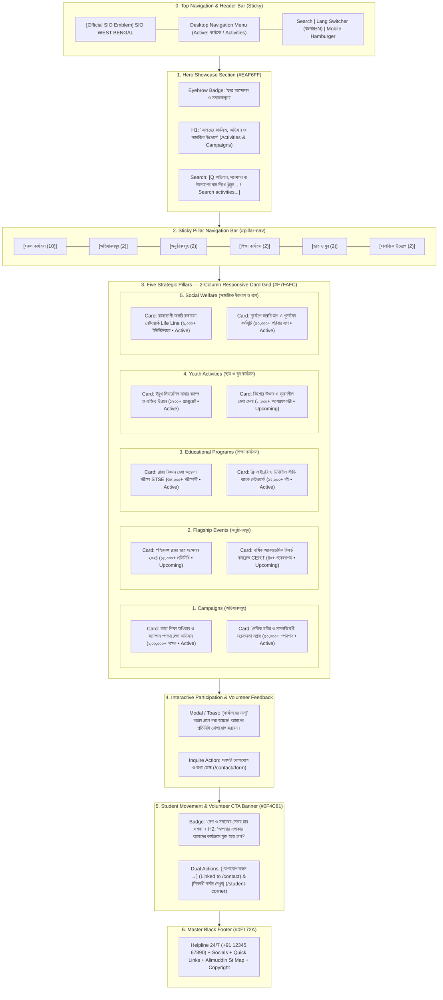

# SIO West Bengal — Activities Page Wireframe & Section-Wise Content Matrix
> **Document Status**: Production Ready & Fully Aligned with Existing Codebase  
> **Target Route**: `/activities`  
> **Source File**: [`src/app/activities/page.tsx`](file:///home/masyud/Development/Masyud/SIO/src/app/activities/page.tsx)  
> **Design Pattern**: Dynamic Student Movement & Social Welfare Hub with 5 Functional Pillars, Sticky Pill Navigation, Real-Time Search, Metrics Badges, and Interactive Participation Modal.

---

## 1. Executive Summary & Page Architecture

The **Activities Page** (`/activities`) serves as the central showcase of SIO West Bengal's grassroots student activism, statewide advocacy campaigns, flagship conferences, educational talent hunts, and emergency humanitarian relief services.

### Core Strategic Pillars:
$$\text{Campaigns (অভিযানসমূহ)} \longleftrightarrow \text{Flagship Events (অনুষ্ঠানসমূহ)} \longleftrightarrow \text{Education (শিক্ষা)} \longleftrightarrow \text{Youth (ছাত্র ও যুব)} \longleftrightarrow \text{Social Welfare (সামাজিক উদ্যোগ)}$$

### Key Technical & Visual Attributes:
- **Sticky Filter Navigation**: Sticky top filter bar featuring 6 dynamic pills with real-time counter badges (`All`, `Campaigns`, `Events`, `Education`, `Youth`, `Social`).
- **Instant Search Filtering**: Real-time multi-field search engine across titles, descriptions, and locations in both Bengali and English.
- **Unified Activity Card Anatomy**:
  - Top status pill (`Active` / `Upcoming` / `Completed`) with corresponding color palettes (Emerald, Blue, Slate).
  - Prominent verified impact metric tag (e.g., `১,০০,০০০+ শিক্ষার্থী স্বাক্ষর`, `৩৫,০০০+ পরীক্ষার্থী`, `৬,০০০+ ইউনিট রক্তদান`).
  - Bilingual Title & Description.
  - Geo-location & operational timeframe metadata with Lucide icons (`MapPin`, `Clock`).
  - 3-point Key Highlights checklist with blue check indicators (`CheckCircle2`).
  - Interactive `Participate / Details` modal trigger button and quick `/contact#form` inquiry link.
- **Interactive Participation Modal**: Instant feedback toast/modal acknowledging student engagement and dispatching interest to zonal coordination.
- **Volunteer Gateway CTA**: Dark navy banner (`#0F4C81`) routing to `/contact` and `/student-corner`.

---

## 2. Interactive Flowchart & Information Architecture



---

## 3. Visual Wireframes (ASCII Schematics)

### 3.1 Activities Directory (`/activities`) — Desktop Layout (1280px+)

```
+--------------------------------------------------------------------------------------------------+
| [LOGO] SIO West Bengal        [Home]  [About]  [Leadership]  [ACTIVITIES*]  [Contact]  [BN/EN]   |
+--------------------------------------------------------------------------------------------------+
| HERO SHOWCASE & SEARCH BAR (#EAF6FF)                                                             |
|                                                                                                  |
|   (•) STUDENT MOVEMENTS & SOCIAL ACTION / ছাত্র আন্দোলন ও সমাজকল্যাণ                                 |
|   STATEWIDE ACTIVITIES, CAMPAIGNS & SOCIAL WELFARE                                               |
|   আমাদের কার্যক্রম, অভিযান ও সামাজিক উদ্যোগ                                                          |
|   Advocating educational equity, campus democracy, moral character development, and active       |
|   emergency relief across West Bengal for over four decades.                                     |
|                                                                                                  |
|   +-------------------------------------------------------------------------+                    |
|   | [Q] Search campaigns, conferences, relief programs, or districts...   [X]|                    |
|   +-------------------------------------------------------------------------+                    |
+--------------------------------------------------------------------------------------------------+
| STICKY PILLAR NAVIGATION BAR (Sticky top-16 md:top-[72px])                                       |
| [All Activities (10)] [Campaigns (2)] [Events (2)] [Education (2)] [Youth (2)] [Social (2)]      |
+--------------------------------------------------------------------------------------------------+
| MAIN CONTENT AREA (2-Column Grid / #F7FAFC)                                                      |
|                                                                                                  |
|   +----------------------------------------+  +----------------------------------------+         |
|   | [Active]        [১,০০,০০০+ স্বাক্ষর]   |  | [Active]          [৫০,০০০+ শপথপত্র]    |         |
|   | Statewide Right to Education & Campus  |  | Moral Character & Anti-Substance       |         |
|   | Democracy Campaign                     |  | Abuse Awareness Drive                  |         |
|   | রাজ্য শিক্ষা অধিকার ও ক্যাম্পাস গণতন্ত্র |  | নৈতিক চরিত্র ও মাদকবিরোধী সচেতনতা     |         |
|   |                                        |  |                                        |         |
|   | Description: Statewide student drive   |  | Description: Extensive campaign        |         |
|   | against fee hikes, equitable access... |  | educating students against addiction...|         |
|   |                                        |  |                                        |         |
|   | [Pin] All Universities & Districts WB  |  | [Pin] 23 Districts & 500+ Campuses     |         |
|   | [Clock] Ongoing Campaign               |  | [Clock] Annual State Campaign          |         |
|   |                                        |  |                                        |         |
|   | Key Highlights:                        |  | Key Highlights:                        |         |
|   |  [v] Signature drive & memorandum      |  |  [v] Street plays, posters & counseling|         |
|   |  [v] Marches for education budget      |  |  [v] Anti-addiction helpline desk      |         |
|   |  [v] Campus democracy conventions      |  |  [v] Youth marathon & moral pledges    |         |
|   |                                        |  |                                        |         |
|   | [Participate / Details ->] [Inquire ->]|  | [Participate / Details ->] [Inquire ->]|         |
|   +----------------------------------------+  +----------------------------------------+         |
|                                                                                                  |
|   +----------------------------------------+  +----------------------------------------+         |
|   | [Upcoming]         [১৫,০০০+ প্রতিনিধি] |  | [Upcoming]         [৪০+ গবেষণাপত্র]   |         |
|   | West Bengal State Student Conf 2024    |  | Annual Academic Research Conclave CERT |         |
|   | পশ্চিমবঙ্গ রাজ্য ছাত্র সম্মেলন ২০২৪      |  | বার্ষিক অ্যাকাডেমিক রিসার্চ কনক্লেভ    |         |
|   |                                        |  |                                        |         |
|   | Description: Flagship biennial summit  |  | Description: Research symposium on     |         |
|   | gathering thousands of delegates...    |  | minority education, pedagogy...        |         |
|   |                                        |  |                                        |         |
|   | [Pin] Kolkata Convention Centre        |  | [Pin] Jadavpur Campus & Auditorium     |         |
|   | [Clock] Upcoming Event                 |  | [Clock] October 2024                   |         |
|   |                                        |  |                                        |         |
|   | Key Highlights:                        |  | Key Highlights:                        |         |
|   |  [v] National academic scholar talks   |  |  [v] Peer-reviewed journal publications|         |
|   |  [v] Academic panels & seminars        |  |  [v] Policy roundtable dialogues       |         |
|   |  [v] Student talent awards & cultural  |  |  [v] Research grant announcements      |         |
|   |                                        |  |                                        |         |
|   | [Participate / Details ->] [Inquire ->]|  | [Participate / Details ->] [Inquire ->]|         |
|   +----------------------------------------+  +----------------------------------------+         |
|                                                                                                  |
|   +----------------------------------------+  +----------------------------------------+         |
|   | [Active]           [৩৫,০০০+ পরীক্ষার্থী]|  | [Active]             [১২,০০০+ বই]      |         |
|   | State Talent Search Exam (STSE)        |  | Free Public Library & Book Bank        |         |
|   | রাজ্য বিজ্ঞান মেধা অন্বেষণ পরীক্ষা (STSE)|  | ফ্রি লাইব্রেরি ও ডিজিটাল স্টাডি ব্যাংক|         |
|   |                                        |  |                                        |         |
|   | [Pin] 250+ Centers Across Bengal       |  | [Pin] 85+ Local Study Centers          |         |
|   | [Clock] Annually in December           |  | [Clock] Round-the-Year Access          |         |
|   | [Participate / Details ->] [Inquire ->]|  | [Participate / Details ->] [Inquire ->]|         |
|   +----------------------------------------+  +----------------------------------------+         |
|                                                                                                  |
|   +----------------------------------------+  +----------------------------------------+         |
|   | [Active]            [১২০০+ গ্র্যাজুয়েট]|  | [Upcoming]         [৮,০০০+ অংশগ্রহণকারী]|        |
|   | Youth Leadership Summer Retreat        |  | Junior Fest & Creative Talent Expo     |         |
|   | ইয়ুথ লিডারশিপ সামার ক্যাম্প            |  | কিশোর উৎসব ও সৃজনশীল মেধা মেলা        |         |
|   |                                        |  |                                        |         |
|   | [Pin] Darjeeling & Bankura Centers     |  | [Pin] All District Headquarters        |         |
|   | [Clock] May & June                     |  | [Clock] November 2024                  |         |
|   | [Participate / Details ->] [Inquire ->]|  | [Participate / Details ->] [Inquire ->]|         |
|   +----------------------------------------+  +----------------------------------------+         |
|                                                                                                  |
|   +----------------------------------------+  +----------------------------------------+         |
|   | [Active]             [৬,০০০+ ইউনিট রক্ত]|  | [Active]           [৫০,০০০+ পরিবার ত্রাণ|        |
|   | Emergency Blood Donors (Life Line)     |  | Disaster Emergency Relief & Rehab      |         |
|   | জরুরি রক্তদাতা নেটওয়ার্ক (Life Line)   |  | দুর্যোগে জরুরি ত্রাণ ও পুনর্বাসন       |         |
|   |                                        |  |                                        |         |
|   | [Pin] All Govt Medical Colleges & Hosps|  | [Pin] Sundarbans, North Bengal Belts   |         |
|   | [Clock] 24/7 Emergency Service         |  | [Clock] Rapid Emergency Deployment     |         |
|   | [Participate / Details ->] [Inquire ->]|  | [Participate / Details ->] [Inquire ->]|         |
|   +----------------------------------------+  +----------------------------------------+         |
+--------------------------------------------------------------------------------------------------+
| STUDENT MOVEMENT CTA BANNER (#0F4C81 Navy)                                                       |
|   (•) FOUR DECADES OF STUDENT LEADERSHIP / দেশ ও সমাজের সেবায় চার দশক                            |
|   Want to Organize or Participate in SIO Initiatives?                                            |
|   আপনার এলাকায় বা ক্যাম্পাসে আমাদের কার্যক্রমে যুক্ত হতে চান?                                       |
|                                                                                                  |
|   [Get in Touch / যোগাযোগ করুন ->]              [Visit Student Corner / শিক্ষার্থী কর্নার]        |
+--------------------------------------------------------------------------------------------------+
| MASTER BLACK FOOTER (#0F172A)                                                                    |
|   24/7 Emergency Helpline | Quick Navigation | Social Channels | Google Maps HQ Location         |
+--------------------------------------------------------------------------------------------------+
```

---

### 3.2 Mobile Visual Layout (375px–430px Responsive View)

```
+-----------------------------------+
| [=] SIO WB Logo          [BN/EN]  |
+-----------------------------------+
| HERO SECTION                      |
| (•) STUDENT ACTION & WELFARE      |
| Activities, Campaigns & Welfare   |
| কার্যক্রম, অভিযান ও সামাজিক উদ্যোগ|
|                                   |
| [Q Search activities or dist...]  |
+-----------------------------------+
| HORIZONTAL SCROLL PILL NAV        |
| [All(10)] [Camp(2)] [Evt(2)] [Edu]|
+-----------------------------------+
| 1-COLUMN ACTIVITY CARDS           |
|                                   |
| +-------------------------------+ |
| | [Active]   [১,০০,০০০+ স্বাক্ষর] | |
| | Right to Education Campaign   | |
| | রাজ্য শিক্ষা অধিকার অভিযান   | |
| |                               | |
| | Campus democracy, fee hike    | |
| | reforms across Bengal...      | |
| |                               | |
| | [Pin] All WB Universities     | |
| | [Clock] Ongoing Campaign      | |
| |                               | |
| | Key Highlights:               | |
| |  [v] Mass signatures          | |
| |  [v] Education budget rallies | |
| |  [v] Campus open dialogue     | |
| |                               | |
| | [Participate / Details ->]    | |
| | Inquire →                     | |
| +-------------------------------+ |
|                                   |
| +-------------------------------+ |
| | [Upcoming]  [১৫,০০০+ প্রতিনিধি]| |
| | WB State Student Conf 2024    | |
| | পশ্চিমবঙ্গ রাজ্য ছাত্র সম্মেলন| |
| |                               | |
| | [Pin] Kolkata Conv. Centre    | |
| | [Clock] Upcoming Event        | |
| |                               | |
| | [Participate / Details ->]    | |
| | Inquire →                     | |
| +-------------------------------+ |
|                                   |
| +-------------------------------+ |
| | [Active]     [৬,০০০+ ইউনিট রক্ত]| |
| | Statewide Blood Donors Network| |
| | জরুরি রক্তদাতা নেটওয়ার্ক      | |
| |                               | |
| | [Pin] All Govt Hospitals      | |
| | [Clock] 24/7 Emergency        | |
| |                               | |
| | [Participate / Details ->]    | |
| | Inquire →                     | |
| +-------------------------------+ |
+-----------------------------------+
| CTA: CONNECT WITH SIO WB          |
| [Get in Touch] [Student Corner]   |
+-----------------------------------+
| MASTER FOOTER                     |
+-----------------------------------+
```

---

## 4. Section-by-Section Name-Wise Content Matrix

### Section 0: Sticky Navigation Header
- **Component File**: [`src/components/layout/header.tsx`](file:///home/masyud/Development/Masyud/SIO/src/components/layout/header.tsx)
- **Position**: Sticky (`top-0 z-50 bg-white/95 backdrop-blur-md border-b border-[#E5E7EB]`)
- **Active Navigation Link**: `কার্যক্রম (Activities)`
- **Actions**: Language switch (`বাংলা` / `English`), Search toggle, CTA button (`যুক্ত হোন / Join Us`).

---

### Section 1: Hero Showcase & Real-Time Search Bar (`#top`)
- **Component File**: Native Section in [`src/app/activities/page.tsx`](file:///home/masyud/Development/Masyud/SIO/src/app/activities/page.tsx)
- **Styling**: Light Sky Blue backdrop (`#EAF6FF`) with radial gradient glow orbs.

| Content Field | Bengali Translation (`bn`) | English Translation (`en`) |
| :--- | :--- | :--- |
| **Top Eyebrow Pill** | `ছাত্র আন্দোলন ও সমাজকল্যাণ` | `Student Movements & Social Action` |
| **Main Title** | `আমাদের কার্যক্রম, অভিযান ও সামাজিক উদ্যোগ` | `Statewide Activities, Campaigns & Social Welfare` |
| **Subtitle Description** | `ক্যাম্পাস অধিকার রক্ষা থেকে শুরু করে নৈতিক চরিত্র গঠন, মেধা অন্বেষণ পরীক্ষা এবং প্রাকৃতিক দুর্যোগে ত্রাণ বিতরণ—চার দশক ধরে SIO পশ্চিমবঙ্গ ছাত্র ও যুব সমাজের কল্যাণে অবিচল।` | `Advocating educational equity, student rights, moral character development, and active emergency relief across West Bengal for over four decades.` |
| **Search Placeholder** | `অভিযান, সম্মেলন বা উদ্যোগের নাম লিখে খুঁজুন...` | `Search campaigns, conferences, or relief programs...` |
| **Search Clear Glyph** | `✕ (অনুসন্ধান মুছুন)` | `✕ (Clear)` |

---

### Section 2: Sticky Pillar Navigation Bar (`#pillar-nav`)
- **Component**: Sticky Header Strip (`sticky top-16 md:top-[72px] z-40 bg-white border-b border-[#E5E7EB] shadow-2xs`)
- **Pills**: Responsive horizontal scroll pills with count badges and Lucide SVG icons.

| Tab ID | Bengali Label | English Label | Icon | Count | Filter Target |
| :--- | :--- | :--- | :--- | :--- | :--- |
| `all` | `সকল কার্যক্রম` | `All Activities` | `Sparkles` | **10** | Shows entire collection |
| `campaigns` | `অভিযানসমূহ` | `Campaigns` | `Megaphone` | **2** | Educational rights & moral drives |
| `events` | `অনুষ্ঠানসমূহ` | `Events` | `Calendar` | **2** | State conferences & research conclaves |
| `education`| `শিক্ষা কার্যক্রম` | `Educational Programs` | `GraduationCap` | **2** | Talent searches & book banks |
| `youth` | `ছাত্র ও যুব` | `Youth Activities` | `Users` | **2** | Leadership camps & creative fests |
| `social` | `সামাজিক উদ্যোগ` | `Social Welfare` | `HeartHandshake` | **2** | Blood network & disaster relief |

---

### Section 3: Campaigns Pillar Grid (`category: "campaigns"`)
- **Focus**: Statewide student rights, higher education governance, and ethical public campaigns.

#### Card 3.1: Right to Education & Campus Democracy Campaign
- **ID**: `camp-1`
- **Status**: `active` (`চলমান`) | **Style**: `bg-emerald-50 text-emerald-700 border-emerald-200`
- **Verified Impact Metric**: `১,০০,০০০+ শিক্ষার্থী স্বাক্ষর` (100,000+ Student Signatures)
- **Title (BN)**: `রাজ্য শিক্ষা অধিকার ও ক্যাম্পাসে গণতন্ত্র রক্ষা অভিযান`
- **Title (EN)**: `Statewide Right to Education & Campus Democracy Campaign`
- **Description (BN)**: `উচ্চশিক্ষায় ফি বৃদ্ধি প্রতিরোধ, মেধাভিত্তিক ও স্বচ্ছ ভর্তি প্রক্রিয়া, এবং বিশ্ববিদ্যালয় ক্যাম্পাসসমূহে অবাধ গণতান্ত্রিক পরিবেশ নিশ্চিত করার দাবিতে রাজ্যব্যাপী ছাত্র আন্দোলন।`
- **Description (EN)**: `Statewide campaign against fee hikes, demanding equitable admissions, campus democracy, and fair representation for all students.`
- **Location (BN/EN)**: `পশ্চিমবঙ্গের সকল বিশ্ববিদ্যালয় ও জেলা` / `All Universities & Districts across WB`
- **Timeframe (BN/EN)**: `চলমান অভিযান` / `Ongoing Campaign`
- **Key Highlights**:
  1. `কলেজ ও বিশ্ববিদ্যালয় স্তরে গণস্বাক্ষর সংগ্রহ ও মেমোরেন্ডাম পেশ` (Mass signature collection & memorandum submission)
  2. `শিক্ষা বাজেট বৃদ্ধি ও স্কলারশিপ বরাদ্দের দাবিতে রাজপথে পদযাত্রা` (Public rallies demanding educational budget hikes)
  3. `ক্যাম্পাস গণতন্ত্র কনভেনশন ও ওপেন ডায়ালগ ফোরাম` (Campus democracy conventions & open dialogue forums)

#### Card 3.2: Moral Character & Anti-Substance Abuse Awareness Drive
- **ID**: `camp-2`
- **Status**: `active` (`চলমান`)
- **Verified Impact Metric**: `৫০,০০০+ শপথপত্র পূরণ` (50,000+ Youth Pledges)
- **Title (BN)**: `নৈতিক চরিত্র ও মাদকবিরোধী সচেতনতা সপ্তাহ`
- **Title (EN)**: `Moral Character & Anti-Substance Abuse Awareness Drive`
- **Description (BN)**: `ক্যাম্পাস ও শহর-গ্রামাঞ্চলের তরুণদের মাঝে মাদক ও সামাজিক অবক্ষয়ের বিরুদ্ধে সচেতনতা সৃষ্টি এবং সুস্থ নৈতিক মূল্যবোধ জাগিয়ে তোলার আন্দোলন।`
- **Description (EN)**: `Extensive campaign educating students against drug addiction, substance abuse, and moral erosion through street plays, posters, and counseling.`
- **Location (BN/EN)**: `২৩ টি জেলা ও ৫০০+ ক্যাম্পাস` / `23 Districts & 500+ Campuses`
- **Timeframe (BN/EN)**: `বার্ষিক রাজ্য অভিযান` / `Annual State Campaign`
- **Key Highlights**:
  1. `ক্যাম্পাসে পথনাটিকা, ডকুমেন্টারি প্রদর্শন ও পোস্টারিং` (Street theatre, documentary screenings & poster drives)
  2. `মাদকাসক্তি নিরাময় কাউন্সেলিং ডেস্ক ও হেল্পলাইন` (Addiction recovery counseling desks & helplines)
  3. `ম্যারাথন দৌড় ও যুব নৈতিক শপথ গ্রহণ` (Youth marathons and collective ethical pledges)

---

### Section 4: Flagship Events Pillar Grid (`category: "events"`)
- **Focus**: Academic symposia, research conventions, and biennial student summits.

#### Card 4.1: West Bengal State Student Conference
- **ID**: `evt-1`
- **Status**: `upcoming` (`আসন্ন`) | **Style**: `bg-[#EAF6FF] text-[#168BD4] border-[#63BDFF]/30`
- **Verified Impact Metric**: `১৫,০০০+ প্রতিনিধি` (15,000+ Delegates)
- **Title (BN)**: `পশ্চিমবঙ্গ রাজ্য ছাত্র সম্মেলন ২০২৪`
- **Title (EN)**: `West Bengal State Student Conference 2024`
- **Description (BN)**: `জ্ঞান, চরিত্র ও কর্মের মাধ্যমে সমাজ পুনর্গঠনের আহ্বানে রাজ্যের বিভিন্ন জেলা থেকে হাজার হাজার শিক্ষার্থী ও শিক্ষাবিদদের মিলনমেলা।`
- **Description (EN)**: `Flagship biennial student convention gathering thousands of delegates, academic thinkers, and student leaders in Kolkata.`
- **Location (BN/EN)**: `কলকাতা কনভেনশন সেন্টার` / `Kolkata Convention Centre`
- **Timeframe (BN/EN)**: `আসন্ন অনুষ্ঠান` / `Upcoming Event`
- **Key Highlights**:
  1. `জাতীয় স্তরের শীর্ষস্থানীয় স্কলার ও শিক্ষাবিদদের বক্তব্য` (Keynotes from national scholars and educators)
  2. `বিশেষ অ্যাকাডেমিক সেমিনার ও প্যানেল ডিসকাশন` (Specialized academic panel discussions)
  3. `ছাত্র মেধা সংবর্ধনা ও সাংস্কৃতিক পরিবেশনা` (Academic felicitations and cultural exhibitions)

#### Card 4.2: Annual Academic Research Conclave (CERT WB)
- **ID**: `evt-2`
- **Status**: `upcoming` (`আসন্ন`)
- **Verified Impact Metric**: `৪০+ গবেষণাপত্র উপস্থাপন` (40+ Research Papers Presented)
- **Title (BN)**: `বার্ষিক অ্যাকাডেমিক রিসার্চ কনক্লেভ (CERT)`
- **Title (EN)**: `Annual Academic Research Conclave (CERT)`
- **Description (BN)**: `উচ্চশিক্ষা গবেষক ও শিক্ষকদের অংশগ্রহণে শিক্ষানীতি, ড্রপআউট পরিসংখ্যান ও আধুনিক শিখন পদ্ধতির ওপর জাতীয় কনফারেন্স।`
- **Description (EN)**: `Annual research presentation summit featuring empirical research papers on minority education and school pedagogy.`
- **Location (BN/EN)**: `যাদবপুর ক্যাম্পাস ও অডিটোরিয়াম` / `Jadavpur Campus & Auditorium`
- **Timeframe (BN/EN)**: `অক্টোবর ২০২৪` / `October 2024`
- **Key Highlights**:
  1. `পিয়ার-রিভিউড জার্নাল প্রকাশনা ও পুরস্কার` (Peer-reviewed journal publishing & research awards)
  2. `নীতিমালা নির্ধারক ও গবেষকদের গোলটেবিল বৈঠক` (Roundtables between policymakers and scholars)
  3. `স্টুডেন্ট রিসার্চ গ্রান্ট ঘোষণা` (Announcement of competitive student research grants)

---

### Section 5: Educational Programs Pillar Grid (`category: "education"`)
- **Focus**: Academic empowerment, competitive talent identification, and inclusive study resources.

#### Card 5.1: State Talent Search Examination (STSE)
- **ID**: `edu-1`
- **Status**: `active` (`চলমান`)
- **Verified Impact Metric**: `৩৫,০০০+ পরীক্ষার্থী` (35,000+ Examinees Annually)
- **Title (BN)**: `রাজ্য বিজ্ঞান মেধা অন্বেষণ পরীক্ষা (STSE)`
- **Title (EN)**: `State Talent Search Examination (STSE)`
- **Description (BN)**: `অষ্টম থেকে দশম শ্রেণির ছাত্র-ছাত্রীদের বিজ্ঞান ও গণিত প্রতিভা যাচাই, ক্যারিয়ার গাইডেন্স এবং নগদ শিক্ষাবৃত্তি প্রদান।`
- **Description (EN)**: `Prestigious talent hunt examination assessing science, mathematics, and logical reasoning among school students across Bengal.`
- **Location (BN/EN)**: `রাজ্যের ২৫০+ পরীক্ষা কেন্দ্র` / `250+ Centers Across Bengal`
- **Timeframe (BN/EN)**: `প্রতি বছর ডিসেম্বর` / `Annually in December`
- **Key Highlights**:
  1. `শীর্ষ ১০০ মেধাবী শিক্ষার্থীর জন্য নগদ মেধা বৃত্তি` (Cash scholarships for top 100 meritorious students)
  2. `সায়েন্স এক্সিবিশন ও মডেল মেকিং প্রতিযোগিতা` (Science project exhibitions & model-making tournaments)
  3. `ক্যারিয়ার কাউন্সেলিং ও মেন্টরশিপ সাপোর্ট` (Personalized career counseling & ongoing mentorship)

#### Card 5.2: Free Public Library & Digital Book Bank Network
- **ID**: `edu-2`
- **Status**: `active` (`চলমান`)
- **Verified Impact Metric**: `১২,০০০+ বই সংরক্ষিত` (12,000+ Books in Circulation)
- **Title (BN)**: `ফ্রি লাইব্রেরি ও ডিজিটাল স্টাডি ব্যাংক নেটওয়ার্ক`
- **Title (EN)**: `Free Public Library & Digital Book Bank Network`
- **Description (BN)**: `আর্থিকভাবে অনগ্রসর শিক্ষার্থীদের জন্য পাঠ্যপুস্তক, প্রতিযোগিতামূলক পরীক্ষার বই ও ডিজিটাল স্টাডি মেটেরিয়ালের উন্মুক্ত লাইব্রেরি।`
- **Description (EN)**: `Community reading rooms and central book lending banks supporting college and school aspirants with costly textbooks.`
- **Location (BN/EN)**: `৮৫+ স্থানীয় স্টাডি সেন্টার` / `85+ Local Study Centers`
- **Timeframe (BN/EN)**: `সারা বছর উন্মুক্ত` / `Round-the-Year Access`
- **Key Highlights**:
  1. `সেমিস্টারভিত্তিক রেফারেন্স বই ইস্যু সুবিধা` (Semester-long reference textbook lending)
  2. `ডিজিটাল ই-বুক রিডিং ট্যাব ও কম্পিউটার হাব` (Digital tablets & e-resource computer stations)
  3. `সাপ্তাহিক গ্রুপ স্টাডি ও ক্লিয়ারিং ক্লাসেস` (Weekly peer group studies & doubt-clearing clinics)

---

### Section 6: Youth Activities Pillar Grid (`category: "youth"`)
- **Focus**: Moral character, leadership bootcamp retreats, sports, and creative cultural expression.

#### Card 6.1: Youth Leadership Summer Retreat & Personality Camp
- **ID**: `yth-1`
- **Status**: `active` (`চলমান`)
- **Verified Impact Metric**: `১২০০+ ক্যাম্প গ্র্যাজুয়েট` (1,200+ Trained Graduates)
- **Title (BN)**: `ইয়ুথ লিডারশিপ সামার ক্যাম্প ও ব্যক্তিত্ব উন্নয়ন`
- **Title (EN)**: `Youth Leadership Summer Retreat & Personality Camp`
- **Description (BN)**: `ছাত্রদের আত্মবিশ্বাস, পাবলিক স্পিকিং, টিমওয়ার্ক, সংগঠন পরিচালনা ও নৈতিক মূল্যবোধ বিকাশের ৩ দিনব্যাপী আবাসিক কর্মশালা।`
- **Description (EN)**: `Residential leadership training bootcamp cultivating public speaking, event management, and spiritual mindfulness.`
- **Location (BN/EN)**: `দার্জিলিং ও বাঁকুড়া রিট্রিট সেন্টার` / `Darjeeling & Bankura Retreat Centers`
- **Timeframe (BN/EN)**: `মে ও জুন মাস` / `May & June`
- **Key Highlights**:
  1. `বিশেষজ্ঞ মেন্টরদের মাধ্যমে লাইফ স্কিলস ও ডিসিশন মেকিং ট্রেনিং` (Life skills and decision-making modules by expert mentors)
  2. `বিতর্ক, তাৎক্ষণিক বক্তৃতা ও লিডারশিপ সিমুলেশন` (Debates, extempore speech & organizational simulations)
  3. `আউটডোর ট্র্যাকিং ও টিম বিল্ডিং অ্যাক্টিভিটিস` (Outdoor tracking & team synergy exercises)

#### Card 6.2: Junior Fest & Creative Talent Exhibition
- **ID**: `yth-2`
- **Status**: `upcoming` (`আসন্ন`)
- **Verified Impact Metric**: `৮,০০০+ অংশগ্রহণকারী` (8,000+ Participants)
- **Title (BN)**: `কিশোর উৎসব ও সৃজনশীল মেধা মেলা`
- **Title (EN)**: `Junior Fest & Creative Talent Exhibition`
- **Description (BN)**: `স্কুল ও কিশোর শিক্ষার্থীদের চিত্রাঙ্কন, ক্যালিগ্রাফি, প্রবন্ধ রচনা, কুইজ এবং রোবোটিক্স মডেল প্রদর্শনের মেগা উৎসব।`
- **Description (EN)**: `Vibrant creative carnival celebrating calligraphy, essay writing, quiz tournaments, and junior science projects.`
- **Location (BN/EN)**: `প্রতিটি সাংগঠনিক জেলা সদর` / `All District Headquarters`
- **Timeframe (BN/EN)**: `নভেম্বর ২০২৪` / `November 2024`
- **Key Highlights**:
  1. `ইসলামি ক্যালিগ্রাফি ও পেইন্টিং প্রতিযোগিতা` (Islamic calligraphy & fine arts competition)
  2. `সাধারণ জ্ঞান ও বিজ্ঞান কুইজ টুর্নামেন্ট` (General knowledge and scientific quiz tournaments)
  3. `পুরস্কার বিতরণ ও সার্টিফিকেট প্রদান` (Merit trophy distribution & commemorative certificates)

---

### Section 7: Social Welfare Pillar Grid (`category: "social"`)
- **Focus**: Humanitarian relief, 24/7 student voluntary blood donation, and natural disaster rehabilitation.

#### Card 7.1: Statewide Emergency Blood Donors Network (Life Line)
- **ID**: `soc-1`
- **Status**: `active` (`চলমান`)
- **Verified Impact Metric**: `৬,০০০+ ইউনিট রক্তদান প্রতি বছর` (6,000+ Blood Units Donated Annually)
- **Title (BN)**: `রাজ্যব্যাপী জরুরি রক্তদাতা নেটওয়ার্ক (Life Line)`
- **Title (EN)**: `Statewide Emergency Blood Donors Network (Life Line)`
- **Description (BN)**: `পশ্চিমবঙ্গের সরকারি ও বেসরকারি হাসপাতালে মুমূর্ষু রোগীদের জরুরি রক্তের প্রয়োজনে ২৪ ঘণ্টার স্বেচ্ছাসেবী ছাত্র রক্তদাতা সেবা।`
- **Description (EN)**: `Active 24/7 student-driven voluntary blood donor registry serving critical patients across state blood banks and hospitals.`
- **Location (BN/EN)**: `সকল সরকারি মেডিক্যাল কলেজ ও হাসপাতাল` / `All Govt Medical Colleges & Hospitals`
- **Timeframe (BN/EN)**: `২৪/৭ জরুরি সেবা` / `24/7 Emergency Service`
- **Key Highlights**:
  1. `জেলা ও মহকুমা স্তরে তাৎক্ষণিক ভলান্টিয়ার কোঅর্ডিনেশন` (Instant district-level volunteer coordination desk)
  2. `বিশ্ব রক্তদাতা দিবসে মেগা রক্তদান শিবির` (Mega blood donation drives on World Blood Donor Day)
  3. `অনলাইন ব্লাড রিকোয়েস্ট ট্র্যাকিং ডিরেক্টরি` (Live online blood requirement registry)

#### Card 7.2: Disaster Emergency Relief & Rehabilitation Mission
- **ID**: `soc-2`
- **Status**: `active` (`চলমান`)
- **Verified Impact Metric**: `৫০,০০০+ পরিবারে খাদ্য ও বস্ত্র সহায়তা` (50,000+ Families Aided)
- **Title (BN)**: `দুর্যোগে জরুরি ত্রাণ ও পুনর্বাসন কর্মসূচি`
- **Title (EN)**: `Disaster Emergency Relief & Rehabilitation Mission`
- **Description (BN)**: `ঘূর্ণিঝড়, বন্যা ও প্রাকৃতিক দুর্যোগের সময় প্রত্যন্ত অঞ্চলে শুকনা খাদ্য, বিশুদ্ধ পানি, চিকিৎসা সহায়তা এবং ঘরবাড়ি মেরামত সেবা।`
- **Description (EN)**: `Rapid humanitarian relief teams deployed during floods and cyclones delivering rations, medical aid, and shelter rehabilitation.`
- **Location (BN/EN)**: `সুন্দরবন, উত্তরবঙ্গ ও নদী তীরবর্তী এলাকা` / `Sundarbans, North Bengal & Riverine Belts`
- **Timeframe (BN/EN)**: `জরুরি সময় মোতায়েন` / `Emergency Rapid Deployment`
- **Key Highlights**:
  1. `বোট ও ফিল্ড টিম দ্বারা দুর্গত এলাকায় ত্রাণ সরবরাহ` (Boat fleets & field dispatch into inundated river islands)
  2. `বন্যা পরবর্তী বিনামূল্যে চিকিৎসা ও ওষুধ বিতরণ ক্যাম্প` (Post-flood medical relief and prescription camps)
  3. `বার্ষিক রাজ্যব্যাপী শীতবস্ত্র বিতরণ কর্মসূচি` (Annual statewide winter clothing drives)

---

### Section 8: Interactive Participation & Registration Trigger
- **Component**: Client State Modal / Toast Feedback in [`src/app/activities/page.tsx`](file:///home/masyud/Development/Masyud/SIO/src/app/activities/page.tsx)
- **Interaction**:
  - Clicking `Participate / Details (অংশগ্রহণ করুন / বিস্তারিত)` opens top banner confirmation:
    - *Bengali*: `"[কার্যক্রমের নাম]" কার্যক্রমে আপনার আগ্রহ গ্রহণ করা হয়েছে! আমাদের প্রতিনিধি শীঘ্রই আপনার সাথে যোগাযোগ করবেন।`
    - *English*: `Your participation interest for "[Activity Name]" has been noted. Our team will reach out soon.`
  - Clicking `Inquire (প্রশ্ন করুন →)` smoothly routes to `/contact#form` with context.

---

### Section 9: Student Movement & Volunteer CTA Banner
- **Component**: High-Impact Call to Action Banner
- **Background**: Solid Deep Blue (`#0F4C81`) with White Typography

| Element | Bengali (`bn`) | English (`en`) |
| :--- | :--- | :--- |
| **Eyebrow Badge** | `দেশ ও সমাজের সেবায় চার দশক` | `Four Decades of Student Leadership` |
| **Heading** | `আপনার এলাকায় বা ক্যাম্পাসে আমাদের কার্যক্রমে যুক্ত হতে চান?` | `Want to Organize or Participate in SIO Initiatives?` |
| **Description** | `শিক্ষা সংস্কার, রক্তদান ক্যাম্প কিংবা চরিত্র গঠন শিবিরে স্বেচ্ছাসেবক হিসেবে কাজ করতে আমাদের রাজ্য বা জেলা প্রতিনিধির সাথে যোগাযোগ করুন।` | `Connect with our state and district representatives to volunteer in educational, humanitarian, and youth development programs.` |
| **Primary Button** | `যোগাযোগ করুন →` (`/contact`) | `Get in Touch →` (`/contact`) |
| **Secondary Button** | `শিক্ষার্থী কর্নার দেখুন` (`/student-corner`) | `Visit Student Corner` (`/student-corner`) |

---

### Section 10: Master Black Footer
- **Component File**: [`src/components/layout/footer.tsx`](file:///home/masyud/Development/Masyud/SIO/src/components/layout/footer.tsx)
- **Background**: `#0F172A`
- **Key Features**: 24/7 Student Helpline (`+91 12345 67890`), State Headquarters location (Kolkata), Social feeds, Quick links, and Google Maps location embed.

---

## 5. Master Activities Reference Table (10 Core Initiatives)

| ID | Category | Title (Bengali & English) | Verified Metric | Status | Location | Timeframe |
| :--- | :--- | :--- | :--- | :--- | :--- | :--- |
| `camp-1` | `campaigns` | **রাজ্য শিক্ষা অধিকার ও ক্যাম্পাস গণতন্ত্র রক্ষা অভিযান**<br>`Statewide Right to Education Campaign` | ১,০০,০০০+ স্বাক্ষর | Active | সকল বিশ্ববিদ্যালয় ও জেলা | চলমান অভিযান |
| `camp-2` | `campaigns` | **নৈতিক চরিত্র ও মাদকবিরোধী সচেতনতা সপ্তাহ**<br>`Moral Character & Anti-Drug Drive` | ৫০,০০০+ শপথপত্র | Active | ২৩ জেলা ও ৫০০+ ক্যাম্পাস | বার্ষিক অভিযান |
| `evt-1` | `events` | **পশ্চিমবঙ্গ রাজ্য ছাত্র সম্মেলন ২০২৪**<br>`WB State Student Conference 2024` | ১৫,০০০+ প্রতিনিধি | Upcoming | কলকাতা কনভেনশন সেন্টার | আসন্ন অনুষ্ঠান |
| `evt-2` | `events` | **বার্ষিক অ্যাকাডেমিক রিসার্চ কনক্লেভ (CERT)**<br>`Annual Academic Research Conclave` | ৪০+ গবেষণাপত্র | Upcoming | যাদবপুর বিশ্ববিদ্যালয় | অক্টোবর ২০২৪ |
| `edu-1` | `education` | **রাজ্য বিজ্ঞান মেধা অন্বেষণ পরীক্ষা (STSE)**<br>`State Talent Search Exam (STSE)` | ৩৫,০০০+ পরীক্ষার্থী | Active | ২৫০+ পরীক্ষা কেন্দ্র | প্রতি বছর ডিসেম্বর |
| `edu-2` | `education` | **ফ্রি লাইব্রেরি ও ডিজিটাল স্টাডি ব্যাংক নেটওয়ার্ক**<br>`Free Public Library & Book Bank` | ১২,০০০+ বই | Active | ৮৫+ স্টাডি সেন্টার | সারা বছর উন্মুক্ত |
| `yth-1` | `youth` | **ইয়ুথ লিডারশিপ সামার ক্যাম্প ও ব্যক্তিত্ব উন্নয়ন**<br>`Youth Leadership Summer Retreat` | ১২০০+ গ্র্যাজুয়েট | Active | দার্জিলিং ও বাঁকুড়া | মে ও জুন মাস |
| `yth-2` | `youth` | **কিশোর উৎসব ও সৃজনশীল মেধা মেলা**<br>`Junior Fest & Creative Talent Expo` | ৮,০০০+ অংশগ্রহণকারী | Upcoming | প্রতিটি জেলা সদর | নভেম্বর ২০২৪ |
| `soc-1` | `social` | **রাজ্যব্যাপী জরুরি রক্তদাতা নেটওয়ার্ক (Life Line)**<br>`Statewide Emergency Blood Donors Network` | ৬,০০০+ ইউনিট/বছর | Active | সকল মেডিক্যাল কলেজ | ২৪/৭ জরুরি সেবা |
| `soc-2` | `social` | **দুর্যোগে জরুরি ত্রাণ ও পুনর্বাসন কর্মসূচি**<br>`Disaster Relief & Rehabilitation Mission` | ৫০,০০০+ পরিবার | Active | সুন্দরবন ও উত্তরবঙ্গ | জরুরি সময় মোতায়েন |
