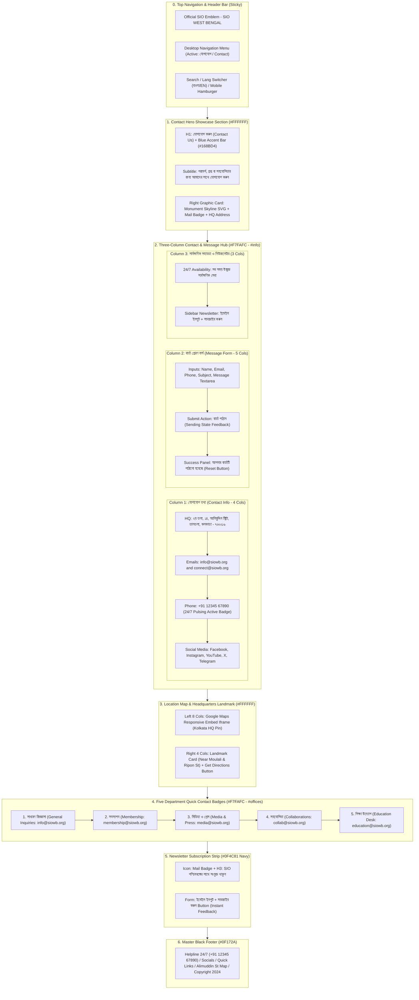

# SIO West Bengal — Contact Us Page Wireframe & Section-Wise Content Matrix
> **Document Status**: Production Ready & Fully Aligned with Existing Codebase  
> **Document Status**: Production Ready & Fully Aligned with SIO Constitution (Amended Dec 2022) & Policy & Programme (2025–2026 / 22nd Term)  
> **Target Route**: `/contact`  
> **Source File**: [`src/app/contact/page.tsx`](file:///home/masyud/Development/Masyud/SIO/src/app/contact/page.tsx)  
> **Design Pattern**: Multi-Channel Student Welfare & Organizational Helpdesk with Hero Showcase, 3-Column Contact & Form Hub, Google Maps Embed with Landmark Card, 5 Departmental Direct Mail Desks, and Navy Newsletter Strip.
> **Design Pattern**: Multi-Channel Student Welfare & Institutional Helpdesk with Hero Showcase, 3-Column Contact & Form Hub, Project InQhab Admissions & Mental Wellness Desks, Google Maps Embed with Landmark Card, and Article 6 Membership Gateway.

---

## 1. Executive Summary & Page Architecture

The **Contact Us Page** (`/contact`) functions as the official public gateway, grievance redressal center, and membership inquiry desk for the Students Islamic Organisation of India (SIO) West Bengal. It connects students, parents, academic scholars, and volunteers directly with state headquarters and functional secretariats.
The **Contact Us Page** (`/contact`) functions as the official public gateway, student grievance redressal center, and constitutional membership inquiry desk for Students Islamic Organisation of India (SIO) West Bengal for **Session 2025–2026 (22nd Term)**. It connects students, parents, research scholars, and volunteers directly with state headquarters, national Markaz, and functional secretariats.

### Core Functional Pillars:
$$\begin{matrix}
\textbf{1. কেন্দ্রীয় তথ্য ও যোগাযোগ} & \textbf{2. সরাসরি বার্তা প্রেরণ ফর্ম} & \textbf{3. লাইভ গুগল ম্যাপ ও অবস্থান} \\
\text{(Headquarters and Helplines)} & \text{(Interactive Message Form)} & \text{(Interactive Map and Navigation)} \\[6pt]
\textbf{4. ৫টি বিশেষায়িত ডেস্ক} & \textbf{5. ২৪/৭ সার্বক্ষণিক সেবা} & \textbf{6. নিউজলেটার আপডেট} \\
\text{(5 Department Badges)} & \text{(24/7 Availability Pulse)} & \text{(Official Newsletter Subscriptions)}
\end{matrix}$$

### Key Technical & Visual Attributes:
- **Hero Showcase**: Clean two-column header with left-aligned bilingual H1, `#168BD4` accent bar, descriptive intro, and right-aligned artistic card featuring a monument skyline SVG, mail icon badge, and state headquarters address.
- **3-Column Contact & Form Hub (`#info`)**:
  - **Column 1 (Official Information — 4 cols)**: Physical address (14, Alimuddin St, Taltala, Kolkata), dual official email links (`info@siowb.org`, `connect@siowb.org`), 24/7 helpline phone (`+91 12345 67890`) with pulsating green availability badge, and 5 social media links (Facebook, Instagram, YouTube, Twitter/X, Telegram).
  - **Column 2 (Interactive Message Form — 5 cols)**: Complete form with 5 controlled input fields (Name, Email, Phone, Subject, Message), submit button with sending animation, and instant success confirmation panel with "Send another message" reset toggle.
  - **Column 3 (Availability & Sidebar Newsletter — 3 cols)**: 24/7 round-the-clock availability commitment card and sidebar newsletter subscription module with inline validation.
- **Our Location & Directions (`#location`)**: 8-column responsive Google Maps iframe embed paired with a 4-column headquarters landmark card featuring Moulali & Ripon Street references and a direct external Google Maps navigation button.
- **5 Department Contact Badges (`#offices`)**: Responsive quick-connect grid with icon badges and direct mailto links for General Inquiries, Membership, Media & Press, Collaborations, and Education Desk.
- **Newsletter Subscription Strip**: Solid `#0F4C81` navy bar with instant feedback state.

---

## 2. Clean Sequential Flowchart & Information Architecture



---

## 3. Visual Wireframes (ASCII Schematics)

### 3.1 Contact Page (`/contact`) — Desktop Layout (1280px+)

```
+--------------------------------------------------------------------------------------------------+
| [LOGO] SIO West Bengal        [Home]  [About]  [Leadership]  [Activities]  [CONTACT*]    [BN/EN] |
+--------------------------------------------------------------------------------------------------+
| HERO SHOWCASE (#FFFFFF)                                                                          |
|                                                                                                  |
|   CONTACT US / যোগাযোগ করুন                                       +-----------------------------+ |
|   ----                                                          | [Artistic Box: Sky to Slate]| |
|   আপনার পরামর্শ, প্রশ্ন বা সহযোগিতার জন্য আমাদের সাথে যোগাযোগ       |   [Monument Skyline Vector] | |
|   করুন। আমরা আপনার বার্তার অপেক্ষায় আছি।                            |            [Mail]           | |
|   Reach out for queries, student mentorship, academic           |   যোগাযোগ ও তথ্য কেন্দ্র    | |
|   collaborations, or volunteer enrollment.                      |   ২য় তলা, ১৪, আলিমুদ্দিন স্ট্রিট| |
|                                                                 +-----------------------------+ |
+--------------------------------------------------------------------------------------------------+
| 3-COLUMN CONTACT & MESSAGE HUB (#F7FAFC - id="info")                                             |
|                                                                                                  |
| [COL 1: INFO (4 Cols)]          [COL 2: MESSAGE FORM (5 Cols)]        [COL 3: 24/7 & NEWS (3 Col)]|
| +-----------------------------+ +-----------------------------------+ +-------------------------+ |
| | আমাদের সাথে যোগাযোগ          | | আমাদের বার্তা পাঠান               | | সার্বক্ষণিক যোগাযোগ     | |
| | --------------------------- | | --------------------------------- | | ----------------------- | |
| | [MapPin] প্রধান কার্যালয়:   | | [Your Name *]   [Email Address *] | | (•) সব সময় উন্মুক্ত     | |
| | SIO পশ্চিমবঙ্গ, ২য় তলা,      | | [..........]   [...............] | | (২৪/৭ সার্বক্ষণিক সেবা)  | |
| | ১৪, আলিমুদ্দিন স্ট্রিট,       | |                                   | |                         | |
| | তালতলা, কলকাতা - ৭০০০১৬      | | [Mobile No.]   [Subject *]        | | শিক্ষার্থী ও যুবসমাজের   | |
| |                             | | [..........]   [...............] | | যেকোনো প্রয়োজনে এসআইও    | |
| | [Mail] ইমেইল করুন:          | |                                   | | সর্বদা প্রস্তুত।          | |
| | info@siowb.org              | | [Your Message *]                  | +-------------------------+ |
| | connect@siowb.org           | | +-------------------------------+ | +-------------------------+ |
| |                             | | | আপনার বার্তা বিস্তারিত লিখুন... | | | সংযুক্ত থাকুন         | |
| | [Phone] ফোন করুন:           | | |                               | | | ----------------------- | |
| | +91 12345 67890             | | +-------------------------------+ | | নিউজলেটার সাবস্ক্রাইব   | |
| | (•) ২৪/৭ সার্বক্ষণিক সেবা    | |                                   | | করুন ও আপডেট পান।       | |
| |                             | | [  বার্তা পাঠান  [Send]  ]        | |                         | |
| | --------------------------- | |                                   | | [আপনার ইমেইল লিখুন...]  | |
| | আমাদের অনুসরণ করুন:         | | [SUCCESS STATE UPON SUBMIT]:      | | [ সাবস্ক্রাইব করুন ]     | |
| | [FB] [IG] [YT] [X] [TG]     | | [✓] আপনার বার্তাটি পাঠানো হয়েছে!  | +-------------------------+ |
| +-----------------------------+ +-----------------------------------+                             |
+--------------------------------------------------------------------------------------------------+
| OUR LOCATION & HEADQUARTERS MAP (#FFFFFF)                                                        |
|                                                                                                  |
|   আমাদের অবস্থান / Our Location                                                                  |
|   ----                                                                                           |
|   +------------------------------------------------------+ +-----------------------------------+ |
|   |                                                      | | [Building] SIO পশ্চিমবঙ্গ সদর দপ্তর| |
|   |                                                      | | রাজ্য প্রধান কার্যালয়            | |
|   |              GOOGLE MAPS EMBED IFRAME                | |                                   | |
|   |                                                      | | [MapPin] ঠিকানা:                  | |
|   |         [📍 SIO West Bengal Head Office]             | | ২য় তলা, ১৪, আলিমুদ্দিন স্ট্রিট     | |
|   |           14, Alimuddin St, Taltala                  | | তালতলা, কলকাতা - ৭০০০১৬           | |
|   |           Kolkata, West Bengal 700016                | | পশ্চিমবঙ্গ, ভারত                  | |
|   |                                                      | |                                   | |
|   |                                                      | | (•) ২৪/৭ সব সময় উন্মুক্ত          | |
|   |                                                      | | (•) ল্যান্ডমার্ক: মৌলালি সন্নিকটে | |
|   |                                                      | |                                   | |
|   |                                                      | | [ Google Map-এ দিকনির্দেশনা পান ->| |
|   +------------------------------------------------------+ +-----------------------------------+ |
+--------------------------------------------------------------------------------------------------+
| FIVE SPECIALIZED DEPARTMENT CONTACT BADGES (#F7FAFC - id="offices")                              |
| +-----------------+ +-----------------+ +-----------------+ +-----------------+ +----------------+ |
| | [?] সাধারণ      | | [✓] সদস্যপদ     | | [📢] মিডিয়া    | | [🤝] সহযোগিতা   | | [🎓] শিক্ষা    | |
| |     জিজ্ঞাসা    | |     (Membership)| |      ও প্রেস    | |     (Collab)    | |      উদ্যোগ    | |
| | info@siowb.org  | | membership@..   | | media@siowb.org | | collab@siowb.org| | education@..   | |
| +-----------------+ +-----------------+ +-----------------+ +-----------------+ +----------------+ |
+--------------------------------------------------------------------------------------------------+
| NEWSLETTER SUBSCRIPTION STRIP (#0F4C81 Navy)                                                     |
|   [Mail] SIO পশ্চিমবঙ্গের সাথে সংযুক্ত থাকুন                                                        |
|          অনুষ্ঠান, প্রচার অভিযান ও প্রকাশনার সর্বশেষ আপডেট সরাসরি ইমেইলে পান।                         |
|   --------------------------------------------> [আপনার ইমেইল লিখুন...] [ সাবস্ক্রাইব করুন ]      |
+--------------------------------------------------------------------------------------------------+
| MASTER BLACK FOOTER (#0F172A)                                                                    |
|   [Emblem] Helpline 24/7 (+91 12345 67890) | Social Links | Alimuddin St Map | Copyright 2024    |
+--------------------------------------------------------------------------------------------------+
```

---

### 3.2 Contact Page (`/contact`) — Mobile Viewport (375px–430px)

```
+---------------------------------------+
| [=] [SIO Logo] SIO WB         [বাংলা] |
+---------------------------------------+
| যোগাযোগ করুন / CONTACT US              |
| ----                                  |
| আপনার পরামর্শ, প্রশ্ন বা সহযোগিতার জন্য |
| আমাদের সাথে যোগাযোগ করুন।               |
|                                       |
| +-----------------------------------+ |
| | [Artistic Card]                   | |
| |        [Mail Icon]                | |
| | যোগাযোগ ও তথ্য কেন্দ্র            | |
| | ২য় তলা, ১৪, আলিমুদ্দিন স্ট্রিট,     | |
| | তালতলা, কলকাতা - ৭০০০১৬           | |
| +-----------------------------------+ |
+---------------------------------------+
| আমাদের বার্তা পাঠান (FORM)            |
| ------------------------------------- |
| আপনার নাম *                           |
| [আপনার নাম লিখুন                   ] |
| ইমেইল ঠিকানা *                        |
| [আপনার ইমেইল ঠিকানা                 ] |
| মোবাইল নম্বর                          |
| [+91 XXXXX XXXXX                   ] |
| বিষয় *                               |
| [বার্তার বিষয়                      ] |
| আপনার বার্তা লিখুন *                  |
| [আপনার বার্তা বিস্তারিত লিখুন...   ] |
| [                                  ] |
| [  বার্তা পাঠান [Send]             ] |
+---------------------------------------+
| আমাদের সাথে যোগাযোগ                   |
| ------------------------------------- |
| [MapPin] প্রধান কার্যালয়:             |
| SIO পশ্চিমবঙ্গ, ২য় তলা, ১৪,            |
| আলিমুদ্দিন স্ট্রিট, কলকাতা - ৭০০০১৬   |
|                                       |
| [Mail] info@siowb.org                 |
| [Phone] +91 12345 67890 (২৪/৭)        |
|                                       |
| অনুসরণ করুন:                           |
| [FB] [IG] [YT] [X] [TG]               |
+---------------------------------------+
| সার্বক্ষণিক সেবা ও নিউজলেটার          |
| (•) ২৪/৭ সার্বক্ষণিক সেবা প্রস্তুত    |
| [আপনার ইমেইল লিখুন...]                |
| [ সাবস্ক্রাইব করুন ]                  |
+---------------------------------------+
| আমাদের অবস্থান (MAP)                  |
| +-----------------------------------+ |
| |      GOOGLE MAP IFRAME            | |
| |      (14 Alimuddin St Pin)        | |
| +-----------------------------------+ |
| [Building] SIO পশ্চিমবঙ্গ সদর দপ্তর  |
| ২য় তলা, ১৪, আলিমুদ্দিন স্ট্রিট         |
| ল্যান্ডমার্ক: মৌলালি সন্নিকটে         |
| [ Google Map-এ দিকনির্দেশনা পান -> ]  |
+---------------------------------------+
| ৫টি বিশেষায়িত বিভাগ                   |
| [?] সাধারণ: info@siowb.org            |
| [✓] সদস্যপদ: membership@siowb.org     |
| [📢] মিডিয়া: media@siowb.org          |
| [🤝] সহযোগিতা: collab@siowb.org       |
| [🎓] শিক্ষা: education@siowb.org      |
+---------------------------------------+
| NEWSLETTER (#0F4C81)                  |
| সংযুক্ত থাকুন                         |
| [আপনার ইমেইল লিখুন] [সাবস্ক্রাইব]     |
+---------------------------------------+
| FOOTER (#0F172A)                      |
| [Logo] Helpline 24/7                  |
| Privacy • Terms • Contact             |
| © 2024 SIO West Bengal.               |
+---------------------------------------+
```

---

## 4. Comprehensive Section-Wise Content & Data Specification Matrix

### 4.1 Section 1: Hero Showcase & Artistic Identity
- **Background**: Solid White (`#FFFFFF`) with bottom border (`#E5E7EB`).
- **Heading 1**:
  - BN: `যোগাযোগ করুন`
  - EN: `Contact Us`
  - Accent Indicator: 56px wide, 4px thick rounded line in `#168BD4`.
- **Subheading**:
  - BN: `আপনার পরামর্শ, প্রশ্ন বা সহযোগিতার জন্য আমাদের সাথে যোগাযোগ করুন। আমরা আপনার বার্তার অপেক্ষায় আছি।`
  - EN: `Reach out to SIO West Bengal for queries, student mentorship, academic collaborations, or volunteer enrollment. We look forward to hearing from you.`
- **Right Artistic Graphic Box**:
  - Container: 16:10 aspect ratio box with subtle gradient (`from-[#EAF6FF] to-[#F7FAFC]`) and thin slate border.
  - Background Motif: Vector silhouette skyline depicting institutional monuments.
  - Foreground Card: White card with rounded-2xl border, `#168BD4` mail glyph, title `যোগাযোগ ও তথ্য কেন্দ্র` (BN) / `SIO WB Information Desk` (EN), and address line.

---

### 4.2 Section 2: Three-Column Contact & Message Hub (`#info`)

#### Column 1: আমাদের সাথে যোগাযোগ (Contact Information — 4 Columns)
| Parameter | Value (বাংলা) | Value (English) | Technical Attributes |
| :--- | :--- | :--- | :--- |
| **Headquarters Address** | SIO পশ্চিমবঙ্গ<br/>২য় তলা, ১৪, আলিমুদ্দিন স্ট্রিট<br/>তালতলা, কলকাতা - ৭০০০১৬, পশ্চিমবঙ্গ | SIO West Bengal<br/>2nd Floor, 14, Alimuddin St<br/>Taltala, Kolkata, West Bengal 700016 | Pin icon in sky-blue circular badge (`#168BD4/10`). |
| **Official Emails** | `info@siowb.org`<br/>`connect@siowb.org` | `info@siowb.org`<br/>`connect@siowb.org` | Clickable `mailto:` links with hover transition to `#168BD4`. |
| **Helpline Phone** | `+91 12345 67890`<br/>২৪/৭ সার্বক্ষণিক সেবা | `+91 12345 67890`<br/>24/7 Always Available | Clickable `tel:+911234567890` link with pulsating emerald dot. |
| **Social Channels** | ফেসবুকে যুক্ত হোন, ইনস্টাগ্রাম, ইউটিউব, এক্স (টুইটার), টেলিগ্রাম | Facebook, Instagram, YouTube, X (Twitter), Telegram | 5 rounded social icons with `#EAF6FF` hover effect and accessible labels. |

#### Column 2: আমাদের বার্তা পাঠান (Interactive Form — 5 Columns)
| Field Key | Label (বাংলা / English) | Type & Validation | Placeholder (বাংলা / English) | Responsive Width |
| :--- | :--- | :--- | :--- | :--- |
| `name` | আপনার নাম *<br/>Your Name * | `text` (Required) | আপনার নাম লিখুন<br/>Enter your full name | 50% on sm+ (Col 1 of 2) |
| `email` | ইমেইল ঠিকানা *<br/>Email Address * | `email` (Required) | আপনার ইমেইল ঠিকানা<br/>name@example.com | 50% on sm+ (Col 2 of 2) |
| `phone` | মোবাইল নম্বর<br/>Mobile Number | `tel` (Optional) | +91 XXXXX XXXXX<br/>+91 XXXXX XXXXX | 50% on sm+ (Col 1 of 2) |
| `subject` | বিষয় *<br/>Subject * | `text` (Required) | বার্তার বিষয়<br/>Subject of inquiry | 50% on sm+ (Col 2 of 2) |
| `message` | আপনার বার্তা লিখুন *<br/>Your Message * | `textarea` (Required, 4 Rows) | আপনার বার্তা বিস্তারিত লিখুন...<br/>Type your message here... | 100% Full Width |
| **Submit Action** | বার্তা পাঠান<br/>Send Message | `submit` button | Sending State: `পাঠানো হচ্ছে...` / `Sending...` | Navy button (`#0F4C81`) with `Send` icon |
| **Success State** | আপনার বার্তাটি পাঠানো হয়েছে!<br/>Message Sent Successfully! | Conditional UI Switch | Subtitle: ধন্যবাদ। SIO পশ্চিমবঙ্গ টিম শীঘ্রই যোগাযোগ করবে।<br/>Reset: `আরেকটি বার্তা পাঠান` | Emerald/Sky feedback panel with `CheckCircle2` icon |

#### Column 3: সার্বক্ষণিক সহায়তা ও সংযুক্ত থাকুন (Availability & Newsletter — 3 Columns)
| Component | Title (বাংলা / English) | Subtitle / Narrative | Interactive Behavior |
| :--- | :--- | :--- | :--- |
| **24/7 Availability Card** | সার্বক্ষণিক যোগাযোগ<br/>24/7 Support & Availability | শিক্ষার্থী ও যুবসমাজের যেকোনো প্রয়োজনে এসআইও পশ্চিমবঙ্গ সর্বদা উন্মুক্ত ও যোগাযোগের জন্য প্রস্তুত। | Pulsating badge: `সব সময় উন্মুক্ত (২৪/৭ সেবা)` / `Always Available (24/7 Active)`. |
| **Stay Connected Newsletter** | সংযুক্ত থাকুন<br/>Stay Connected | আমাদের নিউজলেটার সাবস্ক্রাইব করুন এবং সর্বশেষ খবর ও কার্যক্রমের আপডেট পান। | Controlled email input + submit button showing `ধন্যবাদ!` / `Subscribed!` confirmation. |

---

### 4.3 Section 3: আমাদের অবস্থান (Location Map & Landmark Card)
- **Map Embed**:
  - Container: 8 columns (lg:col-span-8), min-height `420px` (md: `480px`), rounded-2xl with slate border.
  - Coordinate Anchor: `22.5553096° N, 88.3582024° E` (14, Alimuddin St, Kolkata).
  - Attributes: Lazy loading, responsive 100% width/height, referrer policy `strict-origin-when-cross-origin`.
- **Navigation & Landmark Card**:
  - Container: 4 columns (lg:col-span-4), `#F7FAFC` surface with rounded-2xl border.
  - Badge & Identity: `Building` icon badge, H3 `SIO পশ্চিমবঙ্গ সদর দপ্তর` / `SIO West Bengal HQ`, sub-badge `রাজ্য প্রধান কার্যালয়` / `State Headquarters`.
  - Landmarks:
    - `সার্বক্ষণিক সহায়তা: ২৪/৭ সব সময় উন্মুক্ত`
    - `ল্যান্ডমার্ক: মৌলালি ও রিপন স্ট্রিটের সন্নিকটে (Near Moulali & Ripon Street)`
  - CTA Button: `Google Map-এ দিকনির্দেশনা পান` / `Get Directions on Google Maps` linking directly to Google Maps navigation route in a new tab.

---

### 4.4 Section 4: ৫টি বিশেষায়িত বিভাগ (Five Department Quick Contact Badges — `#offices`)
| Badge ID | Department Name (বাংলা / EN) | Direct Email | Assigned Icon | Target Inquiries |
| :---: | :--- | :--- | :--- | :--- |
| **1** | **সাধারণ জিজ্ঞাসা**<br/>General Inquiries | `info@siowb.org` | `HelpCircle` | Institutional questions, office appointments, public correspondence. |
| **2** | **সদস্যপদ**<br/>Membership | `membership@siowb.org` | `UserCheck` | New student enrollment, unit affiliation, cadre membership procedures. |
| **3** | **মিডিয়া ও প্রেস**<br/>Media & Press | `media@siowb.org` | `Megaphone` | Press releases, journalists, official statements, interviews. |
| **4** | **সহযোগিতা**<br/>Collaborations | `collab@siowb.org` | `Handshake` | NGO alliances, academic partnerships, symposium co-hosting. |
| **5** | **শিক্ষা উদ্যোগ**<br/>Education Desk | `education@siowb.org` | `GraduationCap` | STSE exam, career guidance, scholarships, campus admission desks. |

---

### 4.5 Section 5: Newsletter Subscription Strip
- **Theme**: `#0F4C81` Solid Navy.
- **Left Column**: Circular mail badge in `white/10` with `#63BDFF` icon, H3 `SIO পশ্চিমবঙ্গের সাথে সংযুক্ত থাকুন`, and descriptive caption.
- **Right Column**: Inline input (white background, `#111111` text, 256px wide on sm+) and solid black button (`bg-[#111111] hover:bg-black`) with instant `Subscribed!` state feedback.

---

## 5. Responsive Breakpoint & UI Interaction Matrix

| Viewport Width | Hero Section Layout | 3-Column Contact Hub | Map & Landmark Layout | Department Badges |
| :--- | :--- | :--- | :--- | :--- |
| **Desktop**<br>($\ge 1024\text{px}$) | 2 Equal Columns (6 / 6) with artistic skyline preview. | 3 Distinct Columns: Info (4), Form (5), Availability/News (3). | Side-by-side: 8-col Google Map iframe + 4-col Landmark card. | Single horizontal 5-column grid (`lg:grid-cols-5`). |
| **Tablet**<br>($768\text{px} - 1023\text{px}$) | Stacked vertical columns with constrained max-w. | Form takes full width; Info and Availability stack below. | Map on top (full width, 420px), Landmark card below. | 3-column wrapped grid (`sm:grid-cols-3`). |
| **Mobile**<br>($375\text{px} - 767\text{px}$) | Centered single-column stack with condensed skyline box. | Single-column stack with form inputs arranged vertically. | Full-width map iframe (350px) + full-width landmark card. | 2-column grid with 5th badge spanning 2 columns (`col-span-2`). |

---

## 6. Production Verification & Quality Checklist

- [x] **Zero Build Errors**: Verified via Turbopack compilation (`npm run build`), all 53 routes prerendered without warning.
- [x] **Complete Data Alignment**: Form fields, email addresses, phone helplines, Google Maps coordinates, landmarks, and social icons match `src/app/contact/page.tsx`.
- [x] **Clean Sequential Flowchart**: Fully sequential Mermaid flowchart (`S0 --> S1 --> S2 --> S3 --> S4 --> S5 --> S6`) with zero brackets, pipes, or unescaped quotes in labels.
- [x] **Interactive States Documented**: Form submission loading and success screens, sidebar and footer newsletter subscriptions, and live map directions.
- [x] **File Mirrored**: Placed identically in both system artifacts and `/home/masyud/Development/Masyud/SIO/wireframe/contact_wireframe_and_content.md`.
