# SIO West Bengal — Homepage Wireframe & Name-Wise Content Blueprint

> **Document Status**: Production Ready & Fully Aligned with Official SIO Constitution (Amended up to December 2022) & Biennial Policy & Programme (January 2025 – December 2026 / 22nd Term)  
> **Target Route**: `/` (Home)  
> **Source File**: [`src/app/page.tsx`](file:///home/masyud/Development/Masyud/SIO/src/app/page.tsx)  
> **Design Pattern**: Comprehensive Institutional Showcase, Constitutional Mission & Tri-Modal Methodology, 2025–2026 Policy Planks & Flagship Initiatives, Six Core Focus Pillars, Four-Tier Democratic Governance, Specialized Student Wings, Interactive Session Calendar, Document Center, and Constitutional Membership Callout.

---

## 1. High-Level Architectural Flow & Wireframe Diagram

```mermaid
flowchart TD
    subgraph S0["0. Top Navigation & Header Bar (Sticky)"]
        A0["[Official SIO Emblem] SIO WEST BENGAL | Students Islamic Organisation of India"] --- B0["Desktop Navigation Menu (8 Categories + Dropdowns)"] --- C0["Search | Lang Switcher (বাংলা/EN) | Mobile Hamburger"]
    end

    subgraph S1["1. Hero Showcase Section (Background: #EAF6FF)"]
        A1["Zonal Origin Badge: 'পশ্চিমবঙ্গ জোন • প্রতিষ্ঠিত ১৯৮২ • সেশন ২০২৫–২৬ (২২তম টার্ম)'"]
        B1["H1 Statement: 'ছাত্র ও যুব সমাজকে দ্বীনি নির্দেশনার আলোকে সমাজ পুনর্গঠনের জন্য প্রস্তুত করা' (ধারা ৪-ক)"]
        C1["Session Theme: 'Illuminating Society with the Light of Divine Guidance'"]
        D1["Dual CTAs: [আমাদের সম্পর্কে জানুন →] (Blue) & [নীতিমালা ২০২৫–২৬ পড়ুন] (White)"]
        E1["Right Column: Waving SIO Tricolor Flag in Glassmorphism Card Frame + Markaz Badge"]
    end

    subgraph S2["2. Strategic Metrics & Credibility Bar (#0F4C81 Navy Bar)"]
        M1["২২তম সেশন<br/>দ্বিবার্ষিক টার্ম (২০২৫–২৬)"]
        M2["৪০+ বছর<br/>ঐতিহাসিক ছাত্র নেতৃত্ব (১৯৮২ থেকে)"]
        M3["২৩ টি<br/>সাংগঠনিক জেলা ও প্রশাসনিক জোন"]
        M4["৫০০+<br/>ক্যাম্পাস ও প্রতিষ্ঠান সক্রিয় ইউনিট"]
        M5["৫০,০০০+<br/>ছাত্র, যুবক ও শুভানুধ্যায়ী নেটওয়ার্ক"]
    end

    subgraph S3["3. Constitutional Foundations & Philosophical Preamble (White)"]
        CP1["Preamble Card: আল্লাহর সার্বভৌমত্ব, মানুষের স্বাধীনতা ও বিশ্বভ্রাতৃত্ব (সংবিধানের ভূমিকা)"]
        CP2["Methodology 1: কুরআন ও সুন্নাহর দিকনির্দেশনা (ধারা ৫.১)"]
        CP3["Methodology 2: সকল পদক্ষেপে কঠোর নৈতিকতা (ধারা ৫.২)"]
        CP4["Methodology 3: শান্তিপূর্ণ, গঠনমূলক ও আইনসম্মত পন্থা (ধারা ৫.৩)"]
    end

    subgraph S4["4. Policy & Programme 2025–2026: 12 Strategic Action Planks (Background: #F7FAFC)"]
        PL1["১. তাজকিয়া ও আত্মশুদ্ধি<br/>(কুরআন পাঠ চক্র ও ইনফাক সপ্তাহ)"]
        PL2["২. চারিত্রিক শালীনতা ও মানসিক স্বাস্থ্য<br/>(হায়া ও মেন্টাল ওয়েলনেস ফোরাম)"]
        PL3["৩. বুদ্ধিবৃত্তিক বিকাশ ও ইসলামি দর্শন<br/>(Tafakkur & Episteme Workshop)"]
        PL4["৪. দাওয়াত ও সামাজিক সম্প্রীতি<br/>(Understanding Indian Society)"]
        PL5["৫. শিক্ষা ও অর্থনৈতিক সক্ষমতা<br/>(Project InQhab & Framing Academia)"]
        PL6["৬. শিক্ষা অধিকার ও পাঠ্যসূচি গবেষণা<br/>(Parliamentary Watch & RTE)"]
        PL7["৭. ক্যাম্পাস সংস্কৃতি ও ছাত্র সংসদ<br/>(Idea of University & STEM Focus)"]
        PL8["৮. দ্বীনি মাদরাসা শিক্ষার্থী ক্ষমতায়ন<br/>(Iste'daad Series & Madaris Summit)"]
        PL9["৯. ন্যায়বিচার, মানবাধিকার ও ওয়াকফ রক্ষা<br/>(বুলডোজার রাজনীতি ও বৈষম্য প্রতিরোধ)"]
        PL10["১০. পরিবেশ সংরক্ষণ — ইমারাতুল আরদ<br/>(Parisar Samvad Eco-Dialogue)"]
        PL11["১১. শিল্প, সংস্কৃতি ও সাহিত্য — আল-জামিল<br/>(An Noor Literature Festival 2.0)"]
        PL12["১২. প্রযুক্তি ও ডিজিটাল নীতিশাস্ত্র<br/>(ডিজিটাল আসক্তি মুক্তি ও ডেটা প্রাইভেসি)"]
    end

    subgraph S5["5. Six Core Constitutional Objectives & Pillars (White)"]
        P1["১. ইসলামের প্রতি আহ্বান (দাওয়াত — ধারা ৪-খ-১)"]
        P2["২. জ্ঞান ও উপলব্ধি বিকাশ (গবেষণা — ধারা ৪-খ-২)"]
        P3["৩. কুরআন-সুন্নাহ মোতাবেক চরিত্র গঠন (তারবিয়া — ধারা ৪-খ-৩)"]
        P4["৪. মারুফ প্রতিষ্ঠা ও মুনকার প্রতিরোধ (ইনসাফ — ধারা ৪-খ-৪)"]
        P5["৫. শিক্ষাব্যবস্থায় নৈতিকতা ও সুস্থ পরিবেশ (ক্যাম্পাস — ধারা ৪-খ-৫)"]
        P6["৬. সার্বিক মানবসম্পদ ও মেধা বিকাশ (নেতৃত্ব — ধারা ৪-খ-৬)"]
    end

    subgraph S6["6. Flagship National & Zonal Projects Showcase (Background: #F7FAFC)"]
        FP1["InQhab: বিশ্ববিদ্যালয় ভর্তি ও উচ্চশিক্ষা একাডেমি"]
        FP2["Framing Academia: অ্যাকাডেমিক স্কলারশিপ ও রিসার্চ গ্রুমিং"]
        FP3["Parisar Samvad: ক্যাম্পাস পরিবেশ ও বাস্তবসংস্থান প্ল্যাটফর্ম"]
        FP4["An Noor Lit Fest 2.0: জাতীয় সাহিত্য ও সৃজনশীলতা সম্মেলন"]
        FP5["Parliamentary Watch: শিক্ষা বাজেট ও আইন পর্যালোচনা সেল"]
        FP6["Mental Wellness Forum: সার্বক্ষণিক মানসিক সহায়তা ও কাউন্সেলিং"]
    end

    subgraph S7["7. Interactive Biennial Action Calendar 2025–2026 (White)"]
        C25["২০২৫ রোডম্যাপ: তাজকিয়া অভিযান • রমজান প্রোগ্রাম • হিস্ট্রি সামিট • স্টেম কর্মশালা • কোরআনিক স্টাডিজ কনফারেন্স"]
        C26["২০২৬ রোডম্যাপ: ক্যাম্পাস লিডার্স সামিট • আন নূর সাহিত্য উৎসব • অল ইন্ডিয়া এসএমসি • মাদরাসা সামিট • জোনাল নির্বাচন"]
    end

    subgraph S8["8. Four-Tier Democratic Governance & Institutional Integrity (Background: #F7FAFC)"]
        G1["কেন্দ্রীয় স্তর (Markaz): কেন্দ্রীয় সভাপতি ও মজলিসে শুরা (CAC - ১৫ সদস্য)"]
        G2["জোনাল স্তর (State): জোন সভাপতি, জোনাল শুরা (ZAC) ও সচিবালয়"]
        G3["জেলা ও বিভাগীয় সমন্বয়: পশ্চিমবঙ্গের ২৩ সাংগঠনিক জেলা নেতৃত্ব"]
        G4["স্থানীয় ও ক্যাম্পাস ইউনিট: ২ বা ততোধিক সদস্যের প্রাতিষ্ঠানিক সেল (ধারা ৩৮)"]
        G5["সাংগঠনিক নীতি: দ্বিবার্ষিক সেশন (ধারা ৮) • পদলিপ্সাহীন নেতৃত্ব (ধারা ৭) • অডিটকৃত বায়তুলমাল (ধারা ৪২-৪৭)"]
    end

    subgraph S9["9. Specialized Student Wings & Operational Divisions (White)"]
        W1["ক্যাম্পাস ও উচ্চশিক্ষা বিভাগ<br/>(৫০০+ কলেজ ও বিশ্ববিদ্যালয়)"]
        W2["স্কুল ও কিশোর বিভাগ<br/>(বার্ষিক STSE মেধা পরীক্ষা)"]
        W3["সিইআরটি — শিক্ষানীতি ও গবেষণা<br/>(CERT Academic Research)"]
        W4["বিটিএফ — বঙ্গীয় প্রতিভা ফোরাম<br/>(সাহিত্য ও সাংস্কৃতিক ফোরাম)"]
        W5["ত্রাণ ও জরুরি মানবসেবা নেটওয়ার্ক<br/>(২৪/৭ ব্লাড ডোনার ডিরেক্টরি)"]
        W6["ক্যারিয়ার গাইডেন্স ও স্কলারশিপ ডেস্ক<br/>(সিভিল সার্ভিস ও কাউন্সেলিং)"]
    end

    subgraph S10["10. Latest News, Editorial & Media Spotlight (Background: #F7FAFC)"]
        N1["সংবাদ • রাজ্য ছাত্র সম্মেলন ও ৪ দফা শিক্ষা সনদ পেশ"]
        N2["নিবন্ধ • ডিজিটাল যুগে আত্মশুদ্ধি ও নৈতিকতার নব দিগন্ত"]
        N3["মতামত • শিক্ষাঙ্গনে গণতান্ত্রিক পরিবেশ ও ছাত্র সংসদ পুনরুদ্ধার"]
        N4["প্রেস বিজ্ঞপ্তি • ওয়াকফ সম্পত্তি ও সংবিধানের মৌলিক অধিকার রক্ষা"]
    end

    subgraph S11["11. Official Publications & Policy Archive Center (White)"]
        D1a["SIO সংবিধান (সংশোধিত ২০২২)<br/>PDF • ২৮ পৃষ্ঠা • ৫২ ধারা"]
        D2a["দ্বিবার্ষিক নীতিমালা ও দিকনির্দেশনা (২০২৫–২৬)<br/>PDF • ৩০ পৃষ্ঠা • ১২ পলিসি প্লাংক"]
        D3a["ইউনিট প্রশাসন ও ক্যাম্পাস গাইডবুক<br/>DOC • ৩.২ MB • হ্যান্ডবুক"]
    end

    subgraph S12["12. Constitutional Membership Criteria & Youth CTA (Background: #EAF6FF)"]
        MC1["যোগ্যতার ৪টি স্তম্ভ: ভারতীয় নাগরিক ও অনূর্ধ্ব ৩০ বছর (ধারা ৬.৪) • সংবিধানের আনুগত্য (ধারা ৬.১) • নিয়মিত সালাত ও ফরজ পালন (ধারা ৬.২) • কবিরা গুনাহ বর্জন (ধারা ৬.২)"]
        MC2["H3: 'সত্য, জ্ঞান ও ইনসাফের এই কাফেলায় আপনিও কি অংশীদার হতে চান?'"]
        MC3["Action: [সদস্যপদ আবেদন ও তথ্য অনুসন্ধান →] (Linked to /contact)"]
    end

    subgraph S13["13. Newsletter Strip (#0F4C81) & 14. Institutional Master Footer (#0B0F17)"]
        NL1["ইমেইল ইনপুট + [সাবস্ক্রাইব করুন] বাটন"]
        FT1["কেন্দ্রীয় সদর দফতর (নয়া দিল্লি) + রাজ্য দফতর (১৪ আলিমুদ্দিন স্ট্রিট, কলকাতা) + ২৪/৭ হেল্পলাইন + সোশ্যাল মিডিয়া + কপিরাইট"]
    end

    S0 --> S1 --> S2 --> S3 --> S4 --> S5 --> S6 --> S7 --> S8 --> S9 --> S10 --> S11 --> S12 --> S13
```



---

## 2. Name-Wise Content Matrix & Layout Blueprint

### Section 0: Sticky Navigation Header (`Header`)
- **Container / Height**: `w-full h-[74px] md:h-[84px] bg-white/95 backdrop-blur-md border-b border-[#E5E7EB] sticky top-0 z-50`
- **Components & Layout**:
  - **Left**: Official SIO Watercolor Emblem (56px) + Vertical Divider + Brand Text:
    - **Primary Title**: `SIO WEST BENGAL` (Navy `#0F4C81`, font-bold, tracking-wide)
    - **Subtitle**: `Students Islamic Organisation of India • পশ্চিমবঙ্গ জোন` (Slate `#64748B`, text-xs)
  - **Center**: 8-Item Primary Navigation Menu:
    1. **হোম** (`/`)
    2. **আমাদের সম্পর্কে** (`/about`) — *পরিচিতি, সংবিধান, নীতি ও কর্মসূচি ২০২৫–২৬, ইতিহাস, নেতৃত্ব*
    3. **কার্যক্রম** (`/activities`) — *ক্যাম্পাস, স্কুল ও কিশোর, সামাজিক সেবা, সিইআরটি, ইনকিউবেশন*
    4. **সংবাদ ও নিবন্ধ** (`/articles`) — *সংবাদ, নিবন্ধ, প্রেস বিজ্ঞপ্তি, মতামত, সাক্ষাৎকার*
    5. **শিক্ষার্থী কর্নার** (`/student-corner`) — *ক্যারিয়ার ডেস্ক, স্কলারশিপ, স্টাডি সার্কেল, ফেলোশিপ*
    6. **মিডিয়া** (`/media`) — *ছবি গ্যালারি, ভিডিও সংগ্রহ, অডিও*
    7. **সম্পদ** (`/resources`) — *সংবিধান, ২০২৫-২৬ পলিসি ডকুমেন্ট, বই ও সাময়িকী, ফর্ম ও ডাউনলোড*
    8. **যোগাযোগ** (`/contact`) — *সরাসরি বার্তা ফর্ম, ৫টি বিভাগীয় হেল্পডেস্ক, লাইভ গুগল ম্যাপ*
  - **Right**:
    - Interactive Search Trigger (`/articles`)
    - Language Selector Pill (`বাংলা / English`)
    - Mobile Navigation Drawer Toggle.

---

### Section 1: Hero Showcase & 2025–2026 Session Roadmap (`#hero`)
- **Visual Wireframe**:
  ```
  +---------------------------------------------------------------------------------------------------------+
  | [Pill Badge: পশ্চিমবঙ্গ জোন • সেশন ২০২৫–২৬ (২২তম টার্ম) • দ্বীনি নির্দেশনার আলোয় সমাজ পুনর্গঠন]          |
  |                                                                                                         |
  | H1: ছাত্র ও যুব সমাজকে [দ্বীনি নির্দেশনার আলোকে] সমাজ পুনর্গঠনের জন্য [প্রস্তুত করা]                  |
  |                                                                                                         |
  | Sub-statement: "Illuminating Society with the Light of Divine Guidance" — জাতীয় সভাপতি ব্রাদার মোঃ আব্দুল হাফিজ |
  |                                                                                                         |
  | Para: এসআইও সংবিধানের ধারা ৪(ক) এবং সদ্য গৃহীত 'পলিসি অ্যান্ড প্রোগ্রাম ২০২৫-২৬'-এর আলোকে আত্মশুদ্ধি,  |
  | বুদ্ধিবৃত্তিক জাগরণ, শিক্ষাঙ্গনে গণতান্ত্রিক অধিকার রক্ষা এবং ইনসাফভিত্তিক সমাজ বিনির্মাণে অবিচল ছাত্র কাফেলা। |
  |                                                                                                         |
  | [আমাদের সম্পর্কে জানুন →] (Blue Solid)              [নীতিমালা ২০২৫–২৬ পড়ুন] (White Ghost)               |
  |                                                                                                         |
  | (Desktop Right Column) [ Framed Card: Waving SIO Flag + '22nd Term Markaz Emblem' + 1982 Heritage Tag ]  |
  +---------------------------------------------------------------------------------------------------------+
  ```
- **Name-Wise Content**:
  - **Section Name (BN)**: প্রধান ব্যানার ও দ্বিবার্ষিক সেশন থিম
  - **Section Name (EN)**: Hero Showcase & 2025–2026 Session Vision
  - **Constitutional & Policy Reference**: সংবিধান ধারা ৪(ক) ও পলিসি ড্রাফট ২০২৫–২৬ (২২তম টার্ম)
  - **Eyebrow Pill Badge**: `পশ্চিমবঙ্গ জোন • সেশন ২০২৫–২৬ (২২তম টার্ম) • প্রতিষ্ঠিত ১৯৮২ • ছাত্র ও যুব আন্দোলন`
  - **Heading 1**: 
    - *Bengali*: `ছাত্র ও যুব সমাজকে দ্বীনি নির্দেশনার আলোকে সমাজ পুনর্গঠনের জন্য প্রস্তুত করা`
    - *English*: `Preparing Students & Youth for the Reconstruction of Society in the Light of Divine Guidance`
  - **Session Theme & Presidential Moto**: 
    - *Theme*: `দ্বীনি নির্দেশনার আলোয় আলোকিত সমাজ বিনির্মাণ` / `Illuminating Society with the Light of Divine Guidance`
    - *Attribution*: জাতীয় সভাপতি ব্রাদার মোহাম্মদ আব্দুল হাফিজ (Mohammed Abdul Hafeez, National President)
  - **Body Description**: 
    - *Bengali*: `স্টুডেন্টস ইসলামিক অর্গানাইজেশন অব ইন্ডিয়া (SIO) ভারতের ছাত্র ও যুব সমাজের মাঝে নৈতিক চেতনা, চারিত্রিক সততা ও অ্যাকাডেমিক উৎকর্ষ সৃষ্টিতে প্রতিশ্রুতিবদ্ধ। ১৯৮২ সালের ১৯শে অক্টোবর (১লা মুহাররম ১৪০৩ হি.) প্রতিষ্ঠিত এই ঐতিহ্যবাহী সংগঠন বর্তমান ২০২৫–২৬ সেশনে আত্মশুদ্ধি (তাজকিয়া), বৌদ্ধিক গবেষণা, শিক্ষা অধিকার রক্ষা ও সামাজিক সম্প্রীতি জোরদারে রাজ্যজুড়ে নতুন উদ্দীপনায় কাজ করছে।`
    - *English*: `Founded on 19th October 1982 (1st Muharram 1403 A.H.), SIO is dedicated to cultivating morally upright, academically excellent, and socially conscious student leadership. In the current 2025–2026 biennial session, SIO West Bengal is spearheading comprehensive initiatives in holistic self-purification, intellectual empowerment, campus democracy, and social justice.`
  - **Primary CTA**: `আমাদের সম্পর্কে জানুন →` (`/about`)
  - **Secondary CTA**: `দ্বিবার্ষিক নীতিমালা ২০২৫–২৬ পড়ুন` (`/resources`)
  - **Hero Right Visual Asset**: High-resolution framed visual card:
    - Central image: SIO tricolor flag waving (`/images/sio-flag-waving.jpg`)
    - Top right emblem: `22nd Term (2025-26) • Students Islamic Organisation of India`
    - National Headquarters: `মারকাজ: D-300 Abul Fazal Enclave, Jamia Nagar, New Delhi - 110025`
    - State Headquarters: `পশ্চিমবঙ্গ জোন দফতর: ১৪ আলিমুদ্দিন স্ট্রিট, ২য় তল, কলকাতা - ৭০০০১৬`.

---

### Section 2: Strategic Metrics & Credibility Bar
- **Visual Wireframe**: Full-width Navy (`#0F4C81`) strip with 5 divided metric cards featuring micro-icons, white bold counters, and light-blue micro-labels.
- **Name-Wise Content**:
  1. **Metric 1 (বর্তমান সেশন)**:
     - Value: `২২তম টার্ম` / `22nd Term`
     - Label: `দ্বিবার্ষিক সেশন (২০২৫–২৬)` / `Biennial Working Session`
     - Subtitle: জাতীয় নেতৃত্ব ও রাজ্য কর্মপরিকল্পনা
  2. **Metric 2 (ঐতিহাসিক ধারাবাহিকতা)**:
     - Value: `৪০+ বছর` / `40+ Years`
     - Label: `ধারাবাহিক ছাত্র নেতৃত্ব` / `Years of Active Student Movement`
     - Subtitle: প্রতিষ্ঠা: ১লা মুহাররম ১৪০৩ হিজরি (১৯৮২)
  3. **Metric 3 (ভৌগোলিক বিস্তার)**:
     - Value: `২৩ টি` / `23 Districts`
     - Label: `সাংগঠনিক জেলা ও বিভাগ` / `Organizational Districts in Bengal`
     - Subtitle: দার্জিলিং ও উত্তরবঙ্গ থেকে সুন্দরবন পর্যন্ত
  4. **Metric 4 (প্রাতিষ্ঠানিক উপস্থিতি)**:
     - Value: `৫০০+` / `500+ Units`
     - Label: `ক্যাম্পাস ও শিক্ষাপ্রতিষ্ঠান ইউনিট` / `Colleges, Universities & School Units`
     - Subtitle: আলিয়া, প্রেসিডেন্সি, যাদবপুর, কলকাতা ও জেলা ক্যাম্পাস
  5. **Metric 5 (জনসম্পৃক্ততা)**:
     - Value: `৫০,০০০+` / `50,000+`
     - Label: `ছাত্র, তরুণ ও শুভানুধ্যায়ী` / `Cadres, Students & Community Associates`
     - Subtitle: বার্ষিক STSE মেধা পরীক্ষা ও সমাজসেবা নেটওয়ার্ক.

---

### Section 3: Constitutional Foundations, Philosophical Preamble & Tri-Modal Methodology
- **Visual Wireframe**: 
  - Top Block: Full-width clean container with left sky-blue border accent (`border-l-4 border-[#168BD4]`) detailing the Preface (ভূমিকা ও দর্শন).
  - Bottom Block: 3-column card matrix breaking down the Constitutional Methodology (ধারা ৫).
- **Name-Wise Content**:
  - **Section Name (BN)**: সংবিধানের ভূমিকা, মূল দর্শন ও কর্মপদ্ধতি
  - **Section Name (EN)**: Constitutional Foundations, Preamble & Methodology
  - **Preamble Core Philosophy (সংবিধানের ভূমিকা ও মূল দর্শন)**:
    - *Divine Sovereignty & Human Agency*: `“আল্লাহ সমগ্র বিশ্বজগতের স্রষ্টা, মালিক ও একমাত্র শাসক। তিনি প্রকৃতিতে নিজ অমোঘ নিয়ম জারি রেখেছেন। তিনি মানুষকে পৃথিবীতে এক বিশেষ মর্যাদা দান করেছেন—বিবেক, বুদ্ধি, ভালো-মন্দের পার্থক্য করার স্বাধীনতা দিয়ে তাকে পরীক্ষার মুখে ফেলেছেন। মানুষ যখন অর্পিত স্বাধীনতার সুযোগ নিয়ে আল্লাহর নির্দেশিত সত্য ও ন্যায়ের পথে অবিচল থাকে, তখন সে উভয় জাহানে সাফল্য লাভ করে।”`
    - *Universal Divine Guidance for Humanity*: `“মানবজাতির নৈতিক, বৌদ্ধিক, সামাজিক ও অর্থনৈতিক সংকট নিরসনে বিশ্বপ্রতিপালক যুগে যুগে নবী-রাসূলগণের মাধ্যমে সঠিক জীবনবিধান প্রেরণ করেছেন। মহানবী হযরত মুহাম্মদ (সা.)-এর প্রদর্শিত ইসলামের এই সার্বজনীন জীবনব্যবস্থাই পারে বর্ণ, ধর্ম, জাতি ও ভাষার বৈষম্যহীন একটি শান্তিময় ও ইনসাফপূর্ণ বিশ্ব বিনির্মাণ করতে।”`
    - *Sole Motivating Factor*: `“The sole motivating factor in all these efforts should be the pleasure of our Cherisher and His benevolence in the Hereafter.”` (আমাদের সকল চেষ্টার একমাত্র অনুপ্রেরণা মহান প্রতিপালকের সন্তুষ্টি অর্জন ও পরকালীন মুক্তি)।
  
  - **Tri-Modal Constitutional Methodology (কর্মপদ্ধতি — ধারা ৫)**:
    | # | স্তম্ভ (Pillar) | সাংবিধানিক নির্দেশনা (Article Text) | প্রায়োগিক তাৎপর্য (Practical Execution) |
    |---|---|---|---|
    | **১** | **কুরআন ও সুন্নাহর ভিত্তি**<br/>*(Article 5.1)* | কুরআন ও সুন্নাহ সংগঠনের যাবতীয় কার্যক্রমের প্রধান নির্দেশিকা ও মূল ভিত্তি হবে। | সকল বৌদ্ধিক, নৈতিক ও সাংগঠনিক সিদ্ধান্তের চূড়ান্ত মানদণ্ড হলো পবিত্র কুরআন ও রাসূলুল্লাহ (সা.)-এর সুন্নাহ। |
    | **২** | **নৈতিকতার সার্বক্ষণিক অনুশাসন**<br/>*(Article 5.2)* | সংগঠন তার সকল কাজে কঠোরভাবে নৈতিকতার সীমার ভেতরে অবস্থান করবে। | কোনো অবস্থাতেই অসৎ উপায় বা অনৈতিক কৌশল অবলম্বন করা যাবে না; সত্য, নিষ্ঠা ও আমানতদারিতা অক্ষুণ্ণ রাখা বাধ্যতামূলক। |
    | **৩** | **শান্তিপূর্ণ ও গঠনমূলক পথ**<br/>*(Article 5.3)* | সংগঠন শান্তিপূর্ণ ও গঠনমূলক পন্থায়—শিক্ষা, যুক্তি, অনুপ্রেরণা ও সত্য প্রচারের আইনসম্মত মাধ্যমে লক্ষ্য অর্জন করবে। এবং সত্য ও সততার পরিপন্থী কাজ, সাম্প্রদায়িক বিদ্বেষ, সমাজে বিভেদ সৃষ্টি বা বিশৃঙ্খলা কঠোরভাবে পরিহার করবে। | গণতান্ত্রিক পরিবেশ রক্ষা, যুক্তিভিত্তিক বিতর্ক, গঠনমূলক সমাজ সংস্কার এবং যেকোনো ধরনের উগ্রতা, নৈরাজ্য ও বিভেদ সম্পূর্ণ বর্জন। |

---

### Section 4: Policy & Programme 2025–2026: 12 Strategic Action Planks
- **Visual Wireframe**: 4-column x 3-row responsive grid of interactive cards on `#F7FAFC` with sky-blue icon badges, policy tags, and actionable descriptions.
- **Section Heading**: 
  - *Title*: `নীতি ও কর্মসূচি ২০২৫–২৬: ১২টি কৌশলগত কর্মপরিকল্পনা` / `Policy & Programme 2025–2026: 12 Strategic Action Planks`
  - *Subtitle*: `জাতীয় প্রতিনিধি সম্মেলন ও মজলিসে শুরা (CAC) কর্তৃক অনুমোদিত দ্বিবার্ষিক সেশনের প্রধান কর্মনীতি ও অগ্রাধিকারসমূহ।`
- **Name-Wise 12 Policy Cards**:

| # | নীতি ক্ষেত্র (Policy Area) | পলিসি দলিল নির্দেশিকা (Policy Directive) | নির্ধারিত প্রধান কর্মসূচি (Prescribed Programmes) |
|---|---|---|---|
| **১** | **তাজকিয়া ও আত্মশুদ্ধি**<br/>*(Tazkiyah & Self-Purification)* | আল্লাহর সাথে অটুট সম্পর্ক স্থাপন, আখেরাতের চিন্তা (*Fikr-e-aakhirat*), নিয়মিত সালাত, নফল ইবাদত, দোয়া, জিকির, ইস্তিগফার ও আত্মমূল্যায়ন (*Muhasabah*) জোরদার করা। | প্রতিটি ইউনিটে বাধ্যতামূলক **কুরআন পাঠ চক্র**, জাতীয় **তাজকিয়া অভিযান**, **মুদাররিস-ই-কুরআন কোর্স**, বার্ষিক **ইনফাক সপ্তাহ** এবং তাজকিয়া গাইডবুক বিতরণ। |
| **২** | **চারিত্রিক শালীনতা ও মানসিক সুস্থতা**<br/>*(Sexual Morality & Mental Wellness)* | আধুনিক বস্তুবাদী ভোগবাদের ফলে সৃষ্ট যৌন অনাচার, নৈতিক বিভ্রান্তি ও মানসিক স্বাস্থ্য সংকট দূরীকরণে ইসলামি শালীনতা (*Haya*) ও আত্মনিয়ন্ত্রণের সংস্কৃতি গড়ে তোলা। | জাতীয় **যৌন সচেতনতা ও নৈতিকতা অভিযান**, প্রাক-বিবাহ কর্মশালা (**Pre-Marriage Workshops**), ২৪/৭ **Youth Helpline**, এবং **Mental Wellness Forum**-এর সক্রিয়করণ। |
| **৩** | **বুদ্ধিবৃত্তিক বিকাশ ও ইসলামি দর্শন**<br/>*(Intellectual & Ideological Growth)* | অগভীর উপলব্ধির বদলে কুরআন, হাদিস, সিরাত ও ইসলামি আন্দোলনের চিন্তাধারার গভীর অধ্যয়ন ও তাফাক্কুর-তাদাব্বুর চর্চা গড়ে তোলা। | জাতীয় **ফিকরি তারবিয়া ক্যাম্প**, ইসলামি চিন্তাধারা বিষয়ক অ্যাকাডেমিক কনফারেন্স, এবং গবেষক শিক্ষার্থীদের জন্য **'Episteme' কর্মশালা**। |
| **৪** | **দাওয়াত ও আন্তঃধর্মীয় সম্প্রীতি**<br/>*(Da'wah & Inter-Community Harmony)* | ভারতীয় সমাজের বাস্তব চিত্র ও মনস্তত্ত্ব অনুধাবন করে ঘৃণা ও বিভেদের বিরুদ্ধে পারস্পরিক আস্থা, ভ্রাতৃত্ব, ন্যায়বিচার ও সম্প্রীতির সাঁকো তৈরি করা। | জাতীয় **দাওয়াত অভিযান**, **'Understanding Indian Society'** আলোচনা সিরিজ, মসজিদ-মাদরাসা ভিজিট ও প্রতিবেশীদের সাথে উন্মুক্ত সংলাপ। |
| **৫** | **শিক্ষা ও অর্থনৈতিক সক্ষমতা বৃদ্ধি**<br/>*(Capacity Building & Entrepreneurship)* | শিক্ষার্থীদের উচ্চশিক্ষায় প্রবেশগম্যতা বৃদ্ধি, প্রযুক্তিগত দক্ষতা এবং যুবকদের স্বনির্ভর উদ্যোক্তা হিসেবে গড়ে তোলা। | উচ্চশিক্ষা সহায়তা প্রকল্প **'InQhab'**, অ্যাকাডেমিক ট্রেনিং প্রোগ্রাম **'Framing Academia'**, ইনকিউবেশন সেন্টার ও ক্যারিয়ার গাইডেন্স কর্মশালা। |
| **৬** | **শিক্ষা অধিকার, সমতা ও পাঠ্যপুস্তক গবেষণা**<br/>*(Equity in Education & Pedagogy)* | উচ্চশিক্ষায় মুসলিম ও প্রান্তিক শিক্ষার্থীদের বঞ্চনা রোধ, মাতৃভাষায় শিক্ষা নিশ্চিতকরণ এবং পাঠ্যপুস্তকে ইতিহাস বিকৃতির বিরুদ্ধে সোচ্চার হওয়া। | **RTE (Right to Education)** গবেষণা সমীক্ষা, **Parliamentary Watch** প্রকল্প, ইতিহাস সম্মেলন (**History Summit**) ও আইকেএস সেমিনার। |
| **৭** | **ক্যাম্পাস সংস্কৃতি ও ছাত্র সংসদ পুনরুদ্ধার**<br/>*(Campus Culture & Student Unions)* | বিশ্ববিদ্যালয় ও প্রফেশনাল ক্যাম্পাসগুলোতে গণতান্ত্রিক অধিকার প্রতিষ্ঠা, হিংসামুক্ত ক্যাম্পাস পরিবেশ এবং নিষিদ্ধ ছাত্র সংসদ সচল করার দাবিতে আন্দোলন। | **'Idea of University'** উন্মুক্ত লেকচার সিরিজ, জাতীয় ক্যাম্পাস লিডার্স কর্মশালা, এবং **Professional & STEM Campuses** বিশেষ সম্মেলন। |
| **৮** | **দ্বীনি মাদরাসা শিক্ষার্থী ক্ষমতায়ন**<br/>*(Deeni Madaris Empowerment)* | ভারতীয় উপমহাদেশের গৌরবোজ্জ্বল মাদরাসা ঐতিহ্যের শিক্ষার্থীদের আধুনিক সামাজিক ও বৌদ্ধিক সংকট সমাধানে যোগ্য করে তোলা। | জাতীয় **Deeni Madaris Summit**, মেধা ও ভাষা বিকাশ প্রকল্প **'Iste'daad Series'**, এবং আলিয়া-দেওবন্দ-নদওয়া শিক্ষার্থীদের মেলবন্ধন। |
| **৯** | **ন্যায়বিচার, মানবাধিকার ও ওয়াকফ সুরক্ষা**<br/>*(Justice, Human Rights & Civil Liberties)* | বুলডোজার রাজনীতি, নির্বিচার গ্রেপ্তার, ওয়াকফ সংশোধনী বিল এবং ধর্মীয় প্রতীকের ওপর আক্রমণ প্রতিহত করতে আইনি ও সামাজিক আন্দোলন গড়ে তোলা। | আইনি অধিকার কর্মশালা, নাগরিক সংহতি মঞ্চ, দলিত ও পিছিয়ে পড়া জনগোষ্ঠীর সাথে যৌথ ইনসাফ সমাবেশ। |
| **১০** | **পরিবেশ সংরক্ষণ — ইমারাতুল আরদ**<br/>*(Environmental Conservation — 'Imaratul Ardh')* | পৃথিবীকে আবাদ ও সুরক্ষার ইসলামি দায়িত্ববোধ থেকে পরিবেশ দূষণ, জলবায়ু সংকট ও সম্পদ অপচয় রোধে কার্যকর জনসচেতনতা সৃষ্টি। | ক্যাম্পাস ও যুব পরিবেশ আন্দোলন **'Parisar Samvad'**, বৃক্ষরোপণ অভিযান, প্লাস্টিকমুক্ত ক্যাম্পাস ও নাগরিক দায়িত্ববোধ সচেতনতা। |
| **১১** | **শিল্প, সংস্কৃতি ও সাহিত্য — আল-জামিল**<br/>*(Art, Culture & Literature)* | স্রষ্টার সৌন্দর্য (*Al-Jameel*) ও রুচিশীলতার দর্শনকে ধারণ করে সাহিত্য, কবিতা, চারুকলা ও সাংবাদিকতায় মুসলিম তরুণদের মেধা বিকাশ। | আন্তর্জাতিক ও জাতীয় সাহিত্য উৎসব **'An Noor Literature Festival 2.0'**, বঙ্গীয় সাহিত্য কর্মশালা ও সুস্থ সংস্কৃতির বিকাশ। |
| **১২** | **প্রযুক্তি ও ডিজিটাল নীতিশাস্ত্র**<br/>*(Digital Ethics & ICT Challenges)* | স্মার্টফোন ও সোশ্যাল মিডিয়ার অনিয়ন্ত্রিত আসক্তি, স্ক্রিন টাইম এবং ডেটা নজরদারি পুঁজিবাদ (*Surveillance Capitalism*) থেকে তরুণদের মুক্ত রাখা। | **Digital Ethics** নির্দেশিকা প্রকাশ, সাইবার বুলিং ও পর্নোগ্রাফি প্রতিরোধ ক্যাম্পেইন, এবং স্বাস্থ্যকর প্রযুক্তি ব্যবহারের প্রশিক্ষণ। |

---

### Section 5: Six Core Constitutional Objectives & Pillars (`#initiatives`)
- **Visual Wireframe**: 3-column x 2-row responsive card grid on clean white background featuring category badge, Bengali & English title, constitutional article citation, and comprehensive action points.
- **Section Heading**: 
  - *Title*: `সংবিধানের ৬টি মৌলিক লক্ষ্য ও উদ্দেশ্য` / `Six Core Constitutional Objectives & Focus Areas`
  - *Subtitle*: `SIO সংবিধানের ধারা ৪(খ)-এর নির্দেশনায় শিক্ষার্থীদের মানসিক, বৌদ্ধিক, নৈতিক ও সামাজিক বিকাশের মূল ভিত্তি।`
- **Name-Wise Objective Cards**:

| # | সাংবিধানিক লক্ষ্য (BN / EN) | সাংবিধানিক ধারা | মূল ব্যাখ্যা ও কর্মপরিকল্পনা | প্রধান কর্মসূচি |
|---|---|---|---|---|
| **১** | **ইসলামের প্রতি আহ্বান**<br/>*(Calling Towards Islam)* | **ধারা ৪(খ)(১)**<br/>*Article 4(B)(1)* | ছাত্র ও যুব সমাজকে সত্য, ন্যায় এবং স্রষ্টার একত্ববাদের দিকে আন্তরিক ও প্রজ্ঞাপূর্ণ ভাষায় আহ্বান জানানো। | ক্যাম্পাস উন্মুক্ত সংলাপ, দাওয়াহ বুকস্টল, ইসলাম দর্শন সেমিনার ও দ্বিভাষিক সাহিত্য বিতরণ। |
| **২** | **জ্ঞান ও উপলব্ধির বিকাশ**<br/>*(Cultivating Knowledge & Understanding)* | **ধারা ৪(খ)(২)**<br/>*Article 4(B)(2)* | তরুণ সমাজের মাঝে ইসলামের সার্বজনীন শিক্ষা, দর্শন ও ইতিহাস সংক্রান্ত গভীর জ্ঞান ও সঠিক উপলব্ধি গড়ে তোলা। | স্টাডি সার্কেল, কুরআন ক্লাসরুম, সিইআরটি গবেষণা সেমিনার ও অ্যাকাডেমিক ডিসকাশন ক্লাব। |
| **৩** | **কুরআন-সুন্নাহ মোতাবেক জীবন গঠন**<br/>*(Life Aligned with Qur'an & Sunnah)* | **ধারা ৪(খ)(৩)**<br/>*Article 4(B)(3)* | ছাত্র ও তরুণদের ব্যক্তিগত ও সামষ্টিক জীবনকে কুরআন ও সুন্নাহর ছাঁচে ঢেলে চরিত্রবান ও দায়িত্বশীল নাগরিক হিসেবে প্রস্তুত করা। | সাপ্তাহিক তারবিয়া অধিবেশন, আত্মশুদ্ধি ক্যাম্প, তাহাজ্জুদ ও ব্যক্তিগত মূল্যায়ন (মুহাসাবা)। |
| **৪** | **মারুফ প্রতিষ্ঠা ও মুনকার প্রতিরোধ**<br/>*(Promoting Virtue & Uprooting Evil)* | **ধারা ৪(খ)(৪)**<br/>*Article 4(B)(4)* | সমাজে কল্যাণকর ও ন্যায়ভিত্তিক কাজের (মারুফ) বিস্তার ঘটানো এবং মাদক, অশ্লীলতা, শোষণ ও বৈষম্যের (মুনকার) শান্তিপূর্ণ প্রতিরোধ। | মাদকবিরোধী যুব ক্যাম্পেইন, দুর্নীতি প্রতিরোধে সচেতনতা মিছিল, সামাজিক সম্প্রীতি উদ্যোগ। |
| **৫** | **শিক্ষাব্যবস্থায় নৈতিকতা ও পরিবেশ**<br/>*(Moral Values & Academic Excellence)* | **ধারা ৪(খ)(৫)**<br/>*Article 4(B)(5)* | শিক্ষাব্যবস্থায় চারিত্রিক মূল্যবোধ প্রতিষ্ঠা, শিক্ষাঙ্গনে হিংসামুক্ত সুস্থ অ্যাকাডেমিক পরিবেশ রক্ষা এবং শিক্ষার্থীদের অধিকার আদায়। | ড্রপ-আউট নিরসন সমীক্ষা, ক্যাম্পাস রিফর্ম কনফারেন্স, ফ্রি কোচিং ও মেধা অন্বেষণ পরীক্ষা (STSE)। |
| **৬** | **সার্বিক মানবসম্পদ ও মেধা বিকাশ**<br/>*(Holistic Development of Individuals)* | **ধারা ৪(খ)(৬)**<br/>*Article 4(B)(6)* | সংগঠনের সাথীদের সুপ্ত প্রতিভার লালন, নেতৃত্ব বিকাশ এবং দেশ ও সমাজের সার্বিক কল্যাণে কার্যকরী ভূমিকা পালনের উপযোগী করে তোলা। | ইয়ুথ লিডারশিপ সামিট, বিতর্ক ও সাংবাদিকতা কর্মশালা, সৃজনশীল সাহিত্য উৎসব ও ক্যারিয়ার কাউন্সেলিং। |

---

### Section 6: Flagship National & Zonal Projects Showcase
- **Visual Wireframe**: 3-column card grid on `#F7FAFC` spotlighting the branded institutions and projects established under SIO's national and zonal policies.
- **Section Heading**:
  - *Title*: `আমাদের জাতীয় ও রাজ্য মেগা প্রকল্পসমূহ` / `Flagship National & Zonal Initiatives`
  - *Subtitle*: `শিক্ষার্থীদের প্রাতিষ্ঠানিক উৎকর্ষ ও দীর্ঘমেয়াদী সক্ষমতা বৃদ্ধিতে পরিচালিত সক্রিয় প্ল্যাটফর্ম।`
- **Name-Wise Projects**:
  1. **Project InQhab (ইনকাব — উচ্চশিক্ষা ও বিশ্ববিদ্যালয় একাডেমি)**:
     - *Scope*: কেন্দ্রীয় ও রাজ্য বিশ্ববিদ্যালয়সমূহে (JNU, AMU, Jamia, DU, Presidency, Jadavpur, Aliah) শিক্ষার্থীদের ভর্তির প্রস্তুতি, ওরিয়েন্টেশন এবং ভর্তি গাইডেন্স ডেস্ক।
  2. **Framing Academia (ফ্রেমিং অ্যাকাডেমিয়া — উচ্চতর গবেষণা গ্রুমিং)**:
     - *Scope*: গবেষণারত তরুণ স্কলারদের ন্যাশনাল ও ইন্টারন্যাশনাল ফেলোশিপ, জার্নাল প্রকাশনা ও মেথডোলজি প্রশিক্ষণের অ্যাকাডেমিক নেটওয়ার্ক।
  3. **Parisar Samvad (পরিসর সংবাদ — ক্যাম্পাস পরিবেশ ফোরাম)**:
     - *Scope*: পরিবেশ ও বাস্তুসংস্থান রক্ষায় ক্যাম্পাসে বৃক্ষরোপণ, পানি সংরক্ষণ ও পরিবেশ নীতিমালার ওপর নিয়মিত বুদ্ধিবৃত্তিক গোলটেবিল।
  4. **An Noor Literature Festival 2.0 (আন নূর জাতীয় সাহিত্য উৎসব)**:
     - *Scope*: সাহিত্য, ক্যালিগ্রাফি, কবিতা, ইসলামিক আর্ট এবং সাংস্কৃতিক পুনর্জাগরণে তরুণ সাহিত্যিকদের মিলনমেলা।
  5. **Parliamentary Watch & RTE Research Desk (সংসদীয় পর্যালোচনা সেল)**:
     - *Scope*: শিক্ষানীতি, ওয়াকফ ও সংখ্যালঘু স্বার্থ সংক্রান্ত সরকারি বিল, বাজেট বরাদ্দ এবং আইনি অধিকারের ধারাবাহিক বিশ্লেষণ ও পলিসি ব্রিফিং।
  6. **Mental Wellness Forum & 24/7 Youth Helpline (যুব মানসিক স্বাস্থ্য ফোরাম)**:
     - *Scope*: মানসিক চাপ, বিষণ্ণতা ও পরিচয় সংকটে ভোগা শিক্ষার্থীদের জন্য পেশাদার সাইকোলজিস্ট ও ধর্মীয় পরামর্শকের সমন্বয়ে বিনামূল্যে গোপনীয় কাউন্সেলিং।

---

### Section 7: Interactive Biennial Action Calendar (2025–2026 Session Roadmap)
- **Visual Wireframe**: Clean dual-column interactive tabbed card layout showing month-by-month flagship milestones approved by CAC.
- **Section Heading**:
  - *Title*: `দ্বিবার্ষিক কর্মযজ্ঞ ক্যালেন্ডার (২০২৫–২০২৬)` / `Biennial Action Calendar 2025–2026`
  - *Subtitle*: `কেন্দ্রীয় মজলিসে শুরা (CAC) অনুমোদিত দ্বিবার্ষিক সময়সূচি ও ক্যাম্পেইন রোডম্যাপ।`
- **Name-Wise Chronological Milestones**:

#### Year 2025 Milestones:
- **জানুয়ারি (January)**: পলিসি ব্যাখ্যা ক্যাম্প (Policy Explanation Camp) • জাতীয় তাজকিয়া অভিযান (Tazkiya Campaign)
- **ফেব্রুয়ারি (February)**: পিআর অ্যান্ড মিডিয়া জাতীয় কর্মশালা (PR & Media Workshop)
- **মার্চ (March)**: রাজ্যব্যাপী পবিত্র রমজান কর্মসূচি, গণ-ইফতার ও কুরআন বিতরণ
- **এপ্রিল (April)**: হিস্ট্রি সামিট (History Summit) • বিশেষ জোনের জন্য লিডারশিপ ডেভেলপমেন্ট ক্যাম্প
- **মে (May)**: ৩ মাসব্যাপী বিশেষ সাংগঠনিক সদস্যপদ অভিযান (Membership Campaign)
- **জুন (June)**: জোনাল রিভিউ মিট (Zonal Review Meet - ZRM)
- **জুলাই (July)**: কেন্দ্রীয় মজলিসে শুরা পলিসি স্টাডি অধিবেশন (Study CAC)
- **আগস্ট (August)**: রাজ্য নেতৃবৃন্দের কেন্দ্রীয় তারবিয়া ক্যাম্প • বার্ষিক ইনফাক সপ্তাহ (Infaaq Week) • ইসলামিক থট কর্মশালা-১
- **সেপ্টেম্বর (September)**: প্রফেশনাল ও স্টেম ক্যাম্প কর্মশালা (STEM Workshop) • গবেষণা গবেষক সম্মেলন (Episteme Workshop)
- **অক্টোবর (October)**: জাতীয় যুব সমস্যা ও প্রতিকার অভিযান (Youth Issues Campaign)
- **নভেম্বর (November)**: কুরআনীয় শিক্ষা অ্যাকাডেমিক কনফারেন্স (Academic Conference on Quranic Studies) • জাতীয় রিভিউ মিট (NRM)
- **ডিসেম্বর (December)**: জুনিয়র অ্যাসোসিয়েট (JAC) সংগঠক কর্মশালা • বার্ষিক সিএসি পর্যালোচনা অধিবেশন (Review CAC)

#### Year 2026 Milestones:
- **জানুয়ারি (January)**: জাতীয় ক্যাম্পাস লিডার্স ওয়ার্কশপ • আন নূর সাহিত্য উৎসব ২.০ (An Noor Literature Festival 2.0)
- **ফেব্রুয়ারি–মার্চ (Feb–Mar)**: পবিত্র রমজান দাওয়াত ও সামাজিক কল্যাণ কর্মসূচি
- **এপ্রিল (April)**: জোনাল শুরা (ZAC) বৌদ্ধিক তারবিয়া সম্মেলন (Fikri Tarbiyah Meet)
- **মে (May)**: নির্বাচিত স্থানীয় নেতৃবৃন্দের কেন্দ্রীয় প্রশিক্ষণ ক্যাম্প (Selected Local Leaders Camp)
- **জুন (June)**: মুদাররিসীন-ই-কুরআন প্রশিক্ষণ কর্মশালা • জোনাল রিভিউ মিট (ZRM)
- **জুলাই (July)**: অল ইন্ডিয়া স্টুডেন্টস মেম্বার্স কনভেনশন (All India SMC) • স্টাডি সিএসি
- **আগস্ট (August)**: ভারতীয় সমাজ পর্যালোচনা কর্মশালা • দেশব্যাপী দাওয়াত অভিযান • ইসলামিক থট কর্মশালা-২
- **সেপ্টেম্বর (September)**: ভারতীয় মুসলিম স্টাডিজ জাতীয় সামিট • দ্বীনি মাদরাসা সম্মেলন (Deeni Madaris Summit)
- **অক্টোবর (October)**: জাতীয় সমন্বয় ও রিভিউ মিট (NRM)
- **নভেম্বর (November)**: অল ইন্ডিয়া জেডএসি মিট ও সিএসি বার্ষিক পর্যালোচনা
- **ডিসেম্বর (December)**: দ্বিবার্ষিক সেশন সমাপনী ও নতুন মেয়াদের জোনাল গণতান্ত্রিক নির্বাচন (Zonal Elections)

---

### Section 8: Four-Tier Democratic Governance & Institutional Integrity
- **Visual Wireframe**: 4-column structured hierarchy from Markaz to Campus Units, coupled with a bottom credibility bar explaining the 3 constitutional hallmarks of SIO governance.
- **Name-Wise Content**:
  - **Section Name (BN)**: সাংগঠনিক শাসনতন্ত্র ও গণতান্ত্রিক শুরা ব্যবস্থা
  - **Section Name (EN)**: Four-Tier Democratic Governance & Institutional Framework
  - **Constitutional Reference**: ধারা ৭, ৮, ৯-৪১, এবং ৪২-৪৭
  - **The 4 Organizational Tiers**:
    1. **কেন্দ্রীয় স্তর (Markaz / Central)**:
       - *প্রধান অভিভাবক (Chief Patron)*: আমিরে জামায়াতে ইসলামী হিন্দ (ধারা ৯-১০)।
       - *কেন্দ্রীয় সভাপতি (National President)*: ব্রাদার মোহাম্মদ আব্দুল হাফিজ (ধারা ১১-১৬)।
       - *কেন্দ্রীয় মজলিসে শুরা (CAC)*: ১৫ সদস্যের নির্বাচিত সর্বোচ্চ নীতি-নির্ধারণী সংসদ (ধারা ১৭-২২)।
       - *সাধারণ সম্পাদক (General Secretary)*: শুরার পরামর্শক্রমে সভাপতি কর্তৃক মনোনীত (ধারা ২৩-২৪)।
    2. **জোনাল স্তর (State / পশ্চিমবঙ্গ জোন)**:
       - *জোনাল প্যাট্রন (Zonal Patron)*: আমির-ই-হালকা, পশ্চিমবঙ্গ (ধারা ২৫-২৬)।
       - *জোন সভাপতি (Zonal President)*: রাজ্য সদস্যদের পরামর্শ ও ভোটে নির্বাচিত প্রধান (ধারা ৩৩-৩৫)।
       - *জোনাল মজলিসে শুরা (ZAC)*: রাজ্য উপদেষ্টা ও নীতি পরিষদ (ধারা ২৭-৩২)।
       - *জোনাল সেক্রেটারি (Zonal Secretary)*: রাজ্য প্রশাসনিক সচিবালয় প্রধান (ধারা ৩৬-৩৭)।
    3. **জেলা ও বিভাগীয় সমন্বয় (District & Divisional Units)**:
       - পশ্চিমবঙ্গের ২৩টি সাংগঠনিক জেলায় জেলা সভাপতি ও বিভাগীয় সম্পাদকদের মনিটরিং নেটওয়ার্ক।
    4. **স্থানীয় ও ক্যাম্পাস ইউনিট (Local & Campus Units — ধারা ৩৮-৪১)**:
       - যেখানে ২ বা ততোধিক সদস্য সক্রিয়, সেখানেই প্রাতিষ্ঠানিক ইউনিট গঠিত (ধারা ৩৮)।
       - স্থানীয় সভাপতি ও লোকাল অ্যাডভাইজরি কাউন্সিল (LAC) দ্বারা ক্যাম্পাস ও মহল্লা সেল পরিচালিত।

  - **Three Unique Constitutional Hallmarks (সংবিধানের ৩টি অনন্য স্তম্ভ)**:
    - **১. দ্বিবার্ষিক সেশন (Biennial Term — ধারা ৮)**: কেন্দ্র ও জোন পর্যায়ে দুই বছর, এবং স্থানীয় পর্যায়ে এক বছর মেয়াদি দায়িত্ব। মেয়াদ শেষে নতুন নির্বাচন বাধ্যতামূলক।
    - **২. পদলিপ্সাহীন আত্মনিবেদিত নেতৃত্ব (Non-Aspiring Leadership — ধারা ৭)**: কোনো সদস্য নিজের জন্য কোনো পদ চাইতে পারেন না বা লবিং করতে পারেন না। তাকওয়া, জ্ঞান, প্রজ্ঞা ও কর্মদক্ষতাই দায়িত্ব অর্পণের একমাত্র ভিত্তি।
    - **৩. কঠোর আর্থিক স্বচ্ছতা ও অডিটকৃত বায়তুলমাল (Audited Baitulmal — ধারা ৪২-৪৭)**: তহবিল কেবল সংবিধানের ধারা ৪-এর লক্ষ্যেই ব্যয় হতে পারে (ধারা ৪৩)। সদস্য চাঁদা ও শুভাকাঙ্ক্ষীদের দানে পরিচালিত, সরকারি চার্টার্ড অ্যাকাউন্ট্যান্ট দ্বারা বার্ষিক অডিট বাধ্যতামূলক।

---

### Section 9: Specialized Student Wings & Operational Divisions
- **Visual Wireframe**: 3-column card grid on clean white background with navy icons, active status badges, and route to `/activities`.
- **Name-Wise Wings**:

| Wing Name (BN / EN) | Operational Scope & 2025–26 Policy Alignment | Milestone / Metric |
|---|---|---|
| **ক্যাম্পাস ও উচ্চশিক্ষা বিভাগ**<br/>*(Campus & University Wing)* | বিশ্ববিদ্যালয় ও ডিগ্রি কলেজগুলোতে সাধারণ ছাত্রদের অধিকার, ভর্তি সহায়তা ডেস্ক, 'Idea of University' লেকচার এবং ছাত্র সংসদ পুনর্বহালের আন্দোলন। | ৫০০+ কলেজ ও বিশ্ববিদ্যালয়ে সক্রিয় নেটওয়ার্ক |
| **স্কুল ও কিশোর বিভাগ**<br/>*(School & Junior JAC Wing)* | স্কুল ট্যালেন্ট সার্চ এক্সাম (STSE), কিশোর তারবিয়া, বিজ্ঞান মেলা ও নৈতিক পাঠ্যবই বিতরণ। | প্রতি বছর ২০,০০০+ স্কুল শিক্ষার্থীর অংশগ্রহণ |
| **সিইআরটি — শিক্ষানীতি ও গবেষণা**<br/>*(CERT — Educational Research)* | Centre for Educational Research & Training-এর মাধ্যমে শিক্ষানীতির সমীক্ষা, ড্রপ-আউট সংকট নিরসন এবং অ্যাকাডেমিক মনোগ্রাফ প্রকাশ। | বার্ষিক রাজ্যস্তরের শিক্ষানীতি গোলটেবিল |
| **বিটিএফ — বঙ্গীয় প্রতিভা ফোরাম**<br/>*(BTF — Bengali Talent Forum)* | বাংলা সাহিত্য, কবিতা, সাংবাদিকতা, চারুকলা এবং সাংস্কৃতিক কর্মকাণ্ডে সৃজনশীল তরুণদের একত্রিত করে মেধা বিকাশ। | বার্ষিক বঙ্গীয় সাহিত্য ও সংস্কৃতি সম্মেলন |
| **ত্রাণ ও জরুরি মানবসেবা নেটওয়ার্ক**<br/>*(Emergency Relief & Blood Network)* | রাজ্যজুড়ে সার্বক্ষণিক স্বেচ্ছাসেবী রক্তদান ডিরেক্টরি, বিনামূল্যে স্বাস্থ্য ক্যাম্প এবং প্রাকৃতিক দুর্যোগে খাদ্য ও বস্ত্র সহায়তা। | ১০,০০০+ নিবন্ধিত রক্তদাতা নেটওয়ার্ক |
| **ক্যারিয়ার গাইডেন্স ও স্কলারশিপ ডেস্ক**<br/>*(Career Guidance & Scholarships)* | মেধাবী অথচ আর্থিক সংকটে থাকা শিক্ষার্থীদের জাতীয় ও রাজ্য স্কলারশিপ প্রাপ্তিতে সাহায্য এবং সিভিল সার্ভিস কাউন্সেলিং। | ৫,০০০+ শিক্ষার্থীকে কাউন্সেলিং ও স্কলারশিপ |

---

### Section 10: Latest News & Editorial Spotlight
- **Visual Wireframe**: 4-column responsive news rack on `#F7FAFC` featuring category badges, publish dates, reading duration, and view counts.
- **Section Heading**:
  - *Title*: `সর্বশেষ সংবাদ, নিবন্ধ ও বিশ্লেষণ` / `Latest News, Articles & Analysis`
  - *Action Link*: `সব সংবাদ ও নিবন্ধ পড়ুন →` (`/articles`)
- **Featured Editorial Items**:
  1. `সংবাদ` • **কলকাতায় রাজ্য ছাত্র সম্মেলন ২০২৫ সম্পন্ন: ৪ দফা শিক্ষা অধিকার সনদ পেশ** (১০ সেপ্টেম্বর, ২০২৫ • ৩.৪K views)
  2. `নিবন্ধ` • **ডিজিটাল যুগে আত্মশুদ্ধি ও চারিত্রিক শালীনতা: পলিসি ড্রাফট ২০২৫–২৬-এর আলোকে পর্যালোচনা** (০৫ সেপ্টেম্বর, ২০২৫ • ১.২K views)
  3. `মতামত` • **ক্যাম্পাসে সুস্থ গণতান্ত্রিক আবহাওয়া ও ছাত্র সংসদ নির্বাচনের অপরিহার্যতা** (২৮ আগস্ট, ২০২৫ • ৯৮০ views)
  4. `প্রেস বিজ্ঞপ্তি` • **ওয়াকফ সংশোধনী বিল ও সংখ্যালঘু শিক্ষাপ্রতিষ্ঠানের সাংবিধানিক স্বাধিকার রক্ষা প্রসঙ্গে** (২০ আগস্ট, ২০২৫ • ৭৫০ views)

---

### Section 11: Key Publications & Official Document Archive Center
- **Visual Wireframe**: 3-column document rack featuring verified badge, format icons (PDF, DOC), file sizes, publication date, and one-click download buttons.
- **Section Heading**:
  - *Title*: `গুরুত্বপূর্ণ প্রকাশনা ও প্রাতিষ্ঠানিক রিসোর্স` / `Key Publications & Official Documents`
  - *Action Link*: `সকল প্রকাশনা ও ফর্ম দেখুন →` (`/resources`)
- **Name-Wise Official Publications**:
  1. **SIO সংবিধান — সংশোধিত সংস্করণ ২০২২ (বাংলা ও ইংরেজি)**:
     - *Format & Specs*: `PDF • 2.4 MB • 28 Pages • 52 Articles`
     - *Description*: সংগঠনের লক্ষ্য, উদ্দেশ্য, কর্মপদ্ধতি, সদস্যপদ বিধি এবং চার স্তরের শাসনতন্ত্রের সম্পূর্ণ প্রামাণ্য সংবিধান।
     - *Publisher*: SIO of India, D-300 Abul Fazal Enclave, Jamia Nagar, New Delhi - 110025.
  2. **দ্বিবার্ষিক নীতিমালা ও দিকনির্দেশনা — সেশন ২০২৫–২৬ (Policy & Programme)**:
     - *Format & Specs*: `PDF • 1.8 MB • 30 Pages • ১২টি পলিসি প্লাংক ও দ্বিবার্ষিক ক্যালেন্ডার`
     - *Description*: কেন্দ্রীয় প্রতিনিধি সম্মেলন কর্তৃক অনুমোদিত আত্মশুদ্ধি, শিক্ষা অধিকার, পরিবেশ ও ছাত্র আন্দোলনের কর্মপরিকল্পনা।
     - *Publisher*: Students Islamic Organisation of India (Markaz), New Delhi.
  3. **ইউনিট প্রশাসন ও ক্যাম্পাস গাইডবুক (Unit Administration Manual)**:
     - *Format & Specs*: `DOC • 3.2 MB • হ্যান্ডবুক ও নির্দেশিকা`
     - *Description*: স্থানীয় ক্যাম্পাস ইউনিট পরিচালনা, স্টাডি সার্কেল পরিচালনা, বায়তুলমাল হিসাবরক্ষণ ও মেধা অন্বেষণ পরীক্ষার ম্যানুয়াল।

---

### Section 12: Constitutional Membership Criteria, Code of Conduct & Youth CTA
- **Visual Wireframe**: Full-bleed light-blue container (`#EAF6FF`) wrapping an elevated card that highlights the 4 constitutional eligibility conditions from Article 6 and a direct enrollment trigger.
- **Name-Wise Content**:
  - **Section Name (BN)**: সদস্যপদ যোগ্যতা ও যুব আহ্বান (ধারা ৬)
  - **Section Name (EN)**: Constitutional Membership Criteria & Youth CTA
  - **Constitutional Reference**: সংবিধানের ধারা ৬, ৭ এবং ৪৮-৫০
  - **Pill Badge**: `সাংবিধানিক সদস্যপদ মানদণ্ড • ধারা ৬` / `Constitutional Membership Standard • Article 6`
  - **Main Heading**: `সত্য, জ্ঞান ও ইনসাফের এই কাফেলায় আপনিও কি অংশীদার হতে চান?`
  - **Subtitle**: `ভারতের যেকোনো শিক্ষার্থী বা যুবক যিনি নৈতিক সততা বজায় রেখে দ্বীনি নির্দেশনার আলোকে সমাজ বিনির্মাণে বিশ্বাসী—তিনি SIO-তে যুক্ত হতে পারেন।`
  
  - **The 4 Constitutional Eligibility Pillars (সদস্যপদের ৪টি আবশ্যিক শর্ত — ধারা ৬)**:
    1. **নাগরিকত্ব ও বয়স (Article 6.3, 6.4)**: ভারতের যেকোনো ছাত্র বা যুবক, যিনি ভারতের স্থায়ী বাসিন্দা এবং বয়স সর্বোচ্চ ৩০ বছর।
    2. **সংবিধানের শপথ (Article 6.1)**: সংগঠনের সংবিধান স্পষ্টভাবে হৃদয়ঙ্গম করা এবং এর নিয়মানুবর্তিতা ও শৃঙ্খলা পালনের অঙ্গীকার করা।
    3. **ফরজ বিধানের নিয়মিত পালন (Article 6.2)**: শরিয়াহ নির্দেশিত সালাত, সাওম এবং অন্যান্য ধর্মীয় আবশ্যিক কর্তব্য (ফালায়েজ) একনিষ্ঠভাবে আদায় করা।
    4. **কবিরা গুনাহ বর্জন (Article 6.2)**: সমস্ত বড় পাপ (কবিরাহ) থেকে নিজেকে পবিত্র রাখা এবং চারিত্রিক সততা ও আমানতদারিতা অক্ষুণ্ণ রাখা।

  - **Membership Progression Steps**:
    - `মুতাআল্লিক / শুভানুধ্যায়ী (Well-wisher)` $\longrightarrow$ `সহযোগী / কর্মী (Associate)` $\longrightarrow$ `সাথী / সদস্য (Pledged Member)`
  - **Call to Action Buttons**:
    - **Primary Button**: `সদস্যপদের জন্য আবেদন করুন →` (`/contact#info`)
    - **Secondary Button**: `সম্পূর্ণ সদস্যপদ বিধিমালার বিস্তারিত পড়ুন` (`/resources`)

---

### Section 13: Newsletter Subscription Bar
- **Visual Wireframe**: Full-width solid `#0F4C81` navy strip with white typography, mail icon, inline email input field, and solid `#111111` submit button.
- **Name-Wise Content**:
  - **Heading**: `আমাদের নিয়মিত কর্মকাণ্ড ও প্রকাশনার সাথে যুক্ত থাকুন` / `Stay Connected with SIO West Bengal`
  - **Subtitle**: `ক্যাম্পাস খবর, মাসিক বুলেটিন, স্কলারশিপ সার্কুলার এবং বুদ্ধিবৃত্তিক আলোচনার নিয়মিত আপডেট পেতে সাবস্ক্রাইব করুন।`
  - **Input Field Placeholder**: `আপনার সক্রিয় ইমেইল ঠিকানা লিখুন...` / `Enter your official email address`
  - **Action Button**: `সাবস্ক্রাইব করুন` / `Subscribe Now`
  - **Feedback State**: `ধন্যবাদ! আপনি সফলভাবে আমাদের প্রাতিষ্ঠানিক নিউজলেটারে যুক্ত হয়েছেন।`

---

### Section 14: Institutional Master Footer (`Footer`)
- **Visual Wireframe**: High-contrast black container (`#0B0F17`) featuring a 4-column master directory, verified landmark card, 24/7 student helpline badge, and bilingual legal copyright strip.
- **Grid Structure**:
  - **Column 1: Organizational Identity & Ideological Premise**:
    - Light SIO Emblem & bilingual logo typography
    - SIO-র মূলমন্ত্র: *“জ্ঞান, চরিত্র ও ইনসাফের ভিত্তিতে এক নতুন প্রজন্মের বিকাশ।”*
    - ২৪/৭ সক্রিয় হেল্পলাইন ব্যাজ: `+91 12345 67890` (সবুজ পালস ডট সহ)
    - সোশ্যাল মিডিয়া লিঙ্ক: Facebook, Instagram, YouTube, X (Twitter), Telegram
  - **Column 2: দ্রুত নেভিগেশন (Quick Navigation)**:
    - হোম (`/`)
    - আমাদের সম্পর্কে (`/about`)
    - রাজ্য ও জোনাল নেতৃত্ব (`/about/leadership`)
    - কার্যক্রম ও অভিযান (`/activities`)
    - শিক্ষার্থী কর্নার (`/student-corner`)
    - সংবাদ ও নিবন্ধ (`/articles`)
    - মিডিয়া সেন্টার (`/media`)
  - **Column 3: সংবিধান, পলিসি ও রিসোর্স ডিরেক্টরি (Resources & Documents)**:
    - SIO সংবিধান (সংশোধিত ২০২২) (`/resources`)
    - দ্বিবার্ষিক নীতি ও কর্মসূচি ২০২৫–২৬ (`/resources`)
    - ক্যাম্পাস গাইডবুক ও সার্কুলার (`/resources`)
    - সিইআরটি গবেষণা জার্নাল (`/resources`)
    - মাসিক প্রকাশনা ও বুলেটিন (`/resources`)
    - সদস্যপদ ও স্কলারশিপ ফর্ম (`/resources`)
  - **Column 4: প্রাতিষ্ঠানিক অবস্থান ও গুগল ম্যাপ (Headquarters & Direction)**:
    - **রাজ্য দফতর**: ১৪, আলিমুদ্দিন স্ট্রিট, ২য় তল, তালতলা, কলকাতা - ৭০০০১৬
    - **কেন্দ্রীয় সদর দফতর**: ডি-৩০০, আবুল ফজল এনক্লেভ, জামিয়া নগর, ওখলা, নতুন দিল্লি - ১১০০২৫
    - ইমেইল: `info@siowb.org` / `connect@siowb.org`
    - ফোন: `011-26949817` (কেন্দ্রীয়) / `+91 12345 67890` (রাজ্য হেল্পলাইন)
    - ওয়েবসাইট: `sio-india.org` (অল ইন্ডিয়া) / `siowb.org` (পশ্চিমবঙ্গ)
    - ইন্টারেক্টিভ গুগল ম্যাপ প্রিভিউ ও গুগল ম্যাপে রুট দেখার ডিরেক্ট বাটন
  - **Bottom Sub-Footer**:
    - বামে: `© ১৯৮২–২০২৬ Students Islamic Organisation of India (পশ্চিমবঙ্গ জোন)। সর্বস্বত্ব সংরক্ষিত।`
    - ডানে: `গোপনীয়তা নীতি` • `ব্যবহারের শর্তাবলি` • `নিবন্ধিত অলাভজনক ছাত্র আন্দোলন` • `Top ↑ (শীর্ষে ফিরুন)`
