# SIO West Bengal — Homepage Wireframe & Name-Wise Content Blueprint

This document outlines the complete architectural wireframe, visual hierarchy, and section-by-section name-wise content matrix for the official **SIO West Bengal** homepage ([`src/app/page.tsx`](file:///home/masyud/Development/Masyud/SIO/src/app/page.tsx)).

---

## 1. High-Level Architectural Flow & Wireframe Diagram

```mermaid
flowchart TD
    subgraph S0["0. Top Navigation & Header Bar (Sticky)"]
        A0["[Official SIO Emblem] SIO WEST BENGAL | Students Islamic Org of India"] --- B0["Desktop Navigation Menu (8 Categories + Dropdowns)"] --- C0["Search | Lang Switcher (বাংলা/EN) | Mobile Hamburger"]
    end

    subgraph S1["1. Hero Showcase Section (Background: #EAF6FF)"]
        A1["Zonal Origin Badge: 'পশ্চিমবঙ্গ জোন • প্রতিষ্ঠিত ১৯৮২'"]
        B1["H1 Statement: 'ছাত্র ও যুব সমাজকে দ্বীনি নির্দেশনার আলোকে সমাজ পুনর্গঠনের জন্য প্রস্তুত করা'"]
        C1["Narrative Paragraph: 4+ Decades of Ethical Student Leadership"]
        D1["Dual CTAs: [আমাদের সম্পর্কে জানুন →] (Blue) & [সদস্যপদ ও যোগাযোগ] (White)"]
        E1["Right Column: Waving SIO Tricolor Flag in Glassmorphism Card Frame"]
    end

    subgraph S2["2. Strategic Metrics & Credibility Bar (#0F4C81 Navy Bar)"]
        M1["৪০+ বছর<br/>সমৃদ্ধ ছাত্র নেতৃত্ব"]
        M2["২৩ টি<br/>সাংগঠনিক জেলা ও জোন"]
        M3["৫০০+<br/>ক্যাম্পাস ও প্রতিষ্ঠান ইউনিট"]
        M4["৫০,০০০+<br/>ছাত্র, যুবক ও শুভানুধ্যায়ী"]
    end

    subgraph S3["3. Constitutional Mission & Preamble Callout (White)"]
        CP1["Scroll Badge: 'সংবিধানের প্রস্তাবনা ও মূল দিকনির্দেশনা (ধারা ৪ ও ৫)'"]
        CP2["Blockquote: 'কুরআন ও সুন্নাহর নির্দেশনা অনুযায়ী শান্তিপূর্ণ, গঠনমূলক ও আইনসম্মত পন্থায়...'"]
        CP3["Footer Link: 'SIO সংবিধান — ডিসেম্বর ২০২২ সংশোধিত সংস্করণ' & 'বিস্তারিত সংবিধান পড়ুন →'"]
    end

    subgraph S4["4. Six Core Focus Areas & Pillars (Background: #F7FAFC)"]
        P1["1. ইসলামিক জ্ঞান ও উপলব্ধি<br/>(ধারা ৪-খ-১,২)"]
        P2["2. নৈতিক চরিত্র ও তারবিয়া<br/>(ধারা ৪-খ-৩)"]
        P3["3. শিক্ষাব্যবস্থার সংস্কার ও অধিকার<br/>(ধারা ৪-খ-৫)"]
        P4["4. সৎকাজের বিস্তার ও অন্যায় প্রতিরোধ<br/>(ধারা ৪-খ-৪)"]
        P5["5. সামগ্রিক যুব নেতৃত্ব ও মেধা বিকাশ<br/>(ধারা ৪-খ-৬)"]
        P6["6. সমাজসেবা ও মানবকল্যাণ<br/>(মানবতার সেবা)"]
    end

    subgraph S5["5. Specialized Student Wings & Divisions (White)"]
        W1["ক্যাম্পাস ও উচ্চশিক্ষা বিভাগ<br/>(Campus & University Wing)"]
        W2["স্কুল ও কিশোর বিভাগ<br/>(School & Junior STSE Wing)"]
        W3["সিইআরটি — শিক্ষানীতি ও গবেষণা<br/>(CERT Research Wing)"]
        W4["বিটিএফ — বঙ্গীয় প্রতিভা ফোরাম<br/>(BTF Creative & Literature)"]
        W5["ত্রাণ ও জরুরি মানবসেবা নেটওয়ার্ক<br/>(24/7 Blood & Relief)"]
        W6["ক্যারিয়ার গাইডেন্স ও স্কলারশিপ ডেস্ক<br/>(Career & Scholarships)"]
    end

    subgraph S6["6. Latest News & Editorial Spotlight (Background: #F7FAFC)"]
        N1["Card 1: সংবাদ • কলকাতায় ছাত্র সম্মেলন সফলভাবে সম্পন্ন"]
        N2["Card 2: নিবন্ধ • যুব সমাজ ও নেতৃত্বের প্রয়োজনীয়তা"]
        N3["Card 3: মতামত • শিক্ষা ও চরিত্র গঠনে SIO-এর ভূমিকা"]
        N4["Card 4: প্রেস বিজ্ঞপ্তি • ইসলামি দৃষ্টিতে সামাজিক ন্যায় ও সমতা"]
    end

    subgraph S7["7. Key Publications & Official Documents Strip (White)"]
        D1a["SIO সংবিধান (বাংলা সংস্করণ)<br/>PDF • 2.4 MB"]
        D2a["নীতিমালা ও দিকনির্দেশনা<br/>PDF • 1.8 MB"]
        D3a["ছাত্রদের জন্য ক্যাম্পাস নির্দেশিকা<br/>DOC • 3.2 MB"]
    end

    subgraph S8["8. Membership Invitation & Youth CTA (Background: #EAF6FF)"]
        MC1["Badge: 'সদস্যপদ আহ্বান (সংবিধান ধারা ৬)'"]
        MC2["H3: 'আপনি কি ছাত্র আন্দোলনে যুক্ত হতে চান?'"]
        MC3["Action: [সদস্যপদ আবেদন করুন →] (Linked to /contact)"]
    end

    subgraph S9["9. Newsletter Strip (#0F4C81) & 10. Master Black Footer (#0B0F17)"]
        NL1["ইমেইল ইনপুট + [সাবস্ক্রাইব করুন] বাটন"]
        FT1["Brand Info + Socials + 24/7 Availability Pill + Sitemap + 14 Alimuddin St Map + Copyright"]
    end

    S0 --> S1 --> S2 --> S3 --> S4 --> S5 --> S6 --> S7 --> S8 --> S9
```



---

## 2. Name-Wise Content Matrix & Layout Blueprint

### Section 0: Sticky Navigation Header (`Header`)
- **Container / Height**: `w-full h-[74px] md:h-[84px] bg-white/95 backdrop-blur-md border-b border-[#E5E7EB]`
- **Components & Layout**:
  - **Left**: Official SIO Watercolor Emblem (56px) + Divider + `SIO WEST BENGAL` (uppercase bold) + `Students Islamic Organisation of India` subtitle.
  - **Center**: Navigation Links with hover menus:
    1. হোম (`/`)
    2. আমাদের সম্পর্কে (`/about`)
    3. কার্যক্রম (`/activities`)
    4. সংবাদ ও নিবন্ধ (`/articles`)
    5. শিক্ষার্থী কর্নার (`/student-corner`)
    6. মিডিয়া (`/media`)
    7. সম্পদ (`/resources`)
    8. যোগাযোগ (`/contact`)
  - **Right**: Search Icon Button (`/articles`), Language Switcher (`বাংলা / English`), Mobile Hamburger Menu.

---

### Section 1: Hero Showcase (`#hero`)
- **Visual Wireframe**:
  ```
  +-----------------------------------------------------------------------------------+
  | [Badge: পশ্চিমবঙ্গ জোন • প্রতিষ্ঠিত ১৯৮২ • ছাত্র ও যুব আন্দোলন]                          |
  |                                                                                   |
  | H1: ছাত্র ও যুব সমাজকে [দ্বীনি নির্দেশনার আলোকে] সমাজ পুনর্গঠনের জন্য [প্রস্তুত করা]    |
  |                                                                                   |
  | Para: ইসলামের পূর্ণাঙ্গ নির্দেশনার আলোকে সত্য, ন্যায়, নৈতিক চরিত্র এবং শিক্ষাগত উৎকর্ষ... |
  |                                                                                   |
  | [আমাদের সম্পর্কে জানুন →] (Blue)     [সদস্যপদ ও যোগাযোগ] (White)                   |
  |                                                                                   |
  | (Right Col on Desktop) [ Framed Card: Waving SIO Flag + 'Voice of Students' ]     |
  +-----------------------------------------------------------------------------------+
  ```
- **Name-Wise Content**:
  - **Section Name (BN)**: প্রধান ব্যানার ও মূল লক্ষ্য
  - **Section Name (EN)**: Hero Showcase & Mission Statement
  - **Pill Badge**: `পশ্চিমবঙ্গ জোন • প্রতিষ্ঠিত ১৯৮২ • ছাত্র ও যুব আন্দোলন` / `West Bengal Zone • Est. 1982 • Student Movement`
  - **Heading 1**: 
    - *Bengali*: `ছাত্র ও যুব সমাজকে দ্বীনি নির্দেশনার আলোকে সমাজ পুনর্গঠনের জন্য প্রস্তুত করা`
    - *English*: `Preparing Students & Youth for Societal Transformation in the Light of Divine Guidance`
  - **Body Description**: 
    - *Bengali*: `ইসলামের পূর্ণাঙ্গ নির্দেশনার আলোকে সত্য, ন্যায়, নৈতিক চরিত্র এবং শিক্ষাগত উৎকর্ষ অর্জনে চার দশক ধরে অবিচল স্টুডেন্টস ইসলামিক অর্গানাইজেশন অব ইন্ডিয়া (SIO) পশ্চিমবঙ্গ শাখা।`
    - *English*: `For over four decades, SIO West Bengal has been dedicated to cultivating educated, morally conscious, and proactive students committed to educational equity, justice, and holistic societal reconstruction.`
  - **Primary CTA**: `আমাদের সম্পর্কে জানুন →` (`/about`)
  - **Secondary CTA**: `সদস্যপদ ও যোগাযোগ` (`/contact`)
  - **Visual Asset**: `/images/sio-flag-waving.jpg` wrapped in a glassmorphic card with label `ছাত্রদের আওয়াজ • সত্য ও ন্যায়ের প্রতীক`.

---

### Section 2: Strategic Metrics & Credibility Bar
- **Visual Wireframe**: Full-width Navy (`#0F4C81`) strip with 4 divided metric columns.
- **Name-Wise Content**:
  1. **Metric 1**:
     - Value: `৪০+ বছর` / `40+ Years`
     - Label: `সমৃদ্ধ ছাত্র নেতৃত্ব (১৯৮২ থেকে)` / `Years of Leadership (Est. 1982)`
  2. **Metric 2**:
     - Value: `২৩ টি` / `23`
     - Label: `সাংগঠনিক জেলা ও জোন` / `Organizational Districts in Bengal`
  3. **Metric 3**:
     - Value: `৫০০+` / `500+`
     - Label: `ক্যাম্পাস ও শিক্ষাপ্রতিষ্ঠান ইউনিট` / `Campuses & Institutions Active`
  4. **Metric 4**:
     - Value: `৫০,০০০+` / `50,000+`
     - Label: `ছাত্র, যুবক ও শুভানুধ্যায়ী` / `Students, Youth & Associates`

---

### Section 3: Constitutional Vision & Preamble Callout
- **Visual Wireframe**: Centered container with left blue border accent (`border-l-4 border-[#168BD4]`), light gray background (`#F7FAFC`), and prominent quote block.
- **Name-Wise Content**:
  - **Section Name (BN)**: সংবিধানের প্রস্তাবনা ও দিকনির্দেশনা (ধারা ৪ ও ৫)
  - **Section Name (EN)**: Constitutional Vision & Mandate (Articles 4 & 5)
  - **Preamble Quote**: 
    - *Bengali*: `“কুরআন ও সুন্নাহর নির্দেশনা অনুযায়ী শান্তিপূর্ণ, গঠনমূলক ও আইনসম্মত পন্থায় শিক্ষা, যুক্তি ও প্রচারের মাধ্যমে ছাত্রসমাজকে উদ্বুদ্ধ করা—যাতে কোনো প্রকার বিদ্বেষ ও বিশৃঙ্খলা ব্যতিরেকে সত্য ও ন্যায়ের ওপর সমাজ বিনির্মাণ সম্ভব হয়।”`
    - *English*: `“The Qur'an and the Sunnah shall be the main guide and basis for the activities of the Organisation... The Organisation shall adopt peaceful and constructive methods through lawful means of educating, persuading, and preaching, abstaining from communal hatred, discord, or disorder.”`
  - **Citation & Action**: `SIO সংবিধান — ডিসেম্বর ২০২২ সংশোধিত সংস্করণ` | `বিস্তারিত সংবিধান পড়ুন →` (`/about`)

---

### Section 4: Six Core Focus Areas & Pillars (`#initiatives`)
- **Visual Wireframe**: 3-column x 2-row responsive card grid on `#F7FAFC` with icon pills and constitutional article tags.
- **Section Heading**: 
  - *Title*: `আমাদের মূল কার্যক্রম ও স্তম্ভসমূহ` / `Core Focus Areas & Pillars`
  - *Subtitle*: `SIO সংবিধানের ধারা ৪(খ)-এর আলোকে শিক্ষার্থীদের সার্বিক বিকাশ ও সমাজ গঠনের প্রধান ছয়টি স্তম্ভ।`
- **Name-Wise Content Cards**:

| # | Pillar Name (BN / EN) | Core Description | Article Tag |
|---|---|---|---|
| **1** | **ইসলামিক জ্ঞান ও উপলব্ধি**<br/>*(Islamic Knowledge & Ideology)* | কুরআন ও সুন্নাহর সঠিক শিক্ষা তরুণদের মাঝে ছড়িয়ে দেওয়া এবং আধুনিক জীবনজিজ্ঞাসার নৈতিক ও বুদ্ধিদীপ্ত উত্তর উপস্থাপন করা। | ধারা ৪(খ)(১-২) |
| **2** | **নৈতিক চরিত্র ও তারবিয়া**<br/>*(Character & Moral Uprightness)* | ব্যক্তিগত পবিত্রতা, সততা, আত্মশুদ্ধি এবং মানবিক মূল্যবোধের ভিত্তিতে আপসহীন নৈতিক চরিত্রবান ছাত্রসমাজ গড়ে তোলা। | ধারা ৪(খ)(৩) |
| **3** | **শিক্ষাব্যবস্থার সংস্কার ও অধিকার**<br/>*(Educational Reform & Rights)* | শিক্ষাঙ্গনে নৈতিক মূল্যবোধ প্রতিষ্ঠা, সমতা ও শিক্ষায় প্রবেশাধিকার নিশ্চিতকরণ এবং ড্রপ-আউট নিরসনে সোচ্চার হওয়া। | ধারা ৪(খ)(৫) |
| **4** | **সৎকাজের বিস্তার ও অন্যায় প্রতিরোধ**<br/>*(Virtue Promotion & Justice)* | সমাজে কল্যাণকর উদ্যোগ (মারুফ) ছড়িয়ে দেওয়া এবং মাদক, বৈষম্য, শোষণ ও দুর্নীতির (মুনকার) বিরুদ্ধে শান্তিপূর্ণ প্রতিরোধ। | ধারা ৪(খ)(৪) |
| **5** | **সামগ্রিক যুব নেতৃত্ব ও মেধা বিকাশ**<br/>*(Youth Leadership & Talent)* | তরুণদের সহজাত প্রতিভার বিকাশ ঘটিয়ে তাদেরকে সমাজ, দেশ ও মানবজাতির কল্যাণে দূরদর্শী নেতৃত্বে রূপান্তর করা। | ধারা ৪(খ)(৬) |
| **6** | **সমাজসেবা ও মানবকল্যাণ**<br/>*(Humanitarian Welfare & Relief)* | জরুরি দুর্যোগ পুনর্বাসন, অসহায় মানুষের পাশে দাঁড়ানো, রক্তদান নেটওয়ার্ক এবং নিঃস্বার্থ সমাজসেবা কার্যক্রম। | মানবতার সেবা |

---

### Section 5: Specialized Wings & Divisions
- **Visual Wireframe**: 3-column card grid on clean white background with navy icons, stats counters, and link to `/activities`.
- **Section Heading**: 
  - *Title*: `আমাদের বিশেষায়িত বিভাগসমূহ` / `Specialized Wings & Initiatives`
  - *Action Link*: `সকল কার্যক্রম বিস্তারিত দেখুন →` (`/activities`)
- **Name-Wise Wings**:

| Wing Name (BN / EN) | Operational Scope | Milestone / Stat |
|---|---|---|
| **ক্যাম্পাস ও উচ্চশিক্ষা বিভাগ**<br/>*(Campus & University Wing)* | বিশ্ববিদ্যালয় ও ডিগ্রি কলেজগুলোতে সাধারণ ছাত্রদের গণতান্ত্রিক অধিকার, ভর্তি সহায়তা ডেস্ক এবং অ্যাকাডেমিক আলোচনার ফোরাম। | ৫০০+ কলেজ ও বিশ্ববিদ্যালয় ক্যাম্পাসে সক্রিয় |
| **স্কুল ও কিশোর বিভাগ**<br/>*(School & Junior Wing)* | বিজ্ঞান মেধা অন্বেষণ পরীক্ষা (STSE), নৈতিক মূল্যবোধের শিক্ষা, কুইজ ও শিশু-কিশোর প্রতিভা বিকাশে নিয়মিত কর্মসূচি। | প্রতি বছর ২০,০০০+ স্কুল শিক্ষার্থীর অংশগ্রহণ |
| **সিইআরটি — শিক্ষানীতি ও গবেষণা**<br/>*(CERT — Educational Research)* | Centre for Educational Research & Training-এর মাধ্যমে শিক্ষানীতির সমীক্ষা, ড্রপ-আউট প্রতিরোধ এবং অ্যাকাডেমিক জার্নাল প্রকাশনা। | বার্ষিক জাতীয় অ্যাকাডেমিক সম্মেলন |
| **বিটিএফ — বঙ্গীয় প্রতিভা ফোরাম**<br/>*(BTF — Bengali Talent Forum)* | বাংলা সাহিত্য, কবিতা, সাংবাদিকতা, চারুকলা এবং সাংস্কৃতিক কর্মকাণ্ডে সৃজনশীল তরুণদের একত্রিত করে মেধা উন্মোচন। | বার্ষিক সাহিত্য উৎসব ও কর্মশালা |
| **ত্রাণ ও জরুরি মানবসেবা নেটওয়ার্ক**<br/>*(Emergency Relief & Blood Network)* | রাজ্যজুড়ে সার্বক্ষণিক স্বেচ্ছাসেবী রক্তদান ডিরেক্টরি, বিনামূল্যে স্বাস্থ্য ক্লিনিক এবং প্রাকৃতিক দুর্যোগে খাদ্য ও বস্ত্র সহায়তা। | ১০,০০০+ রক্তদাতা নেটওয়ার্ক |
| **ক্যারিয়ার গাইডেন্স ও স্কলারশিপ ডেস্ক**<br/>*(Career Guidance & Scholarships)* | মেধাবী অথচ আর্থিকভাবে পিছিয়ে পড়া শিক্ষার্থীদের জাতীয় ও রাজ্যস্তরের স্কলারশিপ সহায়তা এবং প্রফেশনাল ক্যারিয়ার কাউন্সেলিং। | ৫,০০০+ শিক্ষার্থীকে কাউন্সেলিং প্রদান |

---

### Section 6: Latest News & Editorial Spotlight
- **Visual Wireframe**: 4-column card grid on `#F7FAFC` featuring category tag, title, publication date, and view counter.
- **Section Heading**:
  - *Title*: `সর্বশেষ সংবাদ ও নিবন্ধ` / `Latest News & Articles`
  - *Action Link*: `সব সংবাদ ও নিবন্ধ দেখুন →` (`/articles`)
- **Name-Wise Articles**:
  1. `সংবাদ` • **কলকাতায় ছাত্র সম্মেলন সফলভাবে সম্পন্ন** (১২ মে, ২০২৪ • ২.২K views)
  2. `নিবন্ধ` • **যুব সমাজ ও নেতৃত্বের প্রয়োজনীয়তা** (১০ মে, ২০২৪ • ৪৬৫ views)
  3. `মতামত` • **শিক্ষা ও চরিত্র গঠনে SIO-এর ভূমিকা** (০৮ মে, ২০২৪ • ৭২১ views)
  4. `প্রেস বিজ্ঞপ্তি` • **ইসলামি দৃষ্টিতে সামাজিক ন্যায় ও সমতা** (০৭ মে, ২০২৪ • ৫৩৬ views)

---

### Section 7: Key Publications & Official Documents
- **Visual Wireframe**: 3-card download rack featuring file format badges (PDF, DOC), file size, description, and download buttons.
- **Section Heading**:
  - *Title*: `গুরুত্বপূর্ণ প্রকাশনা ও নির্দেশিকা` / `Key Publications & Official Documents`
  - *Action Link*: `সকল প্রকাশনা দেখুন →` (`/resources`)
- **Name-Wise Publications**:
  1. **SIO সংবিধান (বাংলা সংস্করণ)** — `PDF • 2.4 MB` | ডিসেম্বর ২০২২ পর্যন্ত সংশোধিত সংস্করণ। উদ্দেশ্য ও সাংগঠনিক ধারা।
  2. **নীতিমালা ও দিকনির্দেশনা** — `PDF • 1.8 MB` | ক্যাম্পাস অধিকার ও নৈতিক চরিত্র গঠনের দ্বিবার্ষিক কর্মপরিকল্পনা।
  3. **ছাত্রদের জন্য ক্যাম্পাস নির্দেশিকা** — `DOC • 3.2 MB` | স্টাডি সার্কেল পরিচালনা ও মেধা অন্বেষণ পরীক্ষার হ্যান্ডবুক।

---

### Section 8: Membership Invitation & Call to Action
- **Visual Wireframe**: Full-bleed light-blue container (`#EAF6FF`) enclosing a crisp white card with bold invitation and enrollment CTA button.
- **Name-Wise Content**:
  - **Pill Badge**: `সদস্যপদ আহ্বান (সংবিধান ধারা ৬)` / `Membership Criteria (Article 6)`
  - **Heading**: `আপনি কি ছাত্র আন্দোলনে যুক্ত হতে চান?` / `Want to Join the Student Movement?`
  - **Description**: `ভারতের যেকোনো শিক্ষার্থী বা যুবক (সর্বোচ্চ ৩০ বছর বয়স পর্যন্ত) যিনি নৈতিক চরিত্র রক্ষা ও সত্যের পথে সমাজ বিনির্মাণে বিশ্বাসী—তিনি SIO-তে যোগ দিতে পারেন।`
  - **Action Button**: `সদস্যপদ আবেদন করুন →` (`/contact`)

---

### Section 9: Newsletter Subscription Bar
- **Visual Wireframe**: Navy `#0F4C81` full-width bar with envelope icon, newsletter explanation, email input field, and black submit button (`#111111`).
- **Name-Wise Content**:
  - **Title**: `আমাদের সাথে থাকুন` / `Stay Connected`
  - **Subtitle**: `নতুন খবর, অনুষ্ঠান ও প্রকাশনার আপডেট পেতে আমাদের নিউজলেটারে সাবস্ক্রাইব করুন।`
  - **Input Placeholder**: `আপনার ইমেইল দিন` / `Enter your email`
  - **Submit Button**: `সাবস্ক্রাইব করুন` / `Subscribe`

---

### Section 10: Institutional Master Footer (`Footer`)
- **Visual Wireframe**: High-contrast black container (`#0B0F17`) with 4-column structured grid:
  1. **Brand & Mission Column**: SIO Light Logo, 4-decade mission statement, `২৪/৭ সার্বক্ষণিক ছাত্র সেবা ও সহায়তা` live pulse badge, and social media handles (Facebook, X, Instagram, YouTube).
  2. **Quick Links Column (দ্রুত লিংক)**: হোম, আমাদের সম্পর্কে, রাজ্য নেতৃত্ব, কার্যক্রম ও অভিযান, শিক্ষার্থী কর্নার, সংবাদ ও নিবন্ধ, মিডিয়া সেন্টার.
  3. **Resources & Publications Column (রিসোর্স ও প্রকাশনা)**: সংবিধান, নীতিমালা, ক্যাম্পাস গাইডলাইন, বই ও সাময়িকী, বুলেটিন ও নিউজলেটার, ফর্ম ও ডাউনলোড.
  4. **Headquarters & Interactive Map (আমাদের অবস্থান)**: 2nd Floor, 14 Alimuddin St, Taltala, Kolkata 700016, helpline `+91 12345 67890`, Google Maps preview and direct route link.
  5. **Bottom Bar**: Copyright notice, legal disclaimers, and smooth scroll-to-top button.
