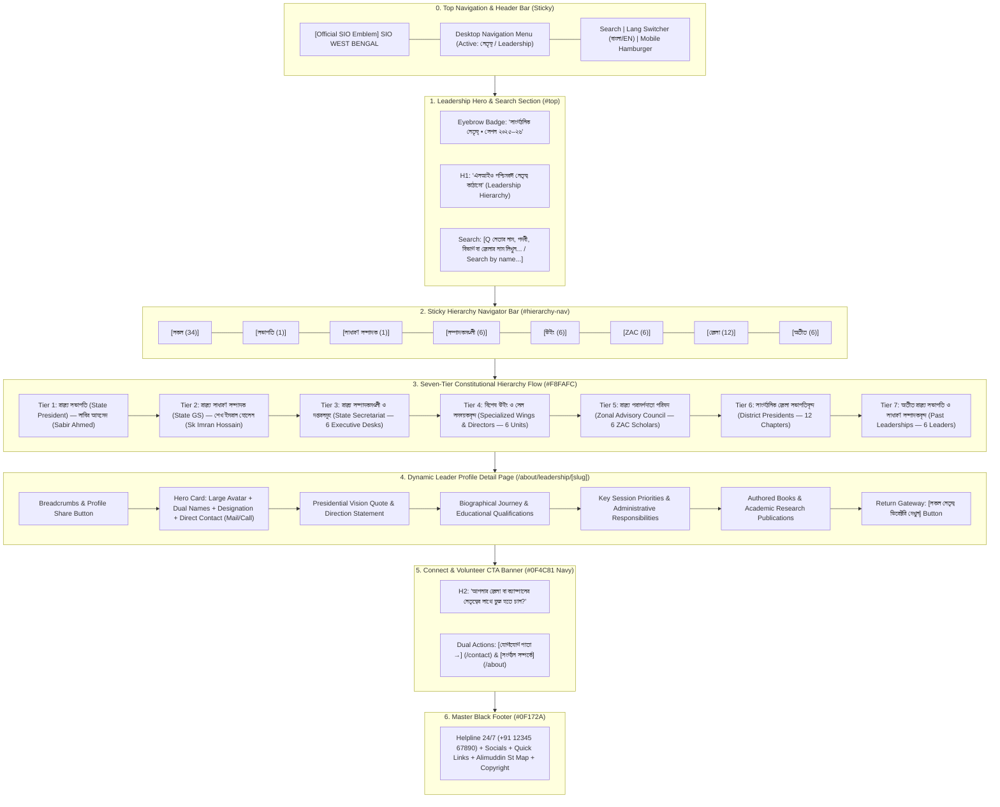

# SIO West Bengal — Leadership Page Wireframe & Section-Wise Content Matrix
> **Document Status**: Production Ready & Fully Aligned with Existing Codebase  
> **Document Status**: Production Ready & Fully Aligned with SIO Constitution (Amended Dec 2022) & Policy & Programme (2025–2026 / 22nd Term)  
> **Target Route**: `/about/leadership` and `/about/leadership/[slug]`  
> **Source Files**: [`src/app/about/leadership/page.tsx`](file:///home/masyud/Development/Masyud/SIO/src/app/about/leadership/page.tsx), [`src/app/about/leadership/[slug]/leader-detail-client.tsx`](file:///home/masyud/Development/Masyud/SIO/src/app/about/leadership/[slug]/leader-detail-client.tsx), [`src/data/leadership.ts`](file:///home/masyud/Development/Masyud/SIO/src/data/leadership.ts)  
> **Design Pattern**: Jamaat-e-Islami Hind (JIH) Leadership Directory & Individual Profile Pages with Dual-Tone Blue Gradients, Silhouette Badges, and Full Hierarchy Flow.
> **Design Pattern**: Democratic Consultation (Shura) Leadership Directory & Individual Profile Pages with Dual-Tone Blue Gradients, Constitutional Article Citations, Silhouette Badges, and Full Hierarchy Flow.

---

## 1. Executive Summary & Page Architecture

The **Leadership Page** serves as the public governance and transparency directory for Students Islamic Organisation of India (SIO) West Bengal Zone (Session 2025–26).
The **Leadership Page** serves as the public governance, accountability, and transparency directory for Students Islamic Organisation of India (SIO) West Bengal Zone for **Session 2025–2026 (22nd Term)** under National President **Mohammed Abdul Hafeez** (Central Markaz) and State President **Sabir Ahmed** (West Bengal Zone).

### Hierarchy Sequence:
$$\text{President} \longrightarrow \text{General Secretary} \longrightarrow \text{State Secretariat} \longrightarrow \text{Wings and Coordinators} \longrightarrow \text{ZAC (Advisory Council)} \longrightarrow \text{District Presidents} \longrightarrow \text{Past Leaderships}$$
### Constitutional Governance Pillars:
$$\text{Central Leadership (CAC)} \longrightarrow \text{Zonal President} \longrightarrow \text{General Secretary} \longrightarrow \text{State Secretariat} \longrightarrow \text{Wings and Coordinators} \longrightarrow \text{ZAC (Advisory Council)} \longrightarrow \text{District Presidents} \longrightarrow \text{Past Leaderships}$$

### Key Technical & Visual Attributes:
### Key Constitutional & Visual Attributes:
- **Constitutional Office-Bearer Standards (Article 7)**: Leaders do not lobby or aspire for any post; selections are made strictly by consultative Shura on the basis of Islamic knowledge, piety (*taqwa*), sagacity, adherence to constitution, and organizational capability.
- **Biennial Term (Article 8)**: Two-year term for Central and Zonal offices (Session 2025–2026).
- **Dual Presentation Modes**:
  1. **All Hierarchy View (`tab=all`)**: Natural vertical flow through all 7 constitutional tiers with anchor jump-links.
  1. **All Hierarchy View (`tab=all`)**: Natural vertical flow through all constitutional tiers with anchor jump-links.
  2. **Filtered Category Tabs**: Instant tab switching (`president`, `general-secretary`, `secretariat`, `wings`, `zac`, `district`, `past`) with leader counts.
- **Instant Search**: Real-time client-side search across leader names (Bengali/English), designations, departments, and districts.
- **Unified JIH Card Component**: Every leader card features a curved blue gradient top banner (`#0F4C81` to `#168BD4`), circular avatar frame with first-letter initial badge, category tag, academic credentials, and view full profile hover trigger.
- **Dedicated Profile Route (`[slug]`)**: Clicking any card smoothly navigates to `/about/leadership/[slug]` featuring biographical journey, session priorities, academic accolades, published books, and direct contact buttons.
- **Unified Card Component**: Every leader card features a curved blue gradient top banner (`#0F4C81` to `#168BD4`), circular avatar frame with first-letter initial badge, category tag, academic credentials, and view full profile hover trigger.
- **Dedicated Profile Route (`[slug]`)**: Clicking any card smoothly navigates to `/about/leadership/[slug]` featuring biographical journey, 2025–2026 session priorities, academic accolades, published books, and direct contact buttons.

---

## 2. Interactive Flowchart & Navigation Logic



---

## 3. Visual Wireframes (ASCII Schematics)

### 3.1 Leadership Index Page (`/about/leadership`) — Desktop Layout (1280px+)

```
+--------------------------------------------------------------------------------------------------+
| [LOGO] SIO West Bengal        [Home]  [About]  [LEADERSHIP*]  [Activities]  [Contact]  [BN/EN]   |
+--------------------------------------------------------------------------------------------------+
| HERO BANNER & SEARCH BAR                                                                         |
|                                                                                                  |
|   (•) ORGANIZATIONAL LEADERSHIP • SESSION 2025–26                                                |
|   SIO WEST BENGAL LEADERSHIP HIERARCHY / এসআইও পশ্চিমবঙ্গ নেতৃত্ব কাঠামো                          |
|   Democratically elected representatives, scholars, and student leaders guiding SIO WB.         |
|                                                                                                  |
|   +-------------------------------------------------------------------------+                    |
|   | [Q] Search by leader name, designation, department, or district...      |                    |
|   +-------------------------------------------------------------------------+                    |
+--------------------------------------------------------------------------------------------------+
| STICKY HIERARCHY NAVIGATOR BAR                                                                   |
| [All (34)] [President (1)] [GS (1)] [Secretariat (6)] [Wings (6)] [ZAC (6)] [Districts (12)] ...|
| Jump: President • GS • Secretariat • Wings • ZAC • Districts • Past                              |
+--------------------------------------------------------------------------------------------------+
| MAIN CONTENT AREA                                                                                |
|                                                                                                  |
|   === 1. STATE PRESIDENT (রাজ্য সভাপতি) ===                                                      |
|                               +-------------------------------------+                            |
|                               | [Blue Gradient Banner]              |                            |
|                               |          (( [Avatar] S ))           |                            |
|                               |        [STATE PRESIDENT BADGE]      |                            |
|                               |       Sabir Ahmed / সাবির আহমেদ      |                            |
|                               |    State President, SIO West Bengal |                            |
|                               |-------------------------------------|                            |
|                               | [Cap] Qualification: M.A, LL.B      |                            |
|                               | [Pin] District: Murshidabad/Kolkata |                            |
|                               | Bio: Prominent student leader...    |                            |
|                               | [View Full Profile ------------->]  |                            |
|                               +-------------------------------------+                            |
|                                                                                                  |
|   === 2. GENERAL SECRETARY (রাজ্য সাধারণ সম্পাদক) ===                                            |
|                               +-------------------------------------+                            |
|                               | [Blue Gradient Banner]              |                            |
|                               |          (( [Avatar] S ))           |                            |
|                               |     [GENERAL SECRETARY BADGE]       |                            |
|                               |  Sk Imran Hossain / শেখ ইমরান হোসেন   |                            |
|                               | State General Secretary, SIO WB     |                            |
|                               |-------------------------------------|                            |
|                               | [Cap] Qualification: M.Sc Chemistry |                            |
|                               | [Pin] District: North 24 Pgs / HQ   |                            |
|                               | Bio: Experienced administrator...   |                            |
|                               | [View Full Profile ------------->]  |                            |
|                               +-------------------------------------+                            |
|                                                                                                  |
|   === 3. STATE SECRETARIAT (রাজ্য সম্পাদকমণ্ডলী ও দপ্তরসমূহ) ===                                  |
|   +-----------------------+ +-----------------------+ +-----------------------+                  |
|   | Md. Abdullah          | | Syed Iqbal            | | Mashiur Rahman        |                  |
|   | Campus & Higher Edu   | | PR & Media            | | Social Welfare        |                  |
|   | Ph.D Scholar, CU      | | M.A Journalism        | | Master of Social Work |                  |
|   | [View Profile ->]     | | [View Profile ->]     | | [View Profile ->]     |                  |
|   +-----------------------+ +-----------------------+ +-----------------------+                  |
|   +-----------------------+ +-----------------------+ +-----------------------+                  |
|   | Dr. Tariq Hasan       | | Nurul Huda            | | Salman Faris          |                  |
|   | Director, CERT WB     | | Cadre Development     | | Finance & Accounts    |                  |
|   | Ph.D Education        | | M.A Arabic & Islamic  | | M.Com, Kolkata        |                  |
|   | [View Profile ->]     | | [View Profile ->]     | | [View Profile ->]     |                  |
|   +-----------------------+ +-----------------------+ +-----------------------+                  |
|                                                                                                  |
|   === 4. SPECIALIZED WINGS & DIRECTORS (বিশেষ উইং ও সমন্বয়কবৃন্দ) ===                              |
|   [CERT WB]                 [Metro Campus Cell]       [Legal Aid & Rights Desk]                  |
|   [Career & Civil Service]  [Digital Media & PR]      [Disaster Relief & Blood Desk]             |
|                                                                                                  |
|   === 5. ZONAL ADVISORY COUNCIL (রাজ্য পরামর্শদাতা পরিষদ - ZAC) ===                              |
|   [Mufakkir Alam]           [Masroor Ahmed]           [Salman Farsi]                             |
|   [Riyazul Karim]           [Wasim Akram]             [Zubair Hossain]                           |
|                                                                                                  |
|   === 6. DISTRICT PRESIDENTS (সাংগঠনিক জেলা সভাপতিবৃন্দ) ===                                     |
|   [Kolkata]                 [Murshidabad North]       [Murshidabad South]                        |
|   [Malda]                   [North 24 Parganas]       [South 24 Parganas]                        |
|   [Nadia]                   [Bardhaman]               [Birbhum]                                  |
|   [Uttar Dinajpur]          [Siliguri & Darjeeling]   [Howrah & Hooghly]                         |
|                                                                                                  |
|   === 7. PAST LEADERSHIPS (অতীত রাজ্য সভাপতি ও সাধারণ সম্পাদকবৃন্দ) ===                             |
|   [Md. Salman (2023-24)]    [Nurul Hasan (2023-24)]   [Shadab Masoom (2021-22)]                  |
|   [Mahmudul Alam (2021-22)] [Sarwar Hossain (2019-20)][Musleh Uddin (2019-20)]                   |
+--------------------------------------------------------------------------------------------------+
| BOTTOM CTA BANNER (Dark Blue: #0F4C81)                                                           |
|   Want to Connect with Your District or Campus Leadership?     [Contact Desk]  [About Us]        |
|   Reach out to our state zonal secretariat or district heads.                                    |
+--------------------------------------------------------------------------------------------------+
| MASTER FOOTER (Black #0F172A)                                                                    |
|   [Helpline 24/7] | [Quick Links] | [Constitutional Wings] | [Google Maps State HQ Embed]        |
+--------------------------------------------------------------------------------------------------+
```

---

### 3.2 Dynamic Profile Detail Page (`/about/leadership/[slug]`) — Desktop Layout

```
+--------------------------------------------------------------------------------------------------+
| [LOGO] SIO West Bengal        [Home]  [About]  [LEADERSHIP*]  [Activities]  [Contact]  [BN/EN]   |
+--------------------------------------------------------------------------------------------------+
| BREADCRUMB BAR                                                                                   |
|   Home / About Us / Leadership / Sabir Ahmed               [Share Profile] [<-- All Leaders]     |
+--------------------------------------------------------------------------------------------------+
| PROFILE CARD HEADER                                                                              |
|                                                                                                  |
|                                   (( [Large Avatar] S ))                                         |
|                                Sabir Ahmed (সাবির আহমেদ)                                         |
|                         State President, SIO West Bengal (রাজ্য সভাপতি)                           |
|                                                                                                  |
|         [Calendar: 2025–26]  [Department: Executive State HQ]  [District: Murshidabad/Kolkata]   |
|                                                                                                  |
|         [Email: president@siowb.org]   [Phone: +91 12345 67890]   [Send Direct Message Button]   |
+--------------------------------------------------------------------------------------------------+
| LEADERSHIP GUIDANCE & VISION QUOTE                                                               |
|   | "Uniting the students and youth of Bengal under the banner of knowledge, moral character,    |
|   |  and social justice is our sacred mission. SIO remains steadfast in safeguarding campus..."  |
+--------------------------------------------------------------------------------------------------+
| BIOGRAPHICAL BACKGROUND & ORGANIZATIONAL JOURNEY                                                 |
|   Sabir Ahmed is a prominent student leader and democratic education advocate in West Bengal.    |
|   Holding a Master's degree in History from Jadavpur University and a degree in Law...           |
|                                                                                                  |
|   [Cap] Educational Qualifications & Degree:                                                     |
|         M.A (History, Jadavpur University), LL.B                                                 |
+--------------------------------------------------------------------------------------------------+
| KEY PRIORITIES FOR CURRENT SESSION (২০২৫–২৬ সেশনের অগ্রাধিকারসমূহ)                                |
|   [v] Higher education reforms & merit-based fair admissions                                     |
|   [v] Revival of student union elections & democratic campus ethos                               |
|   [v] Combating student dropout through statewide scholarships & mentorship                      |
|   [v] Cultivating ethical character and mental wellbeing among youth across Bengal               |
+--------------------------------------------------------------------------------------------------+
| AUTHORED BOOKS & RESEARCH PUBLICATIONS                                                           |
|   +---------------------------------------------------+ +--------------------------------------+ |
|   | [Book] ক্যাম্পাস গণতন্ত্র ও ছাত্র রাজনীতি: বাংলার প্রেক্ষাপট| | [Book] Higher Education in Bengal    | |
|   | Publisher: স্টুডেন্টস পাবলিকেশন্স, কলকাতা (২০২৪)       | | Publisher: CERT WB Research (2023)   | |
|   +---------------------------------------------------+ +--------------------------------------+ |
|   +---------------------------------------------------+ +--------------------------------------+ |
|   | [Book] নৈতিক সমাজ বিনির্মাণে যুবশক্তির ভূমিকা          | | [Book] Student Rights Handbook       | |
|   | Publisher: ইসলামিক স্টাডিজ ফোরাম (২০২২)              | | Publisher: Legal Aid Desk (2021)     | |
|   +---------------------------------------------------+ +--------------------------------------+ |
+--------------------------------------------------------------------------------------------------+
| BOTTOM ACTIONS & CTA BANNER                                                                      |
|   [<-- Back to All Leadership Directory]          [Connect with State President's Office]        |
+--------------------------------------------------------------------------------------------------+
| MASTER FOOTER                                                                                    |
+--------------------------------------------------------------------------------------------------+
```

---

### 3.3 Mobile Visual Layout (375px–430px Responsive Breakpoint)

```
+-----------------------------------+
| [=] SIO WB Logo          [BN/EN]  |
+-----------------------------------+
| HERO SECTION                      |
| (•) SESSION 2025–26               |
| SIO Leadership Hierarchy          |
| পশ্চিমবঙ্গ নেতৃত্ব কাঠামো         |
| [Q Search leaders, districts...]  |
+-----------------------------------+
| HORIZONTAL SCROLL NAVIGATOR       |
| [All(34)] [Pres(1)] [GS(1)] [Sec] |
+-----------------------------------+
| 1. STATE PRESIDENT                |
| +-------------------------------+ |
| | [Blue Gradient Header]        | |
| |        (( Avatar S ))         | |
| |     [STATE PRESIDENT]         | |
| | Sabir Ahmed / সাবির আহমেদ     | |
| | State President, SIO WB       | |
| |-------------------------------| |
| | [Cap] M.A, LL.B               | |
| | [Pin] Murshidabad / Kolkata   | |
| | View Profile ------------->   | |
| +-------------------------------+ |
|                                   |
| 2. GENERAL SECRETARY              |
| +-------------------------------+ |
| | [Blue Gradient Header]        | |
| |        (( Avatar S ))         | |
| |     [GENERAL SECRETARY]       | |
| | Sk Imran Hossain              | |
| | General Secretary, SIO WB     | |
| |-------------------------------| |
| | [Cap] M.Sc Chemistry (Aliah)  | |
| | [Pin] North 24 Pgs / HQ       | |
| | View Profile ------------->   | |
| +-------------------------------+ |
|                                   |
| 3. SECRETARIAT (1-Col Stacking)   |
| [Md. Abdullah - Campus Wing]      |
| [Syed Iqbal - Media & PR]         |
| [Mashiur Rahman - Welfare Desk]   |
| [Dr. Tariq Hasan - CERT WB]       |
| ...                               |
|                                   |
| 4. WINGS & COORDINATORS           |
| [CERT WB Director]                |
| [Metro Campus Coordinator]        |
| [Legal Defense Desk]              |
| ...                               |
|                                   |
| 5. DISTRICT PRESIDENTS            |
| [Kolkata] [Murshidabad] [Malda].. |
+-----------------------------------+
| CTA: CONNECT WITH LEADERSHIP      |
| [Contact Desk]  [About Us]        |
+-----------------------------------+
| FOOTER (Accordion & Helpline)     |
+-----------------------------------+
```

---

## 4. Section-by-Section Name-Wise Content Matrix

### Section 0: Sticky Navigation Header
- **Component File**: [`src/components/layout/header.tsx`](file:///home/masyud/Development/Masyud/SIO/src/components/layout/header.tsx)
- **Position**: Sticky (`top-0 z-50 bg-white/95 backdrop-blur-md border-b border-[#E5E7EB]`)
- **Active Route**: `/about/leadership`
- **Actions**: Language toggle (বাংলা / English), Quick Search, Join Movement button.

---

### Section 1: Hero Showcase & Real-Time Search Bar (`#top`)
- **Component**: Native Section in [`src/app/about/leadership/page.tsx`](file:///home/masyud/Development/Masyud/SIO/src/app/about/leadership/page.tsx)
- **Background**: Soft linear gradient (`from-[#EAF6FF] to-white`) with dual ambient glow orbs (`#63BDFF/20` and `#0F4C81/10`).

| Content Element | Bengali (`bn`) | English (`en`) |
| :--- | :--- | :--- |
| **Top Badge** | `সাংগঠনিক নেতৃত্ব • সেশন ২০২৫–২৬` | `Organizational Leadership • Session 2025–26` |
| **Main Heading** | `এসআইও পশ্চিমবঙ্গ নেতৃত্ব কাঠামো` | `SIO West Bengal Leadership Hierarchy` |
| **Subtitle** | `সংবিধানসম্মত গণতান্ত্রিক প্রক্রিয়ায় নির্বাচিত প্রতিনিধি, শিক্ষাবিদ ও নিবেদিতপ্রাণ ছাত্র নেতৃত্বের সমন্বয়ে পরিচালিত SIO পশ্চিমবঙ্গ জোন। প্রতিটি কার্ডে ক্লিক করে নেতৃত্বের পূর্ণাঙ্গ পরিচিতি দেখুন।` | `Democratically elected representatives, scholars, and student leaders guiding SIO West Bengal. Click on any profile card to view detailed biographical background and contributions.` |
| **Search Placeholder** | `নেতার নাম, পদবী, বিভাগ বা জেলার নাম লিখুন...` | `Search by leader name, designation, department, or district...` |
| **Clear Search Action**| `✕ (রিসেট)` | `✕ (Clear)` |

---

### Section 2: Sticky Hierarchy Navigator & Filter Tabs (`#hierarchy-nav`)
- **Component**: Sticky Header Bar (`sticky top-16 md:top-[72px] z-40 bg-white border-b border-[#CBD5E1] shadow-2xs`)
- **Functionality**: Horizontal scroll pills for mobile; desktop displays quick anchor jumps (`#president`, `#general-secretary`, `#secretariat`, `#wings`, `#zac`, `#district`, `#past`).

| Tab ID | Bengali Label | English Label | Icon | Count |
| :--- | :--- | :--- | :--- | :--- |
| `all` | `সকল নেতৃত্ব` | `All Hierarchy` | `Sparkles` | **34** |
| `president` | `রাজ্য সভাপতি` | `President` | `User` | **1** |
| `general-secretary` | `সাধারণ সম্পাদক` | `General Secretary` | `UserCheck` | **1** |
| `secretariat` | `সম্পাদকমণ্ডলী` | `Secretariat` | `Briefcase` | **6** |
| `wings` | `উইং ও সমন্বয়ক` | `Wings & Directors` | `Building` | **6** |
| `zac` | `পরামর্শদাতা পরিষদ (ZAC)` | `Advisory Council` | `ShieldCheck` | **6** |
| `district` | `জেলা সভাপতিবৃন্দ` | `District Presidents` | `MapPin` | **12** |
| `past` | `অতীত নেতৃত্ব` | `Past Leadership` | `History` | **6** |

---

### Section 3: State President Section (`#president`)
- **Hierarchy Rank**: **Tier 1 (Highest Constitutional Executive)**
- **Card Format**: Single Centered Card (`max-w-md mx-auto`)
- **Badge**: `রাজ্য সভাপতি • ২০২৫–২৬` / `State President • 2025–26`

| Field | Bengali Content (`bn`) | English Content (`en`) |
| :--- | :--- | :--- |
| **Name** | **সাবির আহমেদ** | **Sabir Ahmed** |
| **Slug** | `sabir-ahmed` | `sabir-ahmed` |
| **Designation** | `রাজ্য সভাপতি (State President)` | `State President, SIO West Bengal` |
| **Term** | `২০২৫–২৬ (2025–26)` | `2025–26` |
| **Education** | `এম.এ (ইতিহাস, যাদবপুর বিশ্ববিদ্যালয়), এলএল.বি` | `M.A (History, Jadavpur University), LL.B` |
| **District** | `মুর্শিদাবাদ / কলকাতা` | `Murshidabad / Kolkata` |
| **Email** | `president@siowb.org` | `president@siowb.org` |
| **Phone** | `+91 12345 67890` | `+91 12345 67890` |
| **Bio Summary** | `সাবির আহমেদ ছাত্র রাজনীতি ও ক্যাম্পাস অধিকার আন্দোলনের এক সুপরিচিত মুখ। যাদবপুর বিশ্ববিদ্যালয় থেকে ইতিহাসে স্নাতকোত্তর ও আইন সম্পন্ন করে উচ্চশিক্ষার গণতান্ত্রিক সংস্কারে নেতৃত্ব দিচ্ছেন।` | `Prominent student leader and democratic education advocate holding an M.A in History from Jadavpur University and a Law degree, leading student equity campaigns across Bengal.` |
| **Action** | `পূর্ণাঙ্গ প্রোফাইল দেখুন →` | `View Full Profile →` |

---

### Section 4: State General Secretary Section (`#general-secretary`)
- **Hierarchy Rank**: **Tier 2 (Chief Executive Administrator)**
- **Card Format**: Single Centered Card (`max-w-md mx-auto`)
- **Badge**: `সাধারণ সম্পাদক • ২০২৫–২৬` / `General Secretary • 2025–26`

| Field | Bengali Content (`bn`) | English Content (`en`) |
| :--- | :--- | :--- |
| **Name** | **শেখ ইমরান হোসেন** | **Sk Imran Hossain** |
| **Slug** | `sk-imran-hossain` | `sk-imran-hossain` |
| **Designation** | `রাজ্য সাধারণ সম্পাদক (State General Secretary)` | `State General Secretary, SIO West Bengal` |
| **Department** | `সাধারণ প্রশাসন ও নীতি বাস্তবায়ন` | `General Administration & Policy Execution` |
| **Term** | `২০২৫–২৬ (2025–26)` | `2025–26` |
| **Education** | `এম.এসসি (রসায়ন, আলিয়া বিশ্ববিদ্যালয়)` | `M.Sc (Chemistry, Aliah University)` |
| **District** | `উত্তর ২৪ পরগনা / রাজ্য দপ্তর` | `North 24 Parganas / State HQ` |
| **Email** | `gs@siowb.org` | `gs@siowb.org` |
| **Phone** | `+91 12345 67890` | `+91 12345 67890` |
| **Bio Summary** | `আলিয়া বিশ্ববিদ্যালয় থেকে রসায়নে স্নাতকোত্তর। ক্যাম্পাস শাখা সভাপতি থেকে সাংগঠনিক সম্পাদক হিসেবে রাজ্যব্যাপী তৃণমূল নেটওয়ার্ক ও সচিবালয় পরিচালনায় দীর্ঘ অভিজ্ঞতা।` | `M.Sc in Chemistry from Aliah University with deep organizational roots from university units to heading state administrative operations, action plan execution, and cadre training.` |
| **Action** | `পূর্ণাঙ্গ প্রোফাইল দেখুন →` | `View Full Profile →` |

---

### Section 5: State Secretariat & Portfolios Grid (`#secretariat`)
- **Hierarchy Rank**: **Tier 3 (Executive Department Secretaries)**
- **Layout**: 3-Column Responsive Grid (`grid-cols-1 md:grid-cols-2 lg:grid-cols-3`)
- **Section Heading**: `রাজ্য সম্পাদকমণ্ডলী ও দপ্তরসমূহ` / `STATE SECRETARIAT`
- **Section Subtitle**: `ক্যাম্পাস, জনসংযোগ, সমাজকল্যাণ ও শিক্ষা সংস্কার পরিচালনায় বিভাগীয় সম্পাদকবৃন্দ` / `Executive Secretaries heading strategic state departments and portfolios`

| Leader Name (BN / EN) | Slug | Portfolio / Department | Qualification | District |
| :--- | :--- | :--- | :--- | :--- |
| **মুহাম্মদ আব্দুল্লাহ**<br>`Md. Abdullah` | `md-abdullah` | **ক্যাম্পাস ও উচ্চশিক্ষা উইং**<br>`Campus & Higher Education Wing` | `পিএইচডি গবেষক (রাষ্ট্রবিজ্ঞান, কলকাতা বিশ্ববিদ্যালয়)`<br>`Ph.D Scholar (CU)` | `কলকাতা`<br>`Kolkata` |
| **সাইদ ইকবাল**<br>`Syed Iqbal` | `syed-iqbal` | **জনসংযোগ ও প্রেস (PR & Media)**<br>`Public Relations & Media` | `এম.এ (সাংবাদিকতা ও গণযোগাযোগ)`<br>`M.A (Journalism & Mass Comm)` | `হুগলি`<br>`Hooghly` |
| **মশিউর রহমান**<br>`Mashiur Rahman` | `mashiur-rahman` | **সমাজকল্যাণ ও দুর্যোগ ত্রাণ**<br>`Social Welfare & Disaster Relief` | `এম.এস.ডব্লিউ (মাস্টার অফ সোশ্যাল ওয়ার্ক)`<br>`MSW (Master of Social Work)` | `মালদা`<br>`Malda` |
| **ড. তারিক হাসান**<br>`Dr. Tariq Hasan` | `dr-tariq-hasan` | **শিক্ষা গবেষণা ও প্রশিক্ষণ (CERT WB)**<br>`Centre for Educational Research & Training` | `পিএইচডি (শিক্ষা বিজ্ঞান, কল্যাণী বিশ্ববিদ্যালয়)`<br>`Ph.D (Education, Kalyani Univ)` | `নদিয়া`<br>`Nadia` |
| **নুরুল হুদা**<br>`Nurul Huda` | `nurul-huda` | **ছাত্র সংগঠন ও মেধা বিকাশ (Cadre)**<br>`Students' Cadre Development & Morals` | `এম.এ (আরবি ও ইসলামি স্টাডিজ)`<br>`M.A (Arabic & Islamic Studies)` | `মুর্শিদাবাদ`<br>`Murshidabad` |
| **সালমান ফারিস**<br>`Salman Faris` | `salman-faris` | **অর্থ ও হিসাব রক্ষণ বিভাগ**<br>`Finance & Accounts Department` | `এম.কম, হিসাববিজ্ঞান বিশেষজ্ঞ`<br>`M.Com, Financial Accounting` | `কলকাতা`<br>`Kolkata` |

---

### Section 6: Specialized Wings & State Coordinators Grid (`#wings`)
- **Hierarchy Rank**: **Tier 4 (Operational Directorships & Specialized Desks)**
- **Layout**: 3-Column Responsive Grid (`grid-cols-1 md:grid-cols-2 lg:grid-cols-3`)
- **Section Heading**: `বিশেষ উইং ও সেল সমন্বয়কবৃন্দ` / `WINGS & COORDINATORS`
- **Section Subtitle**: `সিইআরটি পশ্চিমবঙ্গ, মেট্রো ক্যাম্পাস, লিগ্যাল এইড ও সিভিল সার্ভিসেস ডেস্কের সমন্বয়কবৃন্দ` / `Directors and In-Charges of specialized research, legal, career, and media cells`

| Director / Coordinator (BN / EN) | Slug | Specialized Wing / Portfolio | Academic Background |
| :--- | :--- | :--- | :--- |
| **ড. তারিক হাসান**<br>`Dr. Tariq Hasan` | `director-cert` | **পরিচালক, সিইআরটি পশ্চিমবঙ্গ**<br>`Director, CERT West Bengal` | `পিএইচডি (শিক্ষা বিজ্ঞান, কল্যাণী বিশ্ববিদ্যালয়)` |
| **মুহাম্মদ আব্দুল্লাহ**<br>`Md. Abdullah` | `coord-metro-campus` | **কো-অর্ডিনেটর, মেট্রো ও উচ্চশিক্ষা ক্যাম্পাস**<br>`Coordinator, Metro & University Campuses` | `পিএইচডি গবেষক (রাষ্ট্রবিজ্ঞান, CU)` |
| **অ্যাডভোকেট মাসরুর আহমেদ**<br>`Adv. Masroor Ahmed` | `incharge-legal-aid` | **ইন-চার্জ, আইন ও মানবাধিকার সেল**<br>`In-Charge, Legal Aid & Human Rights Cell` | `এলএল.এম (কলকাতা বিশ্ববিদ্যালয়), আইনজীবী` |
| **রিয়াজুল করিম**<br>`Riyazul Karim` | `coord-career-guidance`| **সমন্বয়ক, কেরিয়ার ও সিভিল সার্ভিসেস সেল**<br>`Coordinator, Career & Civil Services Desk` | `বি.টেক (কম্পিউটার সায়েন্স), সিভিল সার্ভিস মেন্টর` |
| **সাইদ ইকবাল**<br>`Syed Iqbal` | `incharge-digital-media`| **ইন-চার্জ, ডিজিটাল মিডিয়া ও জনসংযোগ**<br>`In-Charge, Digital Media & PR Wing` | `এম.এ (সাংবাদিকতা ও গণযোগাযোগ)` |
| **মশিউর রহমান**<br>`Mashiur Rahman` | `director-relief-welfare`| **পরিচালক, দুর্যোগ ব্যবস্থাপনা ও ছাত্রকল্যাণ**<br>`Director, Disaster Relief & Student Welfare` | `এম.এস.ডব্লিউ (মাস্টার অফ সোশ্যাল ওয়ার্ক)` |

---

### Section 7: Zonal Advisory Council (ZAC) Grid (`#zac`)
- **Hierarchy Rank**: **Tier 5 (Constitutional Consultative Council)**
- **Layout**: 3-Column Responsive Grid (`grid-cols-1 md:grid-cols-2 lg:grid-cols-3`)
- **Section Heading**: `রাজ্য পরামর্শদাতা পরিষদ (ZAC)` / `ZONAL ADVISORY COUNCIL`
- **Section Subtitle**: `পশ্চিমবঙ্গ জোনের সাংবিধানিক নীতিনির্ধারণ ও দীর্ঘমেয়াদী কৌশলগত পরামর্শক পরিষদ` / `Constitutional advisory body overseeing state policies and ideological direction`

| Council Member (BN / EN) | Slug | Specialized Advisory Domain | Qualifications & Base |
| :--- | :--- | :--- | :--- |
| **মুফাক্কির আলম**<br>`Mufakkir Alam` | `mufakkir-alam` | **উচ্চশিক্ষা নীতিমালা সেল**<br>`Higher Education Policy Cell` | `এম.ফিল (ইতিহাস, যাদবপুর বিশ্ববিদ্যালয়)`<br>দক্ষিণ ২৪ পরগনা |
| **মাসরুর আহমেদ**<br>`Masroor Ahmed` | `masroor-ahmed` | **আইন ও মানবাধিকার উইং**<br>`Legal & Human Rights Wing` | `এলএল.এম (কলকাতা বিশ্ববিদ্যালয়)`<br>কলকাতা |
| **সালমান ফারসি**<br>`Salman Farsi` | `salman-farsi` | **উত্তরবঙ্গ আঞ্চলিক সমন্বয়**<br>`North Bengal Regional Coordination` | `এম.এ (ইংরেজি, উত্তরবঙ্গ বিশ্ববিদ্যালয়)`<br>উত্তর দিনাজপুর |
| **রিয়াজুল করিম**<br>`Riyazul Karim` | `riyazul-karim` | **ক্যারিয়ার ও সিভিল সার্ভিসেস সেল**<br>`Career & Civil Services Cell` | `বি.টেক (CSE), WBCS প্রস্তুতি প্যানেল`<br>মুর্শিদাবাদ |
| **ওয়াসিম আকরাম**<br>`Wasim Akram` | `wasim-akram` | **ইসলামিক থট ও বুদ্ধিবৃত্তিক ফোরাম**<br>`Islamic Thought & Intellectual Forum` | `এম.এ (আরবি ও ইসলামি স্টাডিজ, আলিয়া)`<br>মালদা |
| **জুবায়ের হোসেন**<br>`Zubair Hossain` | `zubair-hossain` | **মেডিকেল ও হেলথকেয়ার ফোরাম**<br>`Medical & Healthcare Forum` | `এমবিবিএস (মেডিক্যাল কলেজ কলকাতা)`<br>হাওড়া |

---

### Section 8: District Presidents & Campus Zones Grid (`#district`)
- **Hierarchy Rank**: **Tier 6 (Zonal Grassroots & Campus Chapters)**
- **Layout**: 3-Column Responsive Grid (`grid-cols-1 md:grid-cols-2 lg:grid-cols-3`)
- **Section Heading**: `সাংগঠনিক জেলা সভাপতিবৃন্দ` / `DISTRICT PRESIDENTS`
- **Section Subtitle**: `পশ্চিমবঙ্গের প্রতিটি সাংগঠনিক জেলা ও ক্যাম্পাস শাখায় ছাত্র আন্দোলনের দায়িত্বপ্রাপ্ত নেতৃবৃন্দ` / `District chapter presidents mobilizing student empowerment across all Bengal districts`

| # | District / Jurisdiction | District President (BN / EN) | Slug | Qualification |
| :-: | :--- | :--- | :--- | :--- |
| 1 | **কলকাতা** (`Kolkata`) | **আতিফুর রহমান** (`Atifur Rahman`) | `atifur-rahman` | `এম.এ (কলকাতা বিশ্ববিদ্যালয়)` |
| 2 | **মুর্শিদাবাদ (উত্তর)** (`Murshidabad N`) | **শাহিন রেজা** (`Shahin Reza`) | `shahin-reza` | `এম.এসসি (গণিত)` |
| 3 | **মুর্শিদাবাদ (দক্ষিণ)** (`Murshidabad S`) | **তানভীর আহমেদ** (`Tanveer Ahmed`) | `tanveer-ahmed` | `বি.এড, এম.এ` |
| 4 | **মালদা** (`Malda`) | **জসিমুদ্দিন আনসারি** (`Jasimuddin Ansari`) | `jasimuddin-ansari` | `এম.এ (গৌড়বঙ্গ বিশ্ববিদ্যালয়)` |
| 5 | **উত্তর ২৪ পরগনা** (`North 24 Pgs`) | **নাদিম আখতার** (`Nadeem Akhtar`) | `nadeem-akhtar` | `বি.টেক (মেকানিক্যাল ইঞ্জিনিয়ারিং)` |
| 6 | **দক্ষিণ ২৪ পরগনা** (`South 24 Pgs`) | **সোহেল রানা** (`Sohel Rana`) | `sohel-rana` | `এম.এ (ইতিহাস)` |
| 7 | **নদিয়া** (`Nadia`) | **মাহমুদুল হাসান** (`Mahmudul Hasan`) | `mahmudul-hasan` | `এম.এসসি (রসায়ন, কল্যাণী বিশ্ববিদ্যালয়)` |
| 8 | **বর্ধমান** (`Bardhaman`) | **কামরুজ্জামান মল্লিক** (`Kamruzzaman Mollick`)| `kamruzzaman-mollick` | `এম.এ (বর্ধমান বিশ্ববিদ্যালয়)` |
| 9 | **বীরভূম** (`Birbhum`) | **ইমতিয়াজ আহমেদ** (`Imtiaz Ahmed`) | `imtiaz-ahmed` | `এম.এ (বিশ্বভারতী বিশ্ববিদ্যালয়)` |
| 10| **উত্তর দিনাজপুর** (`Uttar Dinajpur`) | **আজহার উদ্দিন** (`Azhar Uddin`) | `azhar-uddin` | `বি.এসসি, বি.এড` |
| 11| **শিলিগুড়ি ও দার্জিলিং** (`Siliguri/Darjeeling`) | **শাকিল মোস্তফা** (`Shakil Mostafa`) | `shakil-mostafa` | `এম.কম (উত্তরবঙ্গ বিশ্ববিদ্যালয়)` |
| 12| **হাওড়া ও হুগলি** (`Howrah/Hooghly`) | **ফারহান সাজিদ** (`Farhan Sajid`) | `farhan-sajid` | `বি.টেক (আইটি)` |

---

### Section 9: Past Leadership & Former General Secretaries Grid (`#past`)
- **Hierarchy Rank**: **Tier 7 (Chronicle of Legacy Leaderships)**
- **Layout**: 3-Column Responsive Grid (`grid-cols-1 md:grid-cols-2 lg:grid-cols-3`)
- **Section Heading**: `অতীত রাজ্য সভাপতি ও সাধারণ সম্পাদকবৃন্দ` / `PAST PRESIDENTS & GENERAL SECRETARIES`
- **Section Subtitle**: `১৯৮২ সালে প্রতিষ্ঠার পর থেকে পশ্চিমবঙ্গ জোনের ঐতিহাসিক নেতৃত্ব পরম্পরা` / `Chronicle of past presidents and general secretaries who guided SIO West Bengal`

| Term | Role / Position | Leader Name (BN / EN) | Slug | Key Legacy Contribution |
| :---: | :--- | :--- | :--- | :--- |
| **২০২৩–২৪** | প্রাক্তন রাজ্য সভাপতি (`Past President`) | **মুহাম্মদ সালমান**<br>`Md. Salman` | `md-salman` | ক্যাম্পাস গণতন্ত্র ও শিক্ষা অধিকার সুরক্ষা অভিযান পরিচালনা। |
| **২০২৩–২৪** | প্রাক্তন সাধারণ সম্পাদক (`Past GS`) | **নুরুল হাসান**<br>`Nurul Hasan` | `nurul-hasan` | রাজ্যব্যাপী সাংগঠনিক সম্প্রসারণ ও নতুন জোনাল দপ্তর স্থাপন। |
| **২০২১–২২** | প্রাক্তন রাজ্য সভাপতি (`Past President`) | **শাদাব মাসুম**<br>`Shadab Masoom` | `shadab-masoom` | করোনাকালীন প্রান্তিক শিক্ষার্থীদের জন্য ডিজিটাল লার্নিং ও ত্রাণ। |
| **২০২১–২২** | প্রাক্তন সাধারণ সম্পাদক (`Past GS`) | **মাহমুদুল আলম**<br>`Mahmudul Alam` | `mahmudul-alam` | অনলাইন ক্যাডার প্রশিক্ষণ ও যুব পলিসি ইনিশিয়েটিভস। |
| **২০১৯–২০** | প্রাক্তন রাজ্য সভাপতি (`Past President`) | **সারওয়ার হোসেন**<br>`Sarwar Hossain` | `sarwar-hossain` | নৈতিক পুনর্জাগরণ ও মাদকবিরোধী ছাত্র আন্দোলনের নেতৃত্ব। |
| **২০১৯–২০** | প্রাক্তন সাধারণ সম্পাদক (`Past GS`) | **মুসলেহ উদ্দিন**<br>`Musleh Uddin` | `musleh-uddin` | জেলা সফর ও রাজ্য যুব সম্মেলনগুলোর সার্বিক সমন্বয়। |

---

## 5. Dynamic Profile Detail Page Breakdown (`/about/leadership/[slug]`)

When a user clicks on any leader card across all 7 tiers, Next.js dynamically renders [`src/app/about/leadership/[slug]/leader-detail-client.tsx`](file:///home/masyud/Development/Masyud/SIO/src/app/about/leadership/[slug]/leader-detail-client.tsx). This page strictly conforms to the Jamaat-e-Islami Hind profile design pattern.

### Components of the Detail View:

1. **Breadcrumb Bar**:
   - Navigation: `Home / About Us / Leadership / [Leader Name]`
   - Utility Actions:
     - `[Share]` Button: Triggers `navigator.share()` on mobile devices or copies URL to clipboard on desktop.
     - `[<-- All Leaders]` Button: Returns directly to `/about/leadership`.

2. **Profile Card Header**:
   - **Large Circular Avatar Frame**: Dual-tone gradient (`#0F4C81` to `#168BD4`), crisp white border, silhouette icon, and prominent first-letter Bengali badge.
   - **Dual-Script Names**: Bengali full name with English Romanized translation in parenthetical subtitle.
   - **Official Designation**: `#168BD4` accent typography.
   - **Pill Metadata Tags**: Term duration badge, Department/Wing, and District/Jurisdiction.
   - **Quick Action Bar**:
     - `[Mail] leader@siowb.org` (opens mail client)
     - `[Phone] +91 12345 67890` (calls directly)
     - `[Send Direct Message]` (links to `/contact?to=[LeaderName]`)

3. **Presidential Guidance & Vision Quote Block** *(For President & Executives)*:
   - Light blue background (`#EAF6FF/60`) with a solid `#168BD4` left vertical highlight bar.
   - Distinctive quotation mark glyph and philosophical quote on student empowerment.

4. **Biographical Journey Narrative**:
   - Narrative overview tracing student activism roots, educational progression, and leadership accomplishments.
   - **Academic Highlight Box**: Displays degrees, university alma maters, and specialized research areas.

5. **Session Priorities & Responsibilities Checklist**:
   - 2-Column bulleted matrix detailing institutional focus points (e.g., campus election revivals, scholarship desks, legal aid outreach).

6. **Authored Publications & Research Papers**:
   - Interactive card list of books, policy papers, and study guides authored by the leader, citing publisher, release year, and language.

7. **Return Gateway CTA**:
   - Button to return to all 34 leadership entries or contact the state zonal office directly.

---

## 6. Section 10 & 11: CTA Banner & Master Footer

### Section 10: Connect & Volunteer CTA Banner
- **Background**: Solid `#0F4C81` with white typography.
- **Copy**:
  - *Bengali*: `আপনার জেলা বা ক্যাম্পাসের নেতৃত্বের সাথে যুক্ত হতে চান? শিক্ষা সংস্কার, ছাত্র অধিকার আন্দোলন কিংবা সামাজিক উদ্যোগে স্বেচ্ছাসেবক হিসেবে কাজ করতে আমাদের প্রতিনিধিদের সাথে সরাসরি যোগাযোগ করুন।`
  - *English*: `Want to Connect with Your District or Campus Leadership? Reach out to our state zonal secretariat or district presidents to volunteer and organize initiatives in your institution.`
- **Buttons**:
  - Primary Red Button: `/contact` (`যোগাযোগ পাতা` / `Contact Desk`)
  - Ghost White Border Button: `/about` (`সংগঠন সম্পর্কে` / `About Us`)

### Section 11: Master Black Footer
- **Component File**: [`src/components/layout/footer.tsx`](file:///home/masyud/Development/Masyud/SIO/src/components/layout/footer.tsx)
- **Background**: `#0F172A` (Rich Dark Slate / Black)
- **Sections**: 24/7 Helpline (+91 12345 67890), State HQ Address (Kolkata, WB), Quick Links, Social Channels (Twitter, Facebook, YouTube, Instagram), and Google Maps Interactive Embed.

---

## 7. Complete Leadership Data Reference Roster (34 Leaders)

| ID | Category | Full Name (Bengali & English) | Current Designation | District | Qualification | Slug |
| :--- | :--- | :--- | :--- | :--- | :--- | :--- |
| `pres-1` | `president` | সাবির আহমেদ (Sabir Ahmed) | State President | Murshidabad/Kolkata | M.A, LL.B | `sabir-ahmed` |
| `sec-1` | `general-secretary` | শেখ ইমরান হোসেন (Sk Imran Hossain) | State General Secretary | North 24 Pgs / HQ | M.Sc Chemistry | `sk-imran-hossain` |
| `sec-2` | `secretariat` | মুহাম্মদ আব্দুল্লাহ (Md. Abdullah) | State Secretary (Campus) | Kolkata | Ph.D Scholar, CU | `md-abdullah` |
| `sec-3` | `secretariat` | সাইদ ইকবাল (Syed Iqbal) | State Secretary (PR & Media) | Hooghly | M.A Journalism | `syed-iqbal` |
| `sec-4` | `secretariat` | মশিউর রহমান (Mashiur Rahman) | State Secretary (Welfare) | Malda | MSW | `mashiur-rahman` |
| `sec-5` | `secretariat` | ড. তারিক হাসান (Dr. Tariq Hasan) | State Secretary & Director (CERT) | Nadia | Ph.D Education | `dr-tariq-hasan` |
| `sec-6` | `secretariat` | নুরুল হুদা (Nurul Huda) | State Secretary (Cadre) | Murshidabad | M.A Arabic | `nurul-huda` |
| `sec-7` | `secretariat` | সালমান ফারিস (Salman Faris) | State Secretary (Finance) | Kolkata | M.Com | `salman-faris` |
| `wing-1` | `wings` | ড. তারিক হাসান (Dr. Tariq Hasan) | Director, CERT West Bengal | Nadia / HQ | Ph.D Education | `director-cert` |
| `wing-2` | `wings` | মুহাম্মদ আব্দুল্লাহ (Md. Abdullah) | Coordinator, Metro Campuses | Kolkata | Ph.D Scholar | `coord-metro-campus` |
| `wing-3` | `wings` | অ্যাডভোকেট মাসরুর আহমেদ (Adv. Masroor) | In-Charge, Legal Aid Cell | Kolkata | LL.M, Advocate | `incharge-legal-aid` |
| `wing-4` | `wings` | রিয়াজুল করিম (Riyazul Karim) | Coordinator, Career & Civil Services | Murshidabad | B.Tech, CSE | `coord-career-guidance` |
| `wing-5` | `wings` | সাইদ ইকবাল (Syed Iqbal) | In-Charge, Digital Media | Hooghly | M.A Journalism | `incharge-digital-media` |
| `wing-6` | `wings` | মশিউর রহমান (Mashiur Rahman) | Director, Disaster Relief | Malda | MSW | `director-relief-welfare` |
| `zac-1` | `zac` | মুফাক্কির আলম (Mufakkir Alam) | Member, ZAC (Higher Edu) | South 24 Parganas | M.Phil History | `mufakkir-alam` |
| `zac-2` | `zac` | মাসরুর আহমেদ (Masroor Ahmed) | Member, ZAC (Legal Rights) | Kolkata | LL.M | `masroor-ahmed` |
| `zac-3` | `zac` | সালমান ফারসি (Salman Farsi) | Member, ZAC (North Bengal) | Uttar Dinajpur | M.A English | `salman-farsi` |
| `zac-4` | `zac` | রিয়াজুল করিম (Riyazul Karim) | Member, ZAC (Career Guidance) | Murshidabad | B.Tech, CSE | `riyazul-karim` |
| `zac-5` | `zac` | ওয়াসিম আকরাম (Wasim Akram) | Member, ZAC (Islamic Thought) | Malda | M.A Islamic Studies | `wasim-akram` |
| `zac-6` | `zac` | জুবায়ের হোসেন (Zubair Hossain) | Member, ZAC (Healthcare Forum) | Howrah | MBBS (Medical College) | `zubair-hossain` |
| `dp-1` | `district` | আতিফুর রহমান (Atifur Rahman) | District President (Kolkata) | Kolkata | M.A | `atifur-rahman` |
| `dp-2` | `district` | শাহিন রেজা (Shahin Reza) | District President (Murshidabad N) | Murshidabad (North) | M.Sc Mathematics | `shahin-reza` |
| `dp-3` | `district` | তানভীর আহমেদ (Tanveer Ahmed) | District President (Murshidabad S) | Murshidabad (South) | B.Ed, M.A | `tanveer-ahmed` |
| `dp-4` | `district` | জসিমুদ্দিন আনসারি (Jasimuddin Ansari)| District President (Malda) | Malda | M.A | `jasimuddin-ansari` |
| `dp-5` | `district` | নাদিম আখতার (Nadeem Akhtar) | District President (North 24 Pgs) | North 24 Parganas | B.Tech Mechanical | `nadeem-akhtar` |
| `dp-6` | `district` | সোহেল রানা (Sohel Rana) | District President (South 24 Pgs) | South 24 Parganas | M.A History | `sohel-rana` |
| `dp-7` | `district` | মাহমুদুল হাসান (Mahmudul Hasan) | District President (Nadia) | Nadia | M.Sc Chemistry | `mahmudul-hasan` |
| `dp-8` | `district` | কামরুজ্জামান মল্লিক (Kamruzzaman Mollick)| District President (Bardhaman) | Bardhaman | M.A | `kamruzzaman-mollick` |
| `dp-9` | `district` | ইমতিয়াজ আহমেদ (Imtiaz Ahmed) | District President (Birbhum) | Birbhum | M.A Visva-Bharati | `imtiaz-ahmed` |
| `dp-10` | `district` | আজহার উদ্দিন (Azhar Uddin) | District President (Uttar Dinajpur)| Uttar Dinajpur | B.Sc, B.Ed | `azhar-uddin` |
| `dp-11` | `district` | শাকিল মোস্তফা (Shakil Mostafa) | District President (Siliguri/Darj) | Siliguri / Darjeeling | M.Com | `shakil-mostafa` |
| `dp-12` | `district` | ফারহান সাজিদ (Farhan Sajid) | District President (Howrah/Hooghly)| Howrah / Hooghly | B.Tech IT | `farhan-sajid` |
| `past-pres-1` | `past` | মুহাম্মদ সালমান (Md. Salman) | Past State President (2023–24) | Kolkata | M.Phil | `md-salman` |
| `past-gs-1` | `past` | নুরুল হাসান (Nurul Hasan) | Past General Secretary (2023–24) | Murshidabad | M.Sc | `nurul-hasan` |
| `past-pres-2` | `past` | শাদাব মাসুম (Shadab Masoom) | Past State President (2021–22) | Malda | M.A | `shadab-masoom` |
| `past-gs-2` | `past` | মাহমুদুল আলম (Mahmudul Alam) | Past General Secretary (2021–22) | North 24 Parganas | B.Tech CSE | `mahmudul-alam` |
| `past-pres-3` | `past` | সারওয়ার হোসেন (Sarwar Hossain) | Past State President (2019–20) | South 24 Parganas | M.A | `sarwar-hossain` |
| `past-gs-3` | `past` | মুসলেহ উদ্দিন (Musleh Uddin) | Past General Secretary (2019–20) | Birbhum | M.A English | `musleh-uddin` |

---

## 8. Card Component Interaction Specification

```tsx
// Unified Card Anatomy (JIH Inspired)
<Link href={`/about/leadership/${leader.slug}`} className="group ...">
  {/* Header: Blue Gradient Banner with Silhouette Avatar */}
  <div className="bg-linear-to-b from-[#0F4C81] to-[#168BD4] p-6 text-white text-center">
    <LeaderAvatar name={leader.nameBn} avatarBg="bg-white/15" size="md" />
    <span className="badge">{badgeText}</span>
    <h3>{locale === 'bn' ? leader.nameBn : leader.nameEn}</h3>
    <p>{locale === 'bn' ? leader.designationBn : leader.designationEn}</p>
    {leader.departmentBn && <span>{leader.departmentBn}</span>}
  </div>

  {/* Body: Credentials, District, & Bio Preview */}
  <div className="p-5 flex-1 flex flex-col justify-between space-y-4 bg-white">
    <div className="flex items-start gap-2.5 p-3 rounded-xl bg-[#F8FAFC]">
      <GraduationCap className="w-4 h-4 text-[#168BD4]" />
      <div>
        <span className="font-bold">Qualification:</span>
        <span>{locale === 'bn' ? leader.educationBn : leader.educationEn}</span>
      </div>
    </div>
    <div className="flex items-center gap-2 text-xs text-[#6B7280]">
      <MapPin className="w-3.5 h-3.5 text-[#168BD4]" />
      <span>{locale === 'bn' ? leader.districtBn : leader.districtEn}</span>
    </div>
    {leader.bioBn && <p className="line-clamp-2">{leader.bioBn}</p>}

    {/* Footer: Hover Action Trigger */}
    <div className="pt-3.5 border-t border-[#F1F5F9] flex justify-between">
      <span className="text-[#168BD4] font-bold group-hover:underline">
        {locale === 'bn' ? 'পূর্ণাঙ্গ প্রোফাইল দেখুন' : 'View Full Profile'}
      </span>
      <ArrowRight className="w-3.5 h-3.5 text-[#168BD4] group-hover:text-white" />
    </div>
  </div>
</Link>
```
