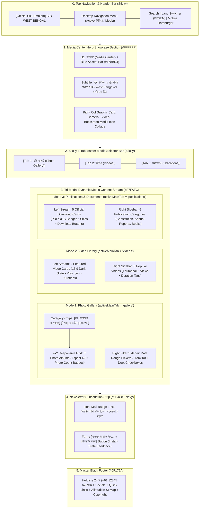

# SIO West Bengal — Media Center Page Wireframe & Section-Wise Content Matrix
> **Document Status**: Production Ready & Fully Aligned with Existing Codebase  
> **Target Route**: `/media`  
> **Source File**: [`src/app/media/page.tsx`](file:///home/masyud/Development/Masyud/SIO/src/app/media/page.tsx)  
> **Design Pattern**: Tri-Modal Digital Asset Hub (Photos, Videos, Publications) with Sticky 3-Tab Selector, Left-Right Split Sidebars, Media Grid Layouts, Instant Downloads, and Navy Newsletter Banner.

---

## 1. Executive Summary & Page Architecture

The **Media Center Page** (`/media`) serves as the official visual and documentary archive of SIO West Bengal.

### Three Primary Media Modalities:
$$\text{Photo Gallery (ছবি গ্যালারি)} \longleftrightarrow \text{Videos (ভিডিও)} \longleftrightarrow \text{Publications and Downloads (প্রকাশনা)}$$

### Key Technical & Visual Attributes:
- **Hero Showcase**: Left-aligned headline with `#168BD4` accent underline and right-aligned collage card featuring camera (`Camera`), cinema camera (`Video`), and open book (`BookOpen`) glyphs.
- **Sticky 3-Tab Main Selector**: Full-width 3-column sticky tab switcher (`sticky top-16 md:top-[72px] z-30 bg-white border-b`) with active sky-blue indicator highlighting the active media mode (`gallery` / `videos` / `publications`).
- **Tab 1 — Photo Gallery Archive (`activeMainTab === 'gallery'`)**:
  - Horizontal category chips filter (`All`, `Conferences`, `Education`, `Social Welfare`, `Campus`).
  - 4x2 responsive album grid (8 photo albums) with aspect-4/3 preview frames, image glyphs, and bottom-right photo counter badges (e.g. `৪৫ ছবি`, `৩২ ছবি`).
  - Right date range filter sidebar with "From" and "To" date pickers and category checkboxes.
- **Tab 2 — Video Hub (`activeMainTab === 'videos'`)**:
  - Left main stream with 4 featured video cards featuring dark slate 16:9 viewports, floating play buttons (`Play`), and duration badges (e.g. `06:45`, `03:18`).
  - Right sidebar showcasing 3 popular videos with compact 16:10 thumbnails, view counters, and duration tags.
- **Tab 3 — Publications & Official Documents (`activeMainTab === 'publications'`)**:
  - Left grid of 5 official downloadable documents with color-coded format badges (Red `PDF`, Blue `DOC`), file sizes (e.g. `2.4 MB`, `1.8 MB`), and one-click download action buttons.
  - Right sidebar listing 5 thematic publication categories with chevron navigation indicators.
- **Newsletter Subscription Strip**: Solid `#0F4C81` navy bar with instant email validation.

---

## 2. Clean Sequential Flowchart & Information Architecture



---

## 3. Visual Wireframes (ASCII Schematics)

### 3.1 Media Center (`/media`) — Desktop Layout (1280px+)

```
+--------------------------------------------------------------------------------------------------+
| [LOGO] SIO West Bengal        [Home]  [About]  [Leadership]  [Activities]  [MEDIA*]      [BN/EN] |
+--------------------------------------------------------------------------------------------------+
| HERO SHOWCASE (#FFFFFF)                                                                          |
|   MEDIA CENTER / মিডিয়া                                         +-----------------------------+ |
|   ----                                                          | [Collage Icon Box]          | |
|   Visual archives, documentary lectures, event photo albums,    |   [Camera]  [VIDEO]  [Book] | |
|   and official constitution and policy publications.            |   Media Archives & Docs     | |
|   দেখুন, জানুন এবং অনুপ্রাণিত হোন।                                |                             | |
|                                                                 +-----------------------------+ |
+--------------------------------------------------------------------------------------------------+
| STICKY 3-TAB MASTER MEDIA SELECTOR BAR (Sticky top-16 md:top-[72px])                             |
| [  [Camera] Photo Gallery (Active)*  |    [Play] Videos     |    [BookOpen] Publications    ]     |
+--------------------------------------------------------------------------------------------------+
| MODE 1: PHOTO GALLERY VIEW (#F7FAFC)                                                             |
|                                                                                                  |
| [LEFT MAIN GRID (9-Columns)]                                        [RIGHT SIDEBAR (3-Columns)]  |
|                                                                                                  |
| +-----------------------------------------------------------------+ +--------------------------+ |
| | Category Chips: [All*] [Conferences] [Education] [Social] ...   | | FILTERS                  | |
| +-----------------------------------------------------------------+ |                          | |
|                                                                     | Select Date Range:       | |
| 4x2 RESPONSIVE PHOTO ALBUMS GRID:                                   | From: [ 2024-01-01     ] | |
| +--------------------+ +--------------------+ +-------------------+ | To:   [ 2024-05-12     ] | |
| | [Aspect 4:3 Image] | | [Aspect 4:3 Image] | | [Aspect 4:3 Image]| |                          | |
| | [ImageIcon]        | | [ImageIcon]        | | [ImageIcon]       | | Departments:             | |
| | [Badge: ৪৫ ছবি]   | | [Badge: ৩২ ছবি]   | | [Badge: ১৮ ছবি]  | | [x] Conferences & Meets  | |
| | State Conf 2024    | | Skill Workshop     | | Iftar Mahfil 2024 | | [x] Educational Programs | |
| | রাজ্য সম্মেলন ২০২৪  | | দক্ষতা উন্নয়ন       | | ইফতার মাহফিল     | | [x] Social Welfare       | |
| | [Cal] 12 May 2024  | | [Cal] 07 May 2024  | | [Cal] 26 Mar 2024 | | [x] Campus Activities    | |
| +--------------------+ +--------------------+ +-------------------+ |                          | |
| +--------------------+ +--------------------+ +-------------------+ | [Apply Filters Button]   | |
| | Student Assembly   | | Blood Donation Camp| | Book Distribution | +--------------------------+ |
| | ছাত্র সমাবেশ       | | রক্তদান শিবির      | | বই বিতরণ কর্মসূচি |                              |
| | [Badge: ৪০ ছবি]   | | [Badge: ১৫ ছবি]   | | [Badge: ২২ ছবি]  |                              |
| | [Cal] 10 Mar 2024  | | [Cal] 16 Mar 2024  | | [Cal] 11 Mar 2024 |                              |
| +--------------------+ +--------------------+ +-------------------+                              |
+--------------------------------------------------------------------------------------------------+
| MODE 2: VIDEOS VIEW (When User Selects 'Videos' Tab)                                             |
|                                                                                                  |
| [FEATURED VIDEOS (8-Columns)]                       [POPULAR VIDEOS SIDEBAR (4-Columns)]         |
| +-------------------------------------------------+ +------------------------------------------+ |
| | [16:9 Dark Slate Video Viewport]                | | Popular Videos                           | |
| |           (( [>] Floating Play Icon ))          | |                                          | |
| |                             [Badge: 06:45]      | | [Thumb 16:10] SIO Documentary Journey    | |
| | SIO State Conference 2024 - Highlights          | |               [Play] [09:12]  2.8K Views | |
| | [Cal] 12 May 2024                 1.2k Views    | |                                          | |
| +-------------------------------------------------+ | [Thumb 16:10] Awareness Rally 2024       | |
| +-------------------------------------------------+ |               [Play] [10:44]  1.9K Views | |
| | Youth Leadership Training Workshop              | |                                          | |
| | [Play Icon] [Badge: 03:18]                      | | [Thumb 16:10] Skill Development Step Fwd | |
| | [Cal] 06 May 2024                  573 Views    | |               [Play] [04:36]  1.5K Views | |
| +-------------------------------------------------+ +------------------------------------------+ |
+--------------------------------------------------------------------------------------------------+
| MODE 3: PUBLICATIONS VIEW (When User Selects 'Publications' Tab)                                 |
|                                                                                                  |
| [DOWNLOADABLE CARDS GRID (8-Columns)]               [PUBLICATION CATEGORIES (4-Columns)]         |
| +-----------------------+ +-----------------------+ +------------------------------------------+ |
| | [PDF Badge]    2.4 MB | | [PDF Badge]    1.8 MB | | Categories:                              | |
| | SIO Constitution      | | Policy & Programme    | |  • Constitution & Bylaws             >   | |
| | SIO সংবিধান (বাংলা)   | | নীতিমালা ও কর্মসূচি    | |  • Annual Reports                    >   | |
| | Amended Dec 2022.     | | Biennial guidelines.  | |  • Guidelines & Handbooks            >   | |
| | [Download Button --->]| | [Download Button --->]| |  • Research & Analysis               >   | |
| +-----------------------+ +-----------------------+ |  • Literature & Books                >   | |
| +-----------------------+ +-----------------------+ +------------------------------------------+ |
| | [PDF Badge]    3.1 MB | | [DOC Badge]    3.2 MB |                                              |
| | Annual Report 2023    | | Student Guidelines    |                                              |
| | [Download Button --->]| | [Download Button --->]|                                              |
| +-----------------------+ +-----------------------+                                              |
+--------------------------------------------------------------------------------------------------+
| NEWSLETTER SUBSCRIPTION STRIP (#0F4C81 Navy)                                                     |
|   (( [Mail Icon] )) Stay Updated with SIO Media / নিয়মিত আপডেট পেতে সাথে থাকুন                    |
|   Receive timely press releases, documentary drops, and event albums.                            |
|                                                                                                  |
|   [ Enter your email / আপনার ইমেইল দিন          ]  [ Subscribe / সাবস্ক্রাইব করুন ]              |
+--------------------------------------------------------------------------------------------------+
| MASTER BLACK FOOTER (#0F172A)                                                                    |
|   24/7 Helpline | Video Playlists | Photo Archives | Publications Repository | Maps HQ Embed     |
+--------------------------------------------------------------------------------------------------+
```

---

### 3.2 Mobile Visual Layout (375px–430px Responsive View)

```
+-----------------------------------+
| [=] SIO WB Logo          [BN/EN]  |
+-----------------------------------+
| MEDIA CENTER HERO                 |
| মিডিয়া / Media Center             |
| Visual archives, documentaries &  |
| publications of SIO West Bengal.  |
|                                   |
| +-------------------------------+ |
| | [Camera]  [Video]  [BookOpen] | |
| +-------------------------------+ |
+-----------------------------------+
| 3-TAB EQUAL WIDTH SELECTOR        |
| [Photos*]   [Videos]   [Documents]|
+-----------------------------------+
| (IF TAB = PHOTOS)                 |
| Category Filter Chips:            |
| [All] [Conferences] [Education]   |
|                                   |
| 1-COLUMN STACKED ALBUMS:          |
| +-------------------------------+ |
| | [Aspect 4:3 Image Placeholder]| |
| | [ImageIcon]     [Badge: ৪৫ ছবি| |
| | State Conference 2024         | |
| | রাজ্য সম্মেলন ২০২৪            | |
| | [Cal] 12 May 2024             | |
| +-------------------------------+ |
|                                   |
| +-------------------------------+ |
| | Skill Development Workshop    | |
| | [Badge: ৩২ ছবি]               | |
| | [Cal] 07 May 2024             | |
| +-------------------------------+ |
+-----------------------------------+
| (IF TAB = VIDEOS)                 |
| +-------------------------------+ |
| | [16:9 Dark Viewport]          | |
| | (( [Play] ))    [Badge: 06:45]| |
| | State Conference Highlights   | |
| | 12 May 2024 • 1.2k Views      | |
| +-------------------------------+ |
+-----------------------------------+
| (IF TAB = PUBLICATIONS)           |
| +-------------------------------+ |
| | [PDF Badge]            2.4 MB | |
| | SIO Constitution (Bengali)    | |
| | Complete articles & bylaws.   | |
| | [Download PDF]                | |
| +-------------------------------+ |
+-----------------------------------+
| NEWSLETTER SUBSCRIPTION STRIP     |
| [Enter email...]  [Subscribe]     |
+-----------------------------------+
| MASTER FOOTER                     |
+-----------------------------------+
```

---

## 4. Section-by-Section Name-Wise Content Matrix

### Section 0: Sticky Navigation Header
- **Component File**: [`src/components/layout/header.tsx`](file:///home/masyud/Development/Masyud/SIO/src/components/layout/header.tsx)
- **Position**: Sticky (`top-0 z-50 bg-white/95 backdrop-blur-md border-b border-[#E5E7EB]`)
- **Active Navigation**: `মিডিয়া (Media)`
- **Actions**: Language switch (`বাংলা` / `English`), Search icon, Join Us CTA button.

---

### Section 1: Hero Showcase & Icon Collage Graphic Card (`#top`)
- **Component**: Top Hero Section in [`src/app/media/page.tsx`](file:///home/masyud/Development/Masyud/SIO/src/app/media/page.tsx)
- **Grid Layout**: 12-column grid (`lg:col-span-7` text, `lg:col-span-5` graphic).

| Content Field | Bengali Text (`bn`) | English Text (`en`) |
| :--- | :--- | :--- |
| **Main Heading** | `মিডিয়া` | `Media Center` |
| **Accent Bar** | `w-14 h-1 bg-[#168BD4] rounded-full` | `w-14 h-1 bg-[#168BD4] rounded-full` |
| **Subtitle Description** | `ছবি, ভিডিও ও প্রকাশনার মাধ্যমে SIO West Bengal-এর বিভিন্ন কার্যক্রম, কর্মসূচি ও উদ্যোগের চিত্র তুলে ধরা। দেখুন, জানুন এবং অনুপ্রাণিত হোন।` | `Visual archives, documentary lectures, event photo albums, and official constitution and policy publications of SIO West Bengal.` |
| **Graphic Card Icons** | `Camera` (Left) • `Video` (Center elevated) • `BookOpen` (Right) | `Camera` • `Video` • `BookOpen` |
| **Graphic Backdrop** | `bg-gradient-to-br from-[#EAF6FF] to-[#F7FAFC]` | Sky blue to neutral gradient frame |

---

### Section 2: Sticky 3-Tab Master Media Selector Bar (`#media-tabs`)
- **Component**: Sticky Tab Bar (`sticky top-16 md:top-[72px] z-30 bg-white border-b border-[#E5E7EB]`)
- **Layout**: Equal 3-column split (`grid grid-cols-3`).

| Tab ID | Bengali Label | English Label | Icon | Active State Styling |
| :--- | :--- | :--- | :--- | :--- |
| `gallery` | `ছবি গ্যালারি` | `Photo Gallery` | `ImageIcon` | `border-[#168BD4] text-[#168BD4] bg-[#EAF6FF]/40` |
| `videos` | `ভিডিও` | `Videos` | `PlayCircle` | `border-[#168BD4] text-[#168BD4] bg-[#EAF6FF]/40` |
| `publications`| `প্রকাশনা` | `Publications` | `BookOpen` | `border-[#168BD4] text-[#168BD4] bg-[#EAF6FF]/40` |

---

### Section 3: Tab 1 — Photo Gallery Archive (`gallery`)

#### Module 3.1: Category Filter Chips
- `all`: `সব` / `All` *(Default)*
- `সমাবেশ ও প্রোগ্রাম`: `সমাবেশ ও প্রোগ্রাম` / `Conferences & Meets`
- `শিক্ষা কার্যক্রম`: `শিক্ষা কার্যক্রম` / `Educational Programs`
- `সামাজিক উদ্যোগ`: `সামাজিক উদ্যোগ` / `Social Welfare`
- `ক্যাম্পাস কার্যক্রম`: `ক্যাম্পাস কার্যক্রম` / `Campus Activities`

#### Module 3.2: 8 Photo Albums Catalog
| ID | Bengali Title | English Title | Date | Photo Count | Category Tag |
| :-: | :--- | :--- | :---: | :---: | :--- |
| `1` | **রাজ্য সম্মেলন ২০২৪** | State Conference 2024 | ১২ মে, ২০২৪ | **৪৫ ছবি** | সমাবেশ ও প্রোগ্রাম |
| `2` | **দক্ষতা উন্নয়ন কর্মশালা** | Skill Development Workshop | ০৭ মে, ২০২৪ | **৩২ ছবি** | শিক্ষা কার্যক্রম |
| `3` | **ইফতার মাহফিল ২০২৪** | Statewide Iftar Mahfil 2024 | ২৬ মার্চ, ২০২৪ | **১৮ ছবি** | সামাজিক উদ্যোগ |
| `4` | **ছাত্র সমাবেশ** | Student Assembly & Rally | ১০ মার্চ, ২০২৪ | **৪০ ছবি** | সমাবেশ ও প্রোগ্রাম |
| `5` | **রক্তদান শিবির** | Voluntary Blood Donation Camp | ১৬ মার্চ, ২০২৪ | **১৫ ছবি** | সামাজিক উদ্যোগ |
| `6` | **বই বিতরণ কর্মসূচি** | Academic Book Distribution | ১১ মার্চ, ২০২৪ | **২২ ছবি** | শিক্ষা কার্যক্রম |
| `7` | **সচেতনতা র্যালি** | Anti-Drug Awareness Rally | ০২ মার্চ, ২০২৪ | **২৫ ছবি** | সামাজিক উদ্যোগ |
| `8` | **ক্যাম্পাস মিটিং** | Campus Cadre Meeting | ২৮ ফেব্রুয়ারি, ২০২৪ | **১৮ ছবি** | ক্যাম্পাস কার্যক্রম |

#### Module 3.3: Right Gallery Filter Sidebar
- **Header**: `ফিল্টার (Filters)` with `Filter` icon.
- **Date Range Pickers**: `থেকে (From)` default `2024-01-01` | `পর্যন্ত (To)` default `2024-05-12`.
- **Department Checkboxes**: `সমাবেশ ও প্রোগ্রাম`, `শিক্ষা কার্যক্রম`, `সামাজিক উদ্যোগ`, `ক্যাম্পাস কার্যক্রম`, `অন্যান্য`.
- **Apply Action Button**: `ফিল্টার প্রয়োগ করুন` / `Apply Filters`.

---

### Section 4: Tab 2 — Featured Videos & Video Library (`videos`)

#### Module 4.1: Featured Videos (Left Stream / 8-Columns)
| ID | Bengali Title | English Title | Duration | Date | Views |
| :-: | :--- | :--- | :---: | :---: | :---: |
| `1` | **SIO রাজ্য সম্মেলন ২০২৪ - সংক্ষিপ্ত ভিডিও** | SIO State Conference 2024 - Highlights | `06:45` | ১২ মে, ২০২৪ | ১.২k ভিউ |
| `2` | **যুব নেতৃত্ব প্রশিক্ষণ কর্মশালা** | Youth Leadership Training Workshop | `03:18` | ০৬ মে, ২০২৪ | ৫৭৩ ভিউ |
| `3` | **শিক্ষা ও চরিত্র গঠনে SIO-এর ভূমিকা** | Role of SIO in Moral Education | `05:21` | ৩০ এপ্রিল, ২০২৪ | ১.৪k ভিউ |
| `4` | **ক্যাম্পাসে আমাদের কার্যক্রম** | Our Campus Activities & Student Welfare | `04:02` | ২০ এপ্রিল, ২০২৪ | ৭৬০ ভিউ |

#### Module 4.2: Popular Videos Sidebar (Right Stream / 4-Columns)
| ID | Video Title (Bengali & English) | Duration | Views |
| :-: | :--- | :---: | :---: |
| `p1` | **SIO ডকুমেন্টারি: একটি পথচলার কাহিনী** (`SIO Documentary`) | `09:12` | ২.৮K ভিউ |
| `p2` | **সচেতনতা র্যালি — ২০২৪** (`Awareness Rally 2024`) | `10:44` | ১.৯K ভিউ |
| `p3` | **দক্ষতা উন্নয়ন: এক ধাপ এগিয়ে** (`Skill Development: Step Forward`)| `04:36` | ১.৫K ভিউ |

---

### Section 5: Tab 3 — Publications & Official Documents (`publications`)

#### Module 5.1: 5 Downloadable Official Publications
| ID | Title (Bengali & English) | Format Badge | File Size | Description Summary |
| :-: | :--- | :---: | :---: | :--- |
| `pub1` | **SIO সংবিধান (বাংলা সংস্করণ)**<br>`SIO Constitution (Bengali Edition)` | `PDF` (Red) | **2.4 MB** | Amended up to December 2022. Complete bylaws and articles. |
| `pub2` | **নীতিমালা ও কর্মসূচি**<br>`Policy & Programme` | `PDF` (Red) | **1.8 MB** | Biennial policy guidelines for educational reform and student activities. |
| `pub3` | **বার্ষিক প্রতিবেদন ২০২৩**<br>`Annual Report 2023` | `PDF` (Red) | **3.1 MB** | Overview of student welfare activities, surveys, and relief work. |
| `pub4` | **ছাত্রদের জন্য নির্দেশিকা**<br>`Student Guidelines & Campus Handbook` | `DOC` (Blue) | **3.2 MB** | Comprehensive guidance for campus study circles and skill clubs. |
| `pub5` | **দাওয়াহ ও তাওহীদ পাঠিত**<br>`Da'wah & Monotheism Reading Guide` | `PDF` (Red) | **2.0 MB** | Ideological literature and foundational reading syllabus. |

#### Module 5.2: Publication Thematic Categories Sidebar
- `সংবিধান ও নীতি` (`Constitution & Policy`)
- `বার্ষিক প্রতিবেদন` (`Annual Reports`)
- `নির্দেশিকা ও গাইড` (`Guidelines & Campus Guides`)
- `গবেষণা ও বিশ্লেষণ` (`Research & Academic Papers`)
- `বই ও সাহিত্য` (`Books & Cultural Literature`)

---

### Section 6: Newsletter Subscription Strip
- **Component**: Newsletter Section in [`src/app/media/page.tsx`](file:///home/masyud/Development/Masyud/SIO/src/app/media/page.tsx)
- **Background**: Solid Deep Blue (`#0F4C81`) with White Typography

| Element | Bengali Content (`bn`) | English Content (`en`) |
| :--- | :--- | :--- |
| **Icon** | `Mail` in circular translucent badge | `Mail` in circular translucent badge |
| **Headline** | `নিয়মিত আপডেট পেতে আমাদের সাথে থাকুন` | `Stay Updated with SIO Media` |
| **Subtitle** | `সংবাদ, নিবন্ধ, কর্মসূচি ও অন্যান্য আপডেটের সরাসরি নোটিফিকেশন পান।` | `Receive timely releases, documentary drops, and event photo albums in your inbox.` |
| **Input Placeholder** | `আপনার ইমেইল দিন` | `Enter your email` |
| **Button Text** | `সাবস্ক্রাইব করুন` (সাবস্ক্রাইব হয়েছে!) | `Subscribe` (Subscribed!) |

---

### Section 7: Master Black Footer
- **Component File**: [`src/components/layout/footer.tsx`](file:///home/masyud/Development/Masyud/SIO/src/components/layout/footer.tsx)
- **Background**: Solid `#0F172A`
- **Details**: 24/7 Helpline (+91 12345 67890), YouTube Video Archives link, Photo Gallery index, State HQ Address (Kolkata), and Google Maps Interactive Location Embed.
