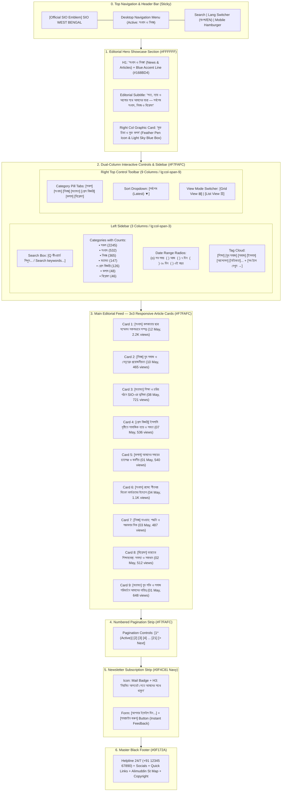

# SIO West Bengal — News & Articles Page Wireframe & Section-Wise Content Matrix
> **Document Status**: Production Ready & Fully Aligned with Existing Codebase  
> **Target Route**: `/articles`  
> **Source Files**: [`src/app/articles/page.tsx`](file:///home/masyud/Development/Masyud/SIO/src/app/articles/page.tsx), [`src/lib/mock/articles.ts`](file:///home/masyud/Development/Masyud/SIO/src/lib/mock/articles.ts), [`src/types/article.ts`](file:///home/masyud/Development/Masyud/SIO/src/types/article.ts)  
> **Design Pattern**: Multi-Category Editorial & Media Portal with 2-Column Sidebar Layout, Real-Time Search, Date Filters, Tag Cloud, Grid/List View Modes, Numbered Pagination, and Dark Blue Newsletter Banner.

---

## 1. Executive Summary & Page Architecture

The **News & Articles Page** (`/articles`) serves as the official publication, opinion journalism, and public statement hub for Students Islamic Organisation of India (SIO) West Bengal.

### Editorial Scope:
$$\text{News (সংবাদ)} \longleftrightarrow \text{Articles (নিবন্ধ)} \longleftrightarrow \text{Opinion (মতামত)} \longleftrightarrow \text{Press Releases (প্রেস বিজ্ঞপ্তি)} \longleftrightarrow \text{Columns (কলাম)} \longleftrightarrow \text{Analysis (বিশ্লেষণ)}$$

### Key Technical & Visual Attributes:
- **Hero Showcase**: Left-aligned headline with `#168BD4` accent bar and right-aligned illuminated editorial card featuring a feather pen (`Feather`) motif for "মুক্ত চিন্তা ও মুক্ত কলম" (Thought & Reflection).
- **Two-Column Master Layout (Desktop 1280px+)**:
  - **Left Sidebar (3 Columns / `lg:col-span-3`)**: Keyword search box, Category directory with article counts, Date range selector radios, and interactive Tag Cloud.
  - **Right Main Stream (9 Columns / `lg:col-span-9`)**: Top filter toolbar with category pill buttons, Sort dropdown (`Latest`, `Popular`, `Oldest`), and Grid/List view mode toggle button group.
- **Article Card Anatomy**:
  - Image placeholder with subtle newspaper graphic (`Newspaper`) and solid navy category pill badge (`#0F4C81`).
  - 2-line clamped bilingual heading with hover transition to `#168BD4`.
  - Metadata footer showing publication date (`Calendar`) and read views counter (`Eye`).
- **Paginated Navigation**: Numbered pagination strip (`1`, `2`, `3`, `4`, `...`, `21`, `>`) with active state styling.
- **Newsletter Subscription Strip**: Navy banner (`#0F4C81`) with instant email input validation and interactive confirmation feedback.

---

## 2. Clean 5-Stage Interactive Flowchart & Information Architecture



---

## 3. Visual Wireframes (ASCII Schematics)

### 3.1 News & Articles Index (`/articles`) — Desktop Layout (1280px+)

```
+--------------------------------------------------------------------------------------------------+
| [LOGO] SIO West Bengal        [Home]  [About]  [Leadership]  [Activities]  [ARTICLES*]   [BN/EN] |
+--------------------------------------------------------------------------------------------------+
| HERO SECTION (#FFFFFF)                                                                           |
|   NEWS & ARTICLES / সংবাদ ও নিবন্ধ                               +-----------------------------+ |
|   ----                                                          | [Feather Graphic Box]       | |
|   Explore the latest institutional press statements, thoughtful |   (( [Feather Icon] ))      | |
|   analytical essays, student welfare columns, and updates.      |   THOUGHT & REFLECTION      | |
|   সত্য, ন্যায় ও আলোর পথে আমাদের যাত্রা।                           |   মুক্ত চিন্তা ও মুক্ত কলম  | |
|                                                                 +-----------------------------+ |
+--------------------------------------------------------------------------------------------------+
| 2-COLUMN MAIN CONTENT AREA (#F7FAFC)                                                             |
|                                                                                                  |
| [LEFT SIDEBAR (3-Cols)]             [RIGHT EDITORIAL STREAM (9-Cols)]                            |
|                                                                                                  |
| +---------------------------------+ +----------------------------------------------------------+ |
| | [Q Search keywords...]          | | [All] [News] [Articles] [Opinion] [Press] [Column] ...   | |
| +---------------------------------+ |                                [Sort: Latest v] [⊞][☰]   | |
|                                     +----------------------------------------------------------+ |
| +---------------------------------+                                                              |
| | Categories                      | 3x3 RESPONSIVE ARTICLE GRID (Grid View Mode):                |
| |  All                     (2245) | +--------------------+ +--------------------+ +------------+ |
| |  News                     (532) | | [Thumbnail / News] | | [Thumbnail / News] | | [Thumb...] | |
| |  Articles                 (365) | | [BADGE: News]      | | [BADGE: Article]   | | [BADGE...] | |
| |  Opinion                  (147) | | Student Conference | | Youth & Leadership | | Role of SIO| |
| |  Press Releases           (126) | | Concluded Kolkata  | | Imperative         | | in Moral...| |
| |  Columns                   (48) | | [Cal] 12 May 2024  | | [Cal] 10 May 2024  | | [Cal] 8 May| |
| |  Analysis                  (46) | | [Eye] 2.2K views   | | [Eye] 465 views    | | [Eye] 721  | |
| +---------------------------------+ +--------------------+ +--------------------+ +------------+ |
|                                                                                                  |
| +---------------------------------+ +--------------------+ +--------------------+ +------------+ |
| | Filter by Date                  | | [Thumbnail / News] | | [Thumbnail / News] | | [Thumb...] | |
| |  (o) All Time                   | | [BADGE: Press]     | | [BADGE: Column]    | | [BADGE...] | |
| |  ( ) Today                      | | Social Justice in  | | Contemporary       | | Winter Aid | |
| |  ( ) Last 7 Days                | | Islamic Perspective| | Challenges & Duty  | | Statewide  | |
| |  ( ) Last 30 Days               | | [Cal] 7 May 2024   | | [Cal] 1 May 2024   | | [Cal] 4 May| |
| |  ( ) This Year                  | | [Eye] 536 views    | | [Eye] 540 views    | | [Eye] 1.1K | |
| +---------------------------------+ +--------------------+ +--------------------+ +------------+ |
|                                                                                                  |
| +---------------------------------+ +--------------------+ +--------------------+ +------------+ |
| | Tags                            | | [Thumbnail / News] | | [Thumbnail / News] | | [Thumb...] | |
| | [Education] [Youth] [Society]   | | [BADGE: Article]   | | [BADGE: Analysis]  | | [BADGE...] | |
| | [Islam] [Movement] [Ethics]     | | Da'wah: Construct- | | Indian Education   | | Youth &    | |
| | [Nation] [Culture] [Women]      | | ive Methodology    | | System Challenges  | | Social Chg | |
| | [View All Tags ->]              | | [Cal] 3 May 2024   | | [Cal] 2 May 2024   | | [Cal] 1 May| |
| +---------------------------------+ | [Eye] 487 views    | | [Eye] 512 views    | | [Eye] 648  | |
|                                     +--------------------+ +--------------------+ +------------+ |
|                                                                                                  |
|                                     PAGINATION CONTROLS:                                         |
|                                     [ 1* ]  [ 2 ]  [ 3 ]  [ 4 ]  ...  [ 21 ]  [ > ]               |
+--------------------------------------------------------------------------------------------------+
| NEWSLETTER SUBSCRIPTION STRIP (#0F4C81 Navy)                                                     |
|   (( [Mail Icon] )) Subscribe for Regular Updates / নিয়মিত আপডেট পেতে সাথে থাকুন                  |
|   Receive the latest articles, reports, and ideological reflections.                             |
|                                                                                                  |
|   [ Enter your email / আপনার ইমেইল দিন          ]  [ Subscribe / সাবস্ক্রাইব করুন ]              |
+--------------------------------------------------------------------------------------------------+
| MASTER BLACK FOOTER (#0F172A)                                                                    |
|   24/7 Helpline | Quick Links | Articles Archive | Media Releases | Google Maps HQ Location      |
+--------------------------------------------------------------------------------------------------+
```

---

### 3.2 Mobile Visual Layout (375px–430px Responsive View)

```
+-----------------------------------+
| [=] SIO WB Logo          [BN/EN]  |
+-----------------------------------+
| EDITORIAL HERO                    |
| News & Articles / সংবাদ ও নিবন্ধ  |
| Explore latest essays, statements |
|                                   |
| +-------------------------------+ |
| | (( Feather Icon ))            | |
| | THOUGHT & REFLECTION          | |
| | মুক্ত চিন্তা ও মুক্ত কলম      | |
| +-------------------------------+ |
+-----------------------------------+
| MOBILE SEARCH BAR                 |
| [Q Search keywords...           ] |
+-----------------------------------+
| HORIZONTAL CATEGORY SCROLL        |
| [All(2245)] [News(532)] [Articles]|
+-----------------------------------+
| 1-COLUMN STACKED CARDS            |
|                                   |
| +-------------------------------+ |
| | [Thumbnail Image / Graphic]   | |
| | [BADGE: News]                 | |
| | Student Conference            | |
| | Successfully in Kolkata       | |
| | কলকাতায় ছাত্র সম্মেলন সম্পন্ন | |
| |                               | |
| | [Cal] 12 May 2024   [Eye] 2.2K| |
| +-------------------------------+ |
|                                   |
| +-------------------------------+ |
| | [Thumbnail Image / Graphic]   | |
| | [BADGE: Article]              | |
| | Youth & Leadership Imperative | |
| | যুব সমাজ ও নেতৃত্বের প্রয়োজনীয়| |
| |                               | |
| | [Cal] 10 May 2024    [Eye] 465| |
| +-------------------------------+ |
|                                   |
| +-------------------------------+ |
| | [Thumbnail Image / Graphic]   | |
| | [BADGE: Opinion]              | |
| | Role of SIO in Character      | |
| | শিক্ষা ও চরিত্র গঠনে ভূমিকা   | |
| |                               | |
| | [Cal] 08 May 2024    [Eye] 721| |
| +-------------------------------+ |
+-----------------------------------+
| MOBILE PAGINATION                 |
| [ 1* ] [ 2 ] [ 3 ] ... [ 21 ] [>] |
+-----------------------------------+
| COLLAPSIBLE TAGS & DATE FILTERS   |
| [Filter by Date v] [Tags Cloud v] |
+-----------------------------------+
| NEWSLETTER SUBSCRIPTION STRIP     |
| [Enter email...]  [Subscribe]     |
+-----------------------------------+
| MASTER FOOTER                     |
+-----------------------------------+
```

---

## 4. Section-by-Section Name-Wise Content Matrix

### Section 0: Sticky Navigation Header
- **Component File**: [`src/components/layout/header.tsx`](file:///home/masyud/Development/Masyud/SIO/src/components/layout/header.tsx)
- **Position**: Sticky (`top-0 z-50 bg-white/95 backdrop-blur-md border-b border-[#E5E7EB]`)
- **Active Route**: `/articles`
- **Actions**: Language switch (`বাংলা` / `English`), Search toggle, Quick Action buttons.

---

### Section 1: Hero Showcase & Editorial Thought Box (`#top`)
- **Component**: Top Hero Section in [`src/app/articles/page.tsx`](file:///home/masyud/Development/Masyud/SIO/src/app/articles/page.tsx)
- **Visual Design**: Clean white background (`#FFFFFF`) with 12-column grid (`lg:col-span-7` text details, `lg:col-span-5` graphic card).

| Content Field | Bengali Content (`bn`) | English Content (`en`) |
| :--- | :--- | :--- |
| **Main Title** | `সংবাদ ও নিবন্ধ` | `News & Articles` |
| **Accent Bar** | `w-14 h-1 bg-[#168BD4] rounded-full` | `w-14 h-1 bg-[#168BD4] rounded-full` |
| **Subtitle Description** | `SIO West Bengal-এর সর্বশেষ সংবাদ, নিবন্ধ, মতামত ও বিশ্লেষণ পড়ুন। সত্য, ন্যায় ও আলোর পথে আমাদের যাত্রা।` | `Explore the latest institutional press statements, thoughtful analytical essays, student welfare columns, and community movement updates from SIO West Bengal.` |
| **Graphic Badge Tag** | `মুক্ত চিন্তা ও মুক্ত কলম` | `Thought & Reflection` |
| **Graphic Subtitle** | `নৈতিক সাহিত্য ও শিক্ষা আন্দোলন` | `Literature & Knowledge Movement` |
| **Graphic Icon** | `Feather` (White circular badge with feather pen) | `Feather` (Feather pen stroke icon) |

---

### Section 2: Top Feed Control Toolbar
- **Component**: Filter Bar in [`src/app/articles/page.tsx`](file:///home/masyud/Development/Masyud/SIO/src/app/articles/page.tsx)
- **Position**: Above the 3x3 article grid on the right column.

| Element | Bengali Options | English Options | Technical State |
| :--- | :--- | :--- | :--- |
| **Category Pill Tabs** | `সকল`, `সংবাদ`, `নিবন্ধ`, `মতামত`, `প্রেস বিজ্ঞপ্তি`, `কলাম`, `বিশ্লেষণ` | `All`, `News`, `Articles`, `Opinions`, `Press Releases`, `Columns`, `Analysis` | `selectedCategory` state |
| **Sort Dropdown** | `সর্বশেষ`, `জনপ্রিয়`, `প্রাচীনতম` | `Latest`, `Popular`, `Oldest` | Dropdown select |
| **Grid View Toggle** | `গ্রিড ভিউ (৩ কলাম)` | `Grid View (3-Column)` | `viewMode === "grid"` (`LayoutGrid`) |
| **List View Toggle** | `লিস্ট ভিউ (১ কলাম)` | `List View (Single Column)` | `viewMode === "list"` (`List`) |

---

### Section 3: Left Interactive Sidebar (3 Columns / `lg:col-span-3`)

#### Module 3.1: Keyword Search Box
- **Input Placeholder (BN)**: `কীওয়ার্ড লিখুন...`
- **Input Placeholder (EN)**: `Search keywords...`
- **Icon**: `Search` (`w-4 h-4 text-[#94A3B8]`)

#### Module 3.2: Thematic Categories Directory with Counts (`বিষয়ভিত্তিক বিভাগ`)
| Category ID | Bengali Title | English Title | Live Count | Filter Trigger |
| :--- | :--- | :--- | :---: | :--- |
| `all` | `সকল` | `All` | **২২৪৫** | Displays entire article archive |
| `news` | `সংবাদ` | `News` | **৫৩২** | Press releases & event reports |
| `article` | `নিবন্ধ` | `Articles` | **৩৬৫** | In-depth ideological & academic essays |
| `opinion` | `মতামত` | `Opinions` | **১৪৭** | Editorials & personal viewpoints |
| `press` | `প্রেস বিজ্ঞপ্তি` | `Press Releases` | **১২৬** | Official statements to media |
| `column` | `কলাম` | `Columns` | **৪৮** | Regular periodic editorial columns |
| `analysis` | `বিশ্লেষণ` | `Analysis` | **৪৬** | Socio-political & empirical studies |

#### Module 3.3: Date Range Radios (`তারিখ অনুযায়ী`)
- `all`: `সব সময়` / `All Time` *(Default)*
- `today`: `আজ` / `Today`
- `week`: `গত ৭ দিন` / `Last 7 Days`
- `month`: `গত ৩০ দিন` / `Last 30 Days`
- `year`: `এই বছর` / `This Year`

#### Module 3.4: Interactive Tag Cloud (`ট্যাগ`)
- **Tags Included**: `শিক্ষা (Education)`, `যুব সমাজ (Youth)`, `সমাজ (Society)`, `ইসলাম (Islam)`, `আন্দোলন (Movement)`, `নৈতিকতা (Ethics)`, `দেশ (Nation)`, `দাওয়াহ (Da'wah)`, `নারী (Women)`, `সংস্কৃতি (Culture)`.
- **Action Link**: `সব ট্যাগ দেখুন →` / `View All Tags →`

---

### Section 4: Main Editorial Feed (9 Articles Catalog)

#### Card 4.1: Student Conference Concluded in Kolkata
- **ID**: `1` | **Category**: `সংবাদ` (`News`)
- **Title (BN)**: `কলকাতায় ছাত্র সম্মেলন সফলভাবে সম্পন্ন`
- **Title (EN)**: `Student Conference Successfully Concluded in Kolkata`
- **Date (BN/EN)**: `১২ মে, ২০২৪` / `12 May, 2024`
- **Views**: `২.২K` | **Read Time**: `৫ মিনিট` (5 mins)
- **Slug**: `kolkata-student-conference-2024`

#### Card 4.2: Youth & the Imperative of Principled Leadership
- **ID**: `2` | **Category**: `নিবন্ধ` (`Article`)
- **Title (BN)**: `যুব সমাজ ও নেতৃত্বের প্রয়োজনীয়তা`
- **Title (EN)**: `Youth & the Imperative of Principled Leadership`
- **Date (BN/EN)**: `১০ মে, ২০২৪` / `10 May, 2024`
- **Views**: `৪৬৫` | **Read Time**: `৬ মিনিট` (6 mins)
- **Slug**: `youth-and-leadership-necessity`

#### Card 4.3: Role of SIO in Shaping Education and Moral Character
- **ID**: `3` | **Category**: `মতামত` (`Opinion`)
- **Title (BN)**: `শিক্ষা ও চরিত্র গঠনে SIO-এর ভূমিকা`
- **Title (EN)**: `Role of SIO in Shaping Education and Moral Character`
- **Date (BN/EN)**: `০৮ মে, ২০২৪` / `08 May, 2024`
- **Views**: `৭২১` | **Read Time**: `৪ মিনিট` (4 mins)
- **Slug**: `sio-role-in-education-and-character`

#### Card 4.4: Social Justice & Equality in Islamic Perspective
- **ID**: `4` | **Category**: `প্রেস বিজ্ঞপ্তি` (`Press Release`)
- **Title (BN)**: `ইসলামি দৃষ্টিতে সামাজিক ন্যায় ও সমতা`
- **Title (EN)**: `Social Justice & Equality in Islamic Perspective`
- **Date (BN/EN)**: `০৭ মে, ২০২৪` / `07 May, 2024`
- **Views**: `৫৩৬` | **Read Time**: `৪ মিনিট` (4 mins)
- **Slug**: `social-justice-islamic-perspective`

#### Card 4.5: Contemporary Challenges & Our Responsibilities
- **ID**: `5` | **Category**: `কলাম` (`Column`)
- **Title (BN)**: `আমাদের সময়ের চ্যালেঞ্জ ও করণীয়`
- **Title (EN)**: `Contemporary Challenges & Our Responsibilities`
- **Date (BN/EN)**: `০১ মে, ২০২৪` / `01 May, 2024`
- **Views**: `৫৪০` | **Read Time**: `৭ মিনিট` (7 mins)
- **Slug**: `contemporary-challenges-and-duty`

#### Card 4.6: Statewide Winter Clothes Distribution Initiative
- **ID**: `6` | **Category**: `সংবাদ` (`News`)
- **Title (BN)**: `রাজ্যে শীতবস্ত্র বিতরণ কার্যক্রমের উদ্যোগ`
- **Title (EN)**: `Statewide Winter Clothes Distribution Initiative`
- **Date (BN/EN)**: `০৪ মে, ২০২৪` / `04 May, 2024`
- **Views**: `১.১K` | **Read Time**: `৩ মিনিট` (3 mins)
- **Slug**: `statewide-winter-aid-drive`

#### Card 4.7: Da'wah: Constructive Methodology & Future Prospects
- **ID**: `7` | **Category**: `নিবন্ধ` (`Article`)
- **Title (BN)**: `দাওয়াহ: পদ্ধতি ও সম্ভাবনার দিক`
- **Title (EN)**: `Da'wah: Constructive Methodology & Future Prospects`
- **Date (BN/EN)**: `০৩ মে, ২০২৪` / `03 May, 2024`
- **Views**: `৪৮৭` | **Read Time**: `৮ মিনিট` (8 mins)
- **Slug**: `dawah-methodology-and-potentials`

#### Card 4.8: Indian Education System: Challenges & Way Forward
- **ID**: `8` | **Category**: `বিশ্লেষণ` (`Analysis`)
- **Title (BN)**: `ভারতের শিক্ষাব্যবস্থা: সমস্যা ও সমাধান`
- **Title (EN)**: `Indian Education System: Challenges & Way Forward`
- **Date (BN/EN)**: `০২ মে, ২০২৪` / `02 May, 2024`
- **Views**: `৫১২` | **Read Time**: `৯ মিনিট` (9 mins)
- **Slug**: `indian-education-system-analysis`

#### Card 4.9: Youth Energy & Our Responsibility in Societal Reform
- **ID**: `9` | **Category**: `মতামত` (`Opinion`)
- **Title (BN)**: `যুব শক্তি ও সমাজ পরিবর্তনে আমাদের দায়িত্ব`
- **Title (EN)**: `Youth Energy & Our Responsibility in Societal Reform`
- **Date (BN/EN)**: `০১ মে, ২০২৪` / `01 May, 2024`
- **Views**: `৬৪৮` | **Read Time**: `৫ মিনিট` (5 mins)
- **Slug**: `youth-energy-and-social-change`

---

### Section 5: Pagination Controls Strip
- **Layout**: Centered pagination button array with active status styling (`bg-[#0F4C81] text-white`).
- **Pages**: `1` (Active), `2`, `3`, `4`, `...`, `21`, `>` (`ChevronRight` next trigger).

---

### Section 6: Newsletter Subscription Banner
- **Component**: Newsletter Section in [`src/app/articles/page.tsx`](file:///home/masyud/Development/Masyud/SIO/src/app/articles/page.tsx)
- **Background**: Deep Navy (`#0F4C81`) with White Typography

| Content Field | Bengali Text (`bn`) | English Text (`en`) |
| :--- | :--- | :--- |
| **Headline** | `নিয়মিত আপডেট পেতে আমাদের সাথে থাকুন` | `Subscribe for Regular Updates` |
| **Subtitle** | `নতুন খবর, নিবন্ধ ও কার্যক্রমের সর্বশেষ আপডেট সরাসরি আপনার ইনবক্সে।` | `Receive the latest articles, reports, and ideological reflections directly in your inbox.` |
| **Input Placeholder** | `আপনার ইমেইল দিন` | `Enter your email` |
| **Default Button** | `সাবস্ক্রাইব করুন` | `Subscribe` |
| **Success State** | `সাবস্ক্রাইব হয়েছে!` | `Subscribed!` |

---

### Section 7: Master Black Footer
- **Component File**: [`src/components/layout/footer.tsx`](file:///home/masyud/Development/Masyud/SIO/src/components/layout/footer.tsx)
- **Background**: Solid `#0F172A`
- **Details**: 24/7 Helpline, Social Media Handles, Address in Kolkata, and Google Maps Location Embed.

---

## 5. Master Articles Reference Table

| ID | Category (BN / EN) | Title (Bengali & English) | Date | Views | Time | Slug |
| :-: | :--- | :--- | :---: | :---: | :---: | :--- |
| 1 | সংবাদ (`News`) | **কলকাতায় ছাত্র সম্মেলন সফলভাবে সম্পন্ন**<br>`Student Conference Concluded in Kolkata` | ১২ মে, ২০২৪ | ২.২K | ৫ মিনিট | `kolkata-student-conference-2024` |
| 2 | নিবন্ধ (`Article`) | **যুব সমাজ ও নেতৃত্বের প্রয়োজনীয়তা**<br>`Youth & Leadership Imperative` | ১০ মে, ২০২৪ | ৪৬৫ | ৬ মিনিট | `youth-and-leadership-necessity` |
| 3 | মতামত (`Opinion`) | **শিক্ষা ও চরিত্র গঠনে SIO-এর ভূমিকা**<br>`Role of SIO in Shaping Education` | ০৮ মে, ২০২৪ | ৭২১ | ৪ মিনিট | `sio-role-in-education-and-character` |
| 4 | প্রেস বিজ্ঞপ্তি (`Press`) | **ইসলামি দৃষ্টিতে সামাজিক ন্যায় ও সমতা**<br>`Social Justice in Islamic Perspective` | ০৭ মে, ২০২৪ | ৫৩৬ | ৪ মিনিট | `social-justice-islamic-perspective` |
| 5 | কলাম (`Column`) | **আমাদের সময়ের চ্যালেঞ্জ ও করণীয়**<br>`Contemporary Challenges & Responsibilities` | ০১ মে, ২০২৪ | ৫৪০ | ৭ মিনিট | `contemporary-challenges-and-duty` |
| 6 | সংবাদ (`News`) | **রাজ্যে শীতবস্ত্র বিতরণ কার্যক্রমের উদ্যোগ**<br>`Statewide Winter Clothes Initiative` | ০৪ মে, ২০২৪ | ১.১K | ৩ মিনিট | `statewide-winter-aid-drive` |
| 7 | নিবন্ধ (`Article`) | **দাওয়াহ: পদ্ধতি ও সম্ভাবনার দিক**<br>`Da'wah: Constructive Methodology` | ০৩ মে, ২০২৪ | ৪৮৭ | ৮ মিনিট | `dawah-methodology-and-potentials` |
| 8 | বিশ্লেষণ (`Analysis`)| **ভারতের শিক্ষাব্যবস্থা: সমস্যা ও সমাধান**<br>`Indian Education System: Challenges` | ০২ মে, ২০২৪ | ৫১২ | ৯ মিনিট | `indian-education-system-analysis` |
| 9 | মতামত (`Opinion`) | **যুব শক্তি ও সমাজ পরিবর্তনে আমাদের দায়িত্ব**<br>`Youth Energy & Societal Reform` | ০১ মে, ২০২৪ | ৬৪৮ | ৫ মিনিট | `youth-energy-and-social-change` |
