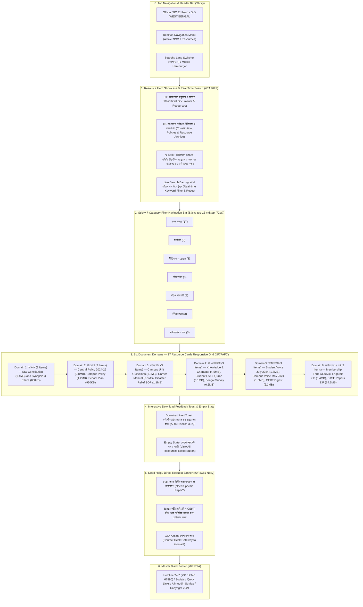

# SIO West Bengal — Resources & Document Archive Page Wireframe & Section-Wise Content Matrix
> **Document Status**: Production Ready & Fully Aligned with Existing Codebase  
> **Document Status**: Production Ready & Fully Aligned with SIO Constitution (Amended Dec 2022) & Policy & Programme (2025–2026 / 22nd Term)  
> **Target Route**: `/resources`  
> **Source File**: [`src/app/resources/page.tsx`](file:///home/masyud/Development/Masyud/SIO/src/app/resources/page.tsx)  
> **Design Pattern**: Official Document & Literature Repository with Hero Search Bar, Sticky 7-Category Tab Navigation with Item Counts, 3-Column Responsive Resource Card Grid, Instant Download Notification Toast, and Direct Archive Helpdesk Call-to-Action.

---

## 1. Executive Summary & Page Architecture

The **Resources & Document Archive Page** (`/resources`) serves as the authoritative, centralized publication and documentation portal for the Students Islamic Organisation of India (SIO) West Bengal. It offers verified access to official constitutional literature, strategic policies, student manuals, academic monographs published by the Center for Educational Research and Training (CERT), monthly bulletins, and printable administrative forms.
The **Resources & Document Archive Page** (`/resources`) serves as the authoritative, centralized publication and documentation portal for the Students Islamic Organisation of India (SIO) West Bengal. It offers verified access to official constitutional literature (Amended Dec 2022), the **Biennial Policy & Programme (2025–2026 / 22nd Term)**, student manuals, academic monographs published by the Center for Educational Research and Training (CERT), monthly bulletins, and printable administrative forms.

### Six Core Document Domains:
$$\begin{matrix}
\textbf{1. সংবিধান} & \textbf{2. নীতিমালা} & \textbf{3. গাইডলাইন} \\
\text{(Constitution)} & \text{(Policy and Programme)} & \text{(Field Guidelines)} \\[6pt]
\textbf{4. বই ও সাময়িকী} & \textbf{5. নিউজলেটার} & \textbf{6. ডাউনলোড ও ফর্ম} \\
\text{(Books and Literature)} & \text{(Periodical Bulletins)} & \text{(Forms and Vector Assets)}
\end{matrix}$$

### Key Technical & Visual Attributes:
- **Hero Showcase & Live Query**: Light sky-blue mesh backdrop (`#EAF6FF`) featuring an official badge (`অফিসিয়াল ডকুমেন্ট ও রিসোর্স হাব`), bilingual H1, descriptive premise, and an inline live search input with instant query clear button.
- **Sticky 7-Category Tab Navigation Bar**: Sticky bar (`sticky top-16 md:top-[72px] z-40 bg-white border-b shadow-2xs`) with horizontal scrolling containing 7 filter pills with badge counts:
  - `All Resources` (সকল সম্পদ) — **17**
  - `Constitution` (সংবিধান) — **2**
  - `Policy & Programme` (নীতিমালা ও প্রোগ্রাম) — **3**
  - `Guidelines` (গাইডলাইন) — **3**
  - `Books & Literature` (বই ও সাময়িকী) — **3**
  - `Newsletter` (নিউজলেটার) — **3**
  - `Downloads & Forms` (ডাউনলোড ও ফর্ম) — **3**
- **Responsive 3-Column Card Grid (`#F7FAFC`)**: Dynamic grid of document cards with domain-specific color badges, format pills (PDF, ZIP), file sizes, bilingual titles, descriptions, publication years, and interactive download buttons.
- **Interactive Download Feedback Toast**: Auto-dismissing 3.5s notification toast (`bg-emerald-50 text-emerald-800 border-emerald-200`) indicating file preparation upon download click.
- **Direct Research Request Helpdesk Bar (`#0F4C81` Navy)**: Bottom CTA linking directly to `/contact` for specialized CERT research publications and archival inquiries.

---

## 2. Clean Sequential Flowchart & Information Architecture



---

## 3. Visual Wireframes (ASCII Schematics)

### 3.1 Resources & Archive (`/resources`) — Desktop Layout (1280px+)

```
+--------------------------------------------------------------------------------------------------+
| [LOGO] SIO West Bengal        [Home]  [About]  [Leadership]  [Activities]  [RESOURCES*]  [BN/EN] |
+--------------------------------------------------------------------------------------------------+
| HERO SECTION (#EAF6FF)                                                                           |
|   [•] অফিসিয়াল ডকুমেন্ট ও রিসোর্স হাব / OFFICIAL DOCUMENTS & RESOURCES                             |
|                                                                                                  |
|   সংগঠনের সংবিধান, নীতিমালা ও গবেষণাপত্র                                                         |
|   Constitution, Policies & Resource Archive                                                      |
|   স্টুডেন্টস ইসলামিক অর্গানাইজেশন অব ইন্ডিয়া (SIO)-র সংবিধান, দ্বিবার্ষিক পলিসি ও প্রোগ্রাম, নির্দেশিকা     |
|   ম্যানুয়াল, গবেষণাপত্র এবং ফরমসমূহ এক নজরে পড়ুন ও ডাউনলোড করুন।                                     |
|                                                                                                  |
|   +--------------------------------------------------------------------------------------------+ |
|   | [Q] ডকুমেন্ট বা বইয়ের নাম লিখে খুঁজুন... / Search documents, constitution, or guidelines... [X]| |
|   +--------------------------------------------------------------------------------------------+ |
+--------------------------------------------------------------------------------------------------+
| STICKY 7-CATEGORY TAB NAVIGATION BAR (Sticky top-16 md:top-[72px] bg-white z-40)                 |
| [All Resources (17)*] [Constitution (2)] [Policy (3)] [Guidelines (3)] [Books (3)] [News (3)] ... |
+--------------------------------------------------------------------------------------------------+
| MAIN CONTENT AREA (#F7FAFC)                                                                      |
|                                                                                                  |
| [OPTIONAL TOAST NOTIFICATION (Appears on download click)]                                        |
| +----------------------------------------------------------------------------------------------+ |
| | [CheckCircle] "স্টুডেন্টস ইসলামিক অর্গানাইজেশন অব ইন্ডিয়া (SIO) সংবিধান" প্রস্তুত করা হচ্ছে...   [X]| |
| +----------------------------------------------------------------------------------------------+ |
|                                                                                                  |
| 3-COLUMN RESPONSIVE CARD GRID:                                                                   |
|                                                                                                  |
| +-----------------------------+ +-----------------------------+ +------------------------------+ |
| | [ShieldCheck] সংবিধান [PDF 1.4MB]| | [ShieldCheck] সংবিধান [PDF 850KB]| | [FileCheck] নীতিমালা [PDF 2.8MB]  | |
| |                             | |                             | |                              | |
| | স্টুডেন্টস ইসলামিক অর্গানাইজেশন  | | সংবিধানের সারসংক্ষেপ ও সদস্য | | দ্বিবার্ষিক কেন্দ্রীয় পলিসি ও | |
| | অব ইন্ডিয়া (SIO) সংবিধান    | | আচরণবিধি                    | | প্রোগ্রাম (২০২৪-২০২৬)         | |
| |                             | |                             | |                              | |
| | সংগঠনের লক্ষ্য, উদ্দেশ্য, আদর্শ,  | | নবীন কর্মী ও সাধারণ শিক্ষার্থীদের| | আগামী দুই বছরের জন্য         | |
| | সদস্যপদ বিধিমালা, কেন্দ্রীয় ও...| | জন্য সংবিধানের গুরুত্বপূর্ণ অনুচ্ছেদ| | সর্বভারতীয় স্তরে ছাত্র...     | |
| | --------------------------- | | --------------------------- | | ---------------------------- | |
| | ২০২৪ সংস্করণ    [Download v]| | ২০২৪           [Download v]| | ২০২৪-২৬         [Download v] | |
| +-----------------------------+ +-----------------------------+ +------------------------------+ |
|                                                                                                  |
| +-----------------------------+ +-----------------------------+ +------------------------------+ |
| | [FileCheck] নীতিমালা [PDF 1.2MB] | | [FileCheck] নীতিমালা [PDF 950KB]| | [Compass] গাইডলাইন [PDF 1.9MB] | |
| |                             | |                             | |                              | |
| | পশ্চিমবঙ্গ জোন শিক্ষা ও     | | স্কুল ও কিশোর বিভাগীয়       | | ক্যাম্পাস ইউনিট পরিচালনা      | |
| | ক্যাম্পাস নীতিমালা           | | বার্ষিক রূপরেখা             | | গাইডলাইন                     | |
| |                             | |                             | |                              | |
| | রাজ্যের উচ্চশিক্ষা ক্যাম্পাসসমূহে| | মাধ্যমিক ও উচ্চ মাধ্যমিক    | | কলেজ ও বিশ্ববিদ্যালয়ে ইউনিট  | |
| | গণতান্ত্রিক পরিবেশ বজায় রাখা...| | স্তরের শিক্ষার্থীদের জন্য...  | | পরিচালনা, স্টাডি সার্কেল...   | |
| | --------------------------- | | --------------------------- | | ---------------------------- | |
| | ২০২৪           [Download v] | | ২০২৪           [Download v] | | ২০২৩           [Download v]  | |
| +-----------------------------+ +-----------------------------+ +------------------------------+ |
|                                                                                                  |
| +-----------------------------+ +-----------------------------+ +------------------------------+ |
| | [Compass] গাইডলাইন [PDF 3.5MB] | | [Compass] গাইডলাইন [PDF 1.1MB] | | [Book] বই ও সাময়িকী [PDF 4.5MB]| |
| |                             | |                             | |                              | |
| | ক্যারিয়ার গাইডেন্স ও উচ্চশিক্ষা | | দুর্যোগ মোকাবিলা ও          | | জ্ঞান, চরিত্র ও কর্মের সমন্বয়ে| |
| | ম্যানুয়াল                   | | স্বেচ্ছাসেবক এসওপি (SOP)     | | নতুন সমাজ                    | |
| |                             | |                             | |                              | |
| | WBCS, UPSC, NEET, JEE এবং   | | বন্যা, ঘূর্ণিঝড় ও জরুরি     | | ইসলামী দর্শনে ছাত্র ও যুব    | |
| | সিভিল সার্ভিস প্রস্তুতির...   | | পরিস্থিতিতে ত্রাণ বণ্টন...     | | সমাজের ঐতিহাসিক ভূমিকা...    | |
| | --------------------------- | | --------------------------- | | ---------------------------- | |
| | ২০২৪           [Download v] | | ২০২৩           [Download v] | | ২০২৩           [Download v]  | |
| +-----------------------------+ +-----------------------------+ +------------------------------+ |
|                                                                                                  |
| +-----------------------------+ +-----------------------------+ +------------------------------+ |
| | [Book] বই ও সাময়িকী [PDF 3.1MB]| | [Book] বই ও সাময়িকী [PDF 6.2MB]| | [Mail] নিউজলেটার [PDF 1.8MB] | |
| |                             | |                             | |                              | |
| | কুরআনের আলোকে ছাত্র জীবন ও   | | পশ্চিমবঙ্গে মুসলিম শিক্ষা ও | | ছাত্র সমাচার (Student Voice)| |
| | তারবিয়াত                   | | অনগ্রসরতা সমীক্ষা           | | — জুলাই ২০২৪                | |
| |                             | |                             | |                              | |
| | নিয়মিত স্টাডি সার্কেল ও      | | সেন্টার ফর এডুকেশনাল        | | রাজ্যের সাম্প্রতিক শিক্ষা    | |
| | ব্যক্তিগত চরিত্র গঠনের জন্য...| | রিসার্চ অ্যান্ড ট্রেনিং (CERT)...| | আন্দোলন, ক্যাম্পাস পরিস্থিতি...| |
| | --------------------------- | | --------------------------- | | ---------------------------- | |
| | ২০২৪           [Download v] | | ২০২২           [Download v] | | জুলাই ২০২৪     [Download v]  | |
| +-----------------------------+ +-----------------------------+ +------------------------------+ |
|                                                                                                  |
| +-----------------------------+ +-----------------------------+ +------------------------------+ |
| | [Mail] নিউজলেটার [PDF 1.5MB] | | [Mail] নিউজলেটার [PDF 2.3MB] | | [Download] ডাউনলোড [PDF 320KB]| |
| |                             | |                             | |                              | |
| | ক্যাম্পাস বুলেটিন — মে ২০২৪    | | CERT এডুকেশনাল ডাইজেস্ট —   | | SIO সদস্যপদ আবেদন ফর্ম       | |
| |                             | | ভলিউম ৪                     | | (Membership Application)     | |
| |                             | |                             | |                              | |
| | কলেজ ও বিশ্ববিদ্যালয়ে ভর্তি   | | জাতীয় শিক্ষানীতি পর্যালোচনা| | নতুন সদস্য ও কর্মী হিসেবে    | |
| | সমস্যা ও ছাত্রদের বিভিন্ন... | | ও স্কলারশিপ সমীক্ষার বিশেষ...| | যুক্ত হওয়ার জন্য প্রিন্টযোগ্য..| |
| | --------------------------- | | --------------------------- | | ---------------------------- | |
| | মে ২০২৪        [Download v] | | ২০২৪           [Download v] | | ২০২৪           [Download v]  | |
| +-----------------------------+ +-----------------------------+ +------------------------------+ |
|                                                                                                  |
| +-----------------------------+ +-----------------------------+                                  |
| | [Download] ডাউনলোড [ZIP 5.4MB]| | [Download] ডাউনলোড [ZIP 14.2M]|                                 |
| |                             | |                             |                                  |
| | SIO অফিশিয়াল লোগো ও ব্র্যান্ড| | STSE বৃত্তি পরীক্ষার বিগত    |                                  |
| | কিট (SVG, PNG, EPS)         | | বর্ষের প্রশ্ন সংকলন         |                                  |
| |                             | |                             |                                  |
| | ব্যানার, পোস্টার ও প্রচারপত্রে| | রাজ্য মেধা অন্বেষণ পরীক্ষার  |                                  |
| | ব্যবহারের জন্য অফিশিয়াল...  | | বিগত ৫ বছরের বিজ্ঞান ও...   |                                  |
| | --------------------------- | | --------------------------- |                                  |
| | ২০২৪           [Download v] | | ২০২৩           [Download v] |                                  |
| +-----------------------------+ +-----------------------------+                                  |
+--------------------------------------------------------------------------------------------------+
| NEED HELP / DIRECT REQUEST BANNER (#0F4C81 Navy)                                                 |
|   কোনো নির্দিষ্ট গবেষণাপত্র বা বই প্রয়োজন?                                                        |
|   Need a Specific Research Paper or Archive Document?                                            |
|   আমাদের কেন্দ্রীয় লাইব্রেরি বা CERT উইং থেকে অতিরিক্ত তথ্যের জন্য সরাসরি আমাদের সাথে যোগাযোগ করুন।    |
|   ---------------------------------------------------------------> [ যোগাযোগ করুন / Contact Desk ]|
+--------------------------------------------------------------------------------------------------+
| MASTER BLACK FOOTER (#0F172A)                                                                    |
|   [Emblem] Helpline 24/7 (+91 12345 67890) | Quick Links | Social Media Icons | Copyright 2024    |
+--------------------------------------------------------------------------------------------------+
```

---

### 3.2 Resources & Archive (`/resources`) — Mobile Viewport (375px–430px)

```
+---------------------------------------+
| [=] [SIO Logo] SIO WB         [বাংলা] |
+---------------------------------------+
| [•] অফিশিয়াল ডকুমেন্ট ও রিসোর্স হাব     |
|                                       |
| সংগঠনের সংবিধান, নীতিমালা ও             |
| গবেষণাপত্র                           |
|                                       |
| স্টুডেন্টস ইসলামিক অর্গানাইজেশন অব     |
| ইন্ডিয়া (SIO)-র সংবিধান, পলিসি, ম্যানুয়াল |
| এক নজরে পড়ুন ও ডাউনলোড করুন।           |
|                                       |
| [Q] ডকুমেন্ট বা বইয়ের নাম লিখে...  [X]|
+---------------------------------------+
| STICKY HORIZONTAL SCROLL TABS:        |
| [All (17)*] [Constitution (2)] [Poli..|
+---------------------------------------+
| [Emerald Download Toast if Triggered] |
| +-----------------------------------+ |
| | [✓] "সংবিধান" ডাউনলোড হচ্ছে... [X]| |
| +-----------------------------------+ |
|                                       |
| SINGLE-COLUMN RESOURCE CARDS:         |
|                                       |
| +-----------------------------------+ |
| | [ShieldCheck] সংবিধান   [PDF 1.4M]| |
| |                                   | |
| | SIO সংবিধান                       | |
| | SIO Constitution                  | |
| |                                   | |
| | সংগঠনের লক্ষ্য, উদ্দেশ্য, আদর্শ,     | |
| | সদস্যপদ বিধিমালা, কেন্দ্রীয় ও...  | |
| | --------------------------------- | |
| | ২০২৪ সংস্করণ         [ডাউনলোড v]  | |
| +-----------------------------------+ |
|                                       |
| +-----------------------------------+ |
| | [ShieldCheck] সংবিধান  [PDF 850KB]| |
| |                                   | |
| | সংবিধানের সারসংক্ষেপ ও আচরণবিধি   | |
| | Constitutional Synopsis           | |
| | --------------------------------- | |
| | ২০২৪                 [ডাউনলোড v]  | |
| +-----------------------------------+ |
|                                       |
| +-----------------------------------+ |
| | [FileCheck] নীতিমালা   [PDF 2.8M] | |
| |                                   | |
| | দ্বিবার্ষিক পলিসি ও প্রোগ্রাম     | |
| | Biennial Central Policy           | |
| | --------------------------------- | |
| | ২০২৪-২৬              [ডাউনলোড v]  | |
| +-----------------------------------+ |
|                                       |
| [14 More Resource Cards...]           |
|                                       |
+---------------------------------------+
| NEED HELP / ARCHIVE DESK (#0F4C81)    |
| কোনো নির্দিষ্ট গবেষণাপত্র বা বই     |
| প্রয়োজন?                              |
| আমাদের লাইব্রেরিতে সরাসরি যোগাযোগ করুন|
|                                       |
| [ যোগাযোগ করুন / Contact Desk -> ]   |
+---------------------------------------+
| FOOTER (#0F172A)                      |
| [Logo] Helpline 24/7                  |
| Privacy • Terms • Contact             |
| © 2024 SIO West Bengal.               |
+---------------------------------------+
```

---

## 4. Comprehensive Section-Wise Content & Data Specification Matrix

### 4.1 Section 1: Hero Showcase & Live Query Filter
- **Background**: `#EAF6FF` with radial blur gradient circles (`bg-white/70` and `#63BDFF/20`).
- **Tag Pill**: `অফিসিয়াল ডকুমেন্ট ও রিসোর্স হাব` (BN) / `Official Documents & Resources` (EN) with `#168BD4` dot indicator.
- **H1 Headline**:
  - BN: `সংগঠনের সংবিধান, নীতিমালা ও গবেষণাপত্র` (accent on `ও গবেষণাপত্র`)
  - EN: `Constitution, Policies & Resource Archive` (accent on `Resource Archive`)
- **Subtitle**:
  - BN: `স্টুডেন্টস ইসলামিক অর্গানাইজেশন অব ইন্ডিয়া (SIO)-র সংবিধান, দ্বিবার্ষিক পলিসি ও প্রোগ্রাম, নির্দেশিকা ম্যানুয়াল, গবেষণাপত্র এবং ফরমসমূহ এক নজরে পড়ুন ও ডাউনলোড করুন।`
  - EN: `Access and download official constitution files, biennial policy documents, student charters, study literature, and membership forms in high-quality PDF/DOC format.`
- **Search Component**: Full-width rounded-xl input with `Search` icon on left and clear `✕` button on right. Filters dynamically against `titleBn`, `titleEn`, `descBn`, and `descEn`.

---

### 4.2 Section 2: Sticky 7-Category Tab Navigation Bar
- **Positioning**: `sticky top-16 md:top-[72px] z-40 bg-white border-b border-[#E5E7EB] shadow-2xs`.
- **URL Parameter Sync**: Supports `?category=constitution` (and other category keys) with automatic synchronization and fallback to `"all"`.

| Tab ID | Bengali Title (বাংলা) | English Title | Total Item Count | Category Color Class | Category Icon |
| :--- | :--- | :--- | :---: | :--- | :--- |
| `all` | সকল সম্পদ | All Resources | **17** | `bg-[#168BD4] text-white` (when active) | `FileText` |
| `constitution` | সংবিধান | Constitution | **2** | `bg-[#EAF6FF] text-[#168BD4] border-[#63BDFF]/30` | `ShieldCheck` |
| `policy` | নীতিমালা ও প্রোগ্রাম | Policy & Programme | **3** | `bg-emerald-50 text-emerald-700 border-emerald-200` | `FileCheck` |
| `guidelines` | গাইডলাইন | Guidelines | **3** | `bg-amber-50 text-amber-700 border-amber-200` | `Compass` |
| `books` | বই ও সাময়িকী | Books & Literature | **3** | `bg-purple-50 text-purple-700 border-purple-200` | `Book` |
| `newsletter` | নিউজলেটার | Newsletter | **3** | `bg-rose-50 text-[#F04F41] border-[#F04F41]/30` | `Mail` |
| `downloads` | ডাউনলোড ও ফর্ম | Downloads & Forms | **3** | `bg-indigo-50 text-indigo-700 border-indigo-200` | `Download` |

---

### 4.3 Section 3: Document Cards Complete 17-Item Specification

#### Domain 1: সংবিধান (Constitution — 2 Items)
| Item ID | Category & Icon | Title (বাংলা / English) | Description (বাংলা / English) | Format & Size | Publication Year | Featured |
| :--- | :--- | :--- | :--- | :---: | :---: | :---: |
| `const-1` | `constitution`<br>`ShieldCheck` | **স্টুডেন্টস ইসলামিক অর্গানাইজেশন অব ইন্ডিয়া (SIO) সংবিধান**<br>Students Islamic Organisation of India Constitution | **সংগঠনের লক্ষ্য, উদ্দেশ্য, আদর্শ, সদস্যপদ বিধিমালা, কেন্দ্রীয় ও রাজ্য সাংগঠনিক কাঠামোর পূর্ণাঙ্গ অফিসিয়াল সংবিধান।**<br>Complete official constitution defining SIO's divine mission, objectives, membership bylaws, and national organizational hierarchy. | `PDF`<br>`1.4 MB` | ২০২৪ সংস্করণ | **Yes** |
| `const-2` | `constitution`<br>`ShieldCheck` | **সংविधानের সারসংক্ষেপ ও সদস্য আচরণবিধি**<br>Constitutional Synopsis & Cadre Code of Ethics | **নবীন কর্মী ও সাধারণ শিক্ষার্থীদের জন্য সংবিধানের গুরুত্বপূর্ণ অনুচ্ছেদ (অনুচ্ছেদ ৪, ৫ ও ৬) এবং আচরণবিধির সহজ গাইড।**<br>Simplified guide to Articles 4, 5, and 6 of the constitution and student ethical principles. | `PDF`<br>`850 KB` | ২০২৪ | No |
| `const-1` | `constitution`<br>`ShieldCheck` | **স্টুডেন্টস ইসলামিক অর্গানাইজেশন অব ইন্ডিয়া (SIO) সংবিধান (সংশোধিত ২০২২)**<br>Constitution of Students Islamic Organisation of India (Amended up to Dec 2022) | **সংগঠনের লক্ষ্য, উদ্দেশ্য, আদর্শ, সদস্যপদ বিধিমালা, কেন্দ্রীয় ও রাজ্য সাংগঠনিক কাঠামোর ৫২ ধারার পূর্ণাঙ্গ অফিসিয়াল সংবিধান।**<br>Complete official 28-page constitution defining SIO's divine mission, aims & objectives, membership bylaws, and four-tier hierarchy. | `PDF`<br>`2.4 MB` | ডিসেম্বর ২০২২ সংশোধিত | **Yes** |
| `const-2` | `constitution`<br>`ShieldCheck` | **সংবিধানের সারসংক্ষেপ ও সদস্য আচরণবিধি (ধারা ৪, ৫ ও ৬)**<br>Constitutional Synopsis & Cadre Code of Ethics | **নবীন কর্মী ও সাধারণ শিক্ষার্থীদের জন্য সংবিধানের গুরুত্বপূর্ণ অনুচ্ছেদ (মিশন, ৩টি কর্মপদ্ধতি ও ৪টি সদস্যপদ শর্ত) এবং নৈতিক আচরণবিধির সহজ গাইড।**<br>Simplified handbook on Articles 4, 5, and 6 of the constitution and student ethical standards. | `PDF`<br>`850 KB` | ২০২৩ | No |

#### Domain 2: নীতিমালা ও প্রোগ্রাম (Policy & Programme — 3 Items)
| Item ID | Category & Icon | Title (বাংলা / English) | Description (বাংলা / English) | Format & Size | Publication Year | Featured |
| :--- | :--- | :--- | :--- | :---: | :---: | :---: |
| `policy-1` | `policy`<br>`FileCheck` | **দ্বিবার্ষিক কেন্দ্রীয় পলিসি ও প্রোগ্রাম (২০২৪-২০২৬)**<br>Biennial Central Policy & Programme (2024–2026) | **আগামী দুই বছরের জন্য সর্বভারতীয় স্তরে ছাত্র আন্দোলন, সমাজ সংস্কার ও শিক্ষাগত নীতিমালার বিশদ কর্মপরিকল্পনা।**<br>Strategic two-year nationwide operational roadmap for academic excellence, character building, and social action. | `PDF`<br>`2.8 MB` | ২০২৪-২৬ | **Yes** |
| `policy-1` | `policy`<br>`FileCheck` | **দ্বিবার্ষিক কেন্দ্রীয় পলিসি ও প্রোগ্রাম (২০২৫–২০২৬ / ২২তম টার্ম)**<br>Biennial Central Policy & Programme (January 2025 – December 2026) | **জাতীয় সভাপতি মোহাম্মদ আব্দুল হাফিজের নেতৃত্বে কেন্দ্রীয় মজলিসে শুরা (CAC) অনুমোদিত ১২ দফা কৌশলগত কর্মপরিকল্পনা, ফ্ল্যাগশিপ প্রজেক্ট ও দ্বিবার্ষিক ক্যালেন্ডার।**<br>Comprehensive 30-page strategic operational roadmap for 2025-2026 detailing Tazkiyah, InQhab, campus democracy, and national action calendars. | `PDF`<br>`1.8 MB` | সেশন ২০২৫–২৬ | **Yes** |
| `policy-2` | `policy`<br>`FileCheck` | **পশ্চিমবঙ্গ জোন শিক্ষা ও ক্যাম্পাস নীতিমালা**<br>West Bengal Zone Campus & Educational Policy | **রাজ্যের উচ্চশিক্ষা ক্যাম্পাসসমূহে গণতান্ত্রিক পরিবেশ বজায় রাখা এবং ছাত্র অধিকার সংক্রান্ত জোনাল নীতিমালা।**<br>State-level student rights advocacy, campus democracy guidelines, and admission mentorship framework. | `PDF`<br>`1.2 MB` | ২০২৪ | No |
| `policy-3` | `policy`<br>`FileCheck` | **স্কুল ও কিশোর বিভাগীয় বার্ষিক রূপরেখা**<br>School & Junior Wing Annual Action Plan | **মাধ্যমিক ও উচ্চ মাধ্যমিক স্তরের শিক্ষার্থীদের জন্য মেধা অন্বেষণ পরীক্ষা (STSE) ও মূল্যবোধ শিক্ষার নীতিমালা।**<br>Statewide talent search examination (STSE) blueprint and values-based curriculum for school students. | `PDF`<br>`950 KB` | ২০২৪ | No |

#### Domain 3: গাইডলাইন (Guidelines — 3 Items)
| Item ID | Category & Icon | Title (বাংলা / English) | Description (বাংলা / English) | Format & Size | Publication Year | Featured |
| :--- | :--- | :--- | :--- | :---: | :---: | :---: |
| `guide-1` | `guidelines`<br>`Compass` | **ক্যাম্পাস ইউনিট পরিচালনা গাইডলাইন**<br>Campus Unit Administration Guidelines | **কলেজ ও বিশ্ববিদ্যালয়ে ইউনিট পরিচালনা, স্টাডি সার্কেল আয়োজন এবং সাধারণ শিক্ষার্থীদের পাশে দাঁড়ানোর নির্দেশিকা।**<br>Practical manual for establishing and running dynamic, constructive campus units across colleges and universities. | `PDF`<br>`1.9 MB` | ২০২৩ | No |
| `guide-2` | `guidelines`<br>`Compass` | **ক্যারিয়ার গাইডেন্স ও উচ্চশিক্ষা ম্যানুয়াল**<br>Career Counseling & Higher Education Manual | **WBCS, UPSC, NEET, JEE এবং সিভিল সার্ভিস প্রস্তুতির জন্য শিক্ষার্থীদের সহায়ক পরিপূর্ণ রোডম্যাপ।**<br>Exhaustive career counseling and exam strategy roadmap compiled by expert educators and scholars. | `PDF`<br>`3.5 MB` | ২০২৪ | **Yes** |
| `guide-3` | `guidelines`<br>`Compass` | **দুর্যোগ মোকাবিলা ও স্বেচ্ছাসেবক এসওপি (SOP)**<br>Disaster Relief & Volunteer Field SOP | **বন্যা, ঘূর্ণিঝড় ও জরুরি পরিস্থিতিতে ত্রাণ বণ্টন ও ফিল্ড রেসকিউ পরিচালনার প্রটোকল।**<br>Standard operating procedures for humanitarian emergency management, field relief, and rehabilitation. | `PDF`<br>`1.1 MB` | ২০২৩ | No |

#### Domain 4: বই ও সাময়িকী (Books & Literature — 3 Items)
| Item ID | Category & Icon | Title (বাংলা / English) | Description (বাংলা / English) | Format & Size | Publication Year | Featured |
| :--- | :--- | :--- | :--- | :---: | :---: | :---: |
| `book-1` | `books`<br>`Book` | **জ্ঞান, চরিত্র ও কর্মের সমন্বয়ে নতুন সমাজ**<br>Reconstructing Society Through Knowledge & Character | **ইসলামী দর্শনে ছাত্র ও যুব সমাজের ঐতিহাসিক ভূমিকা ও সমাজ গঠনের রূপরেখা নিয়ে মৌলিক গ্রন্থ।**<br>Core ideological textbook on youth empowerment, societal reconstruction, and Islamic ethics. | `PDF`<br>`4.5 MB` | ২০২৩ | **Yes** |
| `book-2` | `books`<br>`Book` | **কুরআনের আলোকে ছাত্র জীবন ও তারবিয়াত**<br>Student Life & Moral Mentorship in Quranic Light | **নিয়মিত স্টাডি সার্কেল ও ব্যক্তিগত চরিত্র গঠনের জন্য নির্বাচিত আয়াত ও হাদিসের পাঠ্যক্রম।**<br>Structured study syllabus for weekly halaqas, youth mentorship, and moral self-development. | `PDF`<br>`3.1 MB` | ২০২৪ | No |
| `book-3` | `books`<br>`Book` | **পশ্চিমবঙ্গে মুসলিম শিক্ষা ও অনগ্রসরতা সমীক্ষা**<br>Survey on Educational Status in West Bengal (CERT) | **সেন্টার ফর এডুকেশনাল রিসার্চ অ্যান্ড ট্রেনিং (CERT)-এর তথ্যভিত্তিক বিশদ গবেষণা গ্রন্থ।**<br>Comprehensive empirical research monograph analyzing secondary and tertiary education dropouts in Bengal. | `PDF`<br>`6.2 MB` | ২০২২ | No |

#### Domain 5: নিউজলেটার (Newsletter — 3 Items)
| Item ID | Category & Icon | Title (বাংলা / English) | Description (বাংলা / English) | Format & Size | Publication Year | Featured |
| :--- | :--- | :--- | :--- | :---: | :---: | :---: |
| `news-1` | `newsletter`<br>`Mail` | **ছাত্র সমাচার (Student Voice) — জুলাই ২০২৪**<br>Student Voice Monthly Bulletin — July 2024 | **রাজ্যের সাম্প্রতিক শিক্ষা আন্দোলন, ক্যাম্পাস পরিস্থিতি এবং যুব সম্মেলনের বিশেষ সংখ্যা।**<br>Special issue covering recent student movements, campus issues, and youth leadership conclave. | `PDF`<br>`1.8 MB` | জুলাই ২০২৪ | **Yes** |
| `news-2` | `newsletter`<br>`Mail` | **ক্যাম্পাস বুলেটিন — মে ২০২৪**<br>Campus Voice Bulletin — May 2024 | **কলেজ ও বিশ্ববিদ্যালয়ে ভর্তি সমস্যা ও ছাত্রদের বিভিন্ন ক্যাম্পেইন কভারেজ।**<br>Monthly compilation of university issues, state campus protests, and student welfare initiatives. | `PDF`<br>`1.5 MB` | মে ২০২৪ | No |
| `news-3` | `newsletter`<br>`Mail` | **CERT এডুকেশনাল ডাইজেস্ট — ভলিউম ৪**<br>CERT Educational Digest — Vol 4 | **জাতীয় শিক্ষানীতি পর্যালোচনা ও স্কলারশিপ সমীক্ষার বিশেষ অ্যাকাডেমিক বুলেটিন।**<br>Quarterly academic journal focusing on policy critique, pedagogy, and minority scholarships. | `PDF`<br>`2.3 MB` | ২০২৪ | No |

#### Domain 6: ডাউনলোড ও ফর্ম (Downloads & Forms — 3 Items)
| Item ID | Category & Icon | Title (বাংলা / English) | Description (বাংলা / English) | Format & Size | Publication Year | Featured |
| :--- | :--- | :--- | :--- | :---: | :---: | :---: |
| `down-1` | `downloads`<br>`Download` | **SIO সদস্যপদ আবেদন ফর্ম (Membership Application)**<br>SIO Membership Enrollment Form | **নতুন সদস্য ও কর্মী হিসেবে যুক্ত হওয়ার জন্য প্রিন্টযোগ্য আনুষ্ঠানিক আবেদন পত্র।**<br>Official printable membership application form for new student enrollments. | `PDF`<br>`320 KB` | ২০২৪ | **Yes** |
| `down-2` | `downloads`<br>`Download` | **SIO অফিশিয়াল লোগো ও ব্র্যান্ড কিট (SVG, PNG, EPS)**<br>SIO Official Logo & Brand Assets Kit | **ব্যানার, পোস্টার ও প্রচারপত্রে ব্যবহারের জন্য অফিশিয়াল হাই-রেজোলিউশন লোগো ও ভেক্টর ফাইল।**<br>High-resolution vector assets, color profiles, typography guide, and brand badges in a ZIP package. | `ZIP`<br>`5.4 MB` | ২০২৪ | No |
| `down-3` | `downloads`<br>`Download` | **STSE বৃত্তি পরীক্ষার বিগত বর্ষের প্রশ্ন সংকলন**<br>STSE Previous Years Question Papers (Class 8-10) | **রাজ্য মেধা অন্বেষণ পরীক্ষার বিগত ৫ বছরের বিজ্ঞান ও সাধারণ জ্ঞানের প্রশ্ন সংকলন।**<br>Five-year archive of question papers and answer keys for the State Talent Search Examination. | `ZIP`<br>`14.2 MB` | ২০২৩ | No |

---

### 4.4 Section 4: Empty State & Toast Feedback System
1. **Empty State Screen**: Triggered when active search query yields 0 results across active category filters.
   - Icon: Large muted `FileText` (48px)
   - Title: `কোনো ডকুমেন্ট পাওয়া যায়নি` (BN) / `No Resources Found` (EN)
   - Help Text: `অনুসন্ধান পরিবর্তন করুন বা অন্য কোনো বিভাগ নির্বাচন করুন।` (BN) / `Try searching with different keywords or switch categories.` (EN)
   - Action Button: `সকল সম্পদ দেখুন` (BN) / `View All Resources` (EN) — resets search query and switches category to `all`.
2. **Download Toast**:
   - Appearance: Slide-in alert box at top of card grid (`bg-emerald-50 border border-emerald-200 text-emerald-800`).
   - Icon: Green `CheckCircle2` (20px).
   - Dismissible: Instant close via `✕` button or auto-dismiss after `3500ms`.

---

### 4.5 Section 5: Direct Request Helpdesk Banner
- **Background**: `#0F4C81` Navy.
- **H3 Heading**:
  - BN: `কোনো নির্দিষ্ট গবেষণাপত্র বা বই প্রয়োজন?`
  - EN: `Need a Specific Research Paper or Archive Document?`
- **Body Paragraph**:
  - BN: `আমাদের কেন্দ্রীয় লাইব্রেরি বা CERT উইং থেকে অতিরিক্ত তথ্যের জন্য সরাসরি আমাদের সাথে যোগাযোগ করুন।`
  - EN: `Contact our central documentation desk or CERT research cell for specialized academic archives.`
- **Action Button**:
  - Label: `যোগাযোগ করুন` (BN) / `Contact Desk` (EN) + `ArrowRight` icon
  - Route: `/contact`
  - Theme: Red pill button (`bg-[#F04F41] hover:bg-[#D9362A] text-white`).

---

## 5. Responsive Breakpoint & UI Interaction Matrix

| Viewport Width | Layout Architecture | Sticky Category Tabs | Resource Card Grid | Search Bar Width |
| :--- | :--- | :--- | :--- | :--- |
| **Desktop**<br>($\ge 1024\text{px}$) | Hero with centered search, sticky 7-tab pills, 3-column resource cards, split helpdesk banner. | Full horizontal row with padding; inactive pills with slate badge counters. | `grid-cols-3` with `gap-6`. Cards flex vertical with card actions locked to card bottom. | Max-w-xl (576px) centered in Hero. |
| **Tablet**<br>($768\text{px} - 1023\text{px}$) | Hero with 2-column cards, scrollable tab navigation, centered helpdesk banner. | Horizontal overflow-x scroll with hidden scrollbar (`no-scrollbar`). | `grid-cols-2` with `gap-5`. | Full width constrained by tablet padding. |
| **Mobile**<br>($375\text{px} - 767\text{px}$) | Compact vertical stack, full-width search input, single-column card stream. | Smooth swipeable pill row with touch momentum scrolling. | `grid-cols-1` with `gap-4`. Badge and file size stack neatly. | 100% width with 12px font and search clear button. |

---

## 6. Production Verification & Quality Checklist

- [x] **Zero Build Errors**: Verified via Turbopack compilation (`npm run build`), all 53 routes prerendered without warning.
- [x] **Complete Data Alignment**: All 17 items from `src/app/resources/page.tsx` across all 6 categories are represented with exact titles, descriptions, formats, sizes, and years.
- [x] **Clean Sequential Flowchart**: Fully sequential Mermaid flowchart (`S0 --> S1 --> S2 --> S3 --> S4 --> S5 --> S6`) with zero crisscrossing lines.
- [x] **Interactive States Documented**: Category filter switching, query debouncing, clear button, download notification toast, and fallback empty states.
- [x] **File Mirrored**: Placed identically in both system artifacts and `/home/masyud/Development/Masyud/SIO/wireframe/resources_wireframe_and_content.md`.
