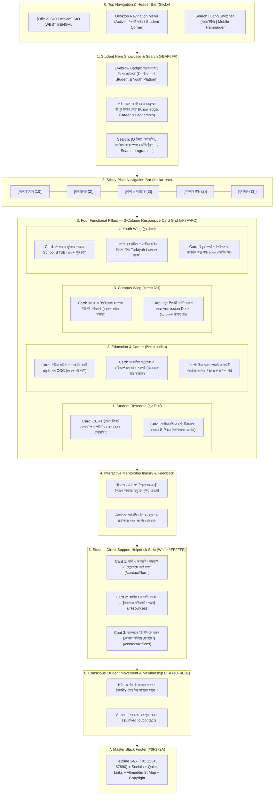

# SIO West Bengal — Student Corner Page Wireframe & Section-Wise Content Matrix
> **Document Status**: Production Ready & Fully Aligned with Existing Codebase  
> **Target Route**: `/student-corner`  
> **Source File**: [`src/app/student-corner/page.tsx`](file:///home/masyud/Development/Masyud/SIO/src/app/student-corner/page.tsx)  
> **Design Pattern**: Student Empowerment & Academic Resource Portal featuring 4 Functional Pillars, Real-Time Search, Sticky Pill Navigator, 3-Column Initiative Cards, 3-Tier Direct Helpdesk Support Strip, and Conscious Student Membership CTA.

---

## 1. Executive Summary & Page Architecture

The **Student Corner Page** (`/student-corner`) is the primary student services, intellectual empowerment, and campus guidance destination for students across West Bengal's schools, colleges, and universities.

### Four Core Student Pillars:
$$\text{Student Research (ছাত্র রিসার্চ)} \longleftrightarrow \text{Education and Career (শিক্ষা ও ক্যারিয়ার)} \longleftrightarrow \text{Campus Wing (ক্যাম্পাস উইং)} \longleftrightarrow \text{Youth Wing (যুব বিভাগ)}$$

### Key Technical & Visual Attributes:
- **Hero Showcase**: Sky blue backdrop (`#EAF6FF`) featuring an eyebrow pill, dual-script title, and multi-keyword real-time search engine.
- **Sticky Pillar Navigator Bar**: Sticky toolbar (`sticky top-16 md:top-[72px] z-40 bg-white border-b border-[#E5E7EB]`) offering 5 filter pills with live counters (`All [10]`, `Research [2]`, `Career [3]`, `Campus [2]`, `Youth [3]`).
- **3-Column Program Cards Grid**: Responsive grid (`grid-cols-1 md:grid-cols-2 lg:grid-cols-3`) with specialized tags, impact metrics badges (e.g. `২৫+ ফেলোশিপ`, `১০,০০০+ ছাত্র সহায়তা`, `৫০০+ সক্রিয় ইউনিট`), 3-point bulleted benefit checklists, and dynamic modal inquiry triggers.
- **Interactive Feedback Toast**: Real-time acknowledgment alert confirming student inquiry and dispatching requests to specialized mentorship desks.
- **Direct Support Helpdesk Strip**: 3-card white container addressing urgent needs: Admission & Scholarship verification, Civil Service career circles, and new Campus Unit establishment.
- **Conscious Student Membership CTA**: Deep blue banner (`#0F4C81`) routing to `/contact` for official membership enrollment.

---

## 2. Clean Sequential Flowchart & Information Architecture



---

## 3. Visual Wireframes (ASCII Schematics)

### 3.1 Student Corner Index (`/student-corner`) — Desktop Layout (1280px+)

```
+--------------------------------------------------------------------------------------------------+
| [LOGO] SIO West Bengal        [Home]  [About]  [Leadership]  [Activities]  [STUDENT CORNER*] [EN]|
+--------------------------------------------------------------------------------------------------+
| HERO SHOWCASE & SEARCH BAR (#EAF6FF)                                                             |
|                                                                                                  |
|   (•) DEDICATED STUDENT & YOUTH PLATFORM / ছাত্রদের জন্য বিশেষ প্ল্যাটফর্ম                          |
|   CENTER FOR KNOWLEDGE, CAREER & STUDENT LEADERSHIP                                              |
|   জ্ঞান, ক্যারিয়ার ও নেতৃত্বের পরিপূর্ণ বিকাশ কেন্দ্র                                               |
|   Empowering college, university, and school students across Bengal through academic research,   |
|   competitive exam mentorship, campus democracy, and moral character development.                |
|                                                                                                  |
|   +-------------------------------------------------------------------------+                    |
|   | [Q] Search research, scholarships, career mentorship, or campus units...|                    |
|   +-------------------------------------------------------------------------+                    |
+--------------------------------------------------------------------------------------------------+
| STICKY PILLAR NAVIGATION BAR (Sticky top-16 md:top-[72px])                                       |
| [All (10)]  [Student Research (2)]  [Career (3)]  [Campus Wing (2)]  [Youth Wing (3)]            |
+--------------------------------------------------------------------------------------------------+
| MAIN INITIATIVES GRID (3-Column / #F7FAFC)                                                       |
|                                                                                                  |
|   +-------------------------+  +-------------------------+  +-------------------------+          |
|   | [গবেষণা ও উন্নয়ন] [২৫+ ফেলো] |  | [বুদ্ধিবৃত্তিক] [১২ চ্যাপ্টার] |  | [ক্যারিয়ার]   [৫০০+ মেন্টর]  |          |
|   | CERT Student Research   |  | Scholars' Intellectual  |  | Civil Services CGC Cell |          |
|   | Fellowship & Policy     |  | Platform (SIP)          |  | WBCS / UPSC Prep Cell   |          |
|   | CERT স্টুডেন্ট রিসার্চ   |  | সোসিওলজি ও দর্শন ফোরাম  |  | সিভিল সার্ভিস প্রস্তুতি|          |
|   |                         |  |                         |  |                         |          |
|   | Description: Empirical  |  | Description: Advanced   |  | Description: Long-term  |          |
|   | educational research,   |  | intellectual discourse  |  | coaching, mock tests,   |          |
|   | surveys & conferences.  |  | on modern philosophy.   |  | answer-writing guides.  |          |
|   |                         |  |                         |  |                         |          |
|   | Key Benefits:           |  | Key Benefits:           |  | Key Benefits:           |          |
|   |  [v] Annual conclaves   |  |  [v] Monthly colloquiums|  |  [v] Direct officer ment|          |
|   |  [v] Dropout data study |  |  [v] Journal publishing |  |  [v] Model test series  |          |
|   |  [v] Professor mentors  |  |  [v] Policy analysis    |  |  [v] Financial waivers  |          |
|   |                         |  |                         |  |                         |          |
|   | [View Guidelines ----->]|  | [Join Discussion Circle]|  | [Apply for Mentorship ->|          |
|   +-------------------------+  +-------------------------+  +-------------------------+          |
|                                                                                                  |
|   +-------------------------+  +-------------------------+  +-------------------------+          |
|   | [অর্থনৈতিক]  [১০,০০০+ ছাত্র] |  | [স্কিলস ও টেক] [৮০০+ ট্রেইনি] |  | [ক্যাম্পাস]    [৫০০+ ইউনিট]  |          |
|   | Scholarship & Financial |  | Skill Development & IT  |  | College & University    |          |
|   | Aid Helpdesk            |  | Career Academy          |  | Campus Unit Network     |          |
|   | স্কলারশিপ হেল্পডেস্ক    |  | আইটি ক্যারিয়ার একাডেমি  |  | ক্যাম্পাস ইউনিট নেটওয়ার্ক|          |
|   |                         |  |                         |  |                         |          |
|   | [Contact Helpdesk ----->|  | [Register Bootcamp --->]|  | [Find Campus Unit ----->|          |
|   +-------------------------+  +-------------------------+  +-------------------------+          |
|                                                                                                  |
|   +-------------------------+  +-------------------------+  +-------------------------+          |
|   | [ভর্তি সহায়তা] [২৫,০০০+ ছাত্র]|  | [মেধা ও মূল্যবোধ][১৫০ ক্লাব]|  | [নৈতিক চরিত্র] [২,৫০০+ সার্কেল|       |
|   | College Admission Desk  |  | Junior & High School    |  | Youth Character Building|          |
|   | নবীন ভর্তি সহায়তা সেল   |  | Wing (STSE Exam)        |  | & Tarbiyah Retreats     |          |
|   |                         |  | কিশোর ও জুনিয়র ফোরাম    |  | চরিত্র উন্নয়ন শিবির     |          |
|   |                         |  |                         |  |                         |          |
|   | [View Helpline -------->|  | [Register for STSE --->]|  | [Join Study Circle ---->|          |
|   +-------------------------+  +-------------------------+  +-------------------------+          |
+--------------------------------------------------------------------------------------------------+
| STUDENT DIRECT SUPPORT HELPDESK STRIP (White #FFFFFF)                                            |
|                                                                                                  |
|   +-------------------------+  +-------------------------+  +-------------------------+          |
|   | [?] HelpCircle Icon     |  | [Compass] Compass Icon  |  | [Award] Award Trophy    |          |
|   | Admission / Scholarship |  | Career & Academic       |  | Start a Campus Unit     |          |
|   | Issues Helpdesk         |  | Study Circles           |  | আপনার ক্যাম্পাসে ইউনিট  |          |
|   | ভর্তি ও স্কলারশিপ সমস্যা?|  | ক্যারিয়ার ও স্টাডি গ্রুপ |  |                         |          |
|   |                         |  |                         |  |                         |          |
|   | Contact helpline for    |  | Join WBCS prep groups   |  | Connect with zonal HQ to|          |
|   | document verification.  |  | and research circles.   |  | launch a campus chapter.|          |
|   |                         |  |                         |  |                         |          |
|   | [Contact Helpline ----->]  | [Read Guidelines ------>]  | [Contact Zonal Office ->]          |
|   +-------------------------+  +-------------------------+  +-------------------------+          |
+--------------------------------------------------------------------------------------------------+
| CONSCIOUS STUDENT MOVEMENT & MEMBERSHIP BANNER (#0F4C81 Navy)                                    |
|   Are You a Conscious Student? Join the SIO Movement.                                            |
|   আপনি কি একজন সচেতন শিক্ষার্থী? যোগ দিন আমাদের সাথে।                                              |
|   Develop your character in the light of divine guidance and reform society.                     |
|                                                                                                  |
|   [ Membership Form / সদস্যপদ ফর্ম → ]                                                            |
+--------------------------------------------------------------------------------------------------+
| MASTER BLACK FOOTER (#0F172A)                                                                    |
|   24/7 Helpline | Student Portals | Career Guidelines | Central Office | Google Maps HQ Location |
+--------------------------------------------------------------------------------------------------+
```

---

### 3.2 Mobile Visual Layout (375px–430px Responsive View)

```
+-----------------------------------+
| [=] SIO WB Logo          [BN/EN]  |
+-----------------------------------+
| STUDENT CORNER HERO               |
| (•) STUDENT & YOUTH PLATFORM      |
| জ্ঞান, ক্যারিয়ার ও নেতৃত্ব বিকাশ  |
|                                   |
| [Q Search programs, scholarships] |
+-----------------------------------+
| HORIZONTAL PILLAR NAV             |
| [All(10)] [Research(2)] [Career(3)]|
+-----------------------------------+
| 1-COLUMN INITIATIVE CARDS         |
|                                   |
| +-------------------------------+ |
| | [গবেষণা ও উন্নয়ন]  [২৫+ ফেলোশিপ]| |
| | CERT Research Fellowship      | |
| | CERT স্টুডেন্ট রিসার্চ         | |
| |                               | |
| | Empirical surveys, research   | |
| | paper awards and conclaves.   | |
| |                               | |
| | Key Benefits:                 | |
| |  [v] Conclaves & papers       | |
| |  [v] Dropout data surveys     | |
| |  [v] Professor mentorship     | |
| |                               | |
| | [View Fellowship Guidelines ->| |
| +-------------------------------+ |
|                                   |
| +-------------------------------+ |
| | [ক্যারিয়ার]   [৫০০+ পরীক্ষার্থী]| |
| | Civil Services Prep Cell CGC  | |
| | সিভিল সার্ভিস প্রস্তুতি সেল   | |
| |                               | |
| | WBCS, UPSC mock tests, answer | |
| | writing and daily routines.   | |
| |                               | |
| | [Apply for Mentorship ------>]| |
| +-------------------------------+ |
|                                   |
| +-------------------------------+ |
| | [ক্যাম্পাস]      [৫০০+ ইউনিট]  | |
| | Campus Unit Network           | |
| | ক্যাম্পাস ইউনিট নেটওয়ার্ক     | |
| |                               | |
| | Active across 500+ colleges   | |
| | defending student democracy.  | |
| |                               | |
| | [Find Your Campus Unit ----->]| |
| +-------------------------------+ |
+-----------------------------------+
| DIRECT SUPPORT HELPDESK           |
| [Admission / Scholarship Helpdesk]|
| [Career & Academic Circles]       |
| [Start a Campus Unit]             |
+-----------------------------------+
| MEMBERSHIP CTA BANNER             |
| [Membership Form / সদস্যপদ ফর্ম]  |
+-----------------------------------+
| MASTER FOOTER                     |
+-----------------------------------+
```

---

## 4. Section-by-Section Name-Wise Content Matrix

### Section 0: Sticky Navigation Header
- **Component File**: [`src/components/layout/header.tsx`](file:///home/masyud/Development/Masyud/SIO/src/components/layout/header.tsx)
- **Position**: Sticky (`top-0 z-50 bg-white/95 backdrop-blur-md border-b border-[#E5E7EB]`)
- **Active Navigation**: `শিক্ষার্থী কর্নার (Student Corner)`
- **Actions**: Language switcher (`বাংলা` / `English`), Search toggle, Quick Action buttons.

---

### Section 1: Hero Showcase & Multi-Keyword Search Bar (`#top`)
- **Component**: Native Hero Section in [`src/app/student-corner/page.tsx`](file:///home/masyud/Development/Masyud/SIO/src/app/student-corner/page.tsx)
- **Background**: Sky Blue (`#EAF6FF`) with radial ambient glow orbs.

| Content Field | Bengali Translation (`bn`) | English Translation (`en`) |
| :--- | :--- | :--- |
| **Top Eyebrow Pill** | `ছাত্রদের জন্য বিশেষ প্ল্যাটফর্ম` | `Dedicated Student & Youth Platform` |
| **Main Title** | `জ্ঞান, ক্যারিয়ার ও নেতৃত্বের পরিপূর্ণ বিকাশ কেন্দ্র` | `Center for Knowledge, Career & Student Leadership` |
| **Subtitle Description** | `কলেজ-বিশ্ববিদ্যালয়ে ছাত্রদের গণতান্ত্রিক অধিকার রক্ষা, উচ্চশিক্ষা ও স্কলারশিপ গাইডেন্স, বুদ্ধিবৃত্তিক গবেষণা এবং আদর্শ চরিত্র গঠনের লক্ষ্যে SIO শিক্ষার্থী কর্নার সার্বক্ষণিক আপনার পাশে।` | `Empowering college, university, and school students across Bengal through academic research, competitive exam mentorship, campus democracy, and moral character development.` |
| **Search Placeholder** | `রিসার্চ, স্কলারশিপ, ক্যারিয়ার বা ক্যাম্পাস ইউনিট খুঁজুন...` | `Search research, scholarships, career mentorship, or campus units...` |
| **Clear Search Glyph** | `✕ (অনুসন্ধান মুছুন)` | `✕ (Clear)` |

---

### Section 2: Sticky Pillar Navigation Bar (`#pillar-nav`)
- **Component**: Sticky Header Strip (`sticky top-16 md:top-[72px] z-40 bg-white border-b border-[#E5E7EB] shadow-2xs`)
- **Pills**: 5 category tabs with Lucide SVG icons and item counters.

| Tab ID | Bengali Label | English Label | Icon | Count | Domain Target |
| :--- | :--- | :--- | :--- | :--- | :--- |
| `all` | `সকল উদ্যোগ` | `All Initiatives` | `Sparkles` | **10** | Complete initiatives catalog |
| `research` | `ছাত্র রিসার্চ` | `Student Research` | `Microscope` | **2** | Academic fellowships & policy colloquiums |
| `career` | `শিক্ষা ও ক্যারিয়ার` | `Education & Career` | `Briefcase` | **3** | Civil services, scholarships & IT skills |
| `campus` | `ক্যাম্পাস উইং` | `Campus Wing` | `Building2` | **2** | Campus units & college admission desks |
| `youth` | `যুব বিভাগ` | `Youth Wing` | `Users` | **3** | STSE school talent, tarbiyah retreats, sports |

---

### Section 3: Four Strategic Pillars — 3-Column Program Cards Grid

#### Pillar 3.1: Student Research (ছাত্র রিসার্চ)

##### Card 3.1.1: CERT Student Research Fellowship & Policy Forum
- **ID**: `res-1` | **Category**: `research`
- **Tag**: `গবেষণা ও উন্নয়ন` (`Research & Development`)
- **Metric**: `২৫+ ফেলোশিপ` (25+ Research Fellowships)
- **Title (BN)**: `CERT স্টুডেন্ট রিসার্চ ফেলোশিপ ও পলিসি ফোরাম`
- **Title (EN)**: `CERT Student Research Fellowship & Policy Forum`
- **Description (BN)**: `উচ্চশিক্ষা ও সমাজ বিজ্ঞানের গবেষক শিক্ষার্থীদের জন্য সেন্টার ফর এডুকেশনাল রিসার্চ অ্যান্ড ট্রেনিং (CERT)-এর বিশেষ ফেলোশিপ ও গবেষণা সুবিধা।`
- **Description (EN)**: `Empirical educational research, state-level student dropout surveys, and policy critique programs for university scholars.`
- **Key Benefits**:
  1. `বার্ষিক রিসার্চ কনক্লেভ ও পেপার প্রকাশনা` (Annual research conclaves & journal paper publishing)
  2. `পশ্চিমবঙ্গ শিক্ষা সমীক্ষা ও ড্রপআউট ডেটা অ্যানালাইসিস` (West Bengal educational surveys & dropout data studies)
  3. `বিশিষ্ট শিক্ষাবিদ ও প্রফেসরস মেন্টরশিপ প্যানেল` (Mentorship by senior university professors)
- **Action Button**: `ফেলোশিপ নির্দেশিকা দেখুন →` / `View Fellowship Guidelines →`

##### Card 3.1.2: Scholars' Intellectual Platform (SIP)
- **ID**: `res-2` | **Category**: `research`
- **Tag**: `বুদ্ধিবৃত্তিক ডায়ালগ` (`Intellectual Dialogue`)
- **Metric**: `১২ টি বিশ্ববিদ্যালয় চ্যাপ্টার` (12 University Chapters)
- **Title (BN)**: `সোসিওলজি ও দর্শন ডিসকাশন ফোরাম (SIP)`
- **Title (EN)**: `Scholars' Intellectual Platform (SIP)`
- **Description (BN)**: `বিশ্ববিদ্যালয়ের স্নাতকোত্তর ও পিএইচডি গবেষকদের নিয়ে সমকালীন দর্শন, সামাজিক ন্যায় ও ইসলামি বুদ্ধিবৃত্তিক ডিসকোর্স ফোরাম।`
- **Description (EN)**: `Advanced intellectual colloquium and peer review sessions on Islamic epistemology, modern politics, and social ethics.`
- **Key Benefits**:
  1. `মাসিক থট কনফারেন্স ও বুক রিভিউ সেশন` (Monthly thought conferences & critical book review sessions)
  2. `আন্তর্জাতিক জার্নাল প্রকাশনার প্রশিক্ষণ` (Guidance for publishing in peer-reviewed international journals)
  3. `সোশ্যাল থিয়োরি ও পলিসি অ্যানালাইসিস উইং` (Social theory critique & statutory policy analysis)
- **Action Button**: `সার্কেলে যুক্ত হন →` / `Join Discussion Circle →`

---

#### Pillar 3.2: Education & Career (শিক্ষা ও ক্যারিয়ার)

##### Card 3.2.1: Civil Services & Competitive Exam Cell (CGC)
- **ID**: `car-1` | **Category**: `career`
- **Tag**: `ক্যারিয়ার গাইডেন্স` (`Career Guidance`)
- **Metric**: `৫০০+ পরীক্ষার্থী মেন্টরশিপ` (500+ Aspirants Mentored)
- **Title (BN)**: `সিভিল সার্ভিস ও সরকারি চাকরি প্রস্তুতি সেল (CGC)`
- **Title (EN)**: `Civil Services & Competitive Exam Cell (CGC)`
- **Description (BN)**: `WBCS, UPSC, SSC, এবং বিভিন্ন সরকারি প্রতিযোগিতামূলক পরীক্ষার জন্য মেধাবী শিক্ষার্থীদের দীর্ঘমেয়াদী দিকনির্দেশনা ও মেন্টরশিপ।`
- **Description (EN)**: `Comprehensive coaching, daily study schedule, answer-writing sessions, and mock interviews for civil service aspirants.`
- **Key Benefits**:
  1. `সফল অফিসার ও বিশেষজ্ঞদের দ্বারা সরাসরি মেন্টরিং` (Direct guidance from serving civil servants and subject experts)
  2. `মডেল টেস্ট সিরিজ ও লাইব্রেরি অ্যাক্সেস` (Full-length mock test series & dedicated reference library)
  3. `অনগ্রসর শিক্ষার্থীদের জন্য বিশেষ স্কলারশিপ সহায়তা` (Full fee waivers and study material grants for underprivileged aspirants)
- **Action Button**: `মেন্টরশিপ ফর্ম পূরণ করুন →` / `Apply for Mentorship →`

##### Card 3.2.2: Scholarship & Financial Aid Helpdesk
- **ID**: `car-2` | **Category**: `career`
- **Tag**: `অর্থনৈতিক সহায়তা` (`Financial Aid`)
- **Metric**: `১০,০০০+ ছাত্র সহায়তা` (10,000+ Students Assisted)
- **Title (BN)**: `স্কলারশিপ হেল্পডেস্ক ও ফাইন্যান্সিয়াল এইড সাপোর্ট`
- **Title (EN)**: `Scholarship & Financial Aid Helpdesk`
- **Description (BN)**: `স্বামী বিবেকানন্দ মেরিট-কাম-মিন্স, ঐক্যশ্রী, ওয়েসিস এবং ন্যাশনাল স্কলারশিপ পোর্টাল (NSP)-এর আবেদন ও ভেরিফিকেশন সহায়তা।`
- **Description (EN)**: `Step-by-step guidance for state and central government scholarship schemes ensuring no student drops out due to lack of funds.`
- **Key Benefits**:
  1. `ডকুমেন্ট যাচাই ও অনলাইন আবেদন গাইডেন্স` (Document verification & error-free online portal submissions)
  2. `কলেজ ও বিশ্ববিদ্যালয় স্তরে রিজেকশন সমাধান` (Addressing college-level verification holdups and rejections)
  3. `জরুরি ব্যক্তিগত শিক্ষা সহায়তা তহবিল` (Discretionary emergency education assistance fund)
- **Action Button**: `স্কলারশিপ হেল্পডেস্কে লিখুন →` / `Contact Helpdesk →`

##### Card 3.2.3: Skill Development & Modern IT Career Academy
- **ID**: `car-3` | **Category**: `career`
- **Tag**: `স্কিলস ও টেক` (`Skills & Tech`)
- **Metric**: `৮০০+ প্রশিক্ষণার্থী` (800+ Trained Trainees)
- **Title (BN)**: `স্কিল ডেভেলপমেন্ট ও আইটি ক্যারিয়ার একাডেমি`
- **Title (EN)**: `Skill Development & Modern IT Career Academy`
- **Description (BN)**: `সফটওয়্যার ডেভেলপমেন্ট, এআই টুলস, গ্রাফিক ডিজাইন ও প্রফেশনাল কমিউনিকেশন স্কিলসের ওপর বিশেষ হ্যান্ডস-অন বুটক্যাম্প।`
- **Description (EN)**: `Industry-aligned coding bootcamps, resume building, and technical skills development for college students.`
- **Key Benefits**:
  1. `ফ্রন্টএন্ড ও ডেটা অ্যানালিটিক্স ফাউন্ডেশন` (Modern web development, frontend frameworks & data fundamentals)
  2. `ইন্টারভিউ প্রস্তুতি ও সফট স্কিলস কর্মশালা` (Technical interview drills & professional soft skills mastery)
  3. `ইন্টার্নশিপ কানেক্টিভিটি নেটওয়ার্ক` (Direct connection with startup internship programs)
- **Action Button**: `বুটক্যাম্পে নাম নথিভুক্ত করুন →` / `Register for Bootcamp →`

---

#### Pillar 3.3: Campus Wing (ক্যাম্পাস উইং)

##### Card 3.3.1: College & University Campus Network
- **ID**: `cam-1` | **Category**: `campus`
- **Tag**: `ক্যাম্পাস অধিকার` (`Campus Rights`)
- **Metric**: `৫০০+ সক্রিয় ইউনিট` (500+ Active Units)
- **Title (BN)**: `কলেজ ও বিশ্ববিদ্যালয় ক্যাম্পাস ইউনিট নেটওয়ার্ক`
- **Title (EN)**: `College & University Campus Network`
- **Description (BN)**: `কলকাতা বিশ্ববিদ্যালয়, যাদবপুর, আলিয়া, প্রেসিডেন্সি ও কল্যাণীসহ পশ্চিমবঙ্গের ৫০০+ ক্যাম্পাসে ছাত্রদের অধিকার রক্ষায় অবিচল।`
- **Description (EN)**: `Active presence across major universities and colleges advocating student democracy, anti-ragging, and campus harmony.`
- **Key Benefits**:
  1. `ছাত্র সংসদ ও গণতান্ত্রিক অধিকার রক্ষা আন্দোলন` (Revival of democratic student unions & fair representation)
  2. `র‍্যাগিং মুক্ত নিরাপদ ক্যাম্পাস অভিযান` (24/7 anti-ragging response and student welfare vigilance)
  3. `ক্যাম্পাস লাইব্রেরি ও হোস্টেল সুবিধা তদারকি` (Auditing campus library access, hostel allocations, and student canteens)
- **Action Button**: `আপনার ক্যাম্পাসের ইউনিট খুঁজুন →` / `Find Your Campus Unit →`

##### Card 3.3.2: New Students College Admission Helpdesk
- **ID**: `cam-2` | **Category**: `campus`
- **Tag**: `ভর্তি সহায়তা` (`Admission Support`)
- **Metric**: `২৫,০০০+ সাহায্যপ্রাপ্ত ছাত্র` (25,000+ Students Guided)
- **Title (BN)**: `নতুন শিক্ষার্থী ভর্তি সহায়তা কেন্দ্র (Admission Helpdesk)`
- **Title (EN)**: `New Students College Admission Helpdesk`
- **Description (BN)**: `স্নাতক ও স্নাতকোত্তর স্তরে কেন্দ্রীয় পোর্টাল ও বিভিন্ন কলেজের ভর্তি প্রক্রিয়ায় নবীন শিক্ষার্থীদের সার্বক্ষণিক দিকনির্দেশনা।`
- **Description (EN)**: `Helpdesks at college gates and online support for entrance exams, merit lists, counseling, and document verification.`
- **Key Benefits**:
  1. `অনলাইন রেজিস্ট্রেশন সহায়তা ক্লিনিক` (On-site & digital form filling clinics for higher secondary pass-outs)
  2. `কাউন্সেলিং ও বিষয় নির্বাচন গাইডেন্স` (Subject combination advice & career counseling)
  3. `দূরবর্তী শিক্ষার্থীদের জন্য অস্থায়ী বাসস্থান গাইড` (Temporary transit stay assistance for rural admission seekers)
- **Action Button**: `ভর্তি হেল্পলাইন দেখুন →` / `View Admission Helpline →`

---

#### Pillar 3.4: Youth Wing (যুব বিভাগ)

##### Card 3.4.1: Junior & High School Wing (STSE)
- **ID**: `yth-1` | **Category**: `youth`
- **Tag**: `মেধা ও মূল্যবোধ` (`Talent & Ethics`)
- **Metric**: `১৫০+ স্কুল ক্লাব` (150+ School Clubs)
- **Title (BN)**: `কিশোর ও জুনিয়র ফোরাম (School Wing - STSE)`
- **Title (EN)**: `Junior & High School Wing (STSE)`
- **Description (BN)**: `মাধ্যমিক ও উচ্চ মাধ্যমিক স্তরের শিক্ষার্থীদের জন্য রাজ্য বিজ্ঞান মেধা অন্বেষণ পরীক্ষা, কুইজ প্রতিযোগিতা এবং সৃজনশীল ক্লাব।`
- **Description (EN)**: `State Talent Search Examination (STSE), school science exhibitions, debate competitions, and moral mentorship clubs.`
- **Key Benefits**:
  1. `রাজ্যব্যাপী STSE মেধা অন্বেষণ পরীক্ষা ও নগদ বৃত্তি` (Statewide talent hunt examination and cash awards for meritorious school students)
  2. `সৃজনশীল সাহিত্য, ক্যালিগ্রাফি ও বিজ্ঞান প্রদর্শনী` (Junior creative writing, Islamic calligraphy, and robotics exhibitions)
  3. `কিশোর নৈতিক পাঠ ও চরিত্র গঠন শিবির` (Moral story circles, ethical value education, and anti-bullying workshops)
- **Action Button**: `STSE পরীক্ষায় নাম নথিভুক্ত করুন →` / `Register for STSE →`

##### Card 3.4.2: Youth Character Building & Tarbiyah Retreats
- **ID**: `yth-2` | **Category**: `youth`
- **Tag**: `নৈতিক চরিত্র` (`Moral Character`)
- **Metric**: `২,৫০০+ স্টাডি সার্কেল` (2,500+ Study Circles)
- **Title (BN)**: `যুব ব্যক্তিত্ব ও নৈতিক চরিত্র উন্নয়ন শিবির (Character Mentorship)`
- **Title (EN)**: `Youth Character Building & Tarbiyah Retreats`
- **Description (BN)**: `সাপ্তাহিক স্টাডি সার্কেল, কুরআন রিডিং সার্কেল (QRC) এবং নেতৃত্ব প্রশিক্ষণ শিবিরের মাধ্যমে আদর্শ নৈতিক চরিত্র গঠন।`
- **Description (EN)**: `Spiritual retreats, ethical halaqas, and dynamic youth training camps forging socially committed student leaders.`
- **Key Benefits**:
  1. `কুরআন রিডিং সার্কেল (QRC) ও বিষয়ভিত্তিক আলোচনা` (Weekly Quran Reading Circles examining social justice and ethics)
  2. `সাপ্তাহিক চরিত্র গঠন সেশন ও আত্মউন্নয়ন গাইড` (Personal mindfulness, time management, and ethical character building)
  3. `লিডারশিপ ও সোশ্যাল ওয়ার্ক প্রশিক্ষণ ক্যাম্প` (Hands-on organizational leadership retreats and crisis volunteering camps)
- **Action Button**: `স্টাডি সার্কেলে যোগ দিন →` / `Join Study Circle →`

##### Card 3.4.3: Youth Sports, Fitness & Mental Health Wing
- **ID**: `yth-3` | **Category**: `youth`
- **Tag**: `ফিটনেস ও সুস্থতা` (`Fitness & Wellness`)
- **Metric**: `৩০+ স্পোর্টস মিট` (30+ Annual Sports Tournaments)
- **Title (BN)**: `ইয়ুথ স্পোর্টস, ফিটনেস ও মানসিক স্বাস্থ্য উইং`
- **Title (EN)**: `Youth Sports, Fitness & Mental Health Wing`
- **Description (BN)**: `ফুটবল ও ক্রিকেট টুর্নামেন্ট, ট্র্যাকিং ক্যাম্প এবং মানসিক চাপ মোকাবিলার জন্য প্রফেশনাল কাউন্সেলিং সেল।`
- **Description (EN)**: `Annual youth sports tournaments, physical fitness camps, stress management seminars, and youth counseling desks.`
- **Key Benefits**:
  1. `জেলা ও জোনভিত্তিক বার্ষিক ফুটবল ও ক্রিকেট লিগ` (District and zonal student football and cricket championship cups)
  2. `অ্যাকাডেমিক স্ট্রেস রিলিফ ও কাউন্সেলিং হেল্পলাইন` (Confidential student mental wellness and exam anxiety counseling)
  3. `যুব আত্মরক্ষা ও ফিটনেস প্রশিক্ষণ` (Self-defense workshops, trekking retreats, and physical fitness circuits)
- **Action Button**: `স্পোর্টস উইং দেখুন →` / `View Sports Wing →`

---

### Section 4: Interactive Mentorship Inquiry Feedback
- **Component**: Client-Side Toast / Modal Banner in [`src/app/student-corner/page.tsx`](file:///home/masyud/Development/Masyud/SIO/src/app/student-corner/page.tsx)
- **Trigger**: Clicking any program's action button triggers instant visual feedback.
- **Copy**:
  - *Bengali*: `"[প্রোগ্রামের নাম]" বিভাগে আপনার অনুরোধ গ্রহণ করা হয়েছে। আমাদের মেন্টরশিপ টিম শীঘ্রই আপনার সাথে যোগাযোগ করবে।`
  - *English*: `Your inquiry for "[Program Name]" has been received. Our mentorship desk will reach out soon.`

---

### Section 5: Student Direct Support Helpdesk Strip
- **Background**: Solid Pure White (`#FFFFFF`) with a 3-Card Grid.

| Module Card | Icon & Badge Color | Bengali Heading & Narrative | English Heading & Narrative | Destination Link |
| :--- | :--- | :--- | :--- | :--- |
| **Card 1: Admission & Scholarships** | `HelpCircle` (`bg-[#EAF6FF] text-[#168BD4]`) | **ভর্তি ও স্কলারশিপ সমস্যা?**<br>যেকোনো কলেজ ও বিশ্ববিদ্যালয়ে ভর্তি কিংবা সরকারি স্কলারশিপ ভেরিফিকেশনে সমস্যায় পড়লে সরাসরি আমাদের হেল্পডেস্কে যোগাযোগ করুন। | **Admission or Scholarship Issue?**<br>Reach out to our student helpline for admissions, documents, or scholarship verification obstacles. | [`/contact#form`](file:///home/masyud/Development/Masyud/SIO/src/app/contact/page.tsx) (`হেল্পডেস্কে বার্তা পাঠান`) |
| **Card 2: Career & Academic Circles** | `Compass` (`bg-emerald-50 text-emerald-600`) | **ক্যারিয়ার ও স্টাডি সার্কেল**<br>WBCS, সিভিল সার্ভিস বা নেট-সেট পরীক্ষার প্রস্তুতিতে আমাদের সাপ্তাহিক স্টাডি গ্রুপ ও মেন্টরশিপের সুবিধা নিন। | **Career & Academic Circles**<br>Join weekly civil service prep groups, peer discussions, and NET/SET exam counseling circles. | [`/resources?category=guidelines`](file:///home/masyud/Development/Masyud/SIO/src/app/resources/page.tsx) (`ক্যারিয়ার গাইডলাইন পড়ুন`) |
| **Card 3: Start a Campus Unit** | `Award` (`bg-purple-50 text-purple-600`) | **ক্যাম্পাসে ইউনিট গঠন করুন**<br>আপনার কলেজ বা বিশ্ববিদ্যালয়ে SIO-এর আদর্শিক ও ছাত্রকল্যাণমূলক কাজের সূচনা করতে আমাদের প্রতিনিধি দলের সাথে যুক্ত হন। | **Start a Campus Unit**<br>Connect with the state zonal office to establish a student rights and welfare unit in your college. | [`/contact#offices`](file:///home/masyud/Development/Masyud/SIO/src/app/contact/page.tsx) (`জোনাল অফিসে যোগাযোগ`) |

---

### Section 6: Conscious Student Movement & Membership CTA
- **Component**: Deep Blue Banner (`#0F4C81`) with White Typography.

| Element | Bengali Content (`bn`) | English Content (`en`) |
| :--- | :--- | :--- |
| **Heading** | `আপনি কি একজন সচেতন শিক্ষার্থী? যোগ দিন আমাদের সাথে।` | `Are You a Conscious Student? Join the SIO Movement.` |
| **Description** | `সত্য, ন্যায় ও নৈতিকতার আলোকে নিজেকে গড়ে তুলুন এবং সমাজ পুনর্গঠনে সক্রিয় ভূমিকা রাখুন।` | `Develop your character in the light of divine guidance and contribute meaningfully to educational equity.` |
| **Primary Action** | `সদস্যপদ ফর্ম পূরণ করুন →` (`/contact`) | `Membership Form →` (`/contact`) |

---

### Section 7: Master Black Footer
- **Component File**: [`src/components/layout/footer.tsx`](file:///home/masyud/Development/Masyud/SIO/src/components/layout/footer.tsx)
- **Background**: Solid `#0F172A`
- **Features**: 24/7 Helpline (+91 12345 67890), State HQ Address in Kolkata, Quick Navigation, Social Feeds, and Google Maps Location Embed.

---

## 5. Master Student Initiatives Reference Table (10 Core Programs)

| ID | Category | Program Title (Bengali & English) | Tag | Verified Metric | Action Trigger Text |
| :--- | :--- | :--- | :--- | :--- | :--- |
| `res-1` | `research` | **CERT স্টুডেন্ট রিসার্চ ফেলোশিপ ও পলিসি ফোরাম**<br>`CERT Student Research Fellowship` | গবেষণা ও উন্নয়ন | ২৫+ ফেলোশিপ | ফেলোশিপ নির্দেশিকা দেখুন |
| `res-2` | `research` | **সোসিওলজি ও দর্শন ডিসকাশন ফোরাম (SIP)**<br>`Scholars' Intellectual Platform (SIP)` | বুদ্ধিবৃত্তিক ডায়ালগ | ১২ বিশ্ববিদ্যালয় চ্যাপ্টার | সার্কেলে যুক্ত হন |
| `car-1` | `career` | **সিভিল সার্ভিস ও সরকারি চাকরি প্রস্তুতি সেল (CGC)**<br>`Civil Services & Exam Prep Cell (CGC)` | ক্যারিয়ার গাইডেন্স | ৫০০+ পরীক্ষার্থী | মেন্টরশিপ ফর্ম পূরণ করুন |
| `car-2` | `career` | **স্কলারশিপ হেল্পডেস্ক ও ফাইন্যান্সিয়াল এইড সাপোর্ট**<br>`Scholarship & Financial Aid Helpdesk` | অর্থনৈতিক সহায়তা | ১০,০০০+ ছাত্র সহায়তা | স্কলারশিপ হেল্পডেস্কে লিখুন |
| `car-3` | `career` | **স্কিল ডেভেলপমেন্ট ও আইটি ক্যারিয়ার একাডেমি**<br>`Skill Development & IT Academy` | স্কিলস ও টেক | ৮০০+ প্রশিক্ষণার্থী | বুটক্যাম্পে নাম নথিভুক্ত করুন |
| `cam-1` | `campus` | **কলেজ ও বিশ্ববিদ্যালয় ক্যাম্পাস ইউনিট নেটওয়ার্ক**<br>`College & University Campus Network` | ক্যাম্পাস অধিকার | ৫০০+ সক্রিয় ইউনিট | আপনার ক্যাম্পাসের ইউনিট খুঁজুন |
| `cam-2` | `campus` | **নতুন শিক্ষার্থী ভর্তি সহায়তা কেন্দ্র (Admission Desk)**<br>`College Admission Helpdesk` | ভর্তি সহায়তা | ২৫,০০০+ সাহায্যপ্রাপ্ত | ভর্তি হেল্পলাইন দেখুন |
| `yth-1` | `youth` | **কিশোর ও জুনিয়র ফোরাম (School Wing - STSE)**<br>`Junior & High School Wing (STSE)` | মেধা ও মূল্যবোধ | ১৫০+ স্কুল ক্লাব | STSE পরীক্ষায় নাম নথিভুক্ত করুন |
| `yth-2` | `youth` | **যুব ব্যক্তিত্ব ও নৈতিক চরিত্র উন্নয়ন শিবির**<br>`Youth Character Building & Tarbiyah` | নৈতিক চরিত্র | ২,৫০০+ স্টাডি সার্কেল | স্টাডি সার্কেলে যোগ দিন |
| `yth-3` | `youth` | **ইয়ুথ স্পোর্টস, ফিটনেস ও মানসিক স্বাস্থ্য উইং**<br>`Youth Sports, Fitness & Mental Health` | ফিটনেস ও সুস্থতা | ৩০+ স্পোর্টস মিট | স্পোর্টস উইং দেখুন |
